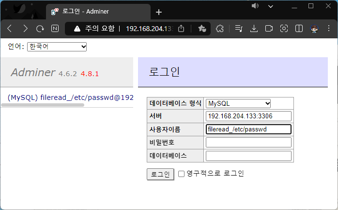
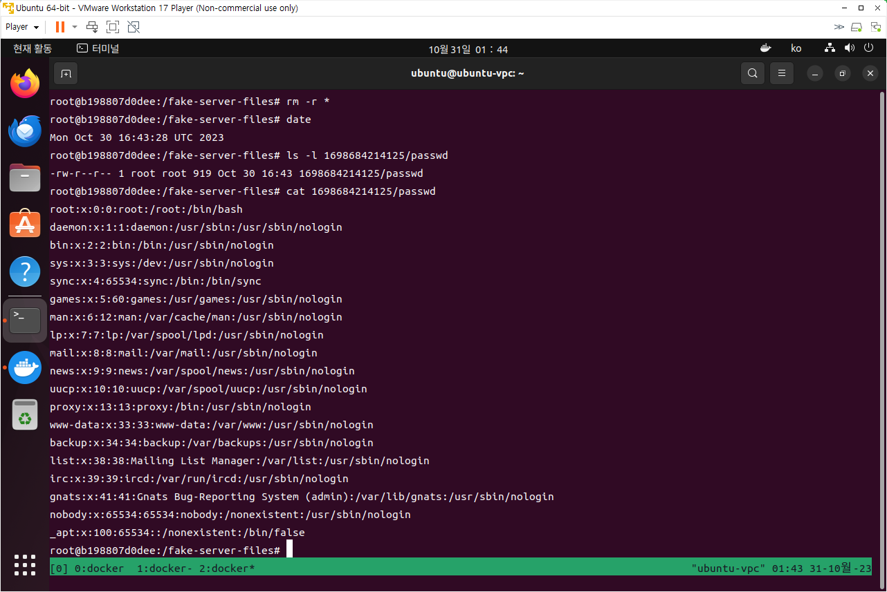
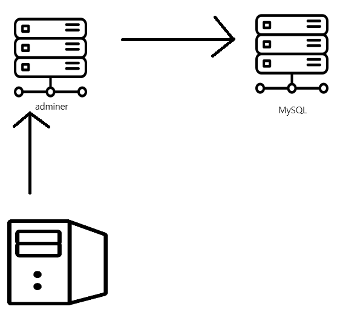

# [Adminer 원격 파일 읽기 (CVE-2021-43008)](https://github.com/vulhub/vulhub/tree/master/adminer/CVE-2021-43008#adminer-remote-arbitrary-file-read-cve-2021-43008)


Adminer는 PHP에서 개발한 데이터 베이스의 콘텐츠를 관리하는 도구 입니다. 기본적으로 MySQL, MariaDB, PostgreSQL, SQLite, MS SQL, Oracle, Elasticsearch, MongoDB을 지원합니다.

Adminer 버전 1.12.0 ~ 4.6.2(버전 4.6.3에서 수정되었음)의 부적절한 액세스 제어로 인해 공격자는 관리자에게 원격 MySQL 데이터베이스에 연결하도록 요청하여 원격 서버에서 임의 파일 읽기를 할 수 있다.

참고자료:

- [https://github.com/p0dalirius/CVE-2021-43008-AdminerRead](https://github.com/p0dalirius/CVE-2021-43008-AdminerRead)
- [http://sansec.io/research/adminer-4.6.2-file-disclosure-vulnerability](http://sansec.io/research/adminer-4.6.2-file-disclosure-vulnerability)

## [취약한 환경](https://github.com/vulhub/vulhub/tree/master/adminer/CVE-2021-43008#vulnerable-environment)

Adminer 4.6.2로 PHP 서버를 시작하려면 다음 명령을 실행하세요. :



```
docker compose up -d
```

서버가 시작되면 관리자의 로그인 페이지를 볼 수 있습니다. `http://your-ip:8080`.

## [익스플로잇](https://github.com/vulhub/vulhub/tree/master/adminer/CVE-2021-43008#exploit)

[mysql-fake-server](https://github.com/4ra1n/mysql-fake-server)를 통해 불량 MySQL 서버를 시작하고, 
`fileread_/etc/passwd`를 사용자 이름 입력박스에 입력한다.

img

로그인 버튼을 누르면 mysql-fake-server에 Adminer의 `/etc/passwd` 파일이 저장된다. 

도커에 올린 mysql-fake-server에 bash로 들어가서 `/fake-server-files/pc-time/passwd`의 내용을 확인하면 Adminer의 서버의 `/etc/passwd`의 파일 내용이 들어있는 것을 볼 수 있다.




