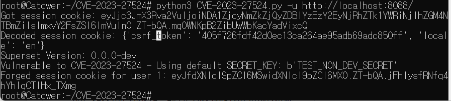
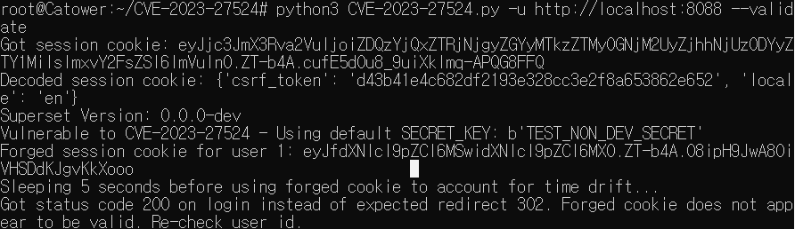

# CVE-2023-27524: Apache Superset 인증 우회

**Contributors**

-   [박건호(@ian9292)](https://github.com/ian9292)
-   [최민석(@catower917)](httpsL//github.com/catower917)

 

### 요약

-   Apache Superset 버전 2.0.1 이하의 세션 유효성 검사 공격
-   SECRET_KEY를 변경하지 않은 설치를 통해 공격자가 승인되지 않은 리소스를 인증하고 액세스 할 수 있음

 

### 환경 구성 및 실행

-   `https://github.com/horizon3ai/CVE-2023-27524` 다운로드
-   `docker-compose -f docker-compose-non-dev.yml pull`
-   `docker-compose -f docker-compose-non-dev.yml up`를 실행하여 테스트 환경을 실행함.
-   `http://your-ip:8088`에 접속하여 Superset 로그인 페이지가 나오는 지 확인
-   `python3 CVE-2023-27524.py -u http://your-ip:8088` 실행 후 반환 결과를 읽음. 결과에서 session cookie, Superset Version, Forged session cookie for user 1 확인
-   `python3 CVE-2023-27524.py -u http://10.0.220.200:8088 --validate` 실행 시 취약점 확인 가능

 

### 결과

 

### 정리

-   이 취약점은 Flask 웹 프레임워크 기반의 Apache Superset의 인증키 우회 취약점으로 설치 시 SECRET_KEY값이 기본값으로 설정되어 있어 발생함. 

### 참고
-   [CVE-2023-27524](https://www.horizon3.ai/cve-2023-27524-insecure-default-configuration-in-apache-superset-leads-to-remote-code-execution)
- [CVE-2023-27524 Github](https://github.com/horizon3ai/CVE-2023-27524)