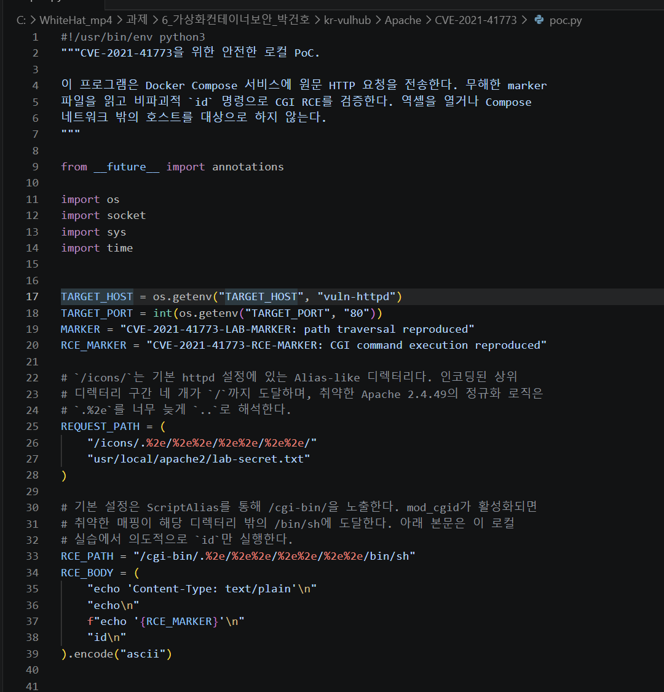

# CVE-2021-41773 - Apache 2.4.49 경로 탐색 재현

> WHS 4기 / 가상화·컨테이너 보안 실무 / GitHub: [@decmoon05](https://github.com/decmoon05)
>
> 문서 구성에는 AI 도움을 일부 받았고, 환경 구축과 PoC 실행 및 검증은 직접 했다.
>
> 실습 범위는 이 저장소에서 만드는 로컬 Docker Compose 서비스망으로 한정한다. PoC는 실습용 확인 문자열을 읽고 컨테이너 안에서 id 명령만 실행한다. 역셸, 외부 콜백, 호스트 탈출은 사용하지 않는다.

## 1. 취약점 요약

| 항목 | 내용 |
| --- | --- |
| CVE / CWE | [CVE-2021-41773](https://nvd.nist.gov/vuln/detail/CVE-2021-41773) / CWE-22 (경로명 제한 미흡) |
| 영향 버전 | **Apache HTTP Server 2.4.49만** 영향 |
| 공격 벡터 | 네트워크(HTTP), 인증 불필요, 사용자 상호작용 불필요 |
| 영향 | Alias 디렉터리를 기준으로 경로를 우회해 공개 범위 밖 파일을 읽을 수 있으며, CGI가 활성화된 조건에서는 원격 코드 실행으로 이어질 수 있다. |
| 패치 | Apache HTTP Server **2.4.50**에서 수정되었으나, 그 수정은 불완전하여 2.4.51에서 CVE-2021-42013까지 함께 수정되었다. 운영 환경은 2.4.51 이상(가급적 최신 안정판)으로 업그레이드한다. |

Apache HTTP Server 2.4.49에는 URL 경로 정규화 오류가 있다. 공격자가 `.%2e`처럼 인코딩한 상위 디렉터리 표현을 Alias URL 아래에 넣으면, 정규화 오류로 Alias 밖 파일까지 접근할 수 있다. 단, 도달한 파일이 일반적인 기본 설정인 `Require all denied`로 차단되지 않아야 한다. Apache의 공식 보안 공지는 이 조건과 2.4.49 단일 영향 버전을 명시한다.

- 벤더 공지: [Apache HTTP Server 보안 공지 — CVE-2021-41773](https://httpd.apache.org/security/vulnerabilities_24.html#CVE-2021-41773)
- 공식 CVE 레코드: [CVE Program](https://www.cve.org/CVERecord?id=CVE-2021-41773)

### Risk Score / CVSS 근거

이 CVE에는 파일 노출만 가능한 구성과 CGI까지 활성화되어 명령 실행이 가능한 구성이 있다. 이 실습은 `mod_cgid`를 켜고 `/bin/sh`를 통한 id 실행까지 확인했다. 위험도는 NVD의 CVSS 9.8을 기준으로 기록한다.

| 기준 | 점수 / 벡터 | 이 보고서에서의 의미 |
| --- | --- | --- |
| NVD CVSS v3.1 | **9.8 / Critical**, `AV:N/AC:L/PR:N/UI:N/S:U/C:H/I:H/A:H` | CGI 활성화 조건에서의 원격 코드 실행까지 포함한 CVE-2021-41773의 영향이다. |
| CISA-ADP CVSS v3.1 | **7.5 / High**, `AV:N/AC:L/PR:N/UI:N/S:U/C:H/I:N/A:N` | 경로 탐색과 파일 노출 자체의 기밀성 영향을 반영한 별도 산정이다. |
| 이 실습의 확인 범위 | **NVD 9.8 기준** | 파일 노출과 `POST .../bin/sh`를 통한 CGI id 명령 실행을 확인했다. 컨테이너 탈출이나 호스트 영향은 확인하지 않았다. |

| 이 실습의 CVSS v3.1 항목 | 값 | 근거 |
| --- | --- | --- |
| Attack Vector (AV) | N | Compose 서비스망에서 HTTP 요청으로 악용 가능 |
| Attack Complexity (AC) | L | 알려진 인코딩 경로를 한 번 요청하면 됨 |
| Privileges Required (PR) | N | 인증 없이 요청 가능 |
| User Interaction (UI) | N | 피해자 조작이 필요 없음 |
| Scope (S) | U | Apache 프로세스 권한 범위에서 영향 발생 |
| C / I / A | H / H / H | CGI 활성화 조건에서 명령 실행 가능성이 있으므로 NVD의 CVE 전체 영향 벡터를 따른다. PoC는 안전상 id만 실행한다. |

루트 목차의 `Risk Score: 9.8`은 현재 NVD CVSS와 이 실습의 CGI RCE 검증 범위를 반영한 값이다. CISA-ADP의 7.5는 파일 노출만 발생하는 구성과 혼동하지 않도록 함께 기록한다.

## 2. 환경 구성

| 서비스 | 역할 | 빌드 방식 | 버전 / 고정값 | 포트 |
| --- | --- | --- | --- | --- |
| `vuln-httpd` | 취약 대상 | 이 저장소의 [`Dockerfile`](./Dockerfile)로 직접 build | Apache HTTP Server `2.4.49`, `mod_cgid` 활성화, 이미지 해시 고정 | 호스트 포트 노출 없음 |
| `poc` | 자동 재현 및 검증 | 이 저장소의 [`poc.Dockerfile`](./poc.Dockerfile)로 직접 build | Python `3.12.2-alpine3.19`, 이미지 해시 고정 | Compose 서비스명 `vuln-httpd`에만 요청 |

구성 파일과 PoC는 모두 저장소에 포함되어 있다. 개인 Docker Hub의 취약 이미지나 외부 LDAP, 콜백 서버를 사용하지 않는다. 최초 build 시에는 고정된 공식 베이스 이미지를 pull하며, 그 위의 취약 설정, 확인 문자열, PoC는 모두 이 저장소에서 build한다. `poc`는 대상 서비스가 시작된 뒤 표준 라이브러리만 사용하는 [`poc.py`](./poc.py)로 HTTP 요청을 원문 그대로 전송한다.

`Dockerfile`은 공식 `httpd:2.4.49` 베이스를 고정하고, 취약 조건인 root `<Directory />`의 `Require all denied`를 의도적으로 `Require all granted`로 바꾼다. `/cgi-bin/` ScriptAlias가 CGI를 실행하도록 `mod_cgid`도 켠다. build 단계에서 설정, `/icons/` Alias include, `mod_cgid`, `httpd -t`를 확인하므로 설정 변경이 실패하면 build도 실패한다. 이 조건은 Apache 공식 공지에 나온 CVE-2021-41773의 파일 노출 및 명령 실행 조건이다.

## 3. 취약 조건

다음 조건을 모두 충족해야 한다.

1. Apache HTTP Server가 **2.4.49**여야 한다.
2. 요청이 Alias URL(`/icons/`)을 통과해야 한다. Dockerfile은 기본 `httpd.conf`에서 `httpd-autoindex.conf` include를 켜 `/icons/` Alias를 사용한다.
3. Alias 밖에서 도달한 파일이 `Require all denied`로 차단되지 않아야 한다. 이 재현 환경은 `Dockerfile`에서 의도적으로 `Require all granted`로 바꾼다.
4. 공격 클라이언트가 `.%2e`를 `..`로 미리 정규화하지 않고 원문 그대로 전송해야 한다. 따라서 PoC는 고수준 URL 라이브러리 대신 raw socket을 사용한다.
5. RCE 재현에는 `/cgi-bin/` ScriptAlias와 `mod_cgid`가 활성화되어 있어야 한다. 이 환경은 Dockerfile에서 이를 명시적으로 활성화한다.

실습 파일 [`lab-secret.txt`](./lab-secret.txt)는 `/usr/local/apache2/htdocs`와 `/icons/` Alias 밖에 놓은 무해한 확인 문자열이다. 성공하면 해당 문자열이 HTTP 응답으로 돌아온다.

## 4. 재현 절차

### 사전 요구사항

Docker Engine과 Docker Compose v2가 설치된 환경이 필요하다.

### 채점용 단일 재현 명령

아래 한 줄로 이미지 build, 취약 서비스 기동, PoC 실행, 종료 코드 검증을 수행한다. `docker compose up --build --abort-on-container-exit --exit-code-from poc`

이전 실행 흔적이 남아 있을 때만 `docker compose down -v --remove-orphans`를 먼저 한 번 실행한다. `poc` 컨테이너의 종료 코드가 `0`이면 재현 성공이다.

### 포트 노출 정책

이 환경은 호스트 포트를 publish하지 않는다. 자동 PoC가 Compose 기본 서비스망의 `vuln-httpd:80`으로만 요청하므로, 채점에 불필요한 `8080` 포트 충돌과 외부 노출을 제거했다.

## 5. PoC 코드

- 실행 파일: [`poc.py`](./poc.py)
- Compose 자동 실행 정의: [`docker-compose.yml`](./docker-compose.yml)

`poc.py`는 `.%2e`를 포함한 경로를 소켓으로 전송하고, CGI 경로에는 확인 문자열과 id만 담은 본문을 보낸다.

성공 조건은 두 요청 모두 `HTTP/1.1 200 OK`를 반환하고, 파일 노출 확인 문자열, CGI 확인 문자열, `uid=` 출력이 응답에 존재하는 것이다. 실패하면 `poc.py`는 0이 아닌 종료 코드로 끝나므로 Compose 명령도 실패로 표시된다.

## 6. 실행 결과

자동 PoC는 Alias 경로 밖의 확인 문자열을 읽은 뒤, CGI 경로 탐색으로 `/bin/sh`에 도달해 id를 실행한다. 이로써 파일 노출과 원격 코드 실행 조건을 확인한다. 확인 문자열은 이 실습을 위해 만든 것이며, PoC는 실제 운영 비밀 정보, 역셸, 호스트 자원을 대상으로 하지 않는다.

### 실행 기록 (2026-07-11)

Compose 자동 PoC를 다시 실행해 `poc`의 종료 코드가 `0`임을 확인했다. 호스트 포트를 publish하지 않은 상태에서 Compose 서비스망 내부 PoC만으로 재현했다.

## 7. 대응 방안

1. **업데이트:** Apache HTTP Server를 최소 2.4.51 이상, 가능하면 공급자가 지원하는 최신 안정 버전으로 업데이트한다. 2.4.50은 CVE-2021-41773의 수정이 불완전해 CVE-2021-42013의 영향을 받으므로 중간 버전으로 멈추면 안 된다.
2. **기본 거부 유지:** `/`에 대한 `Require all denied` 기본값을 유지하고, 필요한 DocumentRoot·Alias 디렉터리에만 최소 범위의 `Require all granted`를 적용한다.
3. **Alias/CGI 최소화:** 불필요한 Alias 및 CGI 모듈을 비활성화한다. 특히 CGI를 켜면 이 유형의 경로 탐색이 코드 실행으로 확대될 수 있다.
4. **노출면 축소:** 관리 포트를 사설망·방화벽 뒤에 두고, WAF/웹 로그에서 `.%2e`, 이중 인코딩 경로, `/cgi-bin/` 접근을 탐지한다. 단, 접근 통제는 패치의 대체 수단이 아니다.

## 8. 재현성 확인

| 점검 항목 | 제출물의 근거 | 확인 결과 |
| --- | --- | --- |
| 버전 고정 | Apache/Python 공식 베이스 이미지를 이미지 해시까지 고정 | 충족 |
| 자동화 | Compose `up` 한 줄이 대상 서비스와 PoC를 함께 실행하고 PoC 종료 코드로 성공 또는 실패를 반환 | 충족 |
| 준비 상태 | 대상 서비스 시작 후 PoC가 최대 30초 동안 소켓 재시도로 실제 HTTP 연결을 판정 | 충족 |
| 충돌 방지 | 고정 `container_name`, 네트워크 이름, 호스트 포트를 사용하지 않음 | 충족 |
| 검증 증거 | 실제 CMD의 파일 노출과 CGI 명령 실행 `200 OK`, 확인 문자열, `uid=`, exit code 0, cleanup PNG를 로컬 상대 경로로 포함 | 충족 |
| 잔여 전제 | Docker/Compose와 최초 이미지 pull을 위한 레지스트리 접속 필요 | 명시 |

## 9. 제출 전 확인

- [x] `docker compose config -q`로 Compose 문법을 확인했다.
- [x] `docker compose build` 후 자동 PoC를 다시 실행해 결과를 확인했다.
- [x] `docker compose down -v --remove-orphans`로 컨테이너와 네트워크를 정리했다.
- [x] GitHub ID `@decmoon05`를 README에 반영했다.
- [x] `screenshots/`의 PNG 3장을 로컬 파일로 넣고 상대 경로를 확인했다.
- [x] 모든 텍스트 파일이 UTF-8/LF인지 확인했다.
- [x] 포크한 `kr-vulhub`의 루트 `README.md` 목차에 Apache HTTP Server 항목을 추가했다.

## 출처

1. Apache HTTP Server Project, [CVE-2021-41773 보안 공지](https://httpd.apache.org/security/vulnerabilities_24.html#CVE-2021-41773)
2. NIST NVD, [CVE-2021-41773](https://nvd.nist.gov/vuln/detail/CVE-2021-41773)
3. CVE Program, [CVE-2021-41773 레코드](https://www.cve.org/CVERecord?id=CVE-2021-41773)
