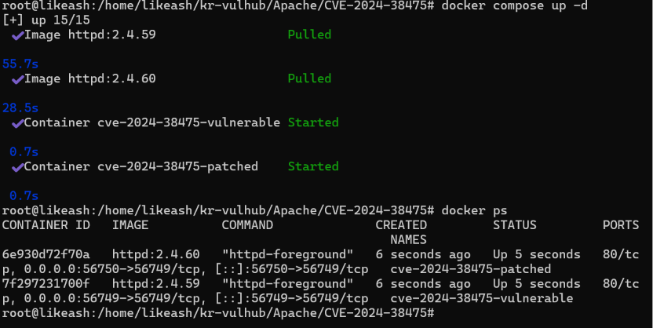
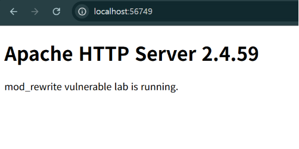
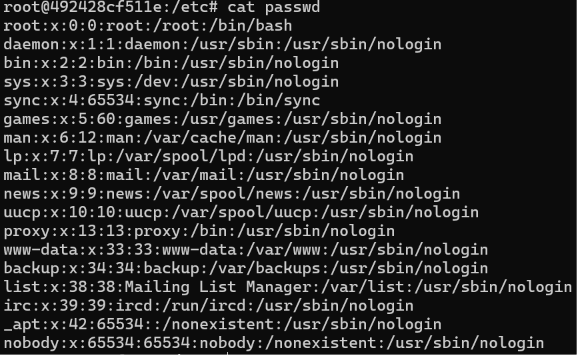
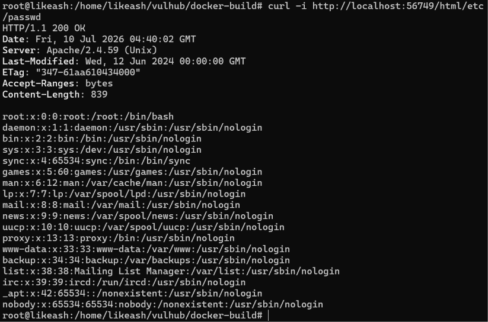
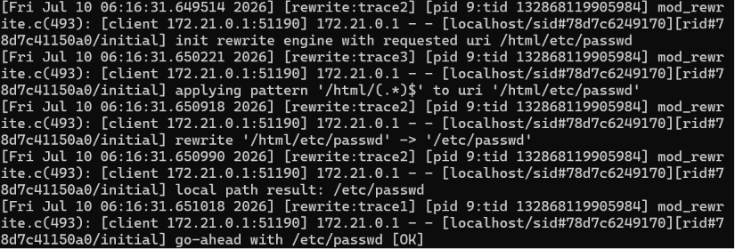
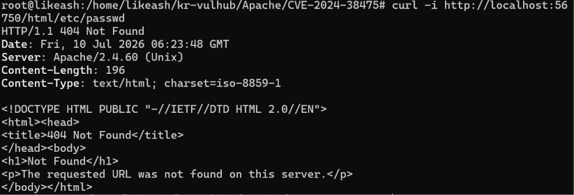
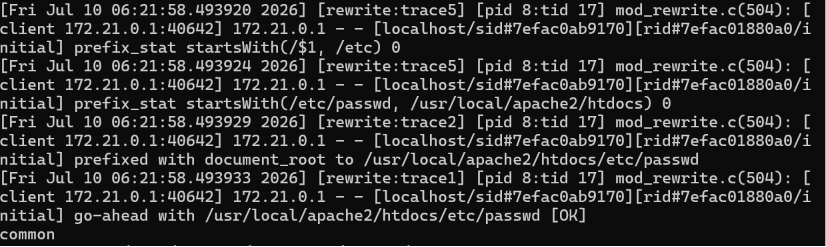

# CVE-2024-38475

# 취약점 개요

CVE-2024-38475는 Apache HTTP Server 2.4.59 및 이전 버전의 `mod_rewrite`에서 발생하는 출력값 이스케이프 미흡 취약점이다. 

취약한 RewriteRule이 존재할 경우 공격자는 조작된 URL을 통해 원래 직접 접근할 수 없어야 하는 파일 시스템 경로에 접근할 수 있으며, 그 결과 소스 코드 유출이나 임의 파일 읽기, 환경에 따라 코드 실행으로 이어질 수 있다.


# 환경 구성

- `docker compose up -d` 명령어를 이용해 취약한 도커 환경을 구성 후 실행한다.



- 취약점을 시연하는 과정에서 curl을 사용한다. curl이 설치되어 있지 않은 경우에는 `sudo apt install curl`를 통해 curl을 설치해야 한다.


환경 구성이 완료되었다면, `http://localhost:56749` 와 `http://localhost:56750` 에 접속해 테스트 페이지를 확인한다.




# 취약 조건

httpd.conf에서 아래와 같이 취약한 RewriteRule을 적용한다. 아래 RewriteRule을 통해 서버는 `html/경로` 로 오는 요청을 `/경로` 로 치환해 내부에서 처리한다.

```bash
DocumentRoot "/usr/local/apache2/htdocs"
...
RewriteEngine On
RewriteRule "^/html/(.*)$" "/$1" [L]
```


본 과제에서는 /etc/passwd 파일을 읽는 것을 목표로 한다.




/etc/passwd는 DocumentRoot 밖에 있는 파일이기 때문에 일반적인 URL 요청으로는 접근할 수 없는 게 정상이다. 하지만, RewriteRule이 url을 시스템 내부 경로로 변환하는 과정에서 Apache가 DocumentRoot와 로컬 파일 시스템의 절대 경로를 혼동해 DocumentRoot를 벗어난 경로에 접근할 수 있다.

[`http://localhost:56749/html/etc/passwd`](http://localhost:56749/html/etc/passwd) 의 요청을 예로 들면, 정상적인 상황이라면 이를 url 경로로 인식해 DocumentRoot + substitution 결과, 즉 `/usr/local/apache2/htdocs/etc/passwd`로 처리되어야 한다. 

하지만, 위 httpd.conf에서의 설정과 같이 RewriteRule의 substitution 첫 번째 경로 요소가 backreference 또는 변수로 구성되는 경우, URL 경로를 시스템의 절대 경로, 즉 `/etc/passwd`로 인식해 DocumentRoot를 벗어난 경로에 접근하게 된다.


# 재현 과정

56749 포트는 CVE-2024-38475에 취약한 환경이고 56750은 CVE-2024-38475가 패치된 환경이다. 각 환경에는 똑같은 RewriteRule이 적용되어 있다. 다음 명령어를 통해 취약점을 테스트한다.

```bash
curl -i http://localhost:포트/html/etc/passwd
```


## 취약 환경(포트 56749)

```bash
curl -i http://localhost:56749/html/etc/passwd
```



/etc/passwd 내용이 출력된 것을 확인할 수 있다. 



위 사진은 Apache 요청 처리 로그를 가져온 것이다. 맨 아래 줄을 보면 최종적으로 처리된 경로를 확인할 수 있다. “go-ahead with /etc/passwd”, 즉 /etc/passwd로 요청이 간 것을 확인할 수 있다.


## 패치된 환경(포트: 56750)

```bash
curl -i http://localhost:56750/html/etc/passwd
```



/etc/passwd 내용이 출력되는 것이 아닌, 404 Not Found가 발생한 것을 확인할 수 있다.



로그를 확인해볼 때, 맨 아래 줄에 `/usr/local/apache2/htdocs/etc/passwd` 로 적혀있는 것을 확인할 수 있으며, 이는 DocumentRoot가 정상적으로 적용되어 실제 시스템의 `/etc/passwd`가 아닌 `/usr/local/apache2/htdocs/etc/passwd`를 조회했음을 의미한다.


# 대응 방안

1. **Apache HTTP Server 업데이트**: 해당 취약점은 Apache HTTP Server 2.4.59 및 이전 버전을 사용하는 경우 발생한다. 따라서, Apache HTTP Server 2.4.60 이상의 버전으로 업데이트해야 한다.
2. **취약한 RewriteRule 수정**: 사용자 입력이 포함된 backreference 또는 변수가 파일 시스템 경로로 직접 연결되지 않도록 RewriteRule을 수정해야 한다. 가능한 경우 rewrite 대상 경로를 DocumentRoot의 내부 고정된 디렉토리로 제한하고, 허용할 문자와 경로 형식을 정규식으로 엄격하게 제한해야 한다.
3. **DocumentRoot 밖 경로 접근 최소화**: 실제 운영 환경에서는 Apache가 접근할 수 있는 파일 시스템 범위를 최소화하고, DocumentRoot 밖 경로에 대한 접근 권한은 필요한 경우에만 제한적으로 허용해야 한다.


# 참고 자료

[https://nvd.nist.gov/vuln/detail/cve-2024-38475](https://nvd.nist.gov/vuln/detail/cve-2024-38475)

[https://labs.watchtowr.com/sonicboom-from-stolen-tokens-to-remote-shells-sonicwall-sma100-cve-2023-44221-cve-2024-38475/](https://labs.watchtowr.com/sonicboom-from-stolen-tokens-to-remote-shells-sonicwall-sma100-cve-2023-44221-cve-2024-38475/)

[https://httpd.apache.org/security/vulnerabilities_24.html](https://httpd.apache.org/security/vulnerabilities_24.html)

[https://www.centripetal.ai/threat-research/cve-2024-38475-and-cve-2023-44221](https://www.centripetal.ai/threat-research/cve-2024-38475-and-cve-2023-44221)
